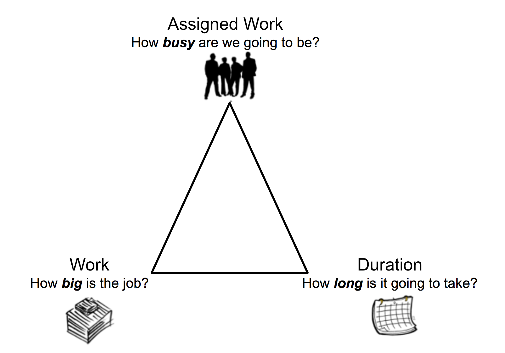

# Vue d’ensemble de la durée des tâches et du type de durée

<!-- Audited: 12/2023 -->

<!--The highlighted information on this page refers to functionality not yet generally available. It is available only in the Preview environment for all customers. After the monthly releases to Production, the same features are also available in the Production environment for customers who enabled fast releases.    

For information about fast releases, see [Enable or disable fast releases for your organization](/help/quicksilver/administration-and-setup/set-up-workfront/configure-system-defaults/enable-fast-release-process.md). -->

La durée de la tâche correspond à la différence entre sa date de début prévue et sa date d’achèvement prévue. La durée indique le délai dont dispose la tâche pour être achevée.

Le type de durée d’une tâche identifie la relation entre le nombre de ressources affectées à une tâche, l’effort total et la durée totale de la tâche.

## Vue d’ensemble de la durée de la tâche

Si les dates de début et d’achèvement effectives de la tâche ne correspondent pas au planning du projet, de la personne cessionnaire principale, ou au planning par défaut, la durée de la tâche est zéro.

>[!BEGINSHADEBOX]

**EXEMPLE**
Si vous avez une planification qui commence à 9 :00 et se termine à 12 :00 et une tâche qui est planifiée pour commencer à 14 :00 et se terminer à 16 :00, la durée de la tâche est nulle.

>[!ENDSHADEBOX]

Voici deux scénarios qui existent lors du calcul de la durée dans Adobe Workfront :

* Si la tâche est affectée à un utilisateur :

   1. Workfront prend en compte le planning du projet ou celui de l&#39;utilisateur affecté à la tâche.

      Votre administrateur Workfront ou de groupe détermine la planification utilisée par Workfront lorsqu’une tâche est affectée à un utilisateur. Pour plus d’informations, voir [Configurer des préférences de projet à l’échelle du système](../../../administration-and-setup/set-up-workfront/configure-system-defaults/set-project-preferences.md).

   1. Si l’utilisateur ou l’utilisatrice ou le projet ne dispose pas de planification, Workfront utilise la planification système par défaut.

      Les étapes sont similaires au premier scénario après avoir compris quel planning Workfront utilise pour calculer la durée.

* Si la tâche est affectée à plusieurs utilisateurs et utilisatrices :

   1. Workfront prend en compte le planning du projet ou celui de la personne cessionnaire principale.

      Votre Workfront ou votre administrateur de groupes détermine la planification utilisée par Workfront lorsqu’une tâche est affectée à plusieurs utilisateurs. Pour plus d’informations, voir [Configurer des préférences de projet à l’échelle du système](../../../administration-and-setup/set-up-workfront/configure-system-defaults/set-project-preferences.md).

   1. Si la personne désignée principale ou le projet ne disposent pas de planification, Workfront utilise la planification système par défaut.

  Les étapes sont similaires au premier scénario après avoir compris quel planning Workfront utilise pour calculer la durée.

>[!NOTE]
>
>Lorsque vous prenez en compte les congés de la personne cessionnaire principale sur un projet, les dates prévues de la tâche peuvent s’ajuster, mais la durée de la tâche reste la même. Pour plus d’informations sur la prise en compte des congés de la personne cessionnaire principale lors de la planification d’un projet, voir [Configurer les préférences des projets à l’échelle du système](../../../administration-and-setup/set-up-workfront/configure-system-defaults/set-project-preferences.md).

## Unités de temps pour la durée de la tâche

Vous pouvez indiquer la durée de la tâche à la fois en temps normal et en temps écoulé entre les dates de début prévu et d&#39;achèvement prévu.

Lors de la mise à jour de la Durée des tâches dans une liste, vous pouvez utiliser les abréviations suivantes pour indiquer les unités de temps dans Workfront :

| Unité de temps | Abréviation |
|---|---|
| Minutes | L |
| Heures | H |
| Jours. Il s’agit de la valeur par défaut. | Dés |
| Semaines | S |
| Mois | T, MO |
| Minutes écoulées | ME |
| Heures écoulées | HE |
| Jours écoulés | JE |
| Semaines écoulées | SE |
| Mois écoulés | TE |

{style="table-layout:auto"}

>[!BEGINSHADEBOX]

**EXEMPLE**

Si vous souhaitez indiquer que la durée d’une tâche est de 3 jours écoulés, vous devez saisir « 3 DE » dans le champ Durée d’une liste de tâches .  Vous pouvez également sélectionner l’option souhaitée pour l’unité de temps Durée dans le menu déroulant disponible lors de la modification d’une tâche ou dans la section Détails de la tâche. Pour plus d’informations sur la modification des tâches, consultez [Modifier les tâches](../../../manage-work/tasks/manage-tasks/edit-tasks.md).

>[!ENDSHADEBOX]

<!--

(NOTE: stays QS only forever; for the pictures below: make the first one classic at preview time and the second one stays QS always. The second one is yellow >> take out at 21.2 production!!)

-->

Tenez compte des points suivants lorsque vous indiquez la durée d’une tâche :

* Le temps écoulé est une unité de temps pour la durée d’une tâche. Il s’agit de la durée entre la date de début et la date d’achèvement prévues d’une tâche qui comprend les jours fériés, les week-ends et les jours de congé. En d’autres termes, le temps écoulé est le nombre de jours calendaires écoulés.
* Les jours représentent les jours ouvrés définis dans le système et configurables dans la zone Configuration. Dans la plupart des cas, une journée dure 8 heures.
* Les heures normales (jours ou jours ouvrables) prennent en compte les jours fériés, les week-ends et les congés et les excluent de la Durée de la tâche.
* Lorsque vous indiquez la durée d’une tâche en semaines, Workfront calcule la durée en jours et en heures en fonction des paramètres Jours ouvrables standard par semaine et Heures ouvrables standard définis par l’administrateur Workfront dans les Préférences du projet de la section Configuration.
* Workfront utilise la durée par défaut de 4 semaines pour un mois lors du calcul de la durée en mois.

## Vue d’ensemble du type de durée des tâches

La gestion du type de durée d’une tâche permet de définir des affectations de ressources cohérentes en fonction des besoins de la tâche.

Le type de durée permet de répondre aux questions suivantes :

* Quelle sera la charge de travail ?
* Quelle est l’ampleur du travail ?
* Combien de temps cela va-t-il prendre ?

## Définir les types de durée

<table border="1" cellspacing="15" cellpadding="1"> 
 <col> 
 <col> 
 <col> 
 <thead> 
  <tr> 
   <th scope="row">
<strong>Type de durée</strong>
</th> 
   <th scope="col"> 
<strong>Fonction</strong> 
 </th> 
   <th scope="col"> 
<strong>Effet des ressources</strong> 
 </th> 
  </tr> 
 </thead> 
 <tbody> 
  <tr> 
   <th scope="col"> 
<strong>Calcul d’affectation</strong> 
 </th> 
   <td scope="col"> 
Calcule le pourcentage d’affectation pour chaque personne cessionnaire d’une tâche. 
 
Lorsque vous choisissez ce type de durée, vous pouvez saisir une durée et des heures prévues individuelles pour la tâche. Workfront divise les heures prévues par le nombre d’heures de la durée de la tâche, puis par le nombre de ressources affectées à la tâche afin de calculer l’allocation pour chaque personne cessionnaire.
 
Pour plus d’informations, consultez <a href="../../../manage-work/tasks/taskdurtn/calculated-assignment.md" class="MCXref xref">Vue d’ensemble du type de durée : calcul d’affectation</a>.
 </td> 
   <td scope="col">La durée et les heures prévues ne changent pas lors de l’ajout ou de la suppression de personnes cessionnaires dans la tâche. </td> 
  </tr> 
  <tr> 
   <th scope="col"> 
<strong>Calcul de travail</strong> 
 </th> 
   <td scope="col"> 
Détermine les heures prévues (quantité d’effort) requises pour effectuer la tâche.
 
Normalement utilisé lorsque les ressources affectées à la tâche sont allouées pour toute la durée de la tâche.
 
Lorsque vous choisissez ce type de durée, vous avez la possibilité de saisir une durée spécifique pour la tâche. Workfront calcule les heures prévues pour la tâche en multipliant le nombre de jours dans la durée par le nombre d’heures de travail dans le planning et par le nombre de personnes cessionnaires pour la tâche. 
 
Vous avez la possibilité de modifier manuellement le pourcentage d’affectation de chaque personne cessionnaire par rapport à la tâche, ce qui réduit le nombre d’heures prévues.
 
Pour plus d’informations, consultez <a href="../../../manage-work/tasks/taskdurtn/calculated-work.md" class="MCXref xref">Vue d’ensemble du type de durée : calcul de travail</a>.
 </td> 
   <td scope="col"> 
Les heures prévues augmentent lorsque des personnes cessionnaires sont ajoutées à la tâche. 
 
Les heures prévues diminuent lorsque des personnes cessionnaires sont retirées de la tâche.
 </td> 
  </tr> 
  <tr> 
   <th scope="col"> 
<strong>Piloté par l'effort</strong>
 </th> 
   <td scope="col"> 
Détermine les heures prévues en fonction du nombre de ressources.
 
Lorsque vous choisissez ce type de durée, vous avez la possibilité de saisir une durée spécifique pour la tâche. Workfront calcule les heures prévues pour la tâche en multipliant le nombre de jours de la durée par le nombre d’heures de travail dans le planning et en divisant par le nombre de personnes cessionnaires pour la tâche. 
 
Vous avez la possibilité de modifier manuellement le pourcentage d’affectation de chaque personne cessionnaire pour la tâche, mais le nombre d’heures prévues reste le même.
 
Pour plus d’informations, consultez <a href="../../../manage-work/tasks/taskdurtn/effort-driven.md" class="MCXref xref">Vue d’ensemble du type de durée : piloté par l’effort</a>.
 </td> 
   <td scope="col"> 
Les heures prévues augmentent lorsque des personnes cessionnaires sont retirées de la tâche.
 
Les heures prévues diminuent lorsque des personnes cessionnaires sont ajoutées à la tâche. 
 
La durée ne change pas, même si un changement est apporté au nombre de personnes cessionnaires ou à leur planning. 
 
La durée est égale aux nombre d’heures prévues. La durée prévue est égale au nombre d’heures prévues divisé par le nombre de personnes cessionnaires.
 </td> 
  </tr> 
  <tr> 
   <th scope="col"> 
<strong>Simple</strong> 
 </th> 
   <td scope="col"> 
Détermine les heures prévues et la durée (identiques pour ce type de durée) en fonction du nombre d’heures allouées pour chaque personne cessionnaire. 
 
Workfront calcule les heures prévues en additionnant les heures allouées prévues pour chaque personne cessionnaire. 
 
Vous avez la possibilité de modifier manuellement le nombre d’heures allouées à chaque personne cessionnaire ; le nombre d’heures prévues et la durée changent en conséquence. Si vous choisissez un nombre total d’heures affectées pour toutes les personnes cessionnaires, ce nombre est réparti uniformément entre elles.
 
Pour plus d’informations, voir la section <a href="../../../manage-work/tasks/taskdurtn/simple-duration-type.md" class="MCXref xref">Vue d’ensemble du type de durée : simple</a>.
 </td> 
   <td scope="col"> 
Les heures sont réparties uniformément entre les personnes cessionnaires si vous choisissez un nombre total d’heures affectées. Cependant, en tant que personne responsable de projet, vous pouvez ajuster manuellement les heures de chaque personne cessionnaire. 
 
Vous pouvez modifier les heures planifiées et la durée d’une tâche avec un type de durée simple, en ligne ou au niveau de la tâche. 
 
Si une équipe Agile est affectée à une tâche, le Type de durée est automatiquement défini sur Simple et ne peut pas être modifié. La durée de la tâche pour une équipe Agile doit être supérieure à 0 minute.
 </td> 
  </tr> 
 </tbody> 
</table>

## Type de durée des nouvelles tâches

Le type de durée d’une nouvelle tâche correspond au type de durée configuré dans votre système. Le type de durée par défaut est Calcul d’affectation. Votre équipe d’administration Workfront ou de groupes peut mettre à jour le type de durée par défaut de votre système ou du groupe associé au projet. Pour plus d’informations, voir la section [Configurer des préférences de tâche et de problème à l’échelle du système](../../../administration-and-setup/set-up-workfront/configure-system-defaults/set-task-issue-preferences.md).

## Durée d’origine d’une tâche parent

La durée initiale d’une tâche est la durée qu’une tâche avait à l’origine avant de devenir une tâche parent, en minutes.

Lorsqu’une tâche devient un parent, la durée entre la date de début prévue du premier enfant et la date d’achèvement prévue du dernier enfant est reportée sur la tâche parent et devient la durée de la tâche parent. Cela remplace la durée de la tâche originale.

Lorsque les enfants utilisent l’unité de durée Jours écoulés et que leur parent utilise l’unité de durée Jours, il peut y avoir des incohérences dans la façon dont Workfront calcule la durée de la tâche parent.

Tenez compte des points suivants :

* L’unité de durée Jours écoulés représente les jours du calendrier, qui se composent toujours de 24 heures par jour.
* L’unité de durée Jours représente le jour ouvré défini dans le système et peut être configurée. Dans la plupart des cas, il se compose de 8 heures par jour.
* La formule de calcul de la durée de la tâche parent est la suivante :

  `Parent task duration = Planned Completion Date of the child task that is planned to end the latest - Planned Start Date of the child task that starts the earliest`

* Lors du calcul de la durée de la tâche parent, le système commence par calculer la durée à l&#39;aide de la formule ci-dessus, puis il applique la planification.

Pour plus d&#39;informations, voir [Aperçu de la durée d&#39;origine de la tâche et des heures prévues d&#39;origine](/help/quicksilver/manage-work/tasks/task-information/task-original-duration-and-original-planned-hours.md).

## Modifier le type de durée d’une tâche

Pour plus d’informations sur la modification du type de durée d’une tâche, voir la section [Mettre à jour le type de durée d’une tâche](../../../manage-work/tasks/taskdurtn/update-duration-type-of-task.md).
