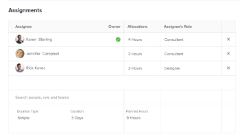

# Mettre à jour le nombre d’heures prévues et la durée d’une tâche avec un type de durée simple

Par défaut, Adobe Workfront calcule la durée d’une tâche avec un type de durée simple en fonction du nombre d’heures prévues. Cependant, vous pouvez également modifier manuellement le nombre d’heures prévues et la durée d’une tâche avec un type de durée simple dans certaines zones de Workfront.

Vous pouvez modifier le nombre d’heures prévues et la durée d’une tâche avec un type de durée simple en ligne ou au niveau de la tâche dans la zone Affectations.

Pour plus d’informations sur la modification d’informations en ligne, voir [Modifier en ligne les éléments d’une liste dans Adobe Workfront](../../../workfront-basics/navigate-workfront/use-lists/inline-edit-objects.md).

Cet article décrit comment vous pouvez mettre à jour le nombre d’heures prévues et la durée d’une tâche avec un type de durée simple au niveau de la tâche, dans la zone Affectations.

## Conditions d’accès

+++ Développez pour afficher les exigences d’accès aux fonctionnalités de cet article.

<table style="table-layout:auto"> 
 <col> 
 <col> 
 <tbody> 
  <tr> 
   <td role="rowheader">Package Adobe Workfront</td> 
   <td> 
Tous
 </td> 
  </tr> 
  <tr> 
   <td role="rowheader">Licence Adobe Workfront</td> 
   <td>
Standard ou supérieur
 
   
Travail ou supérieur
 </td> 
  </tr> 
  <tr> 
   <td role="rowheader">Configurations des niveaux d’accès</td> 
   <td> 
Accès en affichage ou supérieur aux projets
 
Modifier l’accès aux tâches
 </td> 
  </tr> 
  <tr> 
   <td role="rowheader">Autorisations d’objet</td> 
   <td> 
Gérer l’accès à la tâche 
</td> 
  </tr> 
 </tbody> 
</table>

Pour plus d’informations, voir [Conditions d’accès dans la documentation Workfront](/help/quicksilver/administration-and-setup/add-users/access-levels-and-object-permissions/access-level-requirements-in-documentation.md).

+++

<!--Old:

<table style="table-layout:auto"> 
 <col> 
 <col> 
 <tbody> 
  <tr> 
   <td role="rowheader">Adobe Workfront plan*</td> 
   <td> 
Any
 </td> 
  </tr> 
  <tr> 
   <td role="rowheader">Adobe Workfront license*</td> 
   <td> 
Work or higher
 </td> 
  </tr> 
  <tr> 
   <td role="rowheader">Access level configurations*</td> 
   <td> 
Edit access to Tasks
 
Note: If you still don't have access, ask your Workfront administrator if they set additional restrictions in your access level. For information on how a Workfront administrator can modify your access level, see <a href="../../../administration-and-setup/add-users/configure-and-grant-access/create-modify-access-levels.md" class="MCXref xref">Create or modify custom access levels</a>.
 </td> 
  </tr> 
  <tr> 
   <td role="rowheader">Object permissions</td> 
   <td> 
Manage permissions to the task
 
For information on requesting additional access, see <a href="../../../workfront-basics/grant-and-request-access-to-objects/request-access.md" class="MCXref xref">Request access to objects </a>.
 </td> 
  </tr> 
 </tbody> 
</table>-->

## Mettre à jour le nombre d’heures prévues et la durée d’une tâche avec un type de durée simple

>[!IMPORTANT]
>
>Après avoir mis à jour manuellement la durée d’une tâche avec un type de durée simple, Workfront cesse de la calculer en fonction du nombre d’heures prévues.

Pour modifier le nombre d’heures prévues et la durée d’une tâche avec un type de durée simple dans la zone Affectations avancées, procédez comme suit :

1. Dans une liste de tâches, cliquez sur le nom de la tâche pour laquelle vous souhaitez modifier le type de durée.
1. Utilisez l’une des méthodes suivantes :

   * Cliquez sur l’icône **Plus**  en regard du nom de la tâche, cliquez sur **Modifier**, puis **Affectations**.
   * Cliquez sur le **Affecté à** ou sur le nom des affectations dans la zone Affectations de l’en-tête de la tâche, puis cliquez sur **Avancé**.

1. Saisissez une valeur totale pour le **Nombres d’heures prévues** pour toutes les affectations, par exemple 10 heures. Le nombre total d’heures prévues est réparti de manière égale entre toutes les ressources affectées à la tâche.
1. (Facultatif) Ajustez manuellement les heures prévues de chaque ressource affectée à la tâche. Le nombre total d’heures prévues pour la tâche est mis à jour pour refléter les nouvelles heures affectées individuellement à vos ressources.
1. Saisissez une valeur pour la **Durée** de la tâche, par exemple 2 jours.

   

1. Cliquer sur **Enregistrer**.
