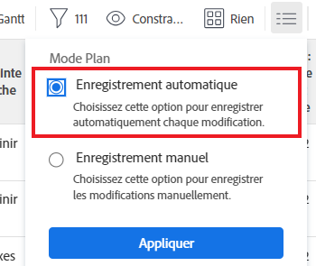

# Créer des relations antérieures en chaînant des tâches

Vous pouvez créer des relations antérieures de plusieurs manières dans Adobe Workfront. Une méthode consiste à chaîner des tâches.

Pour plus d’informations sur les tâches antérieures, consultez la section [Vue d’ensemble des tâches antérieures](../../../manage-work/tasks/use-prdcssrs/predecessors-overview.md).

En chaînant des tâches, vous permettez au système de créer automatiquement les relations antérieures sur les tâches sélectionnées, plutôt que de créer manuellement vous-même, une relation sur chaque tâche. Différents types de relations antérieures peuvent toujours être utilisés entre les tâches.

## Conditions d’accès

+++ Développez pour afficher les exigences d’accès aux fonctionnalités de cet article.

<table style="table-layout:auto"> 
 <col> 
 <col> 
 <tbody> 
  <tr> 
   <td role="rowheader">Package Adobe Workfront</td> 
   <td> 
Tous
 </td> 
  </tr> 
  <tr> 
   <td role="rowheader">Licence Adobe Workfront</td> 
   <td>
Standard
 
   
Plan
 </td> 
  </tr> 
  <tr> 
   <td role="rowheader">Configurations des niveaux d’accès</td> 
   <td> 
Modifier l’accès aux tâches et aux projets
 </td> 
  </tr> 
  <tr> 
   <td role="rowheader">Autorisations d’objet</td> 
   <td> 
Gérer les autorisations sur les tâches et le projet
</td> 
  </tr> 
 </tbody> 
</table>

Pour plus d’informations, voir [Conditions d’accès dans la documentation Workfront](/help/quicksilver/administration-and-setup/add-users/access-levels-and-object-permissions/access-level-requirements-in-documentation.md).

+++

<!--Old:
<table style="table-layout:auto"> 
 <col> 
 <col> 
 <tbody> 
  <tr> 
   <td role="rowheader">Adobe Workfront plan</td> 
   <td> 
Any
 </td> 
  </tr> 
  <tr> 
   <td role="rowheader">Adobe Workfront license</td> 
   <td> 
   
Standard 

    
Plan 
 </td> 
  </tr> 
  <tr> 
   <td role="rowheader">Access level configurations</td> 
   <td> 
Edit access to Tasks and Projects
 
Note: If you still don't have access, ask your Workfront administrator if they set additional restrictions in your access level. For information on how a Workfront administrator can modify your access level, see <a href="../../../administration-and-setup/add-users/configure-and-grant-access/create-modify-access-levels.md" class="MCXref xref">Create or modify custom access levels</a>.
 </td> 
  </tr> 
  <tr> 
   <td role="rowheader">Object permissions</td> 
   <td> 
Manage permissions to the tasks and the project
 
For information on requesting additional access, see <a href="../../../workfront-basics/grant-and-request-access-to-objects/request-access.md" class="MCXref xref">Request access to objects</a>.
 </td> 
  </tr> 
 </tbody> 
</table>-->

## Chaîner des tâches pour créer des relations antérieures

1. Accédez au projet contenant les tâches que vous souhaitez chaîner.
1. Cliquez sur **Tâches** dans le panneau de gauche.
1. (Le cas échéant) Sélectionnez **Enregistrement automatique** dans le coin supérieur droit de la liste des tâches, puis sélectionnez les tâches que vous souhaitez chaîner.

   

   >[!IMPORTANT]
   >
   >Le chaînage de tâches dans une liste de tâches n’est pas possible lorsque vous enregistrez manuellement les modifications apportées aux tâches ou lorsque vous utilisez le mode « Planification chronologique » pour enregistrer les tâches.

1. Cliquez avec le bouton droit sur les tâches sélectionnées, puis cliquez sur **Chaîner**.
1. Sélectionnez l’un des types de dépendances suivants :

   * **Terminer-Démarrer**
   * **Terminer-Terminer**
   * **Démarrer-Démarrer**
   * **Démarrer-Terminer**

   Pour plus d’informations sur les types de dépendance des prédécesseurs, consultez la section [Vue d’ensemble des types de dépendances des tâches](../../../manage-work/tasks/use-prdcssrs/task-dependency-types.md).

1. (Facultatif) Cliquez sur **Annuler le chaînage** si certaines des tâches ont déjà été chaînées.

   >[!CAUTION]
   >
   >Seuls les prédécesseurs séquentiels sont supprimés à l’aide de l’option « Annuler le chaînage » lors des tâches de modification en masse.

   Les tâches sélectionnées sont désormais liées par les relations antérieures.
