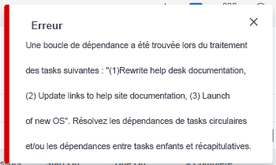

# Vue d’ensemble de la boucle de dépendance des tâches

Lorsque vous ajoutez des relations antérieures aux tâches, vous pouvez rencontrer des boucles de dépendance. Pour plus d’informations sur les tâches antérieures, voir la section [Vue d’ensemble des tâches antérieures](../../../manage-work/tasks/use-prdcssrs/predecessors-overview.md).

## Vue d’ensemble des boucles de dépendance

Les boucles de dépendance se produisent lorsque vous avez deux tâches ou plus qui dépendent l&#39;une de l&#39;autre à terminer. Adobe Workfront ne vous permet pas de créer une relation de prédécesseur entre des tâches si une boucle de dépendance est créée.

**Exemple :** la tâche 2 est antérieure à la tâche 1, la tâche 2 doit donc être terminée avant que vous puissiez commencer à travailler sur la tâche 1.

Si vous essayez de rendre la tâche 1 antérieure à la tâche 2, vous obtenez une erreur de boucle de dépendance, car vous ne pouvez pas démarrer la tâche 1 tant que la tâche 2 n’est pas terminée, mais la tâche 2 ne peut pas être démarrée tant que la tâche 1 n’est pas terminée.

## Considérations sur les boucles de dépendance

* Les boucles de dépendance peuvent impliquer plus de deux tâches. Parfois, un certain nombre de parents des tâches que vous connectez avec une relation d’antériorité sont ceux qui créent la boucle de dépendance.
* Une boucle de dépendance peut également se produire si vous essayez de transformer un parent en tâche antérieure d’un enfant.
* Dans le cas d’une boucle de dépendance, vous ne pouvez sauvegarder ni les tâches ni le projet. Pour corriger la boucle de dépendance, vous devez réévaluer la relation de prédécesseur entre les tâches répertoriées dans le message d’erreur et supprimer les conflits avant de pouvoir enregistrer les tâches ou le projet.

