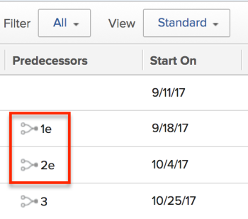

# Appliquer les tâches antérieures

<!-- Audited: 2/2024 -->

Les tâches antérieures sont des tâches dont dépendent d’autres tâches pour se terminer. Les relations antérieures affectent les dates de début et d’achèvement des tâches et ont une incidence sur la chronologie du projet.

Pour plus d’informations sur les tâches antérieures, voir la section [Vue d’ensemble des tâches antérieures](../../../manage-work/tasks/use-prdcssrs/predecessors-overview.md).

En définissant les relations antérieures entre les tâches, vous définissez comment le début ou la fin d’une tâche dépendante dépend du début ou de la fin de ses tâches antérieures. Pour ce faire, vous pouvez utiliser différents types de dépendance.

Pour plus d’informations sur les types de dépendance, voir [Vue d’ensemble des types de dépendances des tâches](../../../manage-work/tasks/use-prdcssrs/task-dependency-types.md).

## Vue d’ensemble des tâches antérieures appliquées

>[!IMPORTANT]
>
>Vous devez appliquer les tâches antérieures pour que les relations antérieures soient respectées. Si vous n’appliquez pas les tâches antérieures, les tâches dépendantes peuvent commencer et se terminer indépendamment du début et de la fin de leurs tâches antérieures, quels que soient leurs types de dépendances.

Vous pouvez appliquer la relation antérieure lors de la définition des tâches antérieures d’un projet.

Si une tâche antérieure est appliquée, la tâche ultérieure ne peut pas commencer avant l’achèvement de la tâche antérieure. Par exemple, l’application d’une relation Terminer-Démarrer entre la tâche A et la tâche B signifie que la tâche B ne peut pas démarrer (le statut doit rester Nouveau et le pourcentage terminé doit rester 0 %) jusqu’à ce que la tâche A soit marquée comme terminée. L’application des relations concerne tous les types de tâches antérieures.

## Conditions d’accès

+++ Développez pour afficher les exigences d’accès aux fonctionnalités de cet article.

Vous devez disposer des accès suivants pour effectuer les étapes décrites dans cet article :

<table style="table-layout:auto"> 
 <col> 
 <col> 
 <tbody> 
  <tr> 
   <td role="rowheader">Formule Adobe Workfront</td> 
   <td> 
Tous
 </td> 
  </tr> 
  <tr> 
   <td role="rowheader">Licence Adobe Workfront</td> 
   <td>
      
Nouvelle : standard
 
      
OU

      
Actuelle : formule

   </td> 
  </tr> 
  <tr> 
   <td role="rowheader">Configurations des niveaux d’accès</td> 
   <td> 
Modifier l’accès aux tâches et aux projets
 </td> 
  </tr> 
  <tr> 
   <td role="rowheader">Autorisations d’objet</td> 
   <td>
Gérer les autorisations sur les tâches et le projet
</td> 
  </tr> 
 </tbody> 
</table>

Pour plus d’informations sur ce tableau, consultez [Conditions d’accès requises dans la documentation Workfront](/help/quicksilver/administration-and-setup/add-users/access-levels-and-object-permissions/access-level-requirements-in-documentation.md).

+++

## Appliquer une tâche antérieure au niveau de la tâche

1. Accédez à la tâche ultérieure à laquelle vous souhaitez appliquer une tâche antérieure.
1. Cliquez sur **Prédécesseurs** dans le panneau de gauche, puis sur **Ajouter un prédécesseur**.
1. (Le cas échéant) Si vous souhaitez ajouter une tâche antérieure sur plusieurs projets, supprimez le nom du projet dans le champ **Projet parent** et remplacez-le par un autre projet.
1. Indiquez le nom de la ou des tâches antérieures dans le champ **Tâches**.
1. Spécifiez le **Type de dépendance** entre ces deux tâches.

   Le **Type de dépendance** par défaut est **Terminer-Démarrer**.

1. Sélectionnez le champ **Appliquer** pour appliquer la tâche antérieure.
1. Cliquer sur **Enregistrer**.

## Appliquer une tâche antérieure à une liste de tâches

1. Accédez à une liste de tâches d’un projet.
1. Dans le menu déroulant **Vue**, sélectionnez la **Vue standard**.

1. Mémorisez le numéro de la tâche que vous allez désigner comme tâche antérieure.
1. Recherchez la tâche ultérieure à laquelle vous souhaitez appliquer la tâche antérieure.
1. Dans la colonne **Tâches antérieures**, commencez à saisir le numéro de la tâche antérieure suivie de « e ». Par exemple, saisissez « 1e » pour ajouter la tâche numéro 1 en tant que tâche antérieure à la tâche sélectionnée.
1. Cliquez sur Entrée pour enregistrer les informations de votre tâche antérieure.

   
