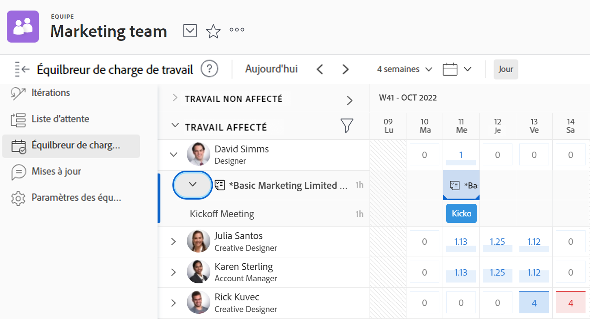

# Gérer les éléments sur lesquels votre équipe travaille

Vous pouvez voir la liste des éléments sur lesquels votre équipe travaille dans la [!UICONTROL Requêtes d’équipe] de votre équipe.

Vous pouvez affecter des éléments non attribués, ajuster les affectations actuelles, ajuster les affectations actuelles, etc. dans la [!UICONTROL Équilibreur de charge de travail] de votre équipe.

Pour plus d’informations sur la gestion du travail assigné à votre équipe, voir [[!UICONTROL Équilibreur de charge de travail]](../../resource-mgmt/workload-balancer/assign-work-in-workload-balancer.md).

