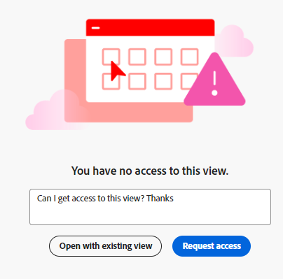

<!-- update metadata when released: 

---
title: Request Permissions to a View or a Workspace
description: You can request permissions to a view or a workspace that others sent you a link to which has not been previously shared with you. 
author: Alina
feature: Workfront Planning
role: User, Admin
---
-->

<!--add this to miniTOC and TOC-->

# Demande d’autorisations pour une vue ou un espace de travail

Vous pouvez demander des autorisations pour une vue ou un espace de travail vers lequel d’autres vous ont envoyé un lien qui n’a pas été partagé avec vous auparavant.

La demande d’autorisations à une vue est similaire à la demande d’autorisations à un espace de travail.

## Conditions d’accès

+++ Développez pour afficher les exigences d’accès à la planification Workfront.

<!--at GA, check that the Workfront plans article linked below has Planning info-->

Pour pouvoir accéder à Workfront Planning, vous devez disposer des éléments suivants :

<table style="table-layout:auto"> 
<col> 
</col> 
<col> 
</col> 
<tbody> 
    <tr> 
<tr> 
<td> 
   
 Produits
 </td> 
   <td> 
   <ul><li>
 Adobe Workfront
</li> 
   <li>
 Planification d’Adobe Workfront
</li></ul></td> 
  </tr>   
<tr> 
   <td role="rowheader">
Forfait Adobe Workfront*
</td> 
   <td> 

L’un des projets Workfront suivants est prévu :
 
<ul><li>Sélectionner</li> 
<li>Principal</li> 
<li>Final</li></ul> 

La planification Workfront n’est pas disponible pour les plans Workfront hérités
 
   </td> 
<tr> 
   <td role="rowheader">
Formule de planification Adobe Workfront*
</td> 
   <td> 

N’importe quelle 
 

Pour plus d’informations sur les éléments inclus dans chaque plan de planification Workfront, voir <a href="https://business.adobe.com/products/workfront/pricing.html">Prix et package Adobe Workfront</a>. 
 
   </td> 
 <tr> 
   <td role="rowheader">
Plateforme Adobe Workfront
</td> 
   <td> 

L’instance de Workfront de votre entreprise doit être intégrée à l’expérience unifiée Adobe pour pouvoir accéder à toutes les fonctionnalités de la planification Workfront.
 

Pour plus d’informations, voir <a href="/help/quicksilver/workfront-basics/navigate-workfront/workfront-navigation/adobe-unified-experience.md">Adobe Unified Experience pour Workfront</a>. 
 
   </td> 
   </tr> 
  </tr> 
  <tr> 
   <td role="rowheader">
Licence Adobe Workfront*
</td> 
   <td>
 Standard, Clair ou Contributeur

   
La planification Workfront n’est pas disponible pour les licences Workfront héritées
 
  </td> 
  </tr> 
  <tr> 
   <td role="rowheader">
Configuration du niveau d’accès
</td> 
   <td> 
Il n’existe aucun contrôle de niveau d’accès pour Adobe Workfront Planning.
   
</td> 
  </tr> 
<tr> 
   <td role="rowheader">
Autorisations d’objet
</td> 
   <td>  
Une fois votre demande d’autorisation accordée, vous pouvez obtenir les autorisations suivantes :

   <ul><li>
Affichage ou gestion pour une vue
</li>
   <li>
Affichage, Contribute ou gestion dans un espace de travail
</li></ul>  
   
Seuls les utilisateurs disposant des autorisations Manage (Gérer) pour un espace de travail et un affichage peuvent partager une vue publiquement.
</td> 
  </tr> 
<tr> 
   <td role="rowheader">
Modèle de disposition
</td> 
   <td> 
Toutes les personnes, y compris les administrateurs et administratrices de Workfront, doivent se voir attribuer un modèle de mise en page incluant la zone Planning dans le menu principal. 
 </td> 
  </tr> 
</tbody> 
</table>

* Pour plus d’informations sur les exigences d’accès à Workfront, consultez les [Conditions d’accès requises dans la documentation de Workfront](/help/quicksilver/administration-and-setup/add-users/access-levels-and-object-permissions/access-level-requirements-in-documentation.md).

+++

## Demande d’autorisations pour un affichage ou un espace de travail

La demande d’autorisations à une vue est similaire à la demande d’autorisations à un espace de travail.

Lorsqu’une personne partage avec vous un lien vers un espace de travail ou une vue à laquelle vous n’avez pas accès :

1. Cliquez sur le lien partagé avec vous pour la vue ou l&#39;espace de travail.

   Une page **Vous n&#39;avez pas d&#39;accès** s&#39;affiche pour vous informer que vous n&#39;avez pas accès à la vue ou à l&#39;espace de travail.

   

1. (Conditionnel) Si le lien partagé correspond à une vue pour un espace de travail auquel vous avez accès, cliquez sur **Ouvrir avec une vue existante**. Si vous êtes autorisé à accéder à l’espace de travail, la page de type enregistrement s’ouvre dans la vue par défaut.

1. (Facultatif et conditionnel) Si vous ne disposez pas des autorisations nécessaires pour afficher l’espace de travail, ajoutez un message personnalisé dans la zone disponible, puis cliquez sur **Demander l’accès**.

   Tous les utilisateurs disposant des autorisations de gestion pour la vue ou l’espace de travail reçoivent les notifications suivantes pour la demande d’accès :
   * Une notification in-app
     
   * Une notification électronique
     

   Pour plus d’informations sur l’octroi d’autorisations aux vues et aux espaces de travail, consultez les articles suivants :

   * [Partager des vues](/help/quicksilver/planning/access/share-views.md)
   * [Partager des espaces de travail](/help/quicksilver/planning/access/share-workspaces.md)
1. (Conditionnel) Lorsque le gestionnaire d’affichage ou d’espace de travail vous accorde des autorisations pour l’affichage ou l’espace de travail, vous recevez une notification par e-mail et une notification in-app confirmant que l’autorisation a été accordée. <!--check this - I was not able to test this-->

