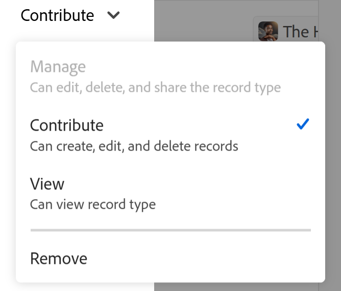
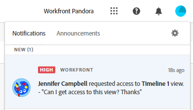

<!-- take the Remove permissions section out, at the end - this is what Lilit said: Because of "Everyone in the workspace can view" wildcard, currently it's not possible to entirely remove access to a record type. Let's take out this section. -->

# Partage des types d’enregistrements

Les informations mises en surbrillance sur cette page font référence à des fonctionnalités qui ne sont pas encore disponibles de manière générale. Elle est disponible uniquement dans l’environnement de Prévisualisation pour tous les clients. Après les versions mensuelles en production, les mêmes fonctionnalités sont également disponibles dans l’environnement de production pour les clients qui ont activé les versions rapides. 

Pour plus d’informations sur les versions rapides, voir [Activation ou désactivation des versions rapides pour votre organisation](/help/quicksilver/administration-and-setup/set-up-workfront/configure-system-defaults/enable-fast-release-process.md). 

{{planning-important-intro}}

Vous pouvez partager un type d’enregistrement avec d’autres utilisateurs pour garantir une collaboration lors de l’utilisation d’enregistrements dans Adobe Workfront Planning.

>[!IMPORTANT]
>
>Les utilisateurs ayant accès à un espace de travail obtiennent automatiquement au moins des autorisations d’affichage pour tous les types d’enregistrements de l’espace de travail.
>Le partage de vues ne donne pas aux utilisateurs les autorisations pour les types d’enregistrements. Seuls les espaces de travail de partage peuvent accorder aux utilisateurs des autorisations pour les types d’enregistrements.
>
>* Pour obtenir des informations générales sur le partage d’objets dans Workfront Planning, consultez également la section [Présentation des autorisations de partage dans Adobe Workfront Planning](/help/quicksilver/planning/access/sharing-permissions-overview.md).
>* Pour plus d’informations, consultez la section [Considérations lors du partage de types d’enregistrements](#considerations-when-sharing-record-types) de cet article.

## Conditions d’accès

+++ Développez pour afficher les exigences d’accès aux fonctionnalités de cet article. 

<!--at GA, check that the Workfront plans article linked below has Planning info-->

<table style="table-layout:auto"> 
<col> 
</col> 
<col> 
</col> 
<tbody> 
    <tr> 
<tr> 
   <td role="rowheader">
Package Adobe Workfront
</td> 
   <td> 

Tout package Workfront and Planning
 
Ou

Tout package Workflow et Planning
 
 </tr>

<tr> 
   <td role="rowheader">
Licence Adobe Workfront
</td> 
   <td>
Tous
 
  </td> 
  </tr> 
  <tr> 
   <td role="rowheader">
Configuration du niveau d’accès
</td> 
   <td> 
Il n’existe aucun contrôle de niveau d’accès pour Adobe Workfront Planning.
   
</td> 
  </tr> 
<tr> 
   <td role="rowheader">
Autorisations d’objet
</td> 
   <td>  
Gestion des autorisations relatives à un espace de travail et à un type d’enregistrement
  
   
<b>IMPORTANT</b>

   
Seuls les utilisateurs disposant d’autorisations de niveau Gérer pour un espace de travail peuvent partager ces autorisations avec un type d’enregistrement
</td> 
  </tr>
<tr>
   <td role="rowheader">
Modèle de mise en page
</td>
   <td> Les utilisateurs disposant d'une licence light ou contributor doivent se voir attribuer un modèle de mise en page incluant Planning.
   
Les zones Planning sont activées par défaut pour les utilisateurs standard et les administrateurs système.

</li></ul>

</td>
  </tr>

</tbody> 
</table>

Pour plus d’informations sur les exigences d’accès à Workfront, voir [Exigences d’accès dans la documentation de Workfront](/help/quicksilver/administration-and-setup/add-users/access-levels-and-object-permissions/access-level-requirements-in-documentation.md).

+++

<!--Old:

<table style="table-layout:auto"> 
<col> 
</col> 
<col> 
</col> 
<tbody> 
    <tr> 
<tr> 
<td> 
   
 Products
 </td> 
   <td> 
   <ul><li>
 Adobe Workfront
</li> 
   <li>
 Adobe Workfront Planning
</li></ul></td> 
  </tr>   
<tr> 
   <td role="rowheader">
Adobe Workfront plan*
</td> 
   <td> 

Any of the following Workfront plans:
 
<ul><li>Select</li> 
<li>Prime</li> 
<li>Ultimate</li></ul> 

Workfront Planning is not available for legacy Workfront plans
 
   </td> 
<tr> 
   <td role="rowheader">
Adobe Workfront Planning package*
</td> 
   <td> 

Any 
 

For more information about what is included in each Workfront Planning plan, contact your Workfront account manager. 
 
   </td> 
 <tr> 
   <td role="rowheader">
Adobe Workfront platform
</td> 
   <td> 

Your organization's instance of Workfront must be onboarded to the Adobe Unified Experience to be able to access Workfront Planning.
 

Users must be added to the Adobe Admin Console in order to gain permissions to Workfront Planning views.

For more information, see <a href="/help/quicksilver/workfront-basics/navigate-workfront/workfront-navigation/adobe-unified-experience.md">Adobe Unified Experience for Workfront</a>. 
 
   </td> 
   </tr> 
  </tr> 
  <tr> 
   <td role="rowheader">
Adobe Workfront license*
</td> 
   <td>
 Standard

   
Workfront Planning is not available for legacy Workfront licenses
 
  </td> 
  </tr> 
  <tr> 
   <td role="rowheader">
Access level configuration
</td> 
   <td> 
There are no access level controls for Adobe Workfront Planning
   
</td> 
  </tr> 
<tr> 
   <td role="rowheader">
Object permissions
</td> 
   <td>  
Manage permissions to a record type
  
   
Only users with Manage permissions to a workspace can share Manage permissions to a record type
</td> 
  </tr> 
 
</tbody> 
</table>-->

## Remarques concernant le partage de types d’enregistrements

* L’octroi d’autorisations à un espace de travail donne par défaut aux utilisateurs les mêmes autorisations aux types d’enregistrements dans l’espace de travail .

  De plus, vous pouvez ajuster les autorisations sur des types d’enregistrements individuels.

  Cependant, vous ne pouvez pas accorder aux personnes des autorisations supérieures à celles dont elles disposent pour l’espace de travail.
* Vous pouvez accorder aux utilisateurs des autorisations inférieures au type d’enregistrement qu’ils n’ont sur l’espace de travail. Par exemple, ils peuvent disposer des autorisations de niveau Contribution à l’espace de travail et des autorisations de niveau Affichage sur un type d’enregistrement.
* Les personnes disposant d’une autorisation Gérer pour l’espace de travail conservent toujours leur accès Gérer à tous les types d’enregistrements de l’espace de travail. Leurs autorisations ne peuvent pas être réduites sur les types d’enregistrements, même lorsque les autorisations héritées sont désactivées.

* Actuellement, vous pouvez obtenir les résultats suivants lorsque vous partagez des types d’enregistrements :

   * Donnez aux personnes les autorisations d’affichage d’un espace de travail lorsque vous partagez un type d’enregistrement avec elles pour la première fois et qu’elles ne disposent d’aucune autorisation sur l’espace de travail.

     Cela leur donne également des autorisations d’affichage pour tous les types d’enregistrements de l’espace de travail.

     Lorsque vous leur donnez des autorisations sur le type d’enregistrement, la zone de partage indique qu’ils sont également ajoutés à l’espace de travail.
   * Définissez le type d’enregistrement en lecture seule pour tous les utilisateurs de l’espace de travail (à l’exception des gestionnaires d’espace de travail) lorsque vous désactivez les autorisations héritées.

     Les personnes disposant d’autorisations de niveau Gérer pour l’espace de travail disposent toujours d’autorisations de niveau Gérer sur les types d’enregistrement, même si vous désactivez les autorisations héritées sur le type d’enregistrement.
   * Autorisation de personnes inférieures à un type d&#39;enregistrement. Vous ne pouvez pas augmenter l&#39;autorisation d&#39;une personne à un type d&#39;enregistrement à partir de ce qu&#39;elle a sur l&#39;espace de travail.

     Par exemple, si une personne dispose de l&#39;autorisation Contribution à l&#39;espace de travail, vous pouvez modifier son autorisation pour un type d&#39;enregistrement spécifique et le définir sur Affichage. Cependant, s’ils disposent de l’autorisation d’affichage pour l’espace de travail, vous ne pouvez pas leur accorder l’autorisation de contribution pour un type d’enregistrement.

* Il n’est pas possible de supprimer l’accès à un type d’enregistrement pour les personnes dans l’espace de travail. Tout le monde dispose au moins de l’autorisation d’affichage pour tous les types d’enregistrements s’il dispose au moins des autorisations d’affichage pour l’espace de travail.

* Vous pouvez partager un type d’enregistrement en interne avec les entités suivantes :

  Utilisateurs, groupes, équipes, entreprises et fonctions de Workfront
* Vous ne pouvez pas partager des types d’enregistrements en externe, avec des utilisateurs en dehors de Workfront.
* Pour accorder à un utilisateur qui ne dispose pas d’autorisations d’espace de travail supérieures aux autorisations d’affichage d’un type d’enregistrement, vous devez d’abord partager l’espace de travail avec lui avec une autorisation supérieure à Affichage. Les autorisations plus élevées pour l’espace de travail s’appliqueront alors aux types d’enregistrements.

* Vous pouvez partager un type d’enregistrement global à la fois à partir de son espace de travail d’origine et d’autres espaces de travail secondaires où il a été ajouté.

  Pour plus d’informations, voir [Présentation du type d’enregistrement de l’espace de travail](/help/quicksilver/planning/architecture/cross-workspace-record-types-overview.md).

## Partage des autorisations sur un type d’enregistrement

Vous pouvez ajuster les autorisations aux types d’enregistrements individuels d’un espace de travail si vous disposez de l’autorisation Gérer sur l’espace de travail.

{{step1-to-planning}}

1. Ouvrez l’espace de travail dont vous souhaitez partager les types d’enregistrements.

1. Utilisez l’une des méthodes suivantes :

   * Dans la carte Type d’enregistrement , cliquez sur le menu **Plus** > **Partager**.
   * Cliquez sur une carte de type d’enregistrement pour ouvrir la page du type d’enregistrement, puis cliquez sur **Partager** > **Partager le type d’enregistrement** dans n’importe quelle vue de type d’enregistrement.

   La boîte **Partager** s’ouvre.

   

1. (Facultatif) Dans la zone **Qui a accès**, l’option **Tout le monde dans l’espace de travail peut afficher** est sélectionnée par défaut.  Tous les utilisateurs disposant d’autorisations d’affichage ou supérieures pour l’espace de travail peuvent afficher le type d’enregistrement.

1. (Facultatif) Cliquez sur le nombre d’utilisateurs sous l’option **Autorisations héritées** pour afficher les utilisateurs, les équipes, les groupes, les sociétés ou les fonctions qui héritent des autorisations de l’espace de travail.

   >[!TIP]
   >
   >Vous ne pouvez pas supprimer des entités individuelles de la liste des autorisations héritées.

1. (Facultatif et conditionnel) Si vous souhaitez partager le type d’enregistrement avec des entités spécifiques et leur donner un accès au type d’enregistrement différent de celui qu’elles ont déjà pour l’espace de travail, procédez comme suit :

   1. Sélectionnez **Désactiver** dans le menu déroulant **Autorisations héritées**.

   >[!TIP]
   >
   >Les responsables Workspace conservent les autorisations de niveau Gérer pour le type d’enregistrement.

   1. Dans le champ **Accorder l’accès à ce type d’enregistrement**, ajoutez les utilisateurs, équipes, groupes, sociétés ou fonctions auxquels vous souhaitez accorder un niveau d’autorisation différent de celui qu’ils ont pour l’espace de travail.
   1. Choisissez un niveau d’autorisation.

   >[!IMPORTANT]
   >
   >* Outre les équipes, les groupes, les entreprises et les fonctions, vous ne pouvez partager qu’avec des utilisateurs qui ont été ajoutés au Adobe Admin Console. Vous ne pouvez pas ajouter des utilisateurs Workfront uniquement. Pour plus d’informations, voir [Gestion des utilisateurs dans Adobe Admin Console](/help/quicksilver/administration-and-setup/add-users/create-and-manage-users/admin-console.md).
   >* Vous ne pouvez jamais accorder aux utilisateurs des autorisations plus importantes sur un type d’enregistrement que sur un espace de travail.
   >* Vous ne pouvez pas accorder aux utilisateurs une autorisation inférieure à Gérer pour un type d’enregistrement s’ils disposent des autorisations Gérer pour l’espace de travail.
   >* Vous pouvez accorder aux utilisateurs une autorisation moindre sur le type d’enregistrement s’ils disposent des autorisations de type Contributeur sur l’espace de travail.
   > Pour plus d’informations, consultez la section [Vue d’ensemble des autorisations de partage dans Adobe Workfront Planning](/help/quicksilver/planning/access/sharing-permissions-overview.md).
   >* Lorsque vous partagez un type d’enregistrement avec un utilisateur, sa fonction principale et son adresse e-mail s’affichent également dans le champ. Le paramètre Afficher les informations de contact doit être activé pour que l’objet Utilisateurs de votre niveau d’accès puisse voir l’e-mail de l’utilisateur.

1. Pour permettre aux utilisateurs qui ne disposent pas des autorisations d’accès à l’espace de travail d’afficher un type d’enregistrement, dans le champ **Accorder l’accès à cette vue**, commencez à saisir le nom d’un utilisateur, d’un groupe, d’une équipe, d’une entreprise ou d’une fonction, puis cliquez dessus lorsqu’il s’affiche dans la liste.

   L&#39;entité sélectionnée est ajoutée au type d&#39;enregistrement et à l&#39;espace de travail avec les autorisations **Vue**.

   Les administrateurs système reçoivent toujours des autorisations de niveau Gérer pour les types d’enregistrements partagés avec eux. Cela indique également qu’un utilisateur est administrateur système.

1. (Facultatif) Cliquez sur **Copier le lien** pour copier un lien vers le type d’enregistrement dans le presse-papiers et le partager avec d’autres personnes.
1. Cliquer sur **Enregistrer**.

   Le type d’enregistrement est maintenant partagé avec d’autres utilisateurs.
Les utilisateurs avec lesquels vous avez partagé le type d’enregistrement reçoivent à la fois une notification in-app et une notification par e-mail concernant l’attribution d’autorisations aux entités suivantes :

   * Type d’enregistrement
   * L’espace de travail , s’ils n’avaient pas les autorisations sur l’espace de travail avant que le type d’enregistrement ne soit partagé avec eux.

1. Partagez le lien copié avec d’autres personnes. Les utilisateurs et utilisatrices qui reçoivent le lien doivent être des utilisateurs et utilisatrices actifs et se connecter à Workfront pour pouvoir accéder à la page du type d’enregistrement et l’afficher dans la vue sélectionnée. Ils doivent disposer d’autorisations sur le type d’enregistrement pour pouvoir l’afficher.

## Supprimer les autorisations d’un type d’enregistrement

Vous pouvez supprimer les autorisations des utilisateurs d’un type d’enregistrement. Cependant, ils conserveront au moins les autorisations d’affichage pour l’espace de travail, ce qui leur donnera également au moins des autorisations d’affichage pour le type d’enregistrement. Vous devez supprimer leur accès de l’espace de travail si vous souhaitez qu’ils ne disposent d’aucune autorisation sur les types d’enregistrements de l’espace de travail.

{{step1-to-planning}}

1. Ouvrez l’espace de travail dont vous souhaitez arrêter le partage des types d’enregistrements, puis cliquez sur une carte de type d’enregistrement. Cela ouvre la page du type d’enregistrement.

1. Dans l’onglet d’un affichage, cliquez sur **Partager** dans le coin supérieur droit du type d’enregistrement.
1. Cliquez sur **Partager le type d’enregistrement**.

   La boîte **Partager** s’ouvre.
1. Recherchez l’utilisateur, le groupe, l’équipe, la société ou la fonction dont vous souhaitez supprimer les autorisations, développez le menu déroulant des autorisations à droite de leur nom, puis cliquez sur **Supprimer**. <!--check the screen shot below - the UI text for View might not be accurate-->

   

1. Cliquer sur **Enregistrer**.

   Les personnes ne disposent plus des autorisations indiquées pour le type d’enregistrement. Toutefois, ils disposent toujours des autorisations pour l’espace de travail, sauf si vous les supprimez également des autorisations d’espace de travail.

   Les utilisateurs qui ont été supprimés de l’accès au type d’enregistrement ne reçoivent aucune notification indiquant qu’ils ne disposent plus de ces autorisations.

<!-- This is not working yet: *************************** edit this before publishing, because this was not tested with record types - this section came from sharing views *******************: 

## Grant permissions to a record type from a permission request

Users who access a link to a record type to which they do not have permissions can request permissions to the record type. All users with Manage permissions to the view receive the permission request and can grant or deny the permissions. 

1. (Conditional) If you are are the manager of a view, you might receive a request from another user to access the view in the following areas:
   
   * An in-app notification
      
   * An email notification
      
1. (Conditional) From the notification area in Workfront, click the in-app notification
   Or
   From the email notification, click **View all notifications**, then click the notification in the list.

   The **Pending access requests** box displays. 

      
1. (Optional) For the user whose permissions you want to approve, select one of the following options from the drop-down menu to the right of the user's name: 
   * **View**
   * **Manage**
1. Select the user for whom you want to approve or deny the permission, then click **Approve all** or **Deny all**. 
1. Click the left-pointing arrow to the left of **Pending access requests**, then click **Save**.

   If you approved the request, the users are added to the sharing box of the view. The user requesting the permission receives an email confirmation that their request was approved. <!--will they also get an in-app notification??-->

