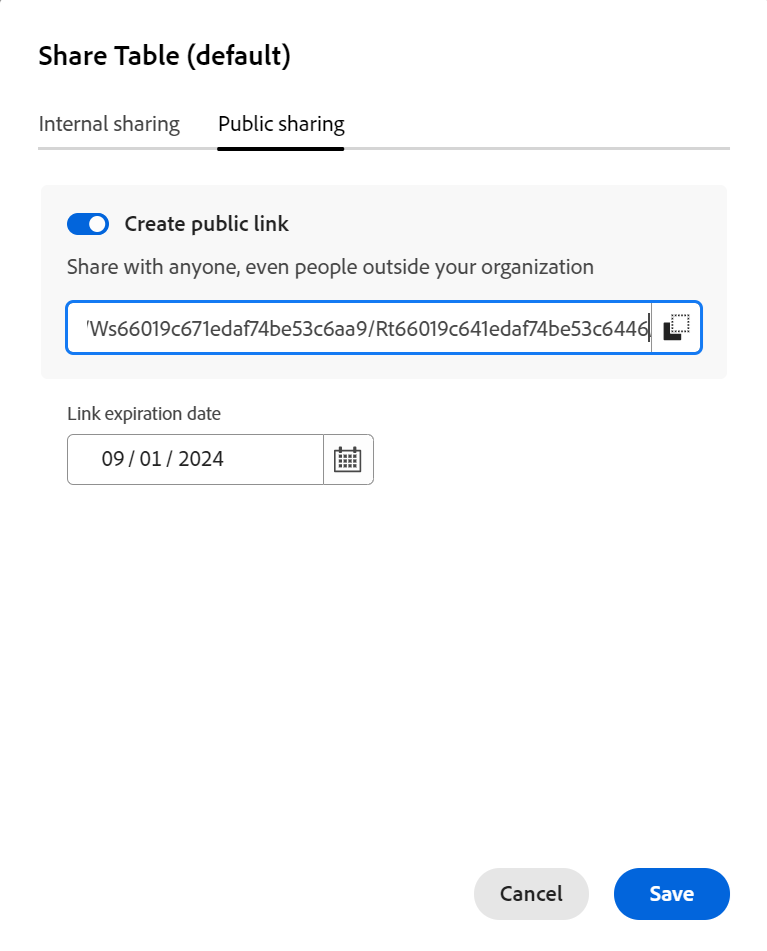

# Partager des vues

Les informations mises en surbrillance sur cette page font référence à des fonctionnalités qui ne sont pas encore disponibles de manière générale. Elle est disponible uniquement dans l’environnement de Prévisualisation pour tous les clients. Après les versions mensuelles en production, les mêmes fonctionnalités sont également disponibles dans l’environnement de production pour les clients qui ont activé les versions rapides. 

Pour plus d’informations sur les versions rapides, voir [Activation ou désactivation des versions rapides pour votre organisation](/help/quicksilver/administration-and-setup/set-up-workfront/configure-system-defaults/enable-fast-release-process.md). 

{{planning-important-intro}}

Vous pouvez partager une vue avec d’autres personnes pour travailler en collaboration lors de l’utilisation d’enregistrements dans Adobe Workfront Planning.

>[!IMPORTANT]
>
>* L’octroi d’autorisations à un espace de travail ne donne pas à d’autres personnes les autorisations d’accès aux vues sur les pages de type enregistrement. Vous devez accorder des autorisations pour des vues individuelles dans une page de type enregistrement afin de les partager avec d’autres personnes.
>
>* Accorder des autorisations à une vue ne modifie pas les autorisations d&#39;affichage des enregistrements. Les autorisations d’enregistrement sont accordées en partageant les espaces de travail.
>
>* Lorsque vous partagez une vue, vous autorisez d’autres utilisateurs à accéder à tous les éléments de la vue. Par exemple, lorsque vous leur donnez des autorisations de niveau Gérer pour une vue, ils peuvent modifier l’aspect du regroupement, du filtre, du tri ou de la barre.

Vous pouvez partager une vue avec les entités suivantes :

* En interne, avec les utilisateurs, les groupes, les équipes, les entreprises et les fonctions de Workfront
* Publiquement, avec des utilisateurs en dehors de Workfront

<!--
This article describes how you can share a view with others. For information about requesting, granting, or denying permissions to a view, see [Request permissions to a view or a workspace](/help/quicksilver/planning/access/request-permissions.md). -->

## Conditions d’accès

+++ Développez pour afficher les exigences d’accès.

<!--at GA, check that the Workfront plans article linked below has Planning info-->

Vous devez disposer des accès suivants pour effectuer les étapes décrites dans cet article :

<table style="table-layout:auto"> 
<col> 
</col> 
<col> 
</col> 
<tbody> 
    <tr> 
<tr> 
<td> 
   
 Produits
 </td> 
   <td> 
   <ul><li>
 Adobe Workfront
</li> 
   <li>
 Planification d’Adobe Workfront
</li></ul></td> 
  </tr>   
<tr> 
   <td role="rowheader">
Formule Adobe Workfront*
</td> 
   <td> 

L’un des plans Workfront suivants :
 
<ul><li>Sélectionner</li> 
<li>Principal</li> 
<li>Final</li></ul> 

Workfront Planning n’est pas disponible pour les plans Workfront hérités
 
   </td> 
<tr> 
   <td role="rowheader">
Package Adobe Workfront Planning*
</td> 
   <td> 

Tous 
 

Pour plus d’informations sur les éléments inclus dans chaque plan de planification Workfront, contactez votre gestionnaire de compte Workfront. 
 
   </td> 
 <tr> 
   <td role="rowheader">
Plateforme Adobe Workfront
</td> 
   <td> 

L’instance de Workfront de votre entreprise doit être intégrée à l’expérience unifiée Adobe pour pouvoir accéder à toutes les fonctionnalités de Workfront Planning.
 

Votre organisation doit être intégrée à l’expérience unifiée Adobe pour que les utilisateurs puissent demander et accorder des autorisations pour une vue à partir d’une demande d’autorisation. 

Les utilisateurs doivent être ajoutés au Adobe Admin Console afin d’obtenir des autorisations pour les vues Workfront Planning.

Pour plus d’informations, voir <a href="/help/quicksilver/workfront-basics/navigate-workfront/workfront-navigation/adobe-unified-experience.md">Adobe Unified Experience pour Workfront</a>. 
 
   </td> 
   </tr> 
  </tr> 
  <tr> 
   <td role="rowheader">
Licence Adobe Workfront*
</td> 
   <td>
 Standard

   
Workfront Planning n’est pas disponible pour les licences Workfront héritées
 
  </td> 
  </tr> 
  <tr> 
   <td role="rowheader">
Configuration du niveau d’accès
</td> 
   <td> 
Il n’existe aucun contrôle de niveau d’accès pour Adobe Workfront Planning.
   
</td> 
  </tr> 
<tr> 
   <td role="rowheader">
Autorisations d’objet
</td> 
   <td>  
Gérer les autorisations pour une vue
  
   
Seuls les utilisateurs disposant d’autorisations de niveau Gérer pour un espace de travail peuvent partager une vue publiquement.
</td> 
  </tr> 
<tr> 
   <td role="rowheader">
Modèle de mise en page
</td> 
   <td> 
Dans l’environnement de production, tous les utilisateurs, y compris les administrateurs système, doivent être affectés à un modèle de mise en page qui inclut les zones Planning.

Dans l’environnement de Prévisualisation, la zone Planning est activée par défaut pour les utilisateurs et utilisatrices standard et les administrateurs et administratrices système.
</td> 
  </tr> 
</tbody> 
</table>

* Pour plus d’informations sur les exigences d’accès à Workfront, voir [Conditions d’accès requises dans la documentation Workfront](/help/quicksilver/administration-and-setup/add-users/access-levels-and-object-permissions/access-level-requirements-in-documentation.md).

+++

## Remarques concernant le partage de vues

* Pour obtenir des informations générales sur le partage d’objets dans Workfront Planning, consultez également la section [Présentation des autorisations de partage dans Adobe Workfront Planning](/help/quicksilver/planning/access/sharing-permissions-overview.md).
* Vous pouvez accorder des autorisations d’affichage ou de gestion pour un affichage aux utilisateurs Workfront internes.

* Les utilisateurs disposant d’autorisations de niveau Gérer peuvent modifier les paramètres d’affichage, les partager, les dupliquer ou les supprimer.

* Vous pouvez partager des vues avec des personnes extérieures à votre organisation via un lien public.

* Lorsque vous partagez une vue publiquement, le lien est accessible par toute personne extérieure à votre entreprise pendant une durée limitée, indiquée par la date d’expiration. Aucune connexion n’est requise pour afficher la vue partagée.

* Les personnes extérieures à votre organisation qui ont accès à une vue ne peuvent pas créer d&#39;autres vues, modifier la vue partagée ou ajouter, supprimer ou modifier des informations d&#39;enregistrement dans la vue.

## Partage des autorisations pour une vue en interne

Vous pouvez partager des vues que vous avez créées ou pour lesquelles vous disposez d&#39;autorisations de niveau Gérer avec des utilisateurs, des groupes, des équipes, des sociétés et des fonctions dans Workfront Planning.

>[!NOTE]
>
>Les administrateurs et administratrices système ne peuvent pas afficher ou partager des vues qu’ils n’ont pas créées eux-mêmes ou elles-mêmes. Ils ou elles peuvent uniquement accéder à des vues ou partager des vues qui ont été partagées avec eux ou elles.
>
>Les administrateurs et administratrices système peuvent uniquement disposer d’autorisations de gestion sur une vue.

{{step1-to-planning}}

1. Ouvrez l’espace de travail dont vous souhaitez partager la vue, puis cliquez sur une carte de type d’enregistrement.

   La page du type d’enregistrement s’affiche.

1. Dans l&#39;onglet Affichage, passez la souris sur l&#39;affichage que vous souhaitez partager et cliquez sur le menu **Plus**  à droite du nom de l&#39;affichage, puis cliquez sur **Partager**. 

    

   L&#39;onglet **Partage interne** doit être sélectionné par défaut.

1. (Facultatif) Dans la zone **Qui a accès**, sélectionnez l’une des options suivantes :

   * **Seules les personnes invitées peuvent y accéder** : vous devez spécifier les utilisateurs, les groupes, l&#39;équipe, l&#39;entreprise ou la fonction avec lesquels vous souhaitez partager la vue. Il s’agit de l’option par défaut.

     >[!NOTE]
     >
     >   Outre les équipes, les groupes, les entreprises et les fonctions, vous ne pouvez partager qu’avec des utilisateurs qui ont été ajoutés au Adobe Admin Console.

   * **Tout le monde dans l’espace de travail peut afficher** : tous les utilisateurs disposant d’autorisations d’affichage ou supérieures dans les espaces de travail peuvent accéder à l’affichage.

1. Dans le champ **Accorder l’accès à cette vue**, commencez à saisir le nom d’un utilisateur, d’un groupe, d’une équipe, d’une entreprise ou d’une fonction, puis cliquez dessus lorsqu’il s’affiche dans la liste.

   

1. Sélectionnez l’un des niveaux d’autorisation suivants dans le menu déroulant :
   * Afficher
   * Gérer

     Pour plus d’informations sur les niveaux d’autorisation et les actions que les utilisateurs et les utilisatrices peuvent effectuer pour chaque niveau, consultez la [Vue d’ensemble des autorisations de partage dans Adobe Workfront Planning](/help/quicksilver/planning/access/sharing-permissions-overview.md).

     Les administrateurs système reçoivent toujours des autorisations de niveau Gérer pour les vues partagées avec eux.

1. Cliquez sur **Copier le lien** pour copier un lien vers la vue dans votre presse-papiers.
1. Cliquer sur **Enregistrer**.

   L’affichage est mis à jour avec une icône de personnes  pour indiquer que l’affichage est désormais partagé avec d’autres utilisateurs.

   >[!TIP]
   >
   >Les vues sans peuple ou sans icône globale sont des vues que vous avez créées et ne sont pas partagées avec d&#39;autres personnes. Les vues non partagées ne sont visibles que par vous.

1. Partagez le lien copié avec d’autres personnes. Les utilisateurs et utilisatrices qui reçoivent le lien doivent être des utilisateurs et utilisatrices actifs et se connecter à Workfront pour pouvoir accéder à la page du type d’enregistrement et l’afficher dans la vue sélectionnée.

## Partager les autorisations d’accès à une vue publiquement

Vous pouvez partager des vues que vous avez créées ou pour lesquelles vous disposez d’autorisations de niveau Gérer avec des personnes qui ne disposent pas d’une licence Workfront et qui sont susceptibles d’être externes à votre organisation.

>[!IMPORTANT]
>
>Seuls les utilisateurs disposant d’autorisations de niveau Gérer pour un espace de travail peuvent partager publiquement les vues de l’espace de travail.

Pour partager une vue publiquement dans Workfront Planning :

{{step1-to-planning}}

1. Ouvrez l’espace de travail dont vous souhaitez partager la vue, puis cliquez sur une carte de type d’enregistrement.

   La page du type d’enregistrement s’affiche.

1. Dans l&#39;onglet Affichage, passez la souris sur l&#39;affichage que vous souhaitez partager et cliquez sur le menu **Plus**  à droite du nom de l&#39;affichage, puis cliquez sur **Partager**. 

   

1. Cliquez sur **Partage public**.

   

1. Activez le paramètre **Créer un lien public**.

   Un lien devient disponible. Il s’agit d’un lien public. Lors du partage, toute personne disposant du lien, y compris des personnes extérieures à votre organisation, peut accéder à la page de type d’enregistrement et afficher les enregistrements et les champs de la page.

1. Cliquez sur l’icône **Copier le lien**  pour copier le lien dans le presse-papiers.

1. Saisissez manuellement une date ou utilisez le calendrier dans le champ **Date d’expiration du lien** pour sélectionner une date d’expiration pour le lien public. La page d’enregistrement vue ne sera pas accessible après la date sélectionnée.

1. Cliquer sur **Enregistrer**.

   L’affichage est mis à jour avec une icône globale  pour indiquer que l’affichage est partagé publiquement.

   >[!TIP]
   >
   >Les vues sans peuple ou sans icône globale sont des vues que vous avez créées et ne sont pas partagées avec d&#39;autres personnes. Les vues non partagées ne sont visibles que par vous.

1. (Facultatif) Collez le lien que vous avez copié dans un e-mail, un message de conversation, un document ou un commentaire Workfront pour le partager avec d’autres personnes.

## Octroi d’autorisations pour une vue à partir d’une demande d’autorisation

Les utilisateurs et utilisatrices qui accèdent à un lien vers une vue pour laquelle ils ne disposent pas d’autorisations peuvent demander des autorisations pour la vue. Tous les utilisateurs disposant d’autorisations de niveau Gérer pour l’affichage reçoivent la demande d’autorisation et peuvent accorder ou refuser les autorisations.

1. (Conditionnel) Si vous êtes le responsable d&#39;une vue, il se peut que vous receviez une demande d&#39;un autre utilisateur pour accéder à la vue dans les domaines suivants :

   * Une notification in-app
     
   * Notification par e-mail
     
1. (Conditionnel) Dans la zone de notification de Workfront, cliquez sur la notification in-app
Ou
Dans la notification par e-mail, cliquez sur **Afficher toutes les notifications**, puis cliquez sur la notification dans la liste.

   La zone **Demandes d’accès en attente** s’affiche.

   
1. (Facultatif) Pour l’utilisateur dont vous souhaitez approuver les autorisations, sélectionnez l’une des options suivantes dans le menu déroulant situé à droite du nom de l’utilisateur :
   * **Afficher**
   * **Gérer**
1. Sélectionnez l’utilisateur pour lequel vous souhaitez approuver ou refuser l’autorisation, puis cliquez sur **Approuver tout** ou **Tout refuser**.
1. Cliquez sur la flèche pointant vers la gauche de **Demandes d’accès en attente**, puis cliquez sur **Enregistrer**.

   Si vous avez approuvé la demande, les utilisateurs sont ajoutés à la zone de partage de la vue. L’utilisateur demandant l’autorisation reçoit un courrier électronique de confirmation confirmant que sa demande a été approuvée. <!--will they also get an in-app notification??-->

## Supprimer les autorisations pour une vue

{{step1-to-planning}}

1. Ouvrez l’espace de travail dont vous souhaitez arrêter le partage de la vue, puis cliquez sur une carte de type d’enregistrement. Cela ouvre la page du type d’enregistrement.
1. Pointez sur le nom de l’onglet de la vue dont vous souhaitez supprimer le partage et cliquez sur le menu **Plus** , puis cliquez sur **Partager**.
1. Pour supprimer le partage interne d’une vue, procédez comme suit :

   1. Assurez-vous que l’onglet **Partage interne** est sélectionné.
   1. Recherchez l’utilisateur, le groupe, l’équipe, l’entreprise ou la fonction à supprimer, développez le menu déroulant des autorisations à droite du nom de l’entité avec laquelle vous partagez la vue, puis cliquez sur **Supprimer**.

1. Pour supprimer le partage public d’une vue, procédez comme suit :

   1. Cliquez sur l’onglet **Partage public**.
   1. Désélectionnez l’option **Créer un lien public**.

1. Cliquer sur **Enregistrer**.

   Les gens n&#39;ont plus accès à la vue. Les utilisateurs qui ont été supprimés de l’accès à l’affichage ne sont pas avertis qu’ils ne disposent plus de cet accès.
