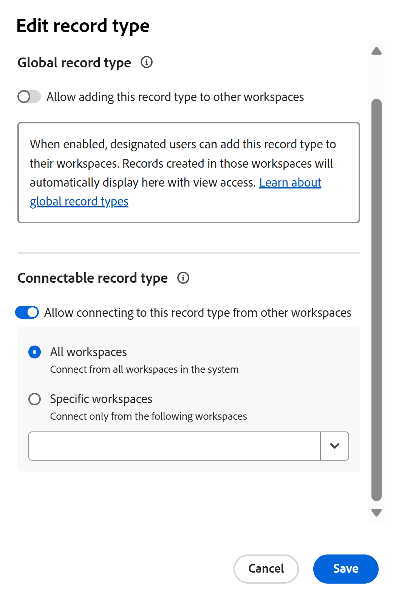

<!--*******************REPLACE THE "ADVANCED SETTINGS" SECTION IN THE "EDIT RECORD TYPES" ARTICLE WITH A LINK TO THIS ARTICLE INSTEAD AND REMOVE THE STEPS FROM THE "EDIT RECORD TYPES" ARTICLE ON HOW TO ALLOW CROSS-WORKSPACE SETTINGS FOR RECORD TYPES*************-->

# Configurer les fonctionnalités de l’espace de travail croisé pour les types d’enregistrements

<!--this article is linked to the UI in the Advanced settings/ Cross-workspace settings tab - do not delete or change the URL-->

{{planning-important-intro}}

Les informations mises en évidence sur cette page font référence à des fonctionnalités qui ne sont pas encore disponibles pour tous. Elle est disponible uniquement dans l’environnement de Prévisualisation pour tous les clients. Après les versions mensuelles en production, les mêmes fonctionnalités sont également disponibles dans l’environnement de production pour les clients qui ont activé les versions rapides. 

Pour plus d’informations sur les versions rapides, voir [Activation ou désactivation des versions rapides pour votre organisation](/help/quicksilver/administration-and-setup/set-up-workfront/configure-system-defaults/enable-fast-release-process.md). 

Vous pouvez configurer des types d’enregistrements pour qu’ils fonctionnent sur plusieurs espaces de travail dans Adobe Workfront Planning.

Vous pouvez désigner un type d’enregistrement comme l’un des types suivants :

* **Un type d’enregistrement global** : les utilisateurs peuvent ajouter des types d’enregistrements globaux à d’autres espaces de travail qu’ils peuvent gérer.
* **Type d’enregistrement connectable** : les utilisateurs peuvent se connecter à ce type d’enregistrement à partir d’autres espaces de travail.

Vous devez d’abord définir les fonctionnalités inter-espaces de travail d’un type d’enregistrement avant que les responsables d’espace de travail puissent l’ajouter ou le connecter à partir d’autres espaces de travail.

Vous définissez les fonctionnalités inter-espaces de travail d’un type d’enregistrement lorsque vous créez ou modifiez un type d’enregistrement.

Pour plus d’informations, consultez l’un des articles suivants :

* [Créer des types d’enregistrement](/help/quicksilver/planning/architecture/create-record-types.md)
* [Modifier des types d’enregistrements](/help/quicksilver/planning/architecture/edit-record-types.md)

## Conditions d’accès

+++ Développez pour afficher les conditions d’accès requises pour la fonctionnalité de cet article.

<table style="table-layout:auto"> 
<col> 
</col> 
<col> 
</col> 
<tbody> 
    <tr> 
<tr> 
</tr>   
<tr> 
   <td role="rowheader">
Package Adobe Workfront
</td> 
   <td> 

Pour configurer les types d’enregistrements connectables : 

<ul> 
<li>
Tout package Workfront et tout package Planning
</li>
Ou
<li>Tout workflow et un package Planning Prime ou Ultimate
</li></ul>

Pour configurer les types d’enregistrements globaux :

<ul> 
<li>
Tout package Workfront et un package Planning Plus
</li>
Ou
<li>
Tout workflow et un package Planning Prime ou Ultimate
</li></ul>

Pour plus d’informations sur les composants inclus dans chaque package Workfront Planning, contactez votre représentant de compte Workfront. 

 
   </td> 
  <tr> 
   <td role="rowheader">
Licence Adobe Workfront
</td> 
   <td>
Standard

   </td> 
  </tr> 
  <tr> 
   <td role="rowheader">
Autorisations d’objet
</td> 
   <td>   
Gérer les autorisations d’un espace de travail
  
   
L’administration système a accès à tous les espaces de travail, y compris ceux qu’elle n’a pas créés.
  </td> 
  </tr>  
</tbody> 
</table>

Pour plus d’informations sur les exigences d’accès à Workfront, voir [Exigences d’accès dans la documentation de Workfront](/help/quicksilver/administration-and-setup/add-users/access-levels-and-object-permissions/access-level-requirements-in-documentation.md).

+++   

<!--Old:

<table style="table-layout:auto"> 
<col> 
</col> 
<col> 
</col> 
<tbody> 
    <tr> 
<tr> 

  </tr>   
<tr> 
   <td role="rowheader">
Adobe Workfront package
</td> 
   <td> 
<ul><li>
Any Workfront package
</li>

And

<li>
Any Planning package to create connectable record types
</li>
<li>
A Planning Plus package to create global record types
</li>
</ul>
Or:
<ul><li>
A Workflow Prime or Ultimate package
 </li>
And
<li>
A Planning Prime or Ultimate package
</li></ul>

For more information about what is included in each Workfront Planning package, contact your Workfront account manager. 
 
   </td> 
  <tr> 
   <td role="rowheader">
Adobe Workfront license
</td> 
   <td>
Standard

   </td> 
  </tr> 
  <tr> 
   <td role="rowheader">
Object permissions
</td> 
   <td>   
Manage permissions to a workspace and to the record type</a> 
  
   
System Administrators have permissions to all workspaces, including the ones they did not create
  </td> 
  </tr>  
</tbody> 
</table> -->

## Configuration des types d’enregistrements globaux

<!--this is a UI term; don't change the title of this section-->

En tant que gestionnaire d’espace de travail, vous pouvez configurer un type d’enregistrement en tant que type d’enregistrement global. Un type d’enregistrement global peut être ajouté à d’autres espaces de travail.

Un responsable d’espace de travail peut ajouter un type d’enregistrement global à un espace de travail qu’il gère. Les champs d’origine du type d’enregistrement sont également ajoutés à l’espace de travail secondaire.

Les utilisateurs peuvent ajouter des enregistrements à un type d&#39;enregistrement global depuis n&#39;importe quel espace de travail où ils disposent d&#39;autorisations Contribute et où le type d&#39;enregistrement global est ajouté, y compris son espace de travail d&#39;origine. Ils peuvent afficher les enregistrements des espaces de travail pour lesquels ils disposent uniquement des autorisations d’affichage.

Pour plus d’informations, voir [Présentation des types d’enregistrements de l’espace de travail](/help/quicksilver/planning/architecture/cross-workspace-record-types-overview.md).

Pour configurer un type d’enregistrement comme global :

{{step1-to-planning}}

1. Cliquez sur l’espace de travail dont vous souhaitez configurer les types d’enregistrements comme globaux.

   La page Workspace s’ouvre et les types d’enregistrements s’affichent.
1. Utilisez l’une des méthodes suivantes :

   * Pointez sur la carte d’un type d’enregistrement et cliquez sur le menu **Plus**  dans le coin supérieur droit de la carte du type d’enregistrement. <!--add new screen shot without Share for now-->

     

   * Cliquez sur une carte de type d’enregistrement pour ouvrir la page de type d’enregistrement, puis cliquez sur le menu **Plus**  à droite du nom du type d’enregistrement.
1. Cliquez sur **Modifier** ou **Paramètres**.

   >[!TIP]
   >
   >Lorsqu’un type d’enregistrement est ajouté à un autre espace de travail, il s’affiche en tant que type d’enregistrement global dans cet espace de travail. Dans ce cas, les options Modifier et Paramètres sont grisées.

1. (Conditionnel) Si vous avez cliqué sur **Modifier**, dans la zone **Modifier le type d’enregistrement**, cliquez sur l’onglet **Paramètres de l’espace de travail croisé**

   Ou, si vous avez cliqué sur **Paramètres**, cliquez sur la section **Paramètres de l’espace de travail transversal** dans le panneau de gauche.
1. Activez le paramètre **Autoriser l’ajout de ce type d’enregistrement à d’autres espaces de travail**.

   

   >[!TIP]
   >
   >Après avoir ajouté un type d’enregistrement global à un autre espace de travail, ce paramètre ne peut plus être désactivé.

1. Dans le champ **Sélectionner les personnes autorisées à ajouter ce type d’enregistrement aux espaces de travail qu’elles gèrent**, ajoutez les entités que vous souhaitez autoriser à ajouter ce type d’enregistrement aux espaces de travail qu’elles gèrent.

   Votre nom est automatiquement ajouté au champ.

   Vous pouvez ajouter des utilisateurs individuels, des groupes, des équipes, des fonctions ou des sociétés dont vous souhaitez autoriser les utilisateurs à ajouter ce type d’enregistrement aux espaces de travail qu’ils gèrent.

   Vous pouvez modifier ce champ après avoir enregistré le type d’enregistrement.

1. (Facultatif) Supprimez votre nom du champ **Sélectionner qui peut ajouter ce type d’enregistrement aux espaces de travail qu’il gère**.

   >[!TIP]
   >
   >Vous devez désigner au moins une entité (utilisateur, équipe, groupe, rôle ou entreprise) pour pouvoir activer ce paramètre.

1. (Conditionnel) Cliquez sur **Enregistrer** dans la zone **Modifier le type d’enregistrement** ou cliquez sur la flèche vers l’arrière à gauche de **Paramètres** dans l’en-tête de page pour enregistrer vos modifications.

   Les événements suivants se produisent :

   * Le type d’enregistrement et ses champs peuvent désormais être ajoutés à un autre espace de travail par les personnes que vous avez désignées.

   >[!NOTE]
   >
   >Vous ne pouvez modifier l’aspect et les paramètres du type d’enregistrement, ainsi que ses champs d’origine, qu’à partir de son espace de travail d’origine.

   * La carte de type d’enregistrement affiche une icône **type d’enregistrement global**  pour indiquer que le type d’enregistrement peut être ajouté à d’autres espaces de travail.
   * Un champ **Workspace** généré par le système est ajouté à la vue Tableau du type d&#39;enregistrement et des détails de ses enregistrements.

     Le champ Workspace affiche l’espace de travail à partir duquel chaque enregistrement est créé.

     Ce champ est en lecture seule et ne peut pas être supprimé.
1. (Facultatif) Accédez à un autre espace de travail et créez un type d’enregistrement à l’aide d’un type d’enregistrement existant. Sélectionnez le type d’enregistrement que vous avez activé dans les étapes ci-dessus.

   Pour plus d’informations, voir [Ajouter des types d’enregistrements existants depuis un autre espace de travail](/help/quicksilver/planning/architecture/add-existing-record-types-from-another-workspace.md).

   Le type d’enregistrement ajouté à partir d’un type d’enregistrement global dans l’espace de travail secondaire affiche également une icône **type d’enregistrement global** .
1. (Facultatif) Revenez à l’espace de travail d’origine où vous avez créé le type d’enregistrement global et modifiez le type d’enregistrement en suivant les étapes 1 à 4 ci-dessus <!--ensure this stays accurate-->
1. (Facultatif) Consultez la liste des espaces de travail où l’enregistrement global a été ajouté dans la section **Espaces de travail où ce type d’enregistrement est utilisé**. Le propriétaire de l’espace de travail est également répertorié en regard du nom de l’espace de travail.

   

## Configuration des types d’enregistrements connectables

<!--this is a UI term; don't change the title of this section-->

Vous pouvez configurer un type d’enregistrement auquel se connecter à partir d’autres espaces de travail lorsque vous créez ou modifiez le type d’enregistrement.

La configuration d’un type d’enregistrement pour qu’il soit connectable diffère selon l’environnement choisi pour votre configuration.

### Configuration des types d’enregistrements connectables dans l’environnement de production

{{step1-to-planning}}

1. Cliquez sur l’espace de travail dont vous souhaitez configurer les types d’enregistrements comme étant connectables.

   La page Workspace s’ouvre et les types d’enregistrements s’affichent.
1. Utilisez l’une des méthodes suivantes :

   * Pointez sur la carte d’un type d’enregistrement et cliquez sur le menu **Plus**  dans le coin supérieur droit de la carte du type d’enregistrement

     

   * Cliquez sur une carte de type d’enregistrement pour ouvrir la page de type d’enregistrement, puis cliquez sur le menu **Plus**  à droite du nom du type d’enregistrement, puis cliquez sur **Modifier**.

1. Cliquez sur l’onglet **Paramètres avancés**.

1. Activez le paramètre **Autoriser la connexion à ce type d’enregistrement à partir d’autres espaces de travail**.

   

   Lorsqu’il est activé, le type d’enregistrement peut être connecté et il est accessible pour être connecté à partir d’autres espaces de travail.

1. Choisissez parmi les espaces de travail accessibles pour le type d’enregistrement. Choisissez l’une des options suivantes :

   <!--check names of the setting: System wide?? OR All workspaces??-->

   * **À l’échelle du système** : les utilisateurs peuvent se connecter à ce type d’enregistrement à partir de tous les espaces de travail pour lesquels ils disposent des autorisations Gérer.
   * **Espaces de travail spécifiques** : dans le menu déroulant, ajoutez les noms des espaces de travail auxquels les responsables d’espace de travail peuvent se connecter à ce type d’enregistrement.
1. (Conditionnel) Cliquez sur **Enregistrer** dans la zone **Modifier le type d’enregistrement** pour enregistrer vos modifications.

   Les événements suivants se produisent :

   * Le type d’enregistrement et ses champs sont désormais disponibles pour la connexion à partir des espaces de travail que vous avez désignés.
   * La carte de type d’enregistrement affiche une icône de type d’enregistrement connectable  pour indiquer que le type d’enregistrement peut être connecté à partir de n’importe quel espace de travail que vous avez désigné dans votre configuration.

1. (Facultatif) Accédez à un autre espace de travail et ajoutez une connexion au type d’enregistrement que vous avez activé pour la connectabilité entre les espaces de travail dans les étapes ci-dessus.

   Pour plus d’informations, consultez la section [Connecter des types d’enregistrements](/help/quicksilver/planning/architecture/connect-record-types.md).

### Configuration des types d’enregistrements connectables dans l’environnement de prévisualisation

{{step1-to-planning}}

1. Cliquez sur l’espace de travail dont vous souhaitez configurer les types d’enregistrements comme étant connectables.

   La page Workspace s’ouvre et les types d’enregistrements s’affichent.
1. Utilisez l’une des méthodes suivantes :

   * Pointez sur la carte d’un type d’enregistrement et cliquez sur le menu **Plus**  dans le coin supérieur droit de la carte du type d’enregistrement

     

   * Cliquez sur une carte de type d’enregistrement pour ouvrir la page de type d’enregistrement, puis cliquez sur le menu **Plus**  à droite du nom du type d’enregistrement.
1. Cliquez sur **Modifier** ou **Paramètres**.

1. (Conditionnel) Si vous avez cliqué sur **Modifier**, dans la zone **Modifier le type d’enregistrement**, cliquez sur l’onglet **Paramètres de l’espace de travail croisé**

   Ou, si vous avez cliqué sur **Paramètres**, cliquez sur la section **Paramètres de l’espace de travail transversal** dans le panneau de gauche.

1. Activez le paramètre **Autoriser la connexion à ce type d’enregistrement dans d’autres espaces de travail**. <!-- check the setting name, I sent this to Lilit to say FROM instead of IN-->

   <!-- add new screen shot with new tab name-->

   

   Lorsqu’il est activé, le type d’enregistrement est accessible et peut être connecté à à partir d’autres espaces de travail.

1. Choisissez parmi les espaces de travail accessibles pour le type d’enregistrement. Choisissez l’une des options suivantes :

   <!--check names of the setting: System wide?? OR All workspaces??-->

   * **Tous les espaces de travail** : les utilisateurs peuvent se connecter à ce type d’enregistrement à partir de tous les espaces de travail pour lesquels ils disposent des autorisations de gestion.
   * **Espaces de travail spécifiques** : dans le menu déroulant, ajoutez les noms des espaces de travail auxquels les responsables d’espace de travail peuvent se connecter à ce type d’enregistrement.
1. (Conditionnel) Cliquez sur **Enregistrer** dans la zone **Modifier le type d’enregistrement** ou cliquez sur la flèche vers l’arrière à gauche de **Paramètres** dans l’en-tête de page pour enregistrer vos modifications.

   Les événements suivants se produisent :

   * Le type d’enregistrement et ses champs sont désormais disponibles pour la connexion à partir des espaces de travail que vous avez désignés.
   * La carte de type d’enregistrement affiche une icône de type d’enregistrement connectable  pour indiquer que le type d’enregistrement peut être connecté à partir de n’importe quel espace de travail que vous avez désigné dans votre configuration.

1. (Facultatif) Accédez à un autre espace de travail et ajoutez une connexion au type d’enregistrement que vous avez activé pour la connectabilité entre les espaces de travail dans les étapes ci-dessus.

   Pour plus d’informations, consultez la section [Connecter des types d’enregistrements](/help/quicksilver/planning/architecture/connect-record-types.md).

