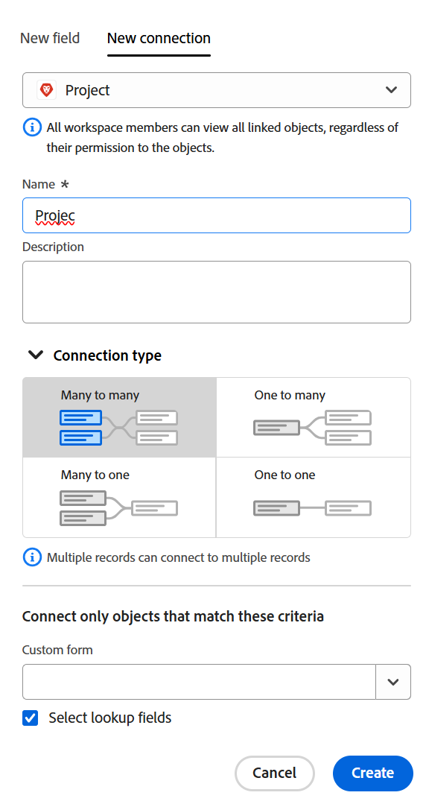

<!-----
title: Connect record types
description: A way to indicate how individual record types relate to one another is to connect them. Also, you can connect Adobe Workfront Planning record types with object types from other applications to enhance your users' experience and keep their focus in one application.
hidefromtoc: yes
hide: yes
feature: Work management
role: User
author: Alina
--->

<!--update the metadata with real information when making this avilable in TOC and in the left nav-->
<!--************ THIS MIGHT NO LONGER BE A 'RELATIONSHIP' TYPE FIELD, BECAUSE THEY WILL SHOW IT IN THE CONNECTION TAB*****************************-->

# Connecter des types d’enregistrements

{{planning-important-intro}}

<!--
You can use Adobe Workfront Planning to design fully-customizable workspaces that contain record types needed in your organization. A way to indicate how individual record types relate to one another is to connect them. Also, you can connect Workfront Planning record types with object types from other applications to enhance your users' experience and keep their focus in one application. -->

Vous pouvez connecter les types d’enregistrements Adobe Workfront Planning les uns aux autres ou à des types d’objets provenant d’autres applications.

Cet article décrit comment vous pouvez connecter deux types d’enregistrement Workfront Planning un type d’enregistrement Workfront Planning à un objet provenant d’une autre application.

Après avoir établi la connexion entre les enregistrements ou les types d’objets, vous pouvez connecter des enregistrements individuels les uns aux autres et afficher les champs de l’enregistrement ou des types d’objets liés sur un enregistrement Workfront Planning.

Pour plus d’informations sur la connexion d’un enregistrement Adobe Workfront Planning à un objet à partir d’une autre application, voir [Connecter des enregistrements](/help/quicksilver/planning/records/connect-records.md).

Pour un exemple de connexion des types d’enregistrements et des enregistrements, reportez-vous à la section [Exemple de connexion de types d&#39;enregistrements et d&#39;enregistrements](/help/quicksilver/planning/architecture/example-connect-record-types-and-records.md).

<!--ensure this last linked article is right; the title and the link should have changed-->

## Conditions d’accès

Vous devez disposer des accès suivants pour effectuer les étapes de cet article :

<table style="table-layout:auto">
 <col>
 </col>
 <col>
 </col>
 <tbody>
    <tr>
<tr>
<td>
   
 Produit
 </td>
   <td>
   
 Adobe Workfront
 
Pour connecter les types d’enregistrements Adobe Workfront Planning à Experience Manager Assets, vous devez disposer d’une licence Adobe Experience Manager Assets et l’instance de Workfront de votre entreprise doit être intégrée à l’expérience unifiée de l’Adobe. Pour plus d’informations, voir <a href="/help/quicksilver/workfront-basics/navigate-workfront/workfront-navigation/adobe-unified-experience.md">Adobe d’une expérience unifiée pour Workfront</a>.
 </td>
  </tr>  
 <td role="rowheader">
Accord Adobe Workfront
</td>
   <td>

Votre entreprise doit être inscrite à l’étape d’accès anticipé pour la planification Workfront 

   </td>
  </tr>
  <tr>
   <td role="rowheader">
Forfait Adobe Workfront
</td>
   <td>

N’importe quelle

   </td>
  </tr>
  <tr>
   <td role="rowheader">
Licence Adobe Workfront*
</td>
   <td>
   
Nouvelle : standard
 
   
Actuelle : formule

  </td>
  </tr>

<tr>
   <td role="rowheader">
Configurations du niveau d’accès
</td>
   <td> 
Il n’existe aucun contrôle de niveau d’accès pour Adobe Workfront Planning.
  
</td>
  </tr>
<tr>
   <td role="rowheader">
Modèle de disposition
</td>
   <td> 
Votre administrateur ou administratrice Workfront ou de groupes doit ajouter la zone Planning dans votre modèle de disposition. Pour plus d’informations, voir <a href="/help/quicksilver/planning/access/access-overview.md">Vue d’ensemble des accès</a>. 
  
</td>
  </tr>
<tr>
   <td role="rowheader">
Autorisations
</td>
   <td> 
Autorisations de gestion d’un espace de travail</a> 
  
   
Les équipes d’administration système ont des droits sur tous les espaces de travail, y compris ceux qu’elles n’ont pas créés.
</td>
  </tr>
 </tbody>
</table>

*Pour plus d’informations, voir [Conditions d’accès requises dans la documentation Workfront](/help/quicksilver/administration-and-setup/add-users/access-levels-and-object-permissions/access-level-requirements-in-documentation.md).

<!--Maybe enable this at GA - but planing is not supposed to have Access controls in the Workfront Access Level: 
>[!NOTE]
>
>If you don't have access, ask your Workfront administrator if they set additional restrictions in your access level. For information on how a Workfront administrator can change your access level, see [Create or modify custom access levels](/help/quicksilver/administration-and-setup/add-users/configure-and-grant-access/create-modify-access-levels.md). -->

<!-- Notes to add for the table: for the "Workfront plans" row: the above is only for closed beta; when going to GA - activate the following plans:    

Current plan: Prime and Ultimate

Legacy plan: Enterprise
-->

<!-- Notes for the table: for the "Workfront access" row: 
For more information, see <a href="../../administration-and-setup/add-users/access-levels-and-object-permissions/wf-licenses.md" class="MCXref xref">Adobe Workfront licenses overview</a>.
-->

## Remarques concernant la connexion des types d’enregistrements

* Vous pouvez connecter les entités suivantes dans Adobe Workfront Planning :

   * Deux types d’enregistrements

     Les types d’enregistrements doivent appartenir au même espace de travail.
   * Type d’enregistrement et type d’objet d’une autre application.

* Vous pouvez connecter les types d’enregistrement de Workfront Planning aux types d’objets suivants à partir des applications suivantes :

   * Adobe Workfront :

      * Projets
      * Portefeuilles
      * Programmes
      * Entreprises
      * Groupes

   * Adobe Experience Manager Assets :

      * Images
      * Dossiers

     >[!IMPORTANT]
     >
     >Vous devez disposer d’une licence Adobe Experience Manager Assets et l’instance Workfront de votre organisation doit être intégrée à Adobe Business Platform ou à Adobe Admin Console pour connecter les enregistrements Workfront Planning à Adobe Experience Manager Assets.
     >
     >Si vous avez des questions relatives à l’intégration à Adobe Admin Console, voir les [questions fréquentes Adobe Unified Experience](/help/quicksilver/workfront-basics/navigate-workfront/workfront-navigation/unified-experience-faq.md).

* Après avoir créé des enregistrements individuels pour un type d’enregistrement, vous pouvez sélectionner les enregistrements à connecter dans le champ de type d’enregistrement lié. Pour plus d’informations, voir [Connecter des enregistrements](/help/quicksilver/planning/records/connect-records.md).

* Lorsque vous connectez un type d’enregistrement à un autre type d’enregistrement ou à un type d’objet provenant d’une autre application, les scénarios suivants se présentent :

   * **Lorsque vous reliez deux types d’enregistrements** : un champ d’enregistrement lié est créé dans le type d’enregistrement à partir duquel vous établissez la connexion. Un champ d’enregistrement lié similaire est créé sur le type d’enregistrement auquel vous vous connectez.

     Par exemple, si vous connectez le type d’enregistrement « Campagne » au type d’enregistrement « Produit », un champ d’enregistrement lié que vous nommez « Produit lié » est créé dans le type d’enregistrement « Campagne » et un type d’enregistrement lié automatiquement nommé « Campagne » est créé dans le type d’enregistrement « Produit ».

   * **Lorsque vous connectez un type d’enregistrement à un type d’objet d’une autre application**:

      * Un champ d’enregistrement lié est créé sur le type d’enregistrement à partir duquel vous vous connectez. Aucun champ d’enregistrement lié n’est automatiquement créé sur le type d’objet de l’autre application.

      * Un nouveau type d’enregistrement Workfront Planning en lecture seule est créé pour l’objet de l’autre application uniquement lorsque des objets réels sont connectés aux enregistrements Workfront Planning.

        Pour plus d’informations, voir [Connecter des enregistrements](/help/quicksilver/planning/records/connect-records.md).

      * La planification des champs d’enregistrement n’est pas accessible à partir des objets Workfront.
      * La planification des champs d’enregistrement est accessible à partir des ressources Experience Manager lorsque votre administrateur Workfront configure le mappage des métadonnées par le biais de l’intégration entre Workfront et Adobe Experience Manager Assets. Pour plus d’informations, voir [Configuration du mappage des métadonnées de ressource entre Adobe Workfront et Experience Manager Assets](https://experienceleague.adobe.com/docs/experience-manager-cloud-service/content/assets/integrations/configure-asset-metadata-mapping.html?lang=fr).

   * **Lorsque vous ajoutez des champs liés (ou de recherche) de l’enregistrement ou de l’objet auquel vous vous connectez.**: vous pouvez connecter des champs de l’objet de l’autre application au type d’enregistrement de la planification Workfront. Les champs liés sont en lecture seule et affichent automatiquement les informations des enregistrements ou des objets connectés lorsque vous connectez les enregistrements ou les objets.

     Par exemple, si vous connectez le type d’enregistrement « Campagne » à un projet Workfront et que vous choisissez d’intégrer le champ Date d’achèvement prévue du projet à l’enregistrement Workfront Planning, un champ lié nommé Date d’achèvement prévue (du projet) est automatiquement créé pour la campagne. Vous ne pouvez pas modifier manuellement ce champ lié. Le champ Date d’achèvement prévue (du projet) affiche la date d’achèvement prévue des projets liés.

     >[!IMPORTANT]
     >
     >    Toute personne disposant d’autorisations d’affichage ou supérieures sur l’espace de travail peut afficher les informations dans les champs liés, indépendamment de ses autorisations ou de son niveau d’accès dans l’application des types d’objets liés.

* Les champs d’enregistrement liés sont précédés d’une icône de relation .

  Les champs liés sont précédés d’une icône qui identifie le type de champ. Par exemple, les champs liés (ou recherche) sont précédés d’icônes indiquant qu’un champ est un nombre, un paragraphe ou une date.

## Connecter des types d’enregistrements

<!--when changes here, also update the article for "Connect records"-->

{{step1-to-planning}}

1. Cliquez sur l&#39;espace de travail dont vous souhaitez vous connecter aux types d&#39;enregistrements,

   Ou

   Dans un espace de travail, développez la flèche pointant vers le bas située à droite du nom d’un espace de travail existant, recherchez un espace de travail, puis sélectionnez-le lorsqu’il s’affiche dans la liste.
1. Cliquez sur la vignette d’un type d’enregistrement pour ouvrir la page du type d’enregistrement.
1. Cliquez sur l’icône **+** dans le coin supérieur droit de la vue Tableau, puis cliquez sur l’onglet **Nouvelle connexion**.

   

1. Dans le champ **Type d’enregistrement**, recherchez un type d’enregistrement ou sélectionnez l’un des éléments suivants :

   * un autre type d’enregistrement de la section de l’espace de travail que vous avez sélectionné.

     

     >[!TIP]
     >
     >Seuls les types d’enregistrements de l’espace de travail sélectionné sont disponibles pour une connexion.
     > 
     >Si vous n’avez pas d’autres types d’enregistrements dans l’espace de travail sélectionné, la section de l’espace de travail ne s’affiche pas.

   * Un **projet, un portfolio, un programme, une entreprise** ou un **groupe** depuis la section **Types d’objets Workfront**.

     

   * **Experience Manager Assets** depuis la section **Adobe Applications**.

     

1. Mettez à jour les informations suivantes :

   * **Nom** : nom du champ connecté, tel qu’il apparaît dans la vue Tableau ou la page de l’enregistrement original. Cela crée la colonne des enregistrements liés dans la vue table du type d&#39;enregistrement d&#39;origine ou du champ d&#39;enregistrement lié pour les enregistrements d&#39;origine. Par défaut, le nom du champ correspond au nom de l’enregistrement ou de l’objet auquel vous vous connectez.

   >[!TIP]
   >
   >Vous pouvez avoir plusieurs connexions au même type d’enregistrement ou d’objet. Si vous ne modifiez pas le nom du champ connecté, Workfront ajoute un nombre après le nom de l’enregistrement connecté, afin d’indiquer le nombre de types d’enregistrements connectés par le même nom.

   * **Description** : informations supplémentaires sur le champ de l’enregistrement connecté. La description d’un champ s’affiche lorsque vous survolez la colonne du champ dans un tableau.
   * **Autoriser les enregistrements multiples** : sélectionnez cette option pour indiquer que vous autorisez les utilisateurs et les utilisatrices à ajouter plusieurs enregistrements lorsque le champ du type d’enregistrement lié s’affiche dans les enregistrements originaux. Cette option est sélectionnée par défaut.
   * **Sélectionner les champs de recherche** : sélectionnez cette option pour ajouter les champs du type d’enregistrement sélectionné. Les champs de recherche sont des champs associés au type d’enregistrement ou d’objet vers lequel vous établissez un lien. La création d’un lien affiche les informations de l’enregistrement ou de l’objet vers lequel vous établissez un lien dans l’enregistrement à partir duquel vous établissez un lien. Cette option est sélectionnée par défaut.

     >[!TIP]
     >
     > Vous ne pouvez pas ajouter les types de champ suivants comme champs de recherche :
     >
     >    * Personnes
     >    * Créé par
     >    * Dernière modification par
     >    * Champs de saisie anticipée Workfront (y compris les champs tels que Propriétaire du projet ou Parrain du projet)

1. (Le cas échéant et facultatif) Si vous avez choisi de connecter un objet Workfront, sélectionnez un **Formulaire personnalisé** dans la section **Lier uniquement les objets correspondant à ces critères**. Seuls les objets auxquels sont attachés les formulaires personnalisés sélectionnés peuvent être liés au type d’enregistrement sélectionné. Vous pouvez sélectionner plusieurs formulaires.

   >[!NOTE]
   >
   > Vous devez créer des formulaires personnalisés dans Workfront pour les objets sélectionnés avant qu’ils ne s’affichent dans cette liste.

1. (Le cas échéant) Si vous avez choisi de vous connecter à Experience Manager Assets, sélectionnez un référentiel dans le menu déroulant **Référentiel Experience Manager** dans la section **Lier des ressources à partir du référentiel suivant**. Il s’agit d’un champ obligatoire. Seuls les référentiels auxquels vous avez accès dans Experience Manager Assets s’affichent dans ce champ.

   >[!NOTE]
   >
   >Votre administrateur Workfront peut mapper les champs de planification Workfront aux champs Experience Manager Assets par le biais du mappage des métadonnées dans Workfront. Pour plus d’informations, voir [Configuration du mappage des métadonnées de ressource entre Adobe Workfront et Experience Manager Assets](https://experienceleague.adobe.com/docs/experience-manager-cloud-service/content/assets/integrations/configure-asset-metadata-mapping.html?lang=fr).

1. (Conditionnel) Si vous avez choisi de vous connecter à Experience Manager Assets ou à un type d’enregistrement Workfront Planning, désactivez la variable **Titre** bascule dans le **Apparence d’enregistrement** , si vous ne souhaitez pas que le titre des enregistrements ou ressources connectés s’affiche dans le champ lié. Lorsque cette option est désactivée, seules les miniatures des enregistrements s’affichent dans les champs liés. Les enregistrements sans miniature affichent une icône d’image à la place. Le bouton bascule est activé par défaut. Un exemple d’affichage des enregistrements connectés dans la section **Apparence d’enregistrement** zone.

   >[!TIP]
   >
   >    Lorsque vous autorisez le lien de plusieurs enregistrements, l’affichage de la miniature peut économiser de l’espace dans des zones plus petites, comme les vues d’enregistrement.
   >
   >Le titre d’un enregistrement est le champ principal de l’enregistrement. Pour plus d’informations, voir [Champ Principal - Aperçu](/help/quicksilver/planning/fields/primary-field-overview.md).

1. Cliquez sur **Créer**.

1. (Le cas échéant) Si vous avez sélectionné le paramètre **Sélectionner un champ de recherche**, la zone **Ajouter des champs de recherche** s’ouvre.

   Cliquez sur le bouton **+** pour ajouter des champs à partir de la zone **Champs non sélectionnés**.

   Ou

   Cliquez sur le bouton **-** pour supprimer des champs de la zone **Champs sélectionnés**.

   

   Les valeurs des champs connectés sont renseignées automatiquement une fois que vous avez lié des enregistrements ou des objets.

   >[!IMPORTANT]
   >
   >    Toute personne disposant d’autorisations d’affichage ou supérieures sur l’espace de travail peut afficher les informations dans les champs liés, indépendamment de ses autorisations ou de son niveau d’accès dans l’application des types d’objets liés.

1. (Facultatif) Cliquez sur **Ignorer** pour ignorer l’ajout de champs à partir de l’enregistrement ou du type d’objet lié. La variable **Nom** ou le **Titre** de l’enregistrement lié est le seul champ visible dans la vue table du type d’enregistrement à partir duquel vous vous connectez.

1. (Facultatif et le cas échéant) Si vous choisissez de lier un champ de type nombre, devise, pourcentage ou date, sélectionnez également une valeur d’agrégation. Les valeurs des champs liés s’affichent séparés par des virgules ou sous la forme d’une valeur agrégée, selon l’agrégateur que vous choisissez, lorsque les utilisateurs et utilisatrices sélectionnent plusieurs enregistrements liés dans le champ d’enregistrement lié.

   >[!IMPORTANT]
   >
   >    Vous devez sélectionner une valeur d’agrégateur lors de l’ajout de champs de date de recherche si vous souhaitez que les champs soient disponibles à ajouter en tant que dates de début et de fin pour les vues de chronologie et de calendrier. Par exemple, vous pouvez sélectionner le MAX ou l’agrégateur MIN pour un champ de date de recherche.

   

   >[!NOTE]
   >
   > Les agrégateurs ne sont pas disponibles lors de la connexion des types d’enregistrement à Experience Manager Assets.

   Sélectionnez l’une des options suivantes :

   * **Aucun** : affiche les valeurs provenant de plusieurs enregistrements séparés par des virgules. Il s’agit de la sélection par défaut.
   * **MAX** : affiche la valeur la plus élevée parmi toutes les valeurs provenant de plusieurs enregistrements sélectionnés dans le champ d’enregistrement lié.
   * **MIN** : affiche la valeur la plus basse parmi toutes les valeurs provenant de plusieurs enregistrements sélectionnés dans le champ d’enregistrement lié.
   * **SOM**: affiche le total de toutes les valeurs provenant de plusieurs enregistrements sélectionnés dans le champ d’enregistrement lié.
   * **MOY** : affiche la moyenne de toutes les valeurs provenant de plusieurs enregistrements sélectionnés dans le champ d’enregistrement lié.
   * **UNIQUE**: supprime les doublons des valeurs de champ de recherche et affiche uniquement les valeurs uniques. Cette option n’est pas disponible pour les types de champ suivants :
      * Paragraphe
      * Case à cocher
      * Personnes

   >[!NOTE]
   >
   >Vous pouvez, par exemple, lier l’enregistrement Produit (enregistrement lié) de l’enregistrement Campagne (enregistrement d’origine) et le nommer « champ de produit ». Vous pouvez également choisir de lier le champ Budget de l’enregistrement Produit à partir de l’enregistrement Campagne et de l’appeler « Budget produit ». Si vous avez le droit de sélectionner plusieurs enregistrements dans le &quot;champ Produit&quot;, vous pouvez sélectionner le Produit 1 dont le budget est de 100 000 € et le Produit 2 dont le budget est de 110 000 €, et le Produit 3 dont le budget est de 100 000 €. Vous pouvez afficher les informations budgétaires suivantes dans le champ lié à partir de l’enregistrement d’origine, en fonction de l’agrégateur choisi :
   >
   >* **Aucun**: 100 000 $, 110 000 $, 100 000 $
   >* **MAX**: 110 000 $
   >* **MIN** : 100 000 €
   >* **SUM**: 310 000 $
   >* **AVG**: 103 000,33 $
   >* **UNIQUE**: 100 000 $
   >

1. (Facultatif) Utilisez l’icône **rechercher**  pour rechercher un champ.

1. Cliquez sur **Ajouter des champs** pour enregistrer vos modifications.

   Les éléments suivants sont ajoutés :

   * Champ de l’enregistrement lié au type d’enregistrement à partir duquel vous créez un lien. Le champ d’enregistrement lié affiche les enregistrements individuels du type d’enregistrement lié, une fois que vous les avez ajoutés manuellement. Pour plus d’informations sur l’ajout d’enregistrements, voir [Connecter des enregistrements](/help/quicksilver/planning/records/connect-records.md). Le nom du champ d’enregistrement lié est le nom que vous avez sélectionné à l’étape 7. <!--accurate-->

   * Champ (ou champ) lié(e) qui affiche des informations sur l’enregistrement ou les types d’objet liés après avoir ajouté manuellement les enregistrements ou les objets dans le champ d’enregistrement lié. Les champs de recherche ne sont créés que lorsque la variable **Sélectionner les champs de recherche** est sélectionné lors de la création de la connexion. Les champs de recherche sont automatiquement nommés selon ce modèle :

     `<Name of the original field on the linked record> (from <Name of your linked field>)`

     Par exemple, si vous avez lié un type d’enregistrement Campagne avec un type d’enregistrement Programme et que vous nommez le champ d’enregistrement associé au Programme « Informations sur le programme », puis que vous choisissez d’afficher également le champ Budget du programme dans la vue de tableau de la campagne, le champ lié est automatiquement nommé `Budget (from Program information)` dans la vue de tableau de la campagne.

   * Lorsque vous liez des types d’enregistrement les uns aux autres, un champ d’enregistrement lié est également ajouté au type d’enregistrement auquel vous liez l’enregistrement. Le nom du champ d’enregistrement lié sur le type d’enregistrement lié correspond au nom du type d’enregistrement à partir duquel vous créez un lien.

     Par exemple, si vous associez le type d’enregistrement « Produit » du type d’enregistrement « Campagne » et que vous nommez le champ connecté de la campagne « Produit lié », un champ d’enregistrement lié « Campagne » est créé pour le type d’enregistrement Produit.

     >[!TIP]
     >
     > Un champ d’enregistrement lié n’est pas créé pour les objets d’une autre application vers le type d’enregistrement que vous liez dans Workfront Planning.

1. (Facultatif et le cas échéant) À partir de la vue de tableau du type d’enregistrement d’origine ou d’enregistrement lié, cliquez sur la flèche du bas dans l’en-tête des champs d’enregistrement liés, puis sélectionnez l’une des options suivantes :

   * **Champ Modifier**: vous pouvez mettre à jour la variable **Nom** et la variable **Description** informations du champ.
   * **Modifier les champs de recherche** : ajoutez ou supprimez l’un des champs de l’enregistrement lié.

   

   Pour ajouter ou supprimer des champs de recherche, suivez les instructions des étapes 10 à 14 ci-dessus. <!--ensure these step numbers stay accurate-->

   >[!NOTE]
   >
   > Vous ne pouvez pas ajouter de champ de recherche appartenant à des types d’enregistrement que vous liez à des types d’objets provenant d’une autre application.
   >
   > Par exemple, vous ne pouvez pas ajouter le champ de recherche « Statut de la campagne » à un projet Workfront à partir duquel vous créez un lien vers les campagnes.

1. (Facultatif) Cliquez sur la flèche pointant vers le bas dans l’en-tête d’un champ d’enregistrement lié ou dans l’en-tête d’un champ de recherche du type d’enregistrement à partir duquel vous créez un lien, puis cliquez sur **Supprimer**.

   Le champ d’enregistrement ou le champ de recherche est supprimé. Si vous supprimez un champ d’enregistrement, tous les champs de recherche associés à l’enregistrement lié sont également supprimés.
