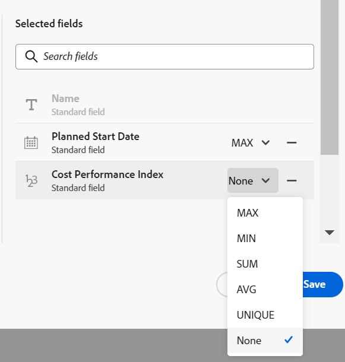

# Connecter des types d’enregistrements

Les informations mises en surbrillance sur cette page font référence à des fonctionnalités qui ne sont pas encore disponibles de manière générale. Elle est disponible uniquement dans l’environnement de Prévisualisation pour tous les clients. Après les versions mensuelles en production, les mêmes fonctionnalités sont également disponibles dans l’environnement de production pour les clients qui ont activé les versions rapides. 

Pour plus d’informations sur les versions rapides, voir [Activation ou désactivation des versions rapides pour votre organisation](/help/quicksilver/administration-and-setup/set-up-workfront/configure-system-defaults/enable-fast-release-process.md). 

{{planning-important-intro}}

<!--
You can use Adobe Workfront Planning to design fully-customizable workspaces that contain record types needed in your organization. A way to indicate how individual record types relate to one another is to connect them. Also, you can connect Workfront Planning record types with object types from other applications to enhance your users' experience and keep their focus in one application. -->

Vous pouvez connecter des types d&#39;enregistrements entre eux ou vous pouvez connecter des types d&#39;enregistrements à des types d&#39;objets provenant d&#39;autres applications.

La connexion de types d’enregistrements s’avère utile lorsque plusieurs types d’objets de travail se touchent. Par exemple, vous pouvez utiliser des campagnes, chacune d’elles pouvant correspondre à plusieurs marques. Pour indiquer cette relation, vous pouvez connecter des campagnes à des marques. De plus, le travail de chaque campagne peut être planifié dans plusieurs projets dans Workfront. Pour indiquer cela, vous pouvez connecter les campagnes aux projets appropriés. La connexion de types d’enregistrements et, par la suite, de différents enregistrements permet d’établir cette relation dans Workfront Planning.

Cet article décrit comment connecter deux types d&#39;enregistrements Workfront Planning ou un type d&#39;enregistrement Workfront Planning à un objet provenant d&#39;une autre application.

Après avoir établi la connexion entre les enregistrements ou les types d&#39;objet, vous pouvez connecter des enregistrements individuels les uns aux autres et afficher les champs de l&#39;enregistrement ou des types d&#39;objet liés sur un enregistrement Workfront Planning.

Pour obtenir des informations générales sur les types de connexion, voir [ Présentation des types d’enregistrements connectés ](/help/quicksilver/planning/architecture/connect-record-types-overview.md).

Pour plus d&#39;informations sur la connexion d&#39;enregistrements ou d&#39;enregistrements avec des objets provenant d&#39;autres applications, voir [Connecter des enregistrements](/help/quicksilver/planning/records/connect-records.md).

Pour un exemple de connexion des types d&#39;enregistrements et des enregistrements, voir [Exemple de connexion des types d&#39;enregistrements et des enregistrements](/help/quicksilver/planning/architecture/example-connect-record-types-and-records.md).

<!--ensure this last linked article is right; the title and the link should have changed-->

## Conditions d’accès

+++ Développez pour afficher les exigences d’accès.

Vous devez disposer des accès suivants pour effectuer les étapes décrites dans cet article :

<table style="table-layout:auto"> 
<col> 
</col> 
<col> 
</col> 
<tbody> 
    <tr> 
<tr> 
<td> 
   
 Produits
 </td> 
   <td> 
   <ul><li>
 Adobe Workfront
</li> 
   <li>
 Planification d’Adobe Workfront
</li>
   <li>
 Adobe Experience Manager Assets, si vous souhaitez connecter des ressources AEM à des types d’enregistrements Planning

   
Vous devez disposer d’une licence Adobe Experience Manager Assets et d’une intégration entre AEM Assets et Workfront.
    Pour plus d’informations, voir <a href="/help/quicksilver/documents/adobe-workfront-for-experience-manager-assets-essentials/workfront-for-aem-asset-essentials.md">Adobe Workfront pour Experience Manager Assets et Assets Essentials : index d’article</a>. 

   </li>
   </ul></td> 
  </tr>   
<tr> 
   <td role="rowheader">
Formule Adobe Workfront*
</td> 
   <td> 

L’un des plans Workfront suivants :
 
<ul><li>Sélectionner</li> 
<li>Principal</li> 
<li>Final</li></ul> 

Workfront Planning n’est pas disponible pour les plans Workfront hérités
 
   </td> 
<tr> 
   <td role="rowheader">
Package Adobe Workfront Planning*
</td> 
   <td> 

Tous 
 

Pour plus d’informations sur les éléments inclus dans chaque plan de planification Workfront, contactez votre gestionnaire de compte Workfront. 
 
   </td> 
 <tr> 
   <td role="rowheader">
Plateforme Adobe Workfront
</td> 
   <td> 

L’instance de Workfront de votre organisation doit être intégrée à l’expérience unifiée Adobe pour pouvoir accéder à Workfront Planning.
 

Pour plus d’informations, voir <a href="/help/quicksilver/workfront-basics/navigate-workfront/workfront-navigation/adobe-unified-experience.md">Adobe Unified Experience pour Workfront</a>. 
 
   </td> 
   </tr> 
  </tr> 
  <tr> 
   <td role="rowheader">
Licence Adobe Workfront*
</td> 
   <td> 
Standard
 
   
Workfront Planning n’est pas disponible pour les licences Workfront héritées
 
  </td> 
  </tr> 
  <tr> 
   <td role="rowheader">
Configuration du niveau d’accès
</td> 
   <td> 
Il n’existe aucun contrôle de niveau d’accès pour Adobe Workfront Planning.
   
</td> 
  </tr> 
<tr> 
   <td role="rowheader">
Autorisations d’objet
</td> 
   <td>   
Autorisations de gestion pour un espace de travail</a> 
  
   
Les équipes d’administration système ont des droits sur tous les espaces de travail, y compris ceux qu’ils n’ont pas créés.
</td> 
  </tr> 
<tr> 
   <td role="rowheader">
Modèle de mise en page
</td> 
   <td> 
Dans l’environnement de production, tous les utilisateurs, y compris les administrateurs système, doivent être affectés à un modèle de mise en page qui inclut Planning.

Dans l’environnement de Prévisualisation, les utilisateurs et utilisatrices standard et les administrateurs et administratrices système ont Planning activé par défaut.
</td> 
  </tr> 
</tbody> 
</table>

* Pour plus d’informations sur les exigences d’accès à Workfront, voir [Conditions d’accès requises dans la documentation Workfront](/help/quicksilver/administration-and-setup/add-users/access-levels-and-object-permissions/access-level-requirements-in-documentation.md).

+++

## Connecter les types d’enregistrements

<!--when changes here, also update the article for "Connect records"-->

{{step1-to-planning}}

1. Cliquez sur l’espace de travail dont vous souhaitez connecter les types d’enregistrements,

   Ou

   Depuis un espace de travail, développez la flèche pointant vers le bas à droite d’un nom d’espace de travail existant, recherchez un espace de travail, puis sélectionnez-le lorsqu’il s’affiche dans la liste.
1. Cliquez sur la vignette d’un type d’enregistrement pour ouvrir la page du type d’enregistrement.
1. Cliquez sur l’icône **+** dans le coin supérieur droit de la vue tableau, puis cliquez sur l’onglet **Nouvelle connexion**.

   

1. Dans le champ **Type d’enregistrement**, recherchez un type d’enregistrement ou sélectionnez l’un des éléments suivants :

   * Autre type d&#39;enregistrement de l&#39;espace de travail actuel

     

     >[!TIP]
     >
     > 
     >Si vous n’avez pas d’autres types d’enregistrements dans l’espace de travail sélectionné, la section de l’espace de travail ne s’affiche pas.

   * Type d’enregistrement d’un autre espace de travail configuré pour se connecter à partir d’autres espaces de travail.

     >[!TIP]
     >
     >Le paramètre **Se connecter à partir d’autres espaces de travail** doit être activé pour un type d’enregistrement dans l’onglet **Paramètres avancés** de la zone **Modifier le type d’enregistrement**, pour qu’un type d’enregistrement soit accessible à partir d’autres espaces de travail. Si aucun type d’enregistrement n’est configuré pour se connecter à partir d’autres espaces de travail, la section espace de travail ne s’affiche pas.
     > 

     Pour plus d’informations, voir [Modifier les types d’enregistrements](/help/quicksilver/planning/architecture/edit-record-types.md).

     

   * Un **projet, un portfolio, un programme, une entreprise** ou un **groupe** depuis la section **Types d’objets Workfront**.

     Sélection de la connexion au projet Workfront 

   * **Experience Manager Assets** depuis la section **Adobe Applications**.

     

1. Mettez à jour les informations suivantes :

   * **Nom** : nom du champ connecté, tel qu’il apparaît dans la vue Tableau ou la page de l’enregistrement original. Cela crée la colonne d&#39;enregistrement lié dans la vue Tableau du type d&#39;enregistrement d&#39;origine ou le champ d&#39;enregistrement lié pour les enregistrements d&#39;origine. Par défaut, le nom du champ est le nom de l’enregistrement ou de l’objet auquel vous vous connectez.

   >[!TIP]
   >
   >Vous pouvez avoir plusieurs connexions au même enregistrement ou type d&#39;objet. Si vous ne modifiez pas le nom du champ connecté, Workfront ajoute un chiffre à la suite du nom de l’enregistrement connecté, pour indiquer le nombre de types d’enregistrements connectés portant le même nom.

   * **Description** : informations supplémentaires sur le champ de l’enregistrement connecté. La description d’un champ s’affiche lorsque vous survolez la colonne du champ dans un tableau.
   * **Autoriser plusieurs enregistrements** : sélectionnez cette option pour indiquer que vous autorisez les utilisateurs à ajouter plusieurs enregistrements lorsque le champ de type d’enregistrement lié s’affiche sur les enregistrements d’origine. Cette option est sélectionnée par défaut.

     Cette option est disponible uniquement lors de la connexion d’enregistrements provenant de deux espaces de travail différents ou d’un enregistrement et d’un objet de ressource Adobe Experience Manager.

     

   * **Type de connexion** : sélectionnez l’une des options suivantes pour indiquer le nombre d’enregistrements auxquels se connecter et depuis lesquels :

      * Multiple-à-multiple
      * Un-à-multiple
      * Multiple-à-un
      * Un-à-un

     Cette option est disponible uniquement lors de la connexion d’enregistrements du même espace de travail ou d’un enregistrement et d’un type d’objet Workfront.

     

     Pour plus d’informations sur les types de connexion, voir [Présentation des types d’enregistrements connectés](/help/quicksilver/planning/architecture/connect-record-types-overview.md).

     >[!NOTE]
     >
     > Si vous sélectionnez Un à plusieurs ou Un à un pour le type Connexion et que vous souhaitez par la suite connecter un enregistrement ou un objet déjà connecté ailleurs, vous recevrez un avertissement indiquant que le connecter à nouveau supprimera la connexion d&#39;origine. Vous pouvez autoriser la suppression ou sélectionner un autre enregistrement.

   * **Sélectionner les champs de recherche** : sélectionnez cette option pour ajouter les champs du type d’enregistrement sélectionné. Les champs de recherche sont des champs associés au type d’enregistrement ou d’objet vers lequel vous établissez un lien. Les lier affiche les informations de l&#39;enregistrement ou de l&#39;objet à partir duquel vous établissez la liaison. Cette option est sélectionnée par défaut.

     >[!TIP]
     >
     > Vous ne pouvez pas ajouter les types de champs suivants en tant que champs de recherche :
     >
     >    * Personnes
     >    * Créé par
     >    * Dernière modification par
     >    * Champs de saisie semi-automatique Workfront (y compris les champs tels que le propriétaire ou le sponsor du projet)

1. (Le cas échéant et facultatif) Si vous avez choisi de connecter un objet Workfront, sélectionnez un **Formulaire personnalisé** dans la section **Lier uniquement les objets correspondant à ces critères**. Seuls les objets auxquels sont attachés les formulaires personnalisés sélectionnés peuvent être liés au type d’enregistrement sélectionné. Vous pouvez sélectionner plusieurs formulaires.

   >[!NOTE]
   >
   > Vous devez créer des formulaires personnalisés dans Workfront pour les objets sélectionnés avant qu’ils ne s’affichent dans cette liste.

1. (Le cas échéant) Si vous avez choisi de vous connecter à Experience Manager Assets, sélectionnez un référentiel dans le menu déroulant **Référentiel Experience Manager** dans la section **Lier des ressources à partir du référentiel suivant**. Champ obligatoire. Seuls les référentiels auxquels vous avez accès dans Experience Manager Assets s’affichent dans ce champ.

   >[!NOTE]
   >
   >Votre administrateur Workfront peut mapper les champs Workfront Planning aux champs Experience Manager Assets à l’aide du mappage de métadonnées dans Workfront. Pour plus d’informations, consultez [Configuration du mappage des métadonnées de ressource entre Adobe Workfront et Experience Manager Assets](https://experienceleague.adobe.com/en/docs/experience-manager-cloud-service/content/assets/integrations/configure-asset-metadata-mapping).

1. (Conditionnel) Si vous avez choisi de vous connecter à Experience Manager Assets ou à un type d’enregistrement Workfront Planning, sélectionnez l’une des options suivantes dans la zone **Apparence des enregistrements** :

   * **Nom et image** : le nom et la miniature ou l’icône des enregistrements connectés s’affichent dans le champ d’enregistrement connecté. Il s’agit de l’option par défaut.
   * **Nom** : seul le nom des enregistrements connectés s&#39;affichera dans le champ d&#39;enregistrement connecté.
   * **Image** : seule la miniature ou l’icône des enregistrements connectés s’affiche dans le champ d’enregistrement connecté.

   Les enregistrements sans image miniature affichent à la place l’icône de type d’enregistrement. Un exemple de la façon dont les enregistrements connectés s’afficheront s’affiche dans la zone **Apparence des enregistrements**.

   >[!NOTE]
   >
   >* Lorsque vous autorisez la liaison de plusieurs enregistrements, l’affichage de la miniature seule peut permettre de gagner de l’espace dans des zones plus petites, comme les vues d’enregistrement.
   >
   >* Le nom d’un enregistrement est le champ principal de l’enregistrement. Pour plus d&#39;informations, consultez Présentation des champs de Principal .
   >
   >* La sélection d’un aspect d’enregistrement n’est pas disponible lors de la sélection de types d’objets Workfront.
   >
   >* Ce que vous sélectionnez dans la zone Apparence des enregistrements détermine l&#39;affichage des enregistrements dans les connexions partout dans le système, y compris toutes les pages de vues et de détails.

1. Cliquez sur **Créer**.

1. (Le cas échéant) Si vous avez sélectionné le paramètre **Sélectionner des champs de recherche**, la boîte de dialogue **Ajouter des champs de recherche** s’ouvre.

   Cliquez sur l’icône **+** pour ajouter des champs à partir de la zone **Champs non sélectionnés**.

   Ou

   Cliquez sur l’icône **-** pour supprimer des champs de la zone **Champs sélectionnés**.

   

   Les valeurs des champs connectés se remplissent automatiquement lorsque vous liez des enregistrements ou des objets.

   >[!IMPORTANT]
   >
   >    Toute personne disposant d’autorisations Afficher ou d’autorisations supérieures dans l’espace de travail peut consulter les informations contenues dans les champs liés, quels que soient ses autorisations ou son niveau d’accès dans l’application des types d’objets liés.

1. (Facultatif) Cliquez sur **Ignorer** pour ignorer l’ajout de champs à partir de l’enregistrement ou du type d’objet lié. Le nom ou le champ de Principal de l&#39;enregistrement lié est le seul champ visible dans la vue Tableau du type d&#39;enregistrement auquel vous vous connectez.

1. (Facultatif et conditionnel) Si vous choisissez de lier un champ de type nombre, devise, pourcentage ou date, sélectionnez également une valeur d’agrégateur pour résumer plusieurs valeurs. Les valeurs des champs liés s’affichent soit séparées par des virgules, soit sous la forme d’une valeur résumée selon l’agrégateur que vous choisissez, lorsque les utilisateurs sélectionnent plusieurs enregistrements liés dans le champ d’enregistrement lié.

   Si le champ de recherche contient plusieurs valeurs qui ne sont pas résumées, tenez compte des points suivants lors de l’utilisation du champ dans un tri ou un regroupement dans une vue :

   * Le tri est effectué par la première valeur

   * Les enregistrements sont regroupés selon chaque combinaison unique de valeurs de champ

   * La vue chronologique est créée en fonction de la première valeur de date

   >[!IMPORTANT]
   >
   >    Vous devez sélectionner une valeur d’agrégateur lors de l’ajout de champs de date de recherche, si vous souhaitez que les champs soient disponibles pour être ajoutés en tant que dates de début et de fin pour les vues chronologique et Calendrier. Par exemple, vous pouvez sélectionner le MAX ou l’agrégateur MIN pour un champ de date de recherche.

   

   >[!NOTE]
   >
   > Les agrégateurs ne sont pas disponibles lors de la connexion des types d’enregistrements à Experience Manager Assets.

   Sélectionnez l’une des options suivantes :

   * **Aucun** : affiche les valeurs provenant de plusieurs enregistrements séparés par des virgules. Il s’agit de la sélection par défaut.
   * **MAX** : affiche la valeur la plus élevée de toutes les valeurs provenant de plusieurs enregistrements sélectionnés dans le champ de l’enregistrement lié.
   * **MIN** : affiche la valeur la plus basse de toutes les valeurs provenant de plusieurs enregistrements sélectionnés dans le champ de l’enregistrement lié.
   * **SOMME** : affiche le total de toutes les valeurs provenant de plusieurs enregistrements sélectionnés dans le champ de l’enregistrement lié.
   * **MOY** : affiche la moyenne de toutes les valeurs provenant de plusieurs enregistrements sélectionnés dans le champ de l’enregistrement lié.
   * **UNIQUE** : supprime les doublons des valeurs des champs de recherche et affiche uniquement les valeurs uniques. Cette option n’est pas disponible pour les types de champs suivants :
      * Paragraphe
      * Case à cocher
      * Personnes

   >[!NOTE]
   >
   >Par exemple, vous pouvez lier l’enregistrement du produit (enregistrement lié) à l’enregistrement de la campagne (enregistrement d’origine) et le nommer « champ de produit ». Vous pouvez également choisir de lier le champ Budget de l’enregistrement de produit à partir de l’enregistrement de campagne et de l’appeler « Budget de produit ». Si vous avez autorisé la sélection de plusieurs enregistrements dans le « champ Produit », vous pouvez sélectionner le Produit 1 avec un budget de 100 000 $ et le Produit 2 avec un budget de 110 000 $, et le Produit 3 avec un budget de 100 000 $. Selon l’agrégateur que vous avez choisi, vous pouvez consulter les informations suivantes sur le budget dans le champ lié de l’enregistrement original :
   >
   >* **Aucun** : 100 000 $, 110 000 $, 100 000 $
   >* **MAX**: 110 000 $
   >* **MIN** : 100 000 $
   >* **SOMME** : 310 000 $
   >* **MOYENNE** : 103 000,33 $
   >* **UNIQUE** : 100 000 $
   >

1. (Facultatif) Utilisez l’icône **rechercher**  pour rechercher un champ.

1. Cliquez sur **Ajouter des champs** pour enregistrer vos modifications.

   Les éléments suivants sont ajoutés :

   * Un champ de l’enregistrement lié sur le type d’enregistrement à partir duquel vous créez un lien. Le champ d’enregistrement lié affichera les enregistrements individuels du type d’enregistrement lié, après les avoir ajoutés manuellement. Pour plus d’informations sur l’ajout d’enregistrements, voir [Connecter des enregistrements](/help/quicksilver/planning/records/connect-records.md). Le nom du champ de l’enregistrement lié est celui que vous avez sélectionné à l’étape 6.<!--accurate-->

   * Champ(s) lié(s) (ou de recherche) qui affiche des informations sur l&#39;enregistrement lié ou les types d&#39;objet après l&#39;ajout manuel des enregistrements ou des objets dans le champ d&#39;enregistrement lié. Les champs de recherche sont créés uniquement lorsque le paramètre **Sélectionner les champs de recherche** est sélectionné lors de la création de la connexion. Les champs de recherche sont automatiquement nommés selon ce modèle :

     `<Name of the original field on the linked record> (from <Name of your linked field>)`

     Par exemple, si vous avez lié un type d’enregistrement Campagne à un type d’enregistrement Programme et que vous avez nommé le champ d’enregistrement lié Programme « Informations sur le programme », puis sélectionné pour afficher également le champ Budget du programme dans la vue Tableau de la campagne, le champ lié est automatiquement nommé `Budget (from Program information)` dans la vue Tableau de la campagne.

   * Lorsque vous liez des types d’enregistrement les uns aux autres, un champ d’enregistrement lié est également ajouté au type d’enregistrement auquel vous liez l’enregistrement. Le nom du champ d’enregistrement lié sur le type d’enregistrement lié correspond au nom du type d’enregistrement à partir duquel vous créez un lien.

     Par exemple, si vous liez le type d’enregistrement « Produit » au type d’enregistrement « Campagne » et que vous nommez le champ connecté de la campagne « Produit lié », un champ d’enregistrement lié « Campagne » est créé pour le type d’enregistrement Produit .

     >[!TIP]
     >
     > Un champ d’enregistrement lié n’est pas créé pour les objets d’une autre application vers le type d’enregistrement que vous liez dans Workfront Planning.

1. (Facultatif et le cas échéant) À partir de la vue de tableau du type d’enregistrement d’origine ou d’enregistrement lié, cliquez sur la flèche du bas dans l’en-tête des champs d’enregistrement liés, puis sélectionnez l’une des options suivantes :

   * **Modifier le champ** : mettez à jour les informations **Nom** et **Description** du champ.
   * **Modifier les champs de recherche** : ajoutez ou supprimez un ou plusieurs champs de l’enregistrement lié.

   

   Pour ajouter ou supprimer des champs de recherche, suivez les instructions des étapes 16 à 17 ci-dessus. <!--ensure these step numbers stay accurate-->

   >[!NOTE]
   >
   > Vous ne pouvez pas ajouter de champ de recherche appartenant à des types d’enregistrement que vous liez à des types d’objets provenant d’une autre application.
   >
   > Par exemple, vous ne pouvez pas ajouter le champ de recherche « Statut de la campagne » à un projet Workfront à partir duquel vous créez un lien vers les campagnes.

1. (Facultatif) Cliquez sur la flèche pointant vers le bas dans l’en-tête d’un champ d’enregistrement lié ou dans l’en-tête d’un champ de recherche du type d’enregistrement à partir duquel vous créez un lien, puis cliquez sur **Supprimer**.

   Le champ d’enregistrement ou le champ de recherche est supprimé. Si vous supprimez un champ d’enregistrement, tous les champs de recherche associés à l’enregistrement lié sont également supprimés.
