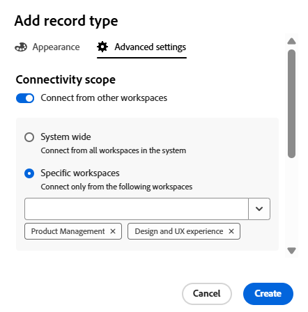

<!--this is linked to the UI in an empty workspace screen-->

<!--keep the yellow for cross-workspace functionality till Jan 2026-->

# Créer des types d’enregistrements

<!--The information on this page refers to functionality not yet generally available. It is available only in the Preview environment for all customers. After the monthly releases to Production, the same features are also available in the Production environment for customers who enabled fast releases.    

For information about fast releases, see [Enable or disable fast releases for your organization](/help/quicksilver/administration-and-setup/set-up-workfront/configure-system-defaults/enable-fast-release-process.md). -->

{{planning-important-intro}}

Les types d’enregistrements sont les types d’objets d’Adobe Workfront Planning. Dans Workfront Planning, vous pouvez créer des types d’enregistrements personnalisés qui illustrent les éléments liés au travail nécessaires tout au long du cycle de vie de votre organisation.

Pour plus d’informations sur les types d’enregistrements, voir [Présentation des types d’enregistrements](/help/quicksilver/planning/architecture/overview-of-record-types.md).

## Conditions d’accès

+++ Développez pour afficher les conditions d’accès requises pour la fonctionnalité de cet article. 

<table style="table-layout:auto"> 
<col> 
</col> 
<col> 
</col> 
<tbody> 
    <tr> 
<tr> 
</tr>   
<tr> 
   <td role="rowheader">
Package Adobe Workfront
</td> 
   <td> 

Pour activer les types d’enregistrements connectables : 

<ul> 
<li>
Tout package Workfront et tout package Planning
</li>

Ou

<li>
Packages Prime et Ultimate de workflow et de planification
</li></ul>

Pour activer les types d’enregistrements globaux :

<ul> 
<li>
Tout package Workfront et un package Planning Plus
</li>

Ou

<li>
Packages Prime et Ultimate de workflow et de planification
</li></ul>

Pour plus d’informations sur les composants inclus dans chaque package Workfront Planning, contactez votre représentant de compte Workfront. 
 
   </td> 
  <tr> 
   <td role="rowheader">
Licence Adobe Workfront
</td> 
   <td>
Standard

   </td> 
  </tr> 
  <tr> 
   <td role="rowheader">
Autorisations d’objet
</td> 
   <td>   
Gérer les autorisations d’un espace de travail
  
   
L’administration système a accès à tous les espaces de travail, y compris ceux qu’elle n’a pas créés.
  </td> 
  </tr>  
</tbody> 
</table>

Pour plus d’informations sur les exigences d’accès à Workfront, voir [Exigences d’accès dans la documentation de Workfront](/help/quicksilver/administration-and-setup/add-users/access-levels-and-object-permissions/access-level-requirements-in-documentation.md).

+++   

<!--Old:
 <table style="table-layout:auto"> 
<col> 
</col> 
<col> 
</col> 
<tbody> 
    <tr> 
<tr> 
<td> 
   
 Products
 </td> 
   <td> 
   <ul><li>
 Adobe Workfront
</li> 
   <li>
 Adobe Workfront Planning
</li></ul></td> 
  </tr>   
<tr> 
   <td role="rowheader">
Adobe Workfront plan*
</td> 
   <td> 

Any of the following Workfront plans:
 
<ul><li>Select</li> 
<li>Prime</li> 
<li>Ultimate</li></ul> 

Workfront Planning is not available for legacy Workfront plans
 
   </td> 
<tr> 
   <td role="rowheader">
Adobe Workfront Planning package*
</td> 
   <td> 

Any 
 

For more information about what is included in each Workfront Planning plan, contact your Workfront account manager. 
 
   </td> 
 <tr> 
   <td role="rowheader">
Adobe Workfront platform
</td> 
   <td> 

Your organization's instance of Workfront must be onboarded to the Adobe Unified Experience to be able to access Workfront Planning.
 

For more information, see <a href="/help/quicksilver/workfront-basics/navigate-workfront/workfront-navigation/adobe-unified-experience.md">Adobe Unified Experience for Workfront</a>. 
 
   </td> 
   </tr> 
  </tr> 
  <tr> 
   <td role="rowheader">
Adobe Workfront license*
</td> 
   <td>
 Standard

   
Workfront Planning is not available for legacy Workfront licenses
 
  </td> 
  </tr> 
  <tr> 
   <td role="rowheader">
Access level configuration
</td> 
   <td> 
There are no access level controls for Adobe Workfront Planning
   
</td> 
  </tr> 
<tr> 
   <td role="rowheader">
Object permissions
</td> 
   <td>   
Manage permissions to a workspace
  
   
System Administrators have permissions to all workspaces, including the ones they did not create
  </td> 
  </tr> 
</tbody> 
</table> -->

## Remarques concernant la création de types d’enregistrements

* Vous pouvez créer des types d’enregistrements dans un espace de travail de la manière suivante :

   * Automatiquement :
      * Lorsque vous créez un espace de travail à l’aide d’un modèle.

        Pour plus d’informations, voir [Créer des espaces de travail](/help/quicksilver/planning/architecture/create-workspaces.md).

      * Lorsque vous les importez à l’aide d’un fichier CSV ou Excel.

        Pour plus d’informations, voir [Création de types d’enregistrements à partir d’un fichier CSV ou Excel](/help/quicksilver/planning/architecture/import-file-to-create-record-types.md).

     >[!TIP]
     >
     >Lorsque vous importez un type d’enregistrement à partir d’un fichier CSV ou Excel, vous pouvez également importer des enregistrements et des champs.

   * Manuellement :

      * À partir de zéro.

        Cet article décrit comment créer des types d’enregistrements à partir de zéro.

     <!--
        * By adding them from another workspace
            For information, see [Add existing record types from another workspace](/help/quicksilver/planning/architecture/add-existing-record-types-from-another-workspace.md). -->

* Vous pouvez déplacer des types d’enregistrements dans une section et d’une section d’un espace de travail vers une autre. Vous ne pouvez pas déplacer des types d’enregistrements d’un espace de travail vers un autre.

## Créer des types d’enregistrements à l’aide d’un modèle d’espace de travail

Vous pouvez créer automatiquement des types d’enregistrements lorsque vous créez un espace de travail à l’aide d’un modèle Workfront Planning. Chaque modèle contient des exemples de types d’enregistrements.

Pour plus d’informations sur la création d’espaces de travail, voir [Créer des espaces de travail](/help/quicksilver/planning/architecture/create-workspaces.md).

Pour plus d’informations sur les types d’enregistrements inclus dans chaque modèle, voir [Liste des modèles d’espace de travail](/help/quicksilver/planning/architecture/workspace-templates.md).

Lorsque vous créez un espace de travail à partir d’un modèle, les types d’enregistrements sont regroupés dans les sections suivantes :

* Types d’enregistrements opérationnels
* Taxonomies

Vous pouvez ajouter manuellement des types d’enregistrements dans les sections Types d’enregistrements opérationnels et Taxonomies . Pour plus d’informations, consultez la section [Créer entièrement un enregistrement](#create-a-record-type-from-scratch) dans cet article.

## Créer un type d’enregistrement à partir de zéro

{{step1-to-planning}}

1. Cliquez sur l’espace de travail dans lequel vous souhaitez créer un type d’enregistrement,

   Ou

   Depuis un espace de travail, développez la flèche pointant vers le bas à droite d’un nom d’espace de travail existant, recherchez un espace de travail, puis sélectionnez-le lorsqu’il s’affiche dans la liste.
1. (Facultatif) Cliquez sur **Ajouter une section** pour ajouter une section à l’espace de travail.
1. Cliquez sur **Ajouter un type d’enregistrement** puis **Ajouter manuellement**.

   La zone Ajouter un type d’enregistrement s’ouvre. <!--update screen shot for preview-->

   

1. Mettez à jour les informations suivantes dans l’onglet **Apparence** :

   * Remplacez « Type d’enregistrement sans titre » par le nom de votre futur type d’enregistrement. <!--did they bring back the field label here and did they rename it to "Name"-->
   * **Description** : ajoutez des informations supplémentaires sur le type d’enregistrement.
   * Sélectionnez une couleur et une forme pour l’icône associée au type d’enregistrement. Procédez comme suit :
      * Sélectionnez une couleur pour identifier votre nouveau type d’enregistrement. Il s’agit de la couleur de l’icône du type d’enregistrement. Le gris est sélectionné par défaut.
      * Sélectionnez une icône dans la liste ou commencez à saisir le nom d’une icône pour décrire ce qu’elle représente, puis sélectionnez-la lorsqu’elle s’affiche. Il s’agit de l’icône du type d’enregistrement. Une icône de fichier est sélectionnée par défaut.

1. (Facultatif et conditionnel) Si vous êtes un administrateur système, cliquez sur **Paramètres avancés** et mettez à jour les informations suivantes dans la section **Fonctionnalité interespace de travail** : <!--the info here is duplicated in the Edit record types article-->
   * Activez le paramètre **Autoriser la connexion à ce type d’enregistrement dans d’autres espaces de travail** : permet aux gestionnaires d’espace de travail de se connecter à ce type d’enregistrement à partir d’autres espaces de travail.\
     Vous pouvez désigner les espaces de travail auxquels ce type d’enregistrement peut être connecté. Vous pouvez le rendre disponible pour tous les espaces de travail ou désigner des espaces de travail spécifiques où vous pouvez l’importer.
Pour plus d’informations, voir [Configuration des fonctionnalités de plusieurs espaces de travail pour les types d’enregistrements](/help/quicksilver/planning/architecture/configure-record-type-cross-workspace-capabilities.md).

   

   <!--replace last point with this when we release global record types; the preview tags might need to be edited, too:
    1. (Optional and conditional) If you are a system administrator, update the information in the **Cross-workspace settings** tab.
    For more information, see [Configure cross-workspace capabilities for record types](/help/quicksilver/planning/architecture/configure-record-type-cross-workspace-capabilities.md).
    ***********Add screenshot***********
    -->

1. Cliquer sur **Enregistrer**.

   La carte du type d’enregistrement est ajoutée à la section et à l’espace de travail que vous avez sélectionné.
La Description du type d’enregistrement s’affiche sur la carte.

   

   Si vous avez choisi de connecter cet enregistrement à partir d&#39;autres espaces de travail, l&#39;icône **se connecter à partir d&#39;autres espaces**  s&#39;affiche sur la carte d&#39;enregistrement.

   <!--If you configured the cross-workspace capabilities for the record, the **connectable record type** icon  and the **global record type** icon  also display on the card. -->

1. (Facultatif) Pointez sur la carte de type d’enregistrement, cliquez sur l’icône **Plus**  dans le coin supérieur droit, puis cliquez sur **Modifier** pour modifier les informations sur le type d’enregistrement.

   <!--replace the last point with this at the preview release of global record types:
    (Optional) Hover over the record type card, click the **More** icon  in the upper-right corner, then click **Edit** or **Settings** to modify information about the record type. 
    >[!TIP]
    >
    >You can access the **Edit** and **Settings** options from the **More** menu of a record type in the record type page.
    -->

1. (Facultatif) Cliquez sur la carte du type d’enregistrement pour ouvrir la page du type d’enregistrement.

   

   La page du type d’enregistrement s’affiche par défaut dans la vue de tableau. Les colonnes du tableau sont des champs associés au nouveau type d’enregistrement. Chaque ligne est un enregistrement unique que vous devez ajouter.

   Par défaut, les champs suivants s’affichent dans les colonnes de la vue Tableau d’un type d’enregistrement opérationnel :

   * Nom
   * Description
   * Date de début
   * Date de fin
   * Statut

1. (Facultatif) Mettez à jour le nom du type d’enregistrement dans l’en-tête de la page

   Ou

   Cliquez sur l’icône **Plus**  à droite du nom du type d’enregistrement et cliquez sur **Modifier** pour le renommer ou modifier les informations le concernant. Pour plus d’informations, voir [Modifier les types d’enregistrements](/help/quicksilver/planning/architecture/edit-record-types.md).

1. (Facultatif) Cliquez sur **+ Nouvel enregistrement** pour ajouter des enregistrements du type sélectionné. Pour plus d’informations, voir [Créer des enregistrements](/help/quicksilver/planning/records/create-records.md).
1. (Facultatif) Cliquez sur l’icône **+** dans le coin supérieur droit du tableau pour ajouter des champs supplémentaires au type d’enregistrement.

   Pour plus d’informations sur la création de champs, voir [Créer des champs](/help/quicksilver/planning/fields/create-fields.md).

1. (Facultatif) Cliquez sur la flèche pointant vers la gauche du nom du type d’enregistrement, dans l’en-tête, pour revenir à l’espace de travail sélectionné.

1. (Facultatif) Dans l’espace de travail, cliquez sur une carte de type d’enregistrement et maintenez-la enfoncée pour faire glisser et déposer le type d’enregistrement à un emplacement souhaité, ou pour le déplacer vers une autre section.

   Les modifications sont enregistrées automatiquement.

   Pour plus d’informations sur l’ajout d’enregistrements, la suppression ou la modification de types d’enregistrements, ou la mise à jour de la vue dans la page du type d’enregistrement, voir les articles suivants :

   * [Créer des enregistrements](/help/quicksilver/planning/records/create-records.md)
   * [Supprimer des types d’enregistrements](/help/quicksilver/planning/architecture/delete-record-types.md)
   * [Modifier des types d’enregistrements](/help/quicksilver/planning/architecture/edit-record-types.md)
   * [Gérer les vues d’enregistrement](/help/quicksilver/planning/views/manage-record-views.md)

## Créer des types d’enregistrements en important des informations depuis un fichier CSV ou Excel

Vous pouvez importer les éléments suivants lors de l’importation d’informations à partir d’un fichier CSV ou Excel :

* Types d’enregistrements
* Enregistrements
* Champs d’enregistrement

Pour plus d’informations, voir [Création de types d’enregistrements à partir d’un fichier CSV ou Excel](/help/quicksilver/planning/architecture/import-file-to-create-record-types.md).

<!--

## Create record types by adding existing ones from another workspace 

You can add record types to a workspace by adding existing ones from another workspace. You can only add record types that have been configured as global record types. 

For information, see [Add existing record types from another workspace](/help/quicksilver/planning/architecture/add-existing-record-types-from-another-workspace.md).

-->