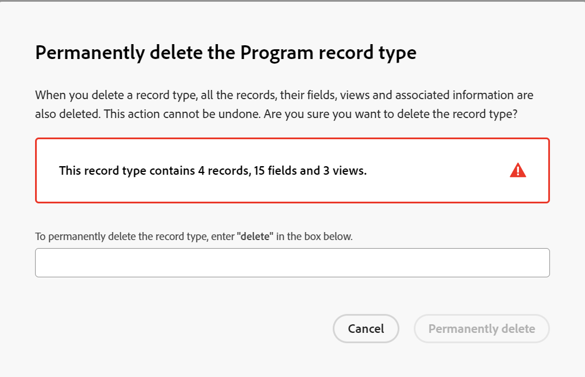

# Supprimer des types d’enregistrements

{{planning-important-intro}}

Vous pouvez supprimer des types d’enregistrement lorsqu’ils ne sont plus pertinents.

Cependant, la suppression des types d’enregistrement supprime également toutes les informations associées aux types d’enregistrement. Pour plus d’informations, consultez la section [Remarques concernant la suppression de types d’enregistrement](#considerations-when-deleting-record-types) de cet article.

Pour plus d’informations sur les types d’enregistrements, voir [ Présentation des types d’enregistrements ](/help/quicksilver/planning/architecture/overview-of-record-types.md).

<!-- last sentence might need to be deleted when we can recover or replace deleted record types-->

## Conditions d’accès

+++ Développez pour afficher les exigences d’accès.

Vous devez disposer des accès suivants pour effectuer les étapes décrites dans cet article :

<table style="table-layout:auto"> 
<col> 
</col> 
<col> 
</col> 
<tbody> 
    <tr> 
<tr> 
<td> 
   
 Produits
 </td> 
   <td> 
   <ul><li>
 Adobe Workfront
</li> 
   <li>
 Planification d’Adobe Workfront
</li></ul></td> 
  </tr>   
<tr> 
   <td role="rowheader">
Formule Adobe Workfront*
</td> 
   <td> 

L’un des plans Workfront suivants :
 
<ul><li>Sélectionner</li> 
<li>Principal</li> 
<li>Final</li></ul> 

Workfront Planning n’est pas disponible pour les plans Workfront hérités
 
   </td> 
<tr> 
   <td role="rowheader">
Package Adobe Workfront Planning*
</td> 
   <td> 

Tous 
 

Pour plus d’informations sur les éléments inclus dans chaque plan de planification Workfront, contactez votre gestionnaire de compte Workfront. 
 
   </td> 
 <tr> 
   <td role="rowheader">
Plateforme Adobe Workfront
</td> 
   <td> 

L’instance de Workfront de votre entreprise doit être intégrée à l’expérience unifiée Adobe pour pouvoir accéder à toutes les fonctionnalités de Workfront Planning.
 

Pour plus d’informations, voir <a href="/help/quicksilver/workfront-basics/navigate-workfront/workfront-navigation/adobe-unified-experience.md">Adobe Unified Experience pour Workfront</a>. 
 
   </td> 
   </tr> 
  </tr> 
  <tr> 
   <td role="rowheader">
Licence Adobe Workfront*
</td> 
   <td>
 Standard

   
Workfront Planning n’est pas disponible pour les licences Workfront héritées
 
  </td> 
  </tr> 
  <tr> 
   <td role="rowheader">
Configuration du niveau d’accès
</td> 
   <td> 
Il n’existe aucun contrôle de niveau d’accès pour Adobe Workfront Planning.
   
</td> 
  </tr> 
<tr> 
   <td role="rowheader">
Autorisations d’objet
</td> 
   <td>   
Gérer des autorisations relatives à un espace de travail</a> 
  
   
L’administration système a accès à tous les espaces de travail, y compris ceux qu’elle n’a pas créés.
</td> 
  </tr> 
<tr> 
   <td role="rowheader">
Modèle de disposition
</td> 
   <td> 
Toutes les personnes, y compris les administrateurs et administratrices de Workfront, doivent se voir attribuer un modèle de mise en page incluant la zone Planning dans le menu principal. 
 </td> 
  </tr> 
</tbody> 
</table>

* Pour plus d’informations sur les exigences d’accès à Workfront, voir [Conditions d’accès requises dans la documentation Workfront](/help/quicksilver/administration-and-setup/add-users/access-levels-and-object-permissions/access-level-requirements-in-documentation.md).

+++

<!--

OLD: 

<table style="table-layout:auto">
 <col>
 </col>
 <col>
 </col>
 <tbody>
    <tr>
<tr>
<td>
   
 Product
 </td>
   <td>
   
 Adobe Workfront
 </td>
  </tr>  
 <td role="rowheader">
Adobe Workfront agreement
</td>
   <td>

Your organization must be enrolled in the early access stage for Workfront Planning 

   </td>
  </tr>
  <tr>
   <td role="rowheader">
Adobe Workfront plan
</td>
   <td>

Any

   </td>
  </tr>
  <tr>
   <td role="rowheader">
Adobe Workfront license*
</td>
   <td>
   
New: Standard

   
Current: Plan
 
  </td>
  </tr>
  
  <tr>
   <td role="rowheader">
Access level configurations
</td>
   <td> 
There are no access level controls for Adobe Workfront Planning
  
</td>
  </tr>

  <tr>
   <td role="rowheader">
Permissions
</td>
   <td> 
Manage permissions to a workspace</a> 
  
   
System Administrators have permissions to all workspaces, including the ones they did not create
</td>
  </tr>
<tr>
   <td role="rowheader">
Layout template
</td>
   <td> 
Your Workfront or group administrator must add the Planning area in your layout template. For information, see <a href="/help/quicksilver/planning/access/access-overview.md">Access overview</a>. 
  
</td>
  </tr>

 </tbody>
</table>

*For information, see [Access requirements in Workfront documentation](/help/quicksilver/administration-and-setup/add-users/access-levels-and-object-permissions/access-level-requirements-in-documentation.md). 

-->

## Remarques concernant la suppression de types d’enregistrement

<!--check this and ensure these are still true - some things might change with / after closed beta-->

* Vous ne pouvez supprimer que les types d’enregistrement des espaces de travail pour lesquels vous disposez d’autorisations de gestion.
* La suppression des types d’enregistrement supprime les informations suivantes qui leur sont associées :

   * Tous les enregistrements de ce type
   * Tous les champs associés au type d’enregistrement
   * Toutes les vues (y compris les filtres, les regroupements et les critères de tri) du type d’enregistrement
* Le type d’enregistrement est supprimé pour toutes les personnes accédant à l’espace de travail.
* La suppression des types d’enregistrements et leurs informations associées est irréversible.
* Il est recommandé de recréer les champs et les enregistrements associés au type d’enregistrement que vous souhaitez supprimer sur un autre type d’enregistrement avant de les supprimer.

## Supprimer des types d’enregistrements

{{step1-to-planning}}

1. Cliquez sur l’espace de travail dont vous souhaitez supprimer les types d’enregistrements,

   Ou

   Depuis un espace de travail, développez la flèche pointant vers le bas à droite d’un nom d’espace de travail existant, recherchez un espace de travail, puis sélectionnez-le lorsqu’il s’affiche dans la liste.

   L’espace de travail et les types d’enregistrement s’affichent.
1. Utilisez l’une des méthodes suivantes :

   * Pointez sur la carte de type d’enregistrement, cliquez sur le menu **Plus**, puis **Supprimer**.
   * Cliquez sur la carte du type d’enregistrement à supprimer, puis, dans la page du type d’enregistrement, cliquez sur le menu **Plus**  à droite du nom du type d’enregistrement, puis cliquez sur **Supprimer**.

   

1. Saisissez **delete** dans la zone de confirmation, puis cliquez sur **Supprimer définitivement**. Cette opération n’est pas sensible à la casse.

   Le type d&#39;enregistrement sélectionné, ainsi que ses champs, les enregistrements associés et les vues sont supprimés et ne peuvent pas être récupérés.
