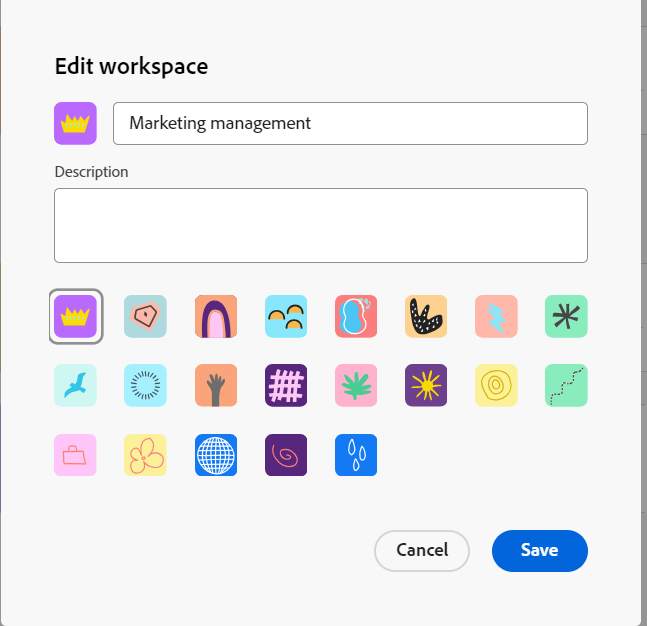

<!--update the metadata with real information when making this available in TOC and in the left nav-->

# Modifier des espaces de travail

{{planning-important-intro}}

Dans Adobe Workfront Planning, les espaces de travail sont des emplacements centralisés permettant aux équipes de planifier le travail.

Un espace de travail est une collection de types d’enregistrements utilisés par une équipe et représente le cycle de vie du travail de l’équipe. Vous pouvez entièrement personnaliser les espaces de travail dans Adobe Workfront Planning.

Pour plus d’informations sur la création d’espaces de travail, voir [Créer des espaces de travail](/help/quicksilver/planning/architecture/create-workspaces.md).

Toutes les modifications que vous apportez à un espace de travail sont visibles par tous ceux qui détiennent au moins les autorisations d’affichage sur l’espace de travail.

## Conditions d’accès

Vous devez disposer des accès suivants pour effectuer les étapes de cet article :

<table style="table-layout:auto">
 <col>
 </col>
 <col>
 </col>
 <tbody>
    <tr>
<tr>
<td>
   
 Produit
 </td>
   <td>
   
 Adobe Workfront
 </td>
  </tr>  
 <td role="rowheader">
Accord Adobe Workfront
</td>
   <td>

Votre entreprise doit être inscrite à l’étape d’accès anticipé pour la planification Workfront 

   </td>
  </tr>
  <tr>
   <td role="rowheader">
Forfait Adobe Workfront
</td>
   <td>

N’importe quelle

   </td>
  </tr>
  <tr>
   <td role="rowheader">
Licence Adobe Workfront*
</td>
   <td>
   
Nouvelle : standard

   
Actuelle : formule
 
  </td>
  </tr>

<tr>
   <td role="rowheader">
Configuration du niveau d’accès
</td>
   <td> 
Il n’existe aucun contrôle de niveau d’accès pour Workfront Planning

</td>
  </tr>

<tr>
   <td role="rowheader">
Autorisations
</td>
   <td> 
Gérer les autorisations d’un espace de travail 
  
</td>
  </tr>

<tr>
   <td role="rowheader">
Modèle de disposition
</td>
   <td> 
Vous devez ajouter la zone Planification à votre modèle de disposition. Pour plus d’informations, voir <a href="/help/quicksilver/planning/access/access-overview.md">Vue d’ensemble des accès</a>. 
  
</td>
  </tr>

</tbody>
</table>

Pour plus d’informations sur les conditions d’accès, voir [Conditions d’accès dans la documentation Workfront](/help/quicksilver/administration-and-setup/add-users/access-levels-and-object-permissions/access-level-requirements-in-documentation.md).

## Modifier un espace de travail

{{step1-to-planning}}

1. Cliquez sur une carte d’espace de travail pour ouvrir l’espace de travail.
1. Cliquez dans le nom de l’espace de travail dans l’en-tête du nouvel espace de travail pour le renommer, puis appuyez sur **Entrée**.
1. Cliquez sur le bouton **Plus** menu  à droite du nom de l’espace de travail dans l’en-tête, puis cliquez sur **Modifier**.

   

   Mettez à jour les informations suivantes dans la variable **Modifier l’espace de travail** box :

   * Ajoutez un nom pour l’espace de travail. <!--did they add a label for this field?-->
   * **Description**: ajoutez des informations sur l’espace de travail.
   * Sélectionnez une icône à associer à l’espace de travail.

1. Cliquez sur **Enregistrer** pour fermer la boîte de dialogue Modifier l’espace de travail et appliquer vos modifications.

1. (Facultatif) Pour ajouter une section d’espace de travail, effectuez l’une des opérations suivantes :

   * Cliquez sur **Ajouter une section** au bas de l’espace de travail.
   * Pointez sur le nom d’une section, puis cliquez sur le menu **Plus** , puis cliquez sur **Ajouter la section ci-dessus** ou **Ajouter la section ci-dessous**.

1. (Facultatif) Pour modifier l’emplacement d’une section, effectuez l’une des opérations suivantes :

   * Pointez sur le nom d’une section, puis cliquez sur l’icône **saisir** , puis faites un glisser-déposer à l’endroit approprié.
   * Pointez sur le nom d’une section, puis cliquez sur le menu **Plus** , puis cliquez sur **Déplacer vers le haut** ou **Déplacer vers le bas**. La section se déplace vers le haut ou vers le bas dans l’espace de travail.

1. (Facultatif) Pour supprimer une section d’espace de travail, procédez comme suit :

   1. Pointez sur le nom d’une section, puis cliquez sur le menu **Plus** , puis cliquez sur **Supprimer**. <!--add screen shot when UI is final?-->
   1. Sélectionnez une nouvelle section pour y déplacer tous les types d’enregistrement, puis cliquez sur **Supprimer**. <!--check the button name; logged a bug to change it to "Delete" from "Delete section".-->

      Tous les types d’enregistrement sont déplacés vers la section de sélection et la section est supprimée.

1. (Facultatif) Cliquez sur **Ajouter un type d’enregistrement** pour ajouter des types d’enregistrement à l’espace de travail.

   Pour plus d’informations, voir [Créer des types d’enregistrement](/help/quicksilver/planning/architecture/create-record-types.md).

1. (Facultatif) Passez la souris sur une carte de type enregistrement, puis cliquez sur le bouton **Plus** menu  dans le coin supérieur droit, puis cliquez sur **Modifier** pour modifier l’aspect d’un type d’enregistrement.

   Pour plus d’informations, voir [Modification des types d’enregistrement](/help/quicksilver/planning/architecture/edit-record-types.md).

1. (Facultatif) Passez la souris sur une carte de type enregistrement, puis cliquez sur le bouton **Plus** menu  dans le coin supérieur droit, puis cliquez sur **Supprimer** pour supprimer un type d’enregistrement.

   Pour plus d’informations, voir [Suppression des types d’enregistrement](/help/quicksilver/planning/architecture/delete-record-types.md).

1. (Facultatif) Appuyez sur une carte de type enregistrement et cliquez dessus pour la faire glisser et la déposer à un nouvel emplacement. Vous pouvez faire glisser et déposer des types d’enregistrement d’une section d’espace de travail vers une autre.

   

1. (Facultatif) Cliquez sur **Partager** dans le coin supérieur droit de l’espace de travail pour partager l’espace de travail avec d’autres personnes.

   Pour plus d’informations, voir [Partager des espaces de travail](/help/quicksilver/planning/access/share-workspaces.md).
