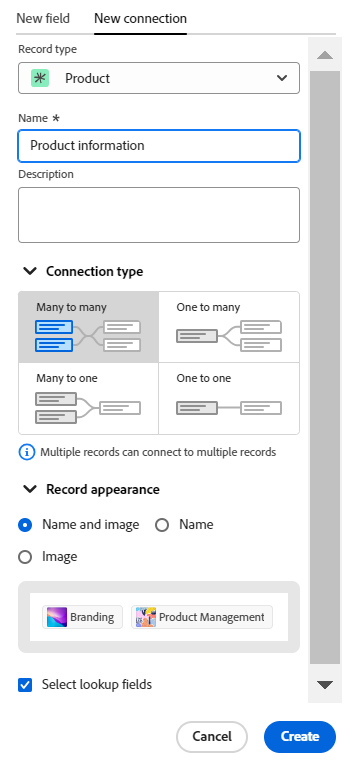
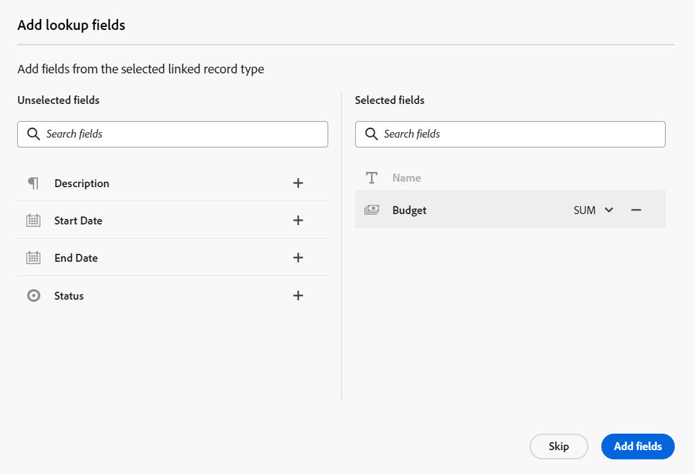

# Exemple de connexion de types d’enregistrements et d’enregistrements

{{planning-important-intro}}

Cet article décrit un exemple des opérations suivantes :

* Comment créer une connexion entre deux types d’enregistrements Workfront Planning et deux enregistrements.

* Comment créer une connexion entre un type d’enregistrement Workfront Planning et un type d’objet de projet Workfront, ainsi qu’une connexion entre un enregistrement et un projet.

Pour plus d’informations, reportez-vous également aux articles suivants :

* [Connecter les types d’enregistrements](/help/quicksilver/planning/architecture/connect-record-types.md)
* [Connecter des enregistrements](/help/quicksilver/planning/records/connect-records.md)

## Connecter deux types d’enregistrements Workfront Planning et des enregistrements (exemple)

Par exemple, vous avez un type d’enregistrement nommé Campaign comme type d’enregistrement d’origine.

Vous disposez également d’un autre type d’enregistrement nommé Product, qui comporte un champ de devise nommé Budget.

Vous souhaitez créer un champ sur le type d’enregistrement Campaign dans lequel vous pouvez afficher les valeurs du champ Budget du type d&#39;enregistrement Product.

Pour ce faire :

1. Ouvrez la vue de tableau pour le type d’enregistrement Campagne dans un espace de travail.
1. Cliquez sur l’icône **+** dans le coin supérieur droit de la vue de tableau pour ajouter un nouveau champ, cliquez sur **Nouvelle connexion**, puis sur **Produit** dans la section d’espace de travail sélectionnée.
1. Ajoutez les informations suivantes, par exemple :

   * **Type d’enregistrement** : Product <!--did they change the casing here?-->
   * **Nom** : donnez un nom au nouveau champ. Par exemple, « Informations sur le produit ». Il s’agit du nom du champ d’enregistrement lié.
   * **Description** : ajoutez une description pour le nouveau champ. Par exemple, « Il s’agit des produits auxquels mes campagnes doivent être associées. » La description du champ s’affiche lorsque vous pointez sur le champ dans l’en-tête de colonne.
   * **Type de connexion** : sélectionnez l’une des options suivantes :
      * **Plusieurs à plusieurs** : les utilisateurs peuvent connecter une campagne à plusieurs produits et un produit à plusieurs campagnes.
      * **Un à plusieurs** : les utilisateurs peuvent connecter une campagne à plusieurs produits et un produit à une seule campagne.
      * **Plusieurs à un** : les utilisateurs peuvent connecter une campagne à un produit et un produit à plusieurs campagnes.
      * **Un à un** : les utilisateurs peuvent connecter une campagne à un produit et un produit à une campagne.

     >[!NOTE]
     >
     >L&#39;option **Type de connexion** n&#39;est pas disponible lors de la connexion d&#39;enregistrements à partir de différents espaces de travail ou lors de la connexion de ressources Experience Manager. Pour plus d’informations, voir [Présentation des types d’enregistrements connectés](/help/quicksilver/planning/architecture/connect-record-types-overview.md).

   * **Enregistrement de l’apparence** : effectuez l’une des options suivantes :
      * **Nom et image** : affiche le nom et la miniature ou l’icône des enregistrements connectés. Cette option est sélectionnée par défaut.
      * **Nom** : affiche uniquement le nom des enregistrements connectés.
      * **Image** : affiche uniquement la miniature ou l’icône des enregistrements connectés.
   * **Sélectionner des champs de recherche** : si vous laissez cette option sélectionnée, la zone **Ajouter des champs de recherche** s’ouvre ensuite pour vous permettre de lier les champs Produit au type d’enregistrement Campagne. Vous pouvez cliquer sur **Ignorer** pour sauter cette étape et ajouter les champs Produits ultérieurement.

     

1. (Le cas échéant) Si vous avez sélectionné l’option **Sélectionner des champs de recherche** à l’étape précédente, dans la liste des champs associés au type d’enregistrement **Produit**, cliquez sur l’icône **+** pour le champ **Budget**, puis cliquez sur **Ajouter des champs**. Cela crée un champ appelé **Budget (à partir des informations sur le produit)**, qui est le nom du champ lié. Toutes les informations relatives au budget du produit s’affichent dans ce champ pour les enregistrements de campagne.

   

   >[!TIP]
   >
   >    Si vous souhaitez afficher le budget de tous les produits sélectionnés sous la forme d’un nombre total, sélectionnez **SOMME** dans le menu déroulant situé à droite du nom du champ. Lorsque les personnes sélectionnent plusieurs produits dans le champ d’enregistrement lié **Informations sur le produit**, le champ **Budget (à partir des informations sur le produit)** additionne toutes les valeurs du budget et affiche le total. <!-- check the shot below - added a bug with a couple of UI changes here-->
   >
   > Si vous sélectionnez **Aucun**, au lieu de **SOMME**, les budgets individuels des produits sélectionnés s’affichent séparés par des virgules.

   Les champs suivants sont créés :

   * Dans la vue de tableau d’enregistrement Campaign et dans la page d’enregistrement Campaign d’une campagne :

      * **Informations sur le produit** (champ d’enregistrement lié) : affiche le ou les noms des produits lorsque vous les ajoutez.
      * **Budget (de Informations sur le produit)** (le champ lié) : affiche les budgets des produits sélectionnés dans le champ Informations sur le produit.

   * Dans la vue de tableau d’enregistrement Product et dans la page d’enregistrement Product d’un produit :

      * **Campaign** : indique que le type d’enregistrement Product est lié au type d’enregistrement Campaign.

     

   >[!TIP]
   >
   >    Les champs d’enregistrement liés sont précédés de l’icône de relation .

1. Dans la vue de tableau du type d’enregistrement **Campagne**, créez une campagne en ajoutant une nouvelle ligne dans le tableau de la page du type d’enregistrement Campagne.

1. Double-cliquez dans la colonne **Informations sur le produit** de la nouvelle campagne.

   

1. Utilisez l’une des méthodes suivantes :

   * Cliquez sur le nom d’un produit connecté dans la liste pour l’ajouter à l’enregistrement sélectionné. Le produit est ajouté automatiquement.
   * Commencez à saisir le nom d’un produit et cliquez dessus lorsqu’il s’affiche dans la liste. Le produit est ajouté automatiquement.
   * Cliquez sur **Afficher tout** pour afficher tous les produits.

1. (Conditionnel) Si vous avez cliqué sur **Afficher tout** à l’étape précédente, la zone **Connecter des objets** s’affiche.

   

1. Commencez à saisir le nom d’un produit dans la zone de recherche, puis sélectionnez-le lorsqu’il s’affiche dans la liste

   Ou

   Sélectionnez les enregistrements de produit que vous souhaitez connecter aux enregistrements Campaign, puis cliquez sur **Connecter les objets**.

   >[!TIP]
   >
   >    Vous pouvez ouvrir la page d’enregistrement d’une Campaign, rechercher le champ d’enregistrement lié et cliquer sur l’icône **+** dans le champ pour ajouter des produits du type d’enregistrement Product connecté.

   Les colonnes suivantes sont renseignées dans le tableau de type d’enregistrement Campaign :
   * Le champ **Informations sur le produit** se remplit pour l’enregistrement Campagne avec les produits sélectionnés.
   * Le champ **Budget (de Informations sur le produit)** renseigne avec la valeur Budget de chaque produit sélectionné ou avec un total de tous les budgets des produits sélectionnés (si vous avez sélectionné SUM pour votre agrégateur).

   

   >[!TIP]
   >
   >Lorsque vous ne sélectionnez pas d’agrégateur pour les valeurs multiples, toutes les valeurs des produits sélectionnés s’affichent séparées par des virgules.

1. Pour renseigner le champ **Campaign** de la vue de tableau **Product**, répétez les étapes 5 à 7 à partir de la vue de tableau de type enregistrement Product et en sélectionnant les informations sur la campagne. Le champ Informations sur le produit sera également mis à jour dans le tableau de la page de type d’enregistrement Campaign. <!--ensure the step numbers remain correct-->

## Connecter un type d’enregistrement Workfront Planning à un type d’objet de projet Workfront et connecter un enregistrement à des projets individuels

>[!IMPORTANT]
>
>    Toute personne disposant d’autorisations d’affichage ou supérieures sur l’espace de travail peut afficher les informations dans les champs liés, indépendamment de ses autorisations ou de son niveau d’accès dans Workfront.

Par exemple, vous disposez d’un type d’enregistrement nommé Campagne comme type d’enregistrement original.

Vous avez également des projets dans Workfront avec un champ nommé « Revenus prévus ».

Vous souhaitez créer un champ de connexion sur le type d&#39;enregistrement de Campaign dans lequel vous pouvez afficher les valeurs du champ Revenus prévus des projets dans Workfront qui sont connectés aux campagnes dans Workfront Planning.

Pour ce faire :

1. Accédez à un espace de travail dans lequel vous souhaitez connecter le type d’enregistrement Campagne aux projets Workfront.
1. Ouvrez la vue de tableau pour le type d’enregistrement Campagne dans l’espace de travail sélectionné.
1. Cliquez sur l’icône **+** dans le coin supérieur droit de la vue de tableau pour ajouter un nouveau champ, puis sur **Nouvelle connexion**, et enfin sur **Projet** dans la section **Types d’objets Workfront**.
1. Ajoutez les informations suivantes, par exemple :

   * **Type d’enregistrement** : Project (dans la sous-section Workfront)
   * **Nom** : donnez un nom au nouveau champ, par exemple « Informations sur le projet ».
   * **Description** : ajoutez une description pour le nouveau champ. Par exemple, « Il s’agit des projets auxquels mes campagnes doivent être associées. » La description s’affiche dans la vue de tableau, lorsque vous pointez sur le nom du champ dans l’en-tête de colonne.
   * **Type de connexion** : sélectionnez l’une des options suivantes :
      * **Plusieurs à plusieurs** : les utilisateurs peuvent connecter une campagne à plusieurs produits et un produit à plusieurs campagnes.
      * **Un à plusieurs** : les utilisateurs peuvent connecter une campagne à plusieurs produits et un produit à une seule campagne.
      * **Plusieurs à un** : les utilisateurs peuvent connecter une campagne à un produit et un produit à plusieurs campagnes.
      * **Un à un** : les utilisateurs peuvent connecter une campagne à un produit et un produit à une campagne.
   * **Lier uniquement les objets correspondant à ce critère** : sélectionnez un formulaire personnalisé dans le menu déroulant **Formulaire personnalisé**. Seuls les projets associés aux formulaires spécifiés peuvent être connectés aux campagnes. Vous pouvez sélectionner plusieurs formulaires.
   * **Sélectionner des champs de recherche** : si vous laissez cette option sélectionnée, la zone **Ajouter des champs de recherche** s’ouvre ensuite pour vous permettre de lier les champs du projet au type d’enregistrement Campagne. Vous pouvez cliquer sur **Ignorer** pour sauter cette étape et ajouter les champs du projet ultérieurement.

   

1. (Le cas échéant) Si vous avez sélectionné l’option **Sélectionner des champs de recherche** à l’étape précédente, dans la liste des champs associés au type d’objet **Projet**, cliquez sur l’icône **+** pour le champ **Revenus prévus**, puis sur **Ajouter des champs**. Cela crée un champ appelé **Revenus prévus (à partir des informations sur le projet)**, qui est le nom du champ lié. Toute information figurant dans le champ Revenus prévus du projet s’affiche automatiquement dans ce champ pour les enregistrements Campagne.

   >[!TIP]
   >
   >    Si vous souhaitez afficher les revenus prévus de tous les projets sélectionnés sous la forme d’un nombre total, sélectionnez **SUM** dans le menu déroulant situé à droite du nom du champ. Lorsque les utilisateurs et utilisatrices sélectionnent plusieurs projets dans le champ de l’objet lié **Informations sur le projet**, le champ **Revenus prévus (à partir des informations sur le projet)** additionne toutes leurs valeurs et affiche le total. <!-- check the shot below - added a bug with a couple of UI changes here-->
   >
   > Si vous sélectionnez **Aucun**, au lieu de **SUM**, les revenus prévus s’affichent séparés par des virgules.

   

   Les champs suivants sont créés :

   * Dans la vue de tableau d’enregistrement Campaign et dans la page d’enregistrement Campaign :

      * **Informations sur le projet** (champ d’objet lié) : affiche le ou les noms des projets.
      * **Revenus prévus (à partir des informations sur le projet)** (champ lié) : ce champ affiche les revenus prévus pour les projets sélectionnés dans le champ Informations sur le projet.

   >[!TIP]
   >
   >    Les champs d’objets liés sont précédés de l’icône de relation .

1. Dans la vue de tableau du type d’enregistrement **Campagne**, créez une campagne en ajoutant une nouvelle ligne dans le tableau.

1. Double-cliquez dans la colonne Informations sur le projet** de la nouvelle campagne.

   

1. Utilisez l’une des méthodes suivantes :

   * Cliquez sur le nom d’un projet dans la liste pour l’ajouter à l’enregistrement sélectionné. Le projet est ajouté automatiquement.
   * Commencez à saisir le nom d’un projet et cliquez dessus lorsqu’il s’affiche dans la liste. Le projet est ajouté automatiquement.
   * Cliquez sur **Afficher tout** pour afficher tous les projets.

1. (Conditionnel) Si vous avez cliqué sur **Afficher tout** à l’étape précédente, la zone **Connecter des objets** s’affiche.

   

1. Commencez à saisir le nom d’un projet dans la zone de recherche, puis sélectionnez-le lorsqu’il s’affiche dans la liste

   Ou

   Sélectionnez les enregistrements de projet que vous souhaitez connecter aux enregistrements Campaign, puis cliquez sur **Connecter les objets**.

   >[!TIP]
   >
   >    Vous pouvez ouvrir la page d’une Campaign, rechercher le champ de projet lié et cliquer sur l’icône **+** dans le champ pour ajouter des projets à partir du type d’enregistrement Product connecté.

   Les éléments suivants sont ajoutés à l’espace de travail sélectionné :

   * Dans le tableau des types d’enregistrements de la campagne :
      * Le champ **Informations sur le projet** se remplit pour l’enregistrement de la campagne avec les projets sélectionnés.
      * Le champ **Revenus prévus (à partir des informations sur le produit)** se remplit avec la valeur du budget pour chaque produit sélectionné. Il s’agit d’un champ en lecture seule.

   

   >[!TIP]
   >
   >Lorsque vous ne sélectionnez pas d’agrégateur pour les valeurs multiples et que vous sélectionnez plusieurs objets dans le champ lié à l’objet, toutes les valeurs s’affichent séparées par des virgules.

1. Cliquez sur le nom d’un projet dans le champ de l’enregistrement connecté.

   Le projet s’ouvre alors dans Workfront, si vous disposez au moins des autorisations d’affichage du projet.
1. (Facultatif) Mettez à jour les informations sur le projet dans Workfront, si vous êtes autorisé à le faire.

1. (Facultatif) Dans la vue de tableau Campaign, pointez sur l’en-tête du champ **Informations sur le projet**, cliquez sur la flèche pointant vers le bas, puis sur **Modifier les champs de recherche.**
1. Cliquez sur l’icône **+** pour les champs de projet que vous souhaitez ajouter à l’enregistrement de planification Workfront du projet dans la section **Champs non sélectionnés** .
1. Cliquez sur l’icône **-** pour tous les champs de projet que vous souhaitez supprimer de l’enregistrement Planification de projet Workfront dans la section **Champs sélectionnés** .
1. Cliquer sur **Enregistrer**.

   Des champs liés supplémentaires sont ajoutés au type d’enregistrement Campagne.
