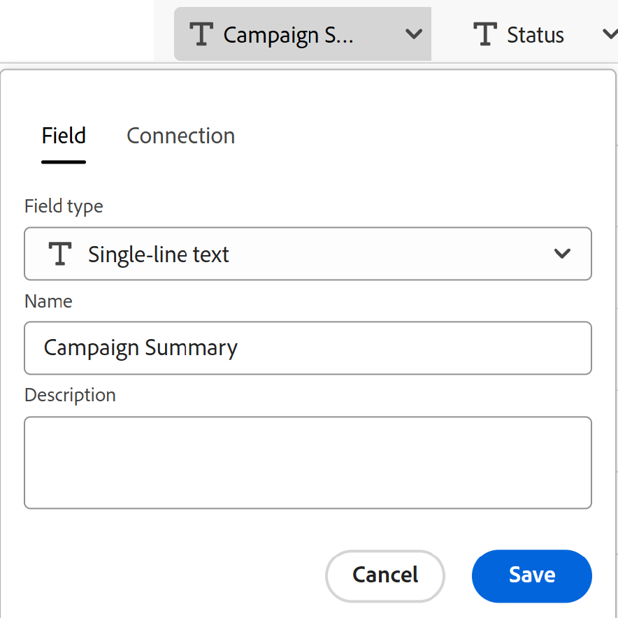

# Créer des types d’enregistrements en important des informations depuis un fichier CSV ou Excel

<!--The information on this page refers to functionality not yet generally available. It is available only in the Preview environment for all customers. After the monthly releases to Production, the same features are also available in the Production environment for customers who enabled fast releases.    

For information about fast releases, see [Enable or disable fast releases for your organization](/help/quicksilver/administration-and-setup/set-up-workfront/configure-system-defaults/enable-fast-release-process.md). -->

{{planning-important-intro}}

Les types d’enregistrements sont les types d’objets d’Adobe Workfront Planning. Dans Workfront Planning, vous pouvez créer des types d’enregistrements personnalisés qui illustrent les tâches nécessaires dans le cycle de vie de votre organisation en important des informations à partir d’un fichier CSV ou Excel.

## Conditions d’accès

+++ Développez pour afficher les conditions d’accès requises pour la fonctionnalité de cet article. 

<table style="table-layout:auto"> 
<col> 
</col> 
<col> 
</col> 
<tbody> 
    <tr> 
<tr> 
</tr>   
<tr> 
   <td role="rowheader">
Package Adobe Workfront
</td> 
   <td> 

Tout Workfront et tout package Planning

Ou

Tout workflow et tout package Planning

Pour plus d’informations sur les composants inclus dans chaque package Workfront Planning, contactez votre représentant de compte Workfront. 
 
   </td> 
  <tr> 
   <td role="rowheader">
Licence Adobe Workfront
</td> 
   <td>
Standard

   </td> 
  </tr> 
  <tr> 
   <td role="rowheader">
Autorisations d’objet
</td> 
   <td>   
Gérer les autorisations d’un espace de travail
  
   
L’administration système a accès à tous les espaces de travail, y compris ceux qu’elle n’a pas créés.
  </td> 
  </tr>  
</tbody> 
</table>

Pour plus d’informations sur les exigences d’accès à Workfront, voir [Exigences d’accès dans la documentation de Workfront](/help/quicksilver/administration-and-setup/add-users/access-levels-and-object-permissions/access-level-requirements-in-documentation.md).

+++   

<!--Old:
<table style="table-layout:auto"> 
<col> 
</col> 
<col> 
</col> 
<tbody> 
    <tr> 
<tr> 
<td> 
   
 Products
 </td> 
   <td> 
   <ul><li>
 Adobe Workfront
</li> 
   <li>
 Adobe Workfront Planning
</li></ul></td> 
  </tr>   
<tr> 
   <td role="rowheader">
Adobe Workfront plan*
</td> 
   <td> 

Any of the following Workfront plans:
 
<ul><li>Select</li> 
<li>Prime</li> 
<li>Ultimate</li></ul> 

Workfront Planning is not available for legacy Workfront plans
 
   </td> 
<tr> 
   <td role="rowheader">
Adobe Workfront Planning package*
</td> 
   <td> 

Any 
 

For more information about what is included in each Workfront Planning plan, contact your Workfront account manager. 
 
   </td> 
 <tr> 
   <td role="rowheader">
Adobe Workfront platform
</td> 
   <td> 

Your organization's instance of Workfront must be onboarded to the Adobe Unified Experience to be able to access Workfront Planning.
 

For more information, see <a href="/help/quicksilver/workfront-basics/navigate-workfront/workfront-navigation/adobe-unified-experience.md">Adobe Unified Experience for Workfront</a>. 
 
   </td> 
   </tr> 
  </tr> 
  <tr> 
   <td role="rowheader">
Adobe Workfront license*
</td> 
   <td>
 Standard

   
Workfront Planning is not available for legacy Workfront licenses
 
  </td> 
  </tr> 
  <tr> 
   <td role="rowheader">
Access level configuration
</td> 
   <td> 
There are no access level controls for Adobe Workfront Planning
   
</td> 
  </tr> 
<tr> 
   <td role="rowheader">
Object permissions
</td> 
   <td>   
Manage permissions to a workspace
  
   
System Administrators have permissions to all workspaces, including the ones they did not create
  </td> 
  </tr> 
 
</tbody> 
</table>-->

## Remarques concernant l’importation de types d’enregistrements à l’aide d’un fichier Excel ou CSV

* Chaque feuille du fichier Excel devient un type d’enregistrement. Le nom de la feuille devient le nom du type d&#39;enregistrement.
* S&#39;il n&#39;y a qu&#39;une seule feuille, ou si vous importez un fichier CSV, le nom du fichier devient le nom du type d&#39;enregistrement.
* Les en-têtes des colonnes de chaque feuille deviennent les champs associés à chaque type d&#39;enregistrement.
* Les champs sont uniques pour leur type d’enregistrement respectif.
* Chaque ligne de chaque feuille devient un enregistrement unique associé à son type d’enregistrement respectif.
* Chaque feuille du fichier Excel ne doit pas dépasser les dimensions suivantes :
   * 25 000 lignes
   * 500 colonnes
* La taille du fichier ne doit pas dépasser 5 Mo.
* Les feuilles vides ne sont pas prises en charge.
* Les champs des types suivants ne sont pas pris en charge et ne peuvent pas être mappés aux champs de la feuille d’importation :

   * Champs de connexion à Workfront, aux types d’objets AEM Assets ou aux marques GenStudio.
   * Champs de recherche des enregistrements Planning connectés, des objets Workfront, AEM Assets ou des marques GenStudio.
   * Champs de formule
   * Date de création, Créé par
   * Date de dernière modification, Dernière modification par
   * Date d’approbation, Approuvé par
   * Personnes

Pour importer des types d&#39;enregistrements à l&#39;aide d&#39;un fichier Excel ou CSV :

{{step1-to-planning}}

1. Cliquez sur l’espace de travail dans lequel vous souhaitez créer des types d’enregistrements,

   Ou

   Depuis un espace de travail, développez la flèche pointant vers le bas à droite d’un nom d’espace de travail existant, recherchez un espace de travail, puis sélectionnez-le lorsqu’il s’affiche dans la liste.
1. Cliquez sur **Ajouter un type d’enregistrement**.
1. Cliquez sur **Télécharger à partir d’un fichier**.
1. Effectuez un glisser-déposer d’un fichier Excel ou CSV précédemment enregistré sur votre ordinateur ou cliquez sur **Sélectionner un fichier CSV ou Excel** pour en rechercher un, puis sélectionnez-le.
1. Cliquez sur **Prévisualiser et modifier**.

   La zone **Prévisualiser et modifier** s’affiche avec les informations suivantes :

   * Les noms des feuilles ou des types d’enregistrements futurs s’affichent dans le panneau de gauche. Workfront Planning sélectionne par défaut une icône et une couleur pour chaque nouveau type d’enregistrement.
   * La première feuille ou le premier type d’enregistrement est sélectionné et les noms des champs qui lui sont associés s’affichent sous forme d’en-têtes de colonne. Le type de chaque champ est sélectionné par défaut.
   * Chaque ligne représente un nouvel enregistrement. Seuls les 10 premiers enregistrements s’affichent dans la zone Prévisualiser et modifier.

   

1. (Facultatif) Cliquez sur le nom de chaque feuille dans le panneau de gauche pour consulter les informations qu’elle contient.

   >[!NOTE]
   >
   >Les feuilles vides ne sont pas prises en charge et sont grisées.

1. (Facultatif) Désélectionnez les feuilles que vous ne souhaitez pas importer dans le panneau de gauche.

   

   Les feuilles que vous avez désélectionnées s’affichent sur fond gris.

1. (Facultatif) Cliquez sur la flèche pointant vers le bas à droite d’un en-tête de colonne pour effectuer l’une des opérations suivantes, dans l’onglet **Champ** :

   

   * Renommer l’un des champs
   * Modifiez le **Type de champ**
   * Mettez à jour le champ **Description**

1. (Facultatif) Cliquez sur l’onglet **Connexion** pour mapper les informations de la colonne à un champ connecté à partir d’autres types d’enregistrements.

   

   >[!TIP]
   >
   >Vous ne pouvez mapper qu’aux champs des enregistrements connectés de Workfront Planning. Vous ne pouvez pas mapper aux champs des connexions Workfront, AEM Assets ou GenStudio Brands . Pour plus d’informations, consultez la section [Considérations relatives à l’importation de types d’enregistrements à l’aide d’un fichier Excel ou CSV](#considerations-about-importing-record-types-using-an-excel-or-csv-file) dans cet article.

1. (Conditionnel) Après avoir mis à jour les informations sur le champ, cliquez sur **Enregistrer**.

1. Cliquez sur **Importer** lorsque vous êtes prêt à importer votre fichier.

   Les informations suivantes sont importées dans Workfront Planning :

   * Nouveaux types d’enregistrements
   * Nouveaux champs associés à chaque type d’enregistrement
   * Nouveaux enregistrements associés à chaque type d’enregistrement

   Vous pouvez commencer à gérer les champs et les enregistrements sur les pages consacrées aux types d’enregistrements.

   Toute personne ayant accès à Workfront Planning et à l’espace de travail peut désormais afficher et modifier les types d’enregistrements importés et leurs informations.
