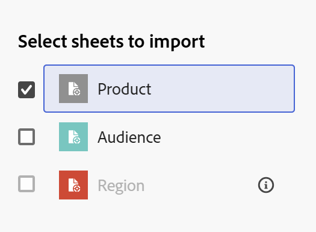

# Créer des types d’enregistrements en important des informations depuis un fichier CSV ou Excel

Les informations de cette page font référence à des fonctionnalités qui ne sont pas encore disponibles de façon générale. Elle est disponible uniquement dans l’environnement de Prévisualisation pour tous les clients. Après les versions mensuelles en production, les mêmes fonctionnalités sont également disponibles dans l’environnement de production pour les clients qui ont activé les versions rapides. 

Pour plus d’informations sur les versions rapides, voir [Activation ou désactivation des versions rapides pour votre organisation](/help/quicksilver/administration-and-setup/set-up-workfront/configure-system-defaults/enable-fast-release-process.md). 

{{planning-important-intro}}

Les types d’enregistrements sont les types d’objets d’Adobe Workfront Planning. Dans Workfront Planning, vous pouvez créer des types d’enregistrements personnalisés qui illustrent les tâches nécessaires dans le cycle de vie de votre organisation en important des informations à partir d’un fichier CSV ou Excel.

## Conditions d’accès

+++ Développez pour afficher les exigences d’accès.

Vous devez disposer des accès suivants pour effectuer les étapes décrites dans cet article :

<table style="table-layout:auto"> 
<col> 
</col> 
<col> 
</col> 
<tbody> 
    <tr> 
<tr> 
<td> 
   
 Produits
 </td> 
   <td> 
   <ul><li>
 Adobe Workfront
</li> 
   <li>
 Planification d’Adobe Workfront
</li></ul></td> 
  </tr>   
<tr> 
   <td role="rowheader">
Formule Adobe Workfront*
</td> 
   <td> 

L’un des plans Workfront suivants :
 
<ul><li>Sélectionner</li> 
<li>Principal</li> 
<li>Final</li></ul> 

Workfront Planning n’est pas disponible pour les plans Workfront hérités
 
   </td> 
<tr> 
   <td role="rowheader">
Package Adobe Workfront Planning*
</td> 
   <td> 

Tous 
 

Pour plus d’informations sur les éléments inclus dans chaque plan de planification Workfront, contactez votre gestionnaire de compte Workfront. 
 
   </td> 
 <tr> 
   <td role="rowheader">
Plateforme Adobe Workfront
</td> 
   <td> 

L’instance de Workfront de votre entreprise doit être intégrée à l’expérience unifiée Adobe pour pouvoir accéder à toutes les fonctionnalités de Workfront Planning.
 

Pour plus d’informations, voir <a href="/help/quicksilver/workfront-basics/navigate-workfront/workfront-navigation/adobe-unified-experience.md">Adobe Unified Experience pour Workfront</a>. 
 
   </td> 
   </tr> 
  </tr> 
  <tr> 
   <td role="rowheader">
Licence Adobe Workfront*
</td> 
   <td>
 Standard

   
Workfront Planning n’est pas disponible pour les licences Workfront héritées
 
  </td> 
  </tr> 
  <tr> 
   <td role="rowheader">
Configuration du niveau d’accès
</td> 
   <td> 
Il n’existe aucun contrôle de niveau d’accès pour Adobe Workfront Planning.
   
</td> 
  </tr> 
<tr> 
   <td role="rowheader">
Autorisations d’objet
</td> 
   <td>   
Gérer des autorisations relatives à un espace de travail</a> 
  
   
L’administration système a accès à tous les espaces de travail, y compris ceux qu’elle n’a pas créés.
  </td> 
  </tr> 
<tr> 
   <td role="rowheader">
Modèle de mise en page
</td> 
   <td> 
Dans l’environnement de production, tous les utilisateurs, y compris les administrateurs système, doivent être affectés à un modèle de mise en page qui inclut Planning.

Dans l’environnement de Prévisualisation, les utilisateurs et utilisatrices standard et les administrateurs et administratrices système ont Planning activé par défaut.
 </td> 
  </tr> 
</tbody> 
</table>

* Pour plus d’informations sur les exigences d’accès à Workfront, voir [Conditions d’accès requises dans la documentation Workfront](/help/quicksilver/administration-and-setup/add-users/access-levels-and-object-permissions/access-level-requirements-in-documentation.md).

+++

## Remarques concernant l’importation de types d’enregistrements à l’aide d’un fichier Excel ou CSV

* Chaque feuille du fichier Excel devient un type d’enregistrement. Le nom de la feuille devient le nom du type d&#39;enregistrement.
* S&#39;il n&#39;y a qu&#39;une seule feuille, ou si vous importez un fichier CSV, le nom du fichier devient le nom du type d&#39;enregistrement.
* Les en-têtes des colonnes de chaque feuille deviennent les champs associés à chaque type d&#39;enregistrement.
* Les champs sont uniques pour leur type d’enregistrement respectif.
* Chaque ligne de chaque feuille devient un enregistrement unique associé à son type d’enregistrement respectif.
* Chaque feuille du fichier Excel ne doit pas dépasser les dimensions suivantes :
   * 25 000 lignes
   * 500 colonnes
* La taille du fichier ne doit pas dépasser 5 Mo.
* Les feuilles vides ne sont pas prises en charge.
* Les champs des types suivants ne sont pas pris en charge et ne peuvent pas être mappés aux champs de la feuille d’importation :

   * <!--In the Production environment,--> Champs de connexion aux enregistrements Planning ou aux objets Workfront et AEM Assets

     <!--In the Preview environment, you can map and import connection fields to Planning records. -->

   * Champs de recherche des enregistrements Planning connectés ou des objets Workfront et AEM Assets
   * Champs de formule
   * Date de création, Créé par
   * Date de dernière modification, Dernière modification par
   * Personnes

Pour importer des types d&#39;enregistrements à l&#39;aide d&#39;un fichier Excel ou CSV :

{{step1-to-planning}}

1. Cliquez sur l’espace de travail dans lequel vous souhaitez créer des types d’enregistrements,

   Ou

   Depuis un espace de travail, développez la flèche pointant vers le bas à droite d’un nom d’espace de travail existant, recherchez un espace de travail, puis sélectionnez-le lorsqu’il s’affiche dans la liste.
1. Cliquez sur **Ajouter un type d’enregistrement**.
1. Cliquez sur **À partir du fichier**.
1. Faites glisser un fichier Excel ou CSV préalablement enregistré sur votre ordinateur ou cliquez sur **Sélectionner un fichier CSV ou Excel** pour en rechercher un.
1. Cliquez sur **Prévisualiser et modifier**.

   La zone **Prévisualiser et modifier** s’affiche avec les informations suivantes :

   * Les noms des feuilles ou des types d’enregistrements futurs s’affichent dans le panneau de gauche. Workfront Planning sélectionne par défaut une icône et une couleur pour chaque nouveau type d’enregistrement.
   * La première feuille ou le premier type d’enregistrement est sélectionné et les noms des champs qui lui sont associés s’affichent sous forme d’en-têtes de colonne. Le type de chaque champ est sélectionné par défaut.
   * Chaque ligne représente un nouvel enregistrement. Seuls les 10 premiers enregistrements s’affichent dans la zone Prévisualiser et modifier.

   

1. (Facultatif) Cliquez sur le nom de chaque feuille dans le panneau de gauche pour consulter les informations qu’elle contient.

   >[!NOTE]
   >
   >Les feuilles vides ne sont pas prises en charge et sont grisées.

1. (Facultatif) Désélectionnez les feuilles que vous ne souhaitez pas importer dans le panneau de gauche.

   

   Les feuilles que vous avez désélectionnées s’affichent sur fond gris.

1. (Facultatif) Cliquez sur la flèche pointant vers le bas à droite de l’en-tête de colonne pour effectuer l’une des opérations suivantes :

   * Renommer l’un des champs
   * Modifiez le **Type de champ**
   * Mettez à jour le champ **Description**

1. (Conditionnel) Après avoir mis à jour les informations sur le champ, cliquez sur **Enregistrer**.

1. Cliquez sur **Importer** lorsque vous êtes prêt à importer votre fichier.

   Les informations suivantes sont importées dans Workfront Planning :

   * Nouveaux types d’enregistrements
   * Nouveaux champs associés à chaque type d’enregistrement
   * Nouveaux enregistrements associés à chaque type d’enregistrement

   Vous pouvez commencer à gérer les champs et les enregistrements sur les pages consacrées aux types d’enregistrements.

   Toute personne ayant accès à Workfront Planning et à l’espace de travail peut désormais afficher et modifier les types d’enregistrements importés et leurs informations.
