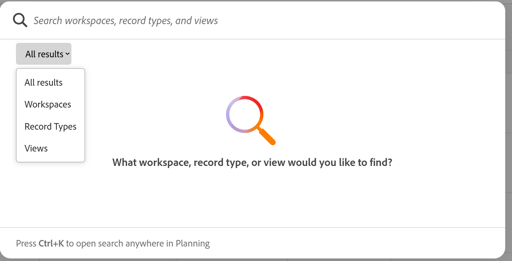

# Vue d’ensemble des espaces de travail

Les informations de cette page font référence à des fonctionnalités qui ne sont pas encore disponibles de façon générale. Elle est disponible uniquement dans l’environnement de Prévisualisation pour tous les clients. Une fois la version à prévisualiser, les mêmes fonctionnalités sont également disponibles tous les mois dans l’environnement de production pour les clients qui ont activé les versions rapides. 

Pour plus d’informations sur les versions rapides, voir [Activation ou désactivation des versions rapides pour votre organisation](/help/quicksilver/administration-and-setup/set-up-workfront/configure-system-defaults/enable-fast-release-process.md). 

{{planning-important-intro}}

Un espace de travail est un ensemble de types d’enregistrements utilisés par une entité organisationnelle et représente le cycle de vie et les processus de travail de l’entité. Vous pouvez entièrement personnaliser les espaces de travail dans Adobe Workfront Planning.

<!--update screenshot with production, it was broken at Preview-->

## Considérations sur les espaces de travail

* Vous pouvez créer des espaces de travail pour des unités organisationnelles spécifiques au sein de votre organisation, afin qu’ils correspondent au mode de travail unique de chaque unité.
* Workfront Planning ne comprend aucun espace de travail préconfiguré. Vous devez les créer en fonction des besoins de votre organisation.
* Vous pouvez créer des espaces de travail comme suit :

   * À partir de zéro
   * En utilisant un modèle. Les modèles contiennent un nombre préconfiguré de types d’enregistrements et leurs champs.
   * Utilisation de Planning Designer optimisé par l’IA Cette fonctionnalité est actuellement disponible dans Beta.
   * Utilisation d’un lot de modèle multi-espace de travail.

  Pour plus d’informations, voir [Créer des espaces de travail](/help/quicksilver/planning/architecture/create-workspaces.md).

* Les espaces de travail sont des structures au sein desquelles vos entités organisationnelles (une équipe, un groupe, un service ou une division) travaillent. Ils ne peuvent pas être associés à des champs. Seuls les types d’enregistrements d’un espace de travail peuvent être associés à des champs.

  Pour plus d’informations, voir [Présentation des types d’enregistrements](/help/quicksilver/planning/architecture/overview-of-record-types.md).
* Les espaces de travail s&#39;affichent dans les onglets suivants de la zone Planning :

   * **Espaces de travail sur lesquels je me trouve** : affiche les espaces de travail que vous avez créés ou les espaces de travail partagés avec vous.
   * **Autres espaces de travail** : affiche tous les autres espaces de travail du système. Cette option est réservée aux administrateurs système.
   * **Exemples d’espaces de travail** : affiche des exemples intégrés d’espaces de travail conformes aux bonnes pratiques. Vous ne pouvez pas modifier les espaces de travail, les types d&#39;enregistrements ni ajouter des enregistrements ou des champs, mais vous pouvez ajouter, modifier et partager des vues avec d&#39;autres utilisateurs.

  >[!NOTE]
  >
  >Nous vous recommandons de ne pas modifier les exemples d’espaces de travail, mais de les utiliser plutôt comme référence pour créer les vôtres. Utilisez le lot de modèles d’espaces de travail multiples pour créer des espaces de travail identiques à ceux répertoriés dans l’onglet Exemples d’espaces de travail . Pour plus d’informations, reportez-vous à la section « Créer plusieurs espaces de travail à l’aide d’un lot de modèle multi-espace de travail conforme aux bonnes pratiques » de l’article [Créer des espaces de travail](/help/quicksilver/planning/architecture/create-workspaces.md). 

<!--
No longer the case - they match now: 

* For all other users:

* **Workspaces I'm on**: Workspaces they created (for Standard-license users) and workspaces others shared with them display in the Workspaces area.

 

* **Sample workspaces**: Displays built-in examples of best-practice workspaces. You cannot edit the workspaces, record types, or add records, but you can add, edit, and share views with others.

-->

* Les types d’enregistrements contenus dans un espace de travail doivent refléter le cycle de vie professionnelle et les concepts d’une entité organisationnelle.

  Par exemple, si les objets de travail d&#39;une unité sont des campagnes, des produits et des régions, l&#39;espace de travail de cette unité doit contenir les types d&#39;enregistrements Campagne, Produit et Région.
* Lorsque vous créez un espace de travail, vous êtes la seule personne à pouvoir y accéder et le gérer. Vous devez le partager avec d’autres utilisateurs afin qu’ils puissent collaborer avec vous dans le même espace.

  Pour plus d’informations, voir [Partager un espace de travail](/help/quicksilver/planning/access/share-workspaces.md).

  Les administrateurs et administratrices système peuvent gérer tous les espaces de travail, même ceux qu’ils ou elles n’ont pas créés.

<!--make this live with the GA: * There is no limit for how many workspaces you can create in your environment. However, we recommend not to have too many workspaces, as they could become hard to manage and your workflows might be too fragmented.-->

* Il existe des limites au nombre d&#39;objets d&#39;espace de travail que vous pouvez créer dans votre instance de Workfront Planning. Pour plus d&#39;informations, voir Présentation des limites d&#39;objet d&#39;Adobe Workfront Planning .

## Présentation de la recherche globale

Sur la page de destination Planning, vous pouvez utiliser la zone de recherche globale pour rechercher les objets Planning suivants :

* Espaces de travail
* Types d’enregistrements
* Vues

Tenez compte des points suivants concernant l’utilisation de la recherche globale :

* Vous pouvez accéder à la recherche à partir de la page de destination Planning ou de n&#39;importe quelle page Planning en appuyant sur la combinaison de clavier suivante :

   * CTRL+K pour Windows
   * ⌘+K pour Mac
* Les 7 derniers résultats de chaque objet s’affichent dans la zone de recherche.
* Vous pouvez effectuer une recherche générale ou sélectionner un objet et rechercher des listes individuelles.

