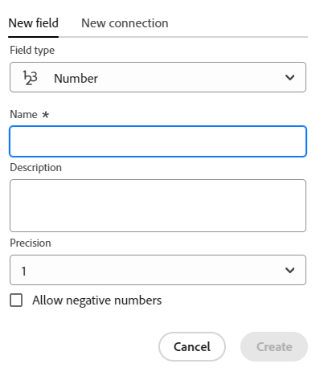
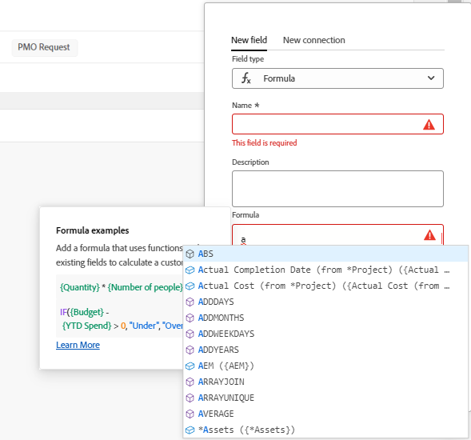
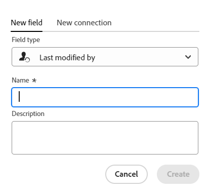

<!--Should the structure of this article be like this other one: https://experienceleague.adobe.com/docs/workfront/using/administration-and-setup/customize/custom-forms/custom-form-builder/use-the-custom-form-builder/add-a-custom-field-to-a-custom-form.html?lang=en ??-->

<!--will they add a way to create fields elsewhere than in a table?! - how will that change the structure of this article? -->

<!--Do we need this for FORMULAS: when we release permissions to RECORDS and we release referring lookup fields in a formula field, update considerations to say that lookup fields from linked records depends on the permissions to the record; if they have no permissions to view a linked record, they won't be able to use that records's lookup fields in a formula - not sure is needed??-->

# Créer des champs

Les informations mises en surbrillance sur cette page font référence à des fonctionnalités qui ne sont pas encore disponibles de manière générale. Il est disponible uniquement dans l’environnement Aperçu pour tous les clients. Après les versions mensuelles de Production, les mêmes fonctionnalités sont également disponibles dans l’environnement Production pour les clients qui ont activé les versions rapides. 

Pour plus d’informations sur les versions rapides, voir [Activation ou désactivation de versions rapides pour votre organisation](/help/quicksilver/administration-and-setup/set-up-workfront/configure-system-defaults/enable-fast-release-process.md). 

{{planning-important-intro}}

Dans Adobe Workfront Planning, vous pouvez créer des champs personnalisés pour des types d’enregistrements. Vous pouvez ensuite associer les champs à des enregistrements Workfront Planning afin d’améliorer les informations d’enregistrement.

Vous devez créer des types d’enregistrements avant de pouvoir créer des champs à associer à ceux-ci. Pour plus d’informations, consultez [Créer des types d’enregistrements](/help/quicksilver/planning/architecture/create-record-types.md).

Vous pouvez créer des champs de la manière suivante dans la planification Workfront :

* À partir de zéro
* En connectant des types d’enregistrement
* En créant un type d’enregistrement
* En créant un espace de travail à partir d’un modèle
*  En important des types d’enregistrement à l’aide d’un fichier Excel ou CSV
*  En important des copies des champs Workfront existants

Pour plus d’informations sur les champs de planification Workfront, voir [Présentation des champs](/help/quicksilver/planning/fields/fields-overview.md).

## Conditions d’accès

+++ Développez pour afficher les exigences d’accès à la planification Workfront.

Vous devez disposer des accès suivants pour effectuer les étapes décrites dans cet article :

<table style="table-layout:auto"> 
<col> 
</col> 
<col> 
</col> 
<tbody> 
    <tr> 
<tr> 
<td> 
   
 Produits
 </td> 
   <td> 
   <ul><li>
 Adobe Workfront
</li> 
   <li>
 Planification d’Adobe Workfront
</li></ul></td> 
  </tr>   
<tr> 
   <td role="rowheader">
Formule Adobe Workfront*
</td> 
   <td> 

L’un des projets Workfront suivants est prévu :
 
<ul><li>Sélectionner</li> 
<li>Principal</li> 
<li>Final</li></ul> 

La planification Workfront n’est pas disponible pour les plans Workfront hérités
 
   </td> 
<tr> 
   <td role="rowheader">
Package de planification Adobe Workfront*
</td> 
   <td> 

Tous 
 

Pour plus d’informations sur les éléments inclus dans chaque plan de planification Workfront, contactez votre gestionnaire de compte Workfront. 
 
   </td> 
 <tr> 
   <td role="rowheader">
Plateforme Adobe Workfront
</td> 
   <td> 

L’instance de Workfront de votre entreprise doit être intégrée à l’expérience unifiée Adobe pour pouvoir accéder à toutes les fonctionnalités de la planification Workfront.
 

Pour plus d’informations, voir <a href="/help/quicksilver/workfront-basics/navigate-workfront/workfront-navigation/adobe-unified-experience.md">Adobe Unified Experience pour Workfront</a>. 
 
   </td> 
   </tr> 
  </tr> 
  <tr> 
   <td role="rowheader">
Licence Adobe Workfront*
</td> 
   <td>
 Standard 

   
La planification Workfront n’est pas disponible pour les licences Workfront héritées
 
  </td> 
  </tr> 
  <tr> 
   <td role="rowheader">
Configuration du niveau d’accès
</td> 
   <td> 
Il n’existe aucun contrôle de niveau d’accès pour Adobe Workfront Planning.
   
</td> 
  </tr> 
<tr> 
   <td role="rowheader">
Autorisations d’objet
</td> 
   <td>   
Autorisations de gestion pour un espace de travail</a> 
  
   
Les équipes d’administration système ont des droits sur tous les espaces de travail, y compris ceux qu’ils n’ont pas créés.
 </td> 
  </tr> 
<tr> 
   <td role="rowheader">
Modèle de mise en page
</td> 
   <td> 
Toutes les personnes, y compris les administrateurs et administratrices de Workfront, doivent se voir attribuer un modèle de mise en page incluant la zone Planning dans le menu principal. 
 </td> 
  </tr> 
</tbody> 
</table>

* Pour plus d’informations sur les exigences d’accès à Workfront, voir [Conditions d’accès requises dans la documentation Workfront](/help/quicksilver/administration-and-setup/add-users/access-levels-and-object-permissions/access-level-requirements-in-documentation.md).

+++

<!--
OLD:

<table style="table-layout:auto">
 <col>
 </col>
 <col>
 </col>
 <tbody>
    <tr>
<tr>
<td>
   
 Product
 </td>
   <td>
   
 Adobe Workfront
 </td>
  </tr>  
 <td role="rowheader">
Adobe Workfront agreement
</td>
   <td>

Your organization must be enrolled in the early access stage for Workfront Planning 

   </td>
  </tr>
  <tr>
   <td role="rowheader">
Adobe Workfront plan
</td>
   <td>

Any

   </td>
  </tr>
  <tr>
   <td role="rowheader">
Adobe Workfront license*
</td>
   <td>
   
New: Standard
 
   
Current: Plan

  </td>
  </tr>
  
  <tr>
   <td role="rowheader">
Access level configurations
</td>
   <td> 
There are no access level control for Workfront Planning
  
</td>
  </tr>

  <tr>
   <td role="rowheader">
Permissions
</td>
   <td> 
Manage permissions to a workspace</a> 
  
   
System Administrators have permissions to all workspaces, including the ones they did not create.

</td>
  </tr>
<tr>
   <td role="rowheader">
Layout template
</td>
   <td> 
Your Workfront or group administrator must add the Planning area in your layout template. For information, see <a href="/help/quicksilver/planning/access/access-overview.md">Access overview</a>. 
  
</td>
  </tr>

 </tbody>
</table>

*For information, see [Access requirements in Workfront documentation](/help/quicksilver/administration-and-setup/add-users/access-levels-and-object-permissions/access-level-requirements-in-documentation.md). 

-->

## Créer des champs à partir de zéro {#create-fields-from-scratch}

<!--in a table (not sure if this can be done elsewhere?!-->

<!--the first 3 steps are the same as in Import fields from Workfron-->

{{step1-to-planning}}

1. Cliquez sur l&#39;espace de travail pour lequel vous souhaitez créer des champs.

   L’espace de travail et les types d’enregistrement s’affichent.

1. Cliquez sur la carte d’un type d’enregistrement.

   Tous les enregistrements existants associés au type d’enregistrement s’affichent dans les lignes de la vue Tableau.

   >[!TIP]
   >
   >    Si aucun enregistrement ne s’affiche, il se peut que vous n’ayez encore aucun enregistrement ou qu’un filtre appliqué limite ce que vous voyez à l’écran.

   Tous les champs existants associés au type d&#39;enregistrement s&#39;affichent dans les colonnes de la vue de tableau.

   >[!TIP]
   >
   >    Certains champs peuvent être masqués. Cliquez sur Champs et activez le bouton d’activation/désactivation des champs à afficher en tant que colonnes dans la vue Tableau.

1. Cliquez sur l’icône **+** dans le coin supérieur droit de la vue de tableau.

   Ou

   Pointez sur l’en-tête d’une colonne, cliquez sur la flèche pointant vers le bas située après le nom du champ, puis cliquez sur **Insérer à gauche** ou **Insérer à droite** pour ajouter le nouveau champ.
1. Dans l’onglet **Nouveau champ**, recherchez un type de champ dans la case **Type de champ** ou effectuez une sélection parmi les types de champ suivants :

   Dans l’onglet **Nouveau champ** , recherchez un type de champ dans la zone **Type de champ** <!--using any related keyword--> ou sélectionnez l’un des types de champ répertoriés ci-dessous.

   * [Texte à une ligne](#single-line-text)
   * [Paragraphe](#paragraph)
   * [Sélection multiple](#multi-select)
   * [Sélection unique](#single-select)
   * [Date](#date)
   * [Nombre](#number)
   * [Pourcentage](#percentage)
   * [Devise](#currency)
   * [Case à cocher](#checkbox)
   * [Formule](#formula)
   * [Personnes](#people)
   * [Créé par](#created-by)
   * [Date de création](#created-date)
   * [Dernière modification par](#last-modified-by)
   * [Date de dernière modification](#last-modified-date)

   >[!IMPORTANT]
   >
   >    Une fois enregistré, vous ne pouvez pas modifier le type de champ.

   <!--Add this to the IMPORTANT above and make it a NOTE - should do directly to Prod:
    * You can use any keyword that might be related to any of the field type names. For example, a search for "Budget" will display the Number or Currency field type.-->

1. Poursuivez en ajoutant chaque champ, comme décrit dans les sections ci-dessous.

### Texte à une ligne {#single-line-text}

Les champs de texte d’une seule ligne capturent des informations alphanumériques limitées. Vous pouvez, par exemple, capturer les informations de la personne propriétaire, des parties prenantes, de l’équipe ou de l’entité organisationnelle dans un champ de texte d’une seule ligne. Le contenu d’un champ de texte d’une seule ligne peut avoir jusqu’à 1 000 caractères. <!-- used to be 250 but just tested with 1000 and it allowed this as a maximum. -->

1. Commencez à créer un champ comme décrit dans la section [Créer des champs à partir de zéro](#create-fields-from-scratch) dans cet article, puis sélectionnez le type de champ **Texte à une ligne**.

   

1. Ajoutez les informations suivantes dans l’onglet **Nouveau champ** :
   * **Nom** : nom du type de champ, tel qu’il apparaîtra dans un tableau ou dans la page Détails de l’enregistrement. <!--ensure they updated this; and update the screen shot: it used to be "Label"-->
   * **Description** : informations complémentaires sur le champ. La description d&#39;un champ s&#39;affiche lorsque vous placez le pointeur de la souris sur l&#39;en-tête de colonne du champ dans un tableau, ou  lorsque vous cliquez sur l&#39;icône d&#39;information en regard du nom du champ dans la page de détails de l&#39;enregistrement.
1. Cliquez sur **Créer**.

   Le nouveau champ d&#39;une seule ligne est ajouté en colonne au type d&#39;enregistrement et ses valeurs peuvent être associées à des enregistrements.

### Paragraphe {#paragraph}

Les champs de paragraphe capturent des informations alphanumériques supplémentaires sur un enregistrement, comme le champ Description.

>[!TIP]
>
>* 20 champs de paragraphe peuvent être associés à un type d’enregistrement.
>
>* Le contenu d’un champ de paragraphe peut avoir jusqu’à 10 000 caractères.
>* Vous pouvez utiliser la mise en forme Texte enrichi pour améliorer le contenu des champs de paragraphe lorsqu’ils s’affichent dans la vue Tableau ou la page Détails d’un enregistrement. Pour plus d’informations, voir [Modifier des enregistrements](/help/quicksilver/planning/records/edit-records.md).
>

1. Commencez à créer un champ comme décrit dans la section [Créer des champs à partir de zéro](#create-fields-from-scratch) dans cet article, puis sélectionnez le type de champ **Paragraphe**.

   

1. Ajoutez les informations suivantes dans l’onglet **Nouveau champ** :
   * **Nom** : nom du type de champ, tel qu’il apparaîtra dans un tableau ou dans la page Détails de l’enregistrement. <!--ensure they updated this; and update the screen shot: it used to be "Label"-->
   * **Description** : informations complémentaires sur le champ. La description d&#39;un champ s&#39;affiche lorsque vous passez la souris sur la colonne du champ dans une table, ou  lorsque vous cliquez sur l&#39;icône d&#39;information en regard du nom du champ dans la page de détails de l&#39;enregistrement.
1. Cliquez sur **Créer**.

   Le nouveau champ de paragraphe est ajouté en tant que colonne au type d’enregistrement et ses valeurs peuvent être associées à des enregistrements.

### Sélection multiple {#multi-select}

Vous pouvez utiliser un champ à sélection multiple pour capturer des informations supplémentaires dans n’importe quel format en sélectionnant plusieurs options dans un menu déroulant.

1. Commencez à créer un champ comme décrit dans la section [Créer des champs à partir de zéro](#create-fields-from-scratch) dans cet article, puis sélectionnez le type de champ **Sélection multiple**.

   

1. Ajoutez les informations suivantes dans l’onglet **Nouveau champ** :
   * **Nom** : nom du type de champ, tel qu’il apparaîtra dans un tableau ou dans la page Détails de l’enregistrement. <!--ensure they updated this; and update the screen shot: it used to be "Label"-->
   * **Description** : informations complémentaires sur le champ. La description d&#39;un champ s&#39;affiche lorsque vous passez la souris sur la colonne du champ dans une table, ou  lorsque vous cliquez sur l&#39;icône d&#39;information en regard du nom du champ dans la page de détails de l&#39;enregistrement.
   * **Choix** : options que les utilisateurs peuvent sélectionner lors de la mise à jour de ce champ. Vous pouvez utiliser des chiffres et des lettres pour le nom de chaque choix.
1. Cliquez sur **Ajouter un choix** pour ajouter d’autres choix. Le nombre de choix que vous pouvez ajouter à un champ à sélection multiple est illimité.
1. (Facultatif) Faites glisser et déposez manuellement chaque choix dans l’ordre souhaité, ou sélectionnez l’option
   **Trier les choix dans l’ordre alphabétique** si vous souhaitez que les choix soient automatiquement répertoriés dans l’ordre alphabétique. <!--Add this if they added this functionality: You cannot edit this option after you save the field.-->
1. (Facultatif) Pour supprimer un choix, cliquez sur l’icône **x** située à droite.
1. Cliquez sur l’échantillon de couleur à gauche d’un choix pour développer le sélecteur de couleurs et personnaliser la couleur de chaque option.
1. Cliquez sur **Créer**.

   Le nouveau champ à sélection multiple est ajouté en tant que colonne au type d&#39;enregistrement et ses valeurs peuvent être associées à des enregistrements.

### Sélection unique {#single-select}

Les champs à sélection unique capturent des informations supplémentaires dans n’importe quel format en sélectionnant une option dans un menu déroulant.

1. Commencez à créer un champ comme décrit dans la section [Créer des champs à partir de zéro](#create-fields-from-scratch) dans cet article, puis sélectionnez le type de champ **Sélection simple**.

   

1. Ajoutez les informations suivantes dans l’onglet **Nouveau champ** :
   * **Nom** : nom du type de champ, tel qu’il apparaîtra dans un tableau ou dans la page Détails de l’enregistrement. <!--ensure they updated this; and update the screen shot: it used to be "Label"-->
   * **Description** : informations complémentaires sur le champ. La description d&#39;un champ s&#39;affiche lorsque vous passez la souris sur la colonne du champ dans une table, ou  lorsque vous cliquez sur l&#39;icône d&#39;information en regard du nom du champ dans la page de détails de l&#39;enregistrement.
   * **Choix** : options disponibles pour la sélection dans le menu déroulant après l’enregistrement du champ. Vous pouvez avoir des nombres et des lettres pour le nom de chaque choix.

1. Cliquez sur **Ajouter un choix** pour ajouter d’autres choix. Le nombre de choix que vous pouvez ajouter à un champ à sélection unique n’est pas limité.
1. (Facultatif) Faites glisser et déposez manuellement chaque choix dans l’ordre souhaité, ou sélectionnez l’option **Trier les choix de A-Z** si vous souhaitez que les choix soient automatiquement répertoriés dans l’ordre alphabétique. <!--Add this if they added this functionality: You cannot edit this option after you save the field.-->
1. (Facultatif) Pour supprimer un choix, cliquez sur l’icône **x** située à droite.
1. Cliquez sur l’échantillon de couleur à gauche d’un choix pour développer le sélecteur de couleurs et personnaliser la couleur de chaque option.
1. Cliquez sur **Créer**.

   Le nouveau champ à sélection unique est ajouté en tant que colonne au type d&#39;enregistrement et ses valeurs peuvent être associées à des enregistrements.

### Date {#date}

Vous pouvez utiliser un champ de date pour capturer des informations supplémentaires au format date et heure.

1. Commencez à créer un champ comme décrit dans la section [Créer des champs à partir de zéro](#create-fields-from-scratch) dans cet article, puis sélectionnez le type de champ **Date**.

   

1. Ajoutez les informations suivantes dans l’onglet **Nouveau champ** :
   * **Nom**: nom du type de champ, tel qu’il apparaît dans un tableau ou la page de l’enregistrement. <!--ensure they updated this; and update the screen shot: it used to be "Label"-->
   * **Description** : informations complémentaires sur le champ. La description d&#39;un champ s&#39;affiche lorsque vous passez la souris sur la colonne du champ dans une table, ou  lorsque vous cliquez sur l&#39;icône d&#39;information en regard du nom du champ dans la page de détails de l&#39;enregistrement.
   * **Format de date** : type de format de date à afficher dans ce champ. <!--update this casing - submitted bug for it-->

     Sélectionnez l’un des formats suivants :
      * **Paramètres régionaux** : correspond aux paramètres régionaux de votre navigateur.
      * **Standard** : 05/16/2023
      * **Long** : 16 mai 2023
      * **Européen** : 16/05/2023
      * **ISO** : 2023-05-16
      * **Inclure l’heure** : sélectionnez cette option si vous souhaitez inclure un horodatage. Cette option est désélectionnée par défaut. Vous ne pouvez pas inclure un moment après avoir sécurisé le champ.

     Sélectionnez l’une des options suivantes :

      * **24 h** : par exemple : 18:00
      * **12 h** : par exemple : 6:00 PM

1. Cliquez sur **Créer**.

   Le nouveau champ date est ajouté en tant que colonne au type d&#39;enregistrement et ses valeurs peuvent être associées à des enregistrements.

### Nombre {#number}

Les types de champ Nombre capturent les informations au format numérique.

1. Commencez à créer un champ comme décrit dans la section [Créer des champs à partir de zéro](#create-fields-from-scratch) dans cet article, puis sélectionnez le type de champ **Nombre**.

   
1. Ajoutez les informations suivantes dans l’onglet **Nouveau champ** :

   * **Nom** : nom du type de champ, tel qu’il apparaît dans un tableau ou la page de l’enregistrement.
   * **Description** : informations complémentaires sur le champ. La description d&#39;un champ s&#39;affiche lorsque vous passez la souris sur la colonne du champ dans une table, ou  lorsque vous cliquez sur l&#39;icône d&#39;information en regard du nom du champ dans la page de détails de l&#39;enregistrement.
   * **Précision** : nombre de décimales que vous souhaitez enregistrer pour le champ. Vous pouvez afficher jusqu’à 6 décimales.
   * **Autoriser les nombres négatifs** : sélectionnez cette option si vous souhaitez autoriser les nombres négatifs dans ce champ. Cette option n’est pas sélectionnée par défaut.

   >[!NOTE]
   >
   >    Si vous sélectionnez Autoriser les nombres négatifs et que les valeurs négatives sont stockées sur les enregistrements auxquels le champ est associé, vous ne pouvez plus désélectionner ce paramètre à l’avenir.

1. Cliquez sur **Créer**.

   Le nouveau champ numérique est ajouté en tant que colonne au type d&#39;enregistrement et ses valeurs peuvent être associées à des enregistrements.

### Pourcentage {#percentage}

Les types de champ en pourcentage capturent les informations au format numérique, suivis d’un signe de pourcentage.

1. Commencez à créer un champ comme décrit dans la section [Créer des champs à partir de zéro](#create-fields-from-scratch) de cet article, puis sélectionnez le type de champ **Pourcentage** . <!--change screen shot for preview-->

   

1. Ajoutez les informations suivantes dans l’onglet **Nouveau champ** :
   * **Nom** : nom du type de champ, tel qu’il apparaît dans un tableau ou la page de l’enregistrement.
   * **Description** : informations complémentaires sur le champ. La description d&#39;un champ s&#39;affiche lorsque vous passez la souris sur la colonne du champ dans une table, ou  lorsque vous cliquez sur l&#39;icône d&#39;information en regard du nom du champ dans la page de détails de l&#39;enregistrement.
   * **Précision** : nombre de décimales que vous souhaitez enregistrer pour le champ. Vous pouvez afficher jusqu’à 6 décimales.
   * **Autoriser les nombres négatifs** : sélectionnez cette option si vous souhaitez autoriser les valeurs en pourcentage négatif dans ce champ. Cette option n’est pas sélectionnée par défaut.

     >[!NOTE]
     >
     >Si vous sélectionnez Autoriser les nombres négatifs et que les valeurs négatives sont stockées sur les enregistrements auxquels le champ est associé, vous ne pouvez plus désélectionner ce paramètre à l’avenir.

   

   * **Afficher comme** : dans le menu déroulant, choisissez comment afficher les valeurs en pourcentage dans la vue de tableau. Sélectionnez l’une des options suivantes :
      * **Number** : la valeur de pourcentage s’affiche sous la forme d’un nombre suivi du signe de pourcentage.
      * **Bar** : la valeur de pourcentage s’affiche sous forme de barre en regard du nombre de pourcentages. La couleur de remplissage de la barre indique la valeur de pourcentage. Il s’agit de la sélection par défaut.
      * **Cercle** : la valeur de pourcentage s’affiche sous forme de contour d’un cercle à côté du nombre de pourcentages. La couleur de remplissage du contour du cercle indique la valeur de pourcentage.

   >[!NOTE]
   >
   >* La sélection que vous effectuez dans le champ Afficher sous s’applique uniquement à la valeur de pourcentage visible dans la vue de tableau. La valeur de pourcentage du champ s’affiche sous la forme d’un nombre suivi du signe de pourcentage partout ailleurs dans Workfront Planning. Cela s’applique également au champ de type pourcentage lorsqu’il s’affiche sous la forme d’un champ de recherche dans les vues de table d’autres enregistrements.
   >* Vous pouvez modifier la sélection Afficher comme lors de la modification ultérieure du champ.
   

1. Cliquez sur **Créer**.

   Le nouveau champ de pourcentage est ajouté en tant que colonne au type d&#39;enregistrement et ses valeurs peuvent être associées à des enregistrements.

### Devise {#currency}

Les types de champ de devise capturent les informations dans un format numérique précédé d’un symbole monétaire.

1. Commencez à créer un champ comme décrit dans la section [Créer des champs à partir de zéro](#create-fields-from-scratch) dans cet article, puis sélectionnez le type de champ **Devise**.

   

1. Ajoutez les informations suivantes dans l’onglet **Nouveau champ** :
   * **Nom**: nom du type de champ, tel qu’il apparaît dans un tableau ou la page de l’enregistrement. <!--ensure they updated this; and update the screen shot: it used to be "Label"-->
   * **Description** : informations complémentaires sur le champ. La description d&#39;un champ s&#39;affiche lorsque vous passez la souris sur la colonne du champ dans une table, ou  lorsque vous cliquez sur l&#39;icône d&#39;information en regard du nom du champ dans la page de détails de l&#39;enregistrement.
   * **Devise** : type de devise à afficher dans ce champ. Il s’agit d’une liste de devises selon l’Organisation internationale de normalisation (ISO).
   * **Précision** : nombre de décimales que vous souhaitez enregistrer pour le champ. Vous pouvez afficher jusqu’à 6 décimales.
   * **Autoriser les nombres négatifs** : sélectionnez cette option si vous souhaitez autoriser les valeurs de devise négatives dans ce champ. Cette option n’est pas sélectionnée par défaut.

   >[!NOTE]
   >
   >    Si vous sélectionnez Autoriser les nombres négatifs et que les valeurs négatives sont stockées sur les enregistrements auxquels le champ est associé, vous ne pouvez plus désélectionner ce paramètre à l’avenir.

1. Cliquez sur **Créer**.

   Le nouveau champ de devise est ajouté en tant que colonne au type d’enregistrement et ses valeurs peuvent être associées à des enregistrements.

### Case à cocher

Vous pouvez utiliser le type de champ Case à cocher pour ajouter une seule option de case à cocher à un enregistrement. Vous pouvez utiliser ce champ pour indiquer un attribut ou un statut spécifique pour cet enregistrement particulier. Vous pouvez l’utiliser, par exemple, comme indicateur pour suivre l’achèvement, l’approbation ou tout autre attribut binaire de chaque enregistrement.

1. Commencez à créer un champ comme décrit dans la section [Créer des champs à partir de zéro](#create-fields-from-scratch) dans cet article, puis sélectionnez le type de champ **Case à cocher**.

   

1. Ajoutez les informations suivantes dans l’onglet **Nouveau champ** :
   * **Nom**: nom du type de champ, tel qu’il apparaît dans un tableau ou la page de l’enregistrement. <!--ensure they updated this; and update the screen shot: it used to be "Label"-->
   * **Description** : informations complémentaires sur le champ. La description d&#39;un champ s&#39;affiche lorsque vous passez la souris sur la colonne du champ dans une table, ou  lorsque vous cliquez sur l&#39;icône d&#39;information en regard du nom du champ dans la page de détails de l&#39;enregistrement.
1. Cliquez sur **Créer**.

   Le nouveau champ de case à cocher est ajouté en tant que colonne au type d’enregistrement et ses valeurs peuvent être associées à des enregistrements.

### Formule

Les champs de type formule génèrent une nouvelle valeur en utilisant des valeurs existantes provenant d’autres champs d’un type d’enregistrement et une fonction qui indique comment les valeurs existantes doivent être calculées.

Pour plus d’informations, voir [Vue d’ensemble des champs de formule](/help/quicksilver/planning/fields/formula-fields.md).

1. Commencez à créer un champ comme décrit dans la section [Créer des champs à partir de zéro](#create-fields-from-scratch) dans cet article, puis sélectionnez le type de champ **Formule**.

   

1. Ajoutez les informations suivantes dans l’onglet **Nouveau champ** :

   * **Nom** : saisissez le nom du nouveau champ.
   * **Description** : ajoutez des informations sur le nouveau champ. La description d&#39;un champ s&#39;affiche lorsque vous passez la souris sur la colonne du champ dans une table, ou  lorsque vous cliquez sur l&#39;icône d&#39;information en regard du nom du champ dans la page de détails de l&#39;enregistrement.
   * **Formule** : commencez à saisir au moins un caractère pour accéder à une expression, puis sélectionnez-la lorsqu’elle s’affiche dans la liste.

1. Cliquez sur l’expression sélectionnée pour afficher la définition et afficher sa mise en forme.

   

   Pour plus d’informations sur les expressions prises en charge, voir [Présentation des champs de formule](/help/quicksilver/planning/fields/formula-fields.md).

   >[!TIP]
   >
   >Vous recevrez un message d&#39;avertissement lors de l&#39;édition ou de la création d&#39;un champ de formule qui peut entraîner une référence circulaire à lui-même ou à des champs partagés. Vous ne pouvez pas enregistrer un champ de formule qui se réfère à lui-même ou aux éléments référencés dans son calcul.  

1. Ajoutez les noms des champs tels qu’ils s’affichent dans la Planification Workfront pour les référencer dans une formule.

   >[!NOTE]
   >
   >* Vous ne pouvez pas ajouter de champs de type Sélection multiple dans une formule.
   >
   >* Vous pouvez référencer un champ qui peut contenir jusqu’à 4 champs (et objets) à l’écart du type d’enregistrement actif. Par exemple, si vous créez un champ de formule pour un type d’enregistrement Activité (1) et que l’activité est connectée au type d’enregistrement Campagne (2) connecté à un projet Workfront (3), vous pouvez référencer le champ Budget du projet (4) dans la formule que vous créez pour le type d’enregistrement Activité.
   >
   >
   >

1. Dans le champ **Format** , sélectionnez l’un des choix suivants pour identifier le format du résultat affiché dans le champ de type de formule :

   * **Texte** : le résultat du champ de formule s’affiche en texte brut.
   * **Number** : le résultat du champ de formule s’affiche sous la forme d’un nombre.
   * **Pourcentage** : le résultat du champ de formule s’affiche sous la forme d’un nombre suivi d’un symbole de pourcentage.
   * **Devise** : le résultat du champ de formule s’affiche sous la forme d’un nombre précédé ou suivi d’un symbole monétaire.
   * **Balises** : le résultat du champ de formule s’affiche sous la forme d’une balise avec le nom de l’objet.

     >[!TIP]
     >
     >Nous recommandons des balises pour les champs qui affichent des tableaux. Dans ce cas, chaque membre du tableau s’affiche sous la forme d’une balise distincte.

     

   * **Date** : le résultat du champ de formule s’affiche sous la forme d’une date.

     Un aperçu du résultat s’affiche sous le champ **Format**.

     >[!WARNING]
     >
     >Si le résultat de la formule ne correspond pas au format sélectionné, le champ affiche un message d’erreur à l’emplacement où il s’affiche.

1. Cliquez sur **Créer**.

   Le nouveau champ de formule est ajouté en tant que colonne au type d&#39;enregistrement et ses valeurs peuvent être associées à des enregistrements.

### Personnes

Vous pouvez utiliser le type de champ Personnes pour ajouter un utilisateur ou une utilisatrice<!--, job role, or team--> à un enregistrement. Il s’agit d’un champ de type anticipé, et vous pouvez ajouter uniquement les utilisateurs<!--, roles, or teams--> qui existent déjà dans votre instance Workfront.

1. Commencez à créer un champ comme décrit dans la section [Créer des champs à partir de zéro](#create-fields-from-scratch) dans cet article, puis sélectionnez le type de champ **Personnes**.

   

1. Ajoutez les informations suivantes dans l’onglet **Nouveau champ** :
   * **Nom** : nom du type de champ, tel qu’il apparaît dans un tableau ou la page de l’enregistrement.
   * **Description** : informations complémentaires sur le champ. La description d&#39;un champ s&#39;affiche lorsque vous passez la souris sur la colonne du champ dans une table, ou  lorsque vous cliquez sur l&#39;icône d&#39;information en regard du nom du champ dans la page de détails de l&#39;enregistrement.
   * **Autoriser plusieurs valeurs** : sélectionnez cette option si vous souhaitez permettre aux personnes d’ajouter plusieurs utilisateurs et utilisatrices dans ce champ. Cette option n’est pas sélectionnée par défaut.

   >[!NOTE]
   >
   >    Si vous sélectionnez Autoriser plusieurs valeurs et que plusieurs personnes sont stockées dans les enregistrements auxquels le champ est associé, vous ne pouvez plus désélectionner le paramètre à l’avenir lors de la modification de ce champ.

1. Cliquez sur **Créer**.

   Le nouveau champ Type de personne est ajouté en tant que colonne au type d’enregistrement et ses valeurs peuvent être associées à des enregistrements.

### Créé par

Vous pouvez utiliser le type de champ Créé par pour ajouter à un enregistrement la personne qui a créé l’enregistrement. Il s’agit d’un champ en lecture seule qui s’affiche automatiquement avec le nom de la personne connectée lors de la création de l’enregistrement.

1. Commencez à créer un champ comme décrit dans la section [Créer des champs à partir de zéro](#create-fields-from-scratch) dans cet article, puis sélectionnez le type de champ **Créé par**.

   

1. Ajoutez les informations suivantes dans l’onglet **Nouveau champ** :

   * **Nom**: nom du type de champ, tel qu’il apparaît dans un tableau ou la page de l’enregistrement. <!--this might change and they might prepopulate it with "Created by"-->
   * **Description** : informations complémentaires sur le champ. La description d&#39;un champ s&#39;affiche lorsque vous passez la souris sur la colonne du champ dans une table, ou  lorsque vous cliquez sur l&#39;icône d&#39;information en regard du nom du champ dans la page de détails de l&#39;enregistrement.

1. Cliquez sur **Créer**.

   Le nouveau champ de type Créé par est ajouté en tant que colonne au type d’enregistrement et ses valeurs sont préremplies avec le nom de la personne qui a créé chaque enregistrement.

### Date de création

Vous pouvez utiliser le type de champ Date de création pour ajouter à un enregistrement la date à laquelle l’enregistrement a été créé. Il s’agit d’un champ en lecture seule qui est automatiquement renseigné avec la date (et éventuellement avec l’heure) de création de l’enregistrement.

1. Commencez à créer un champ comme décrit dans la section [Créer des champs à partir de zéro](#create-fields-from-scratch) dans cet article, puis sélectionnez le type de champ **Date de création**.

   

   <!--check the image above - added bug fix for UI text changes-->

1. Ajoutez les informations suivantes dans l’onglet **Nouveau champ** :

   * **Nom**: nom du type de champ, tel qu’il apparaît dans un tableau ou la page de l’enregistrement. <!--this might change and they might prepopulate it with "Created date"-->
   * **Description** : informations complémentaires sur le champ. La description d&#39;un champ s&#39;affiche lorsque vous passez la souris sur la colonne du champ dans une table, ou  lorsque vous cliquez sur l&#39;icône d&#39;information en regard du nom du champ dans la page de détails de l&#39;enregistrement.
   * **Format de date** : sélectionnez l’un des formats suivants :

      * **Paramètre local** : correspond au paramètre local de votre navigateur.
      * **Standard** : 05/16/2023
      * **Long** : 16 mai 2023
      * **Européen** : 16/05/2023
      * **ISO** : 2023-05-16
   * **Inclure un champ de l’heure** : sélectionnez cette option si vous souhaitez inclure un horodatage. Cette option est désélectionnée par défaut. <!--submitted a UI text change for this - check the UI-->

     Sélectionnez l’une des options suivantes :

      * **24 h** : par exemple : 18:00
      * **12 h** : par exemple : 6:00 PM

1. Cliquez sur **Créer**.

   Le nouveau champ de type Date de création est ajouté en tant que colonne au type d’enregistrement et ses valeurs sont préremplies avec la date (ou la date et l’heure) de création de l’enregistrement.

### Dernière modification par

Vous pouvez utiliser le champ Dernière modification par type pour ajouter à un enregistrement la personne qui a modifié l’enregistrement pour la dernière fois. Il s’agit d’un champ en lecture seule qui se remplit automatiquement avec le nom de la personne connectée lors de la dernière mise à jour de l’enregistrement.

1. Commencez à créer un champ comme décrit dans la section [Créer des champs à partir de zéro](#create-fields-from-scratch) dans cet article, puis sélectionnez le type de champ **Dernière modification par**.

   

1. Ajoutez les informations suivantes dans l’onglet **Nouveau champ** :

   * **Nom**: nom du type de champ, tel qu’il apparaît dans un tableau ou la page de l’enregistrement. <!--this might change and they might prepopulate it with "Created by"-->
   * **Description** : informations complémentaires sur le champ. La description d&#39;un champ s&#39;affiche lorsque vous passez la souris sur la colonne du champ dans une table, ou  lorsque vous cliquez sur l&#39;icône d&#39;information en regard du nom du champ dans la page de détails de l&#39;enregistrement.

1. Cliquez sur **Créer**.

   Le nouveau champ de type Dernière modification par est ajouté en colonne au type d’enregistrement et ses valeurs sont préremplies avec le nom de la personne qui a modifié chaque enregistrement pour la dernière fois.

### Date de dernière modification

Vous pouvez utiliser le type de champ Date de dernière modification pour ajouter à un enregistrement la date de dernière modification d’un enregistrement. Il s’agit d’un champ en lecture seule qui s’affiche automatiquement avec la date (et éventuellement avec l’heure) de la dernière modification de l’enregistrement.

1. Commencez à créer un champ comme décrit dans la section [Créer des champs à partir de zéro](#create-fields-from-scratch) de cet article, puis sélectionnez le type de champ **Date de création**.

   

   <!--check the image above - added bug fix for UI text changes-->

1. Ajoutez les informations suivantes dans l’onglet **Nouveau champ** :

   * **Nom**: nom du type de champ, tel qu’il apparaît dans un tableau ou la page de l’enregistrement. <!--this might change and they might prepopulate it with "Created date"-->
   * **Description** : informations complémentaires sur le champ. La description d&#39;un champ s&#39;affiche lorsque vous passez la souris sur la colonne du champ dans une table, ou  lorsque vous cliquez sur l&#39;icône d&#39;information en regard du nom du champ dans la page de détails de l&#39;enregistrement.
   * **Format de date** : sélectionnez l’un des formats suivants :

      * **Paramètre local** : correspond au paramètre local de votre navigateur.
      * **Standard** : 05/16/2023
      * **Long** : 16 mai 2023
      * **Européen** : 16/05/2023
      * **ISO** : 2023-05-16

   * **Inclure un champ de l’heure** : sélectionnez cette option si vous souhaitez inclure un horodatage. Cette option est désélectionnée par défaut. <!--submitted a UI text change for this - check the UI-->

     Sélectionnez l’une des options suivantes :

      * **24 h** : par exemple : 18:00
      * **12 h** : par exemple : 6:00 PM

1. Cliquez sur **Créer**.

   Le nouveau champ de type Date de la dernière modification est ajouté en tant que colonne au type d’enregistrement et ses valeurs sont préremplies avec la date (ou la date et l’heure) de la dernière modification de l’enregistrement.

## Créer des champs en connectant des types d’enregistrement

Vous pouvez créer des champs d’enregistrement liés lorsque vous ajoutez une nouvelle connexion entre deux types d’enregistrement ou un type d’enregistrement et des types d’objet à partir d’autres applications.

Pour plus d’informations sur la connexion des types d’enregistrement Workfront Planning, voir [Connexion des types d’enregistrement](/help/quicksilver/planning/architecture/connect-record-types.md).

<!--## Create fields by importing record types using an Excel or CSV file

For more information, see [Create record types](/help/quicksilver/planning/architecture/create-record-types.md).-->

## Créer des champs en créant un type d’enregistrement

Lorsque vous créez un type d’enregistrement, plusieurs champs associés au nouveau type d’enregistrement sont également créés par défaut. Pour plus d’informations, consultez la section [Créer des types d’enregistrements](/help/quicksilver/planning/architecture/create-record-types.md).

## Créer des champs en créant un espace de travail à partir d’un modèle

Adobe Workfront Planning crée des champs pour les types d’enregistrement lorsque vous créez un espace de travail à partir d’un modèle.

Pour plus d’informations, consultez la section [Créer des espaces de travail](/help/quicksilver/planning/architecture/create-workspaces.md).

## Créer des champs lors de l’importation de types d’enregistrement à partir d’un fichier CSV ou Excel

Vous pouvez importer des champs lorsque vous importez des types d’enregistrement à l’aide d’un fichier CSV ou Excel.

Pour plus d’informations, consultez la section [Créer des types d’enregistrement](/help/quicksilver/planning/architecture/create-record-types.md).

## Créer des champs à partir de Workfront

Vous pouvez importer des copies de champs Workfront existants.

L’importation de champs à partir de Workfront crée une copie de chaque champ pour un type d’enregistrement Workfront Planning.

Une fois les champs copiés, ils sont indépendants les uns des autres et n’exchange pas les informations.

Pour plus d’informations, voir [Importation de champs à partir de Workfront](/help/quicksilver/planning/fields/import-fields-from-workfront.md).

