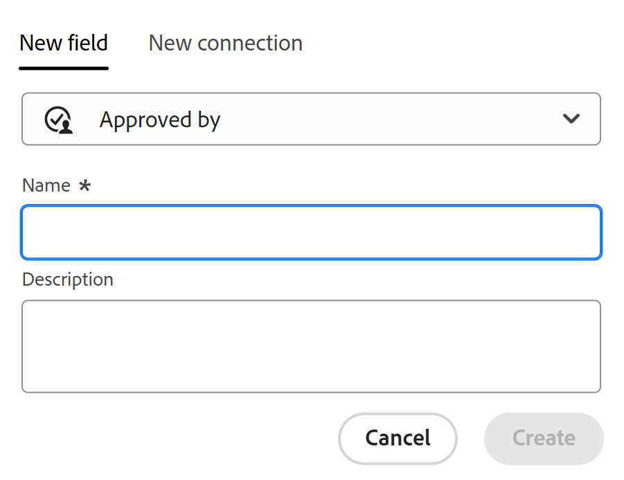

<!--Should the structure of this article be like this other one: https://experienceleague.adobe.com/docs/workfront/using/administration-and-setup/customize/custom-forms/custom-form-builder/use-the-custom-form-builder/add-a-custom-field-to-a-custom-form.html?lang=en ??-->

<!--will they add a way to create fields elsewhere than in a table?! - how will that change the structure of this article? -->

<!--Do we need this for FORMULAS: when we release permissions to RECORDS and we release referring lookup fields in a formula field, update considerations to say that lookup fields from linked records depends on the permissions to the record; if they have no permissions to view a linked record, they won't be able to use that records's lookup fields in a formula - not sure is needed??-->

# Créer des champs

<!--information about choice values must stay in yellow till Jan 2026-->

<!--<span class="preview">The highlighted information on this page refers to functionality not yet generally available. It is available only in the Preview environment for all customers. After the monthly releases to Production, the same features are also available in the Production environment for customers who enabled fast releases. </span>   

<span class="preview">For information about fast releases, see [Enable or disable fast releases for your organization](/help/quicksilver/administration-and-setup/set-up-workfront/configure-system-defaults/enable-fast-release-process.md). </span>-->


{{planning-important-intro}}

Dans Adobe Workfront Planning, vous pouvez créer des champs personnalisés pour des types d’enregistrements. Vous pouvez ensuite associer les champs à des enregistrements Workfront Planning afin d’améliorer les informations d’enregistrement.

Vous devez créer des types d’enregistrements avant de pouvoir créer des champs à associer à ceux-ci. Pour plus d’informations, consultez [Créer des types d’enregistrements](/help/quicksilver/planning/architecture/create-record-types.md).

Dans Workfront Planning, vous pouvez créer des champs des manières suivantes :

* [À partir de zéro](#create-fields-from-scratch)
* [En connectant des types d’enregistrement](#create-fields-by-connecting-record-types)
* [En créant un type d’enregistrement](#create-fields-by-creating-a-record-type)
* [En créant un espace de travail à partir d’un modèle](#create-fields-by-creating-a-workspace-from-a-template)
* [En important des types d’enregistrements à l’aide d’un fichier Excel ou CSV](#create-fields-when-importing-record-types-from-a-csv-or-excel-file)
* [En important des copies de champs Workfront existants](#create-fields-by-importing-them-from-workfront)

Pour plus d’informations sur les champs de planification Workfront, voir [Présentation des champs](/help/quicksilver/planning/fields/fields-overview.md).

## Conditions d’accès

+++ Développez pour afficher les conditions d’accès requises pour la fonctionnalité de cet article. 

<table style="table-layout:auto"> 
<col> 
</col> 
<col> 
</col> 
<tbody> 
    <tr> 
<tr> 
</tr>   
<tr> 
   <td role="rowheader"><p>Package Adobe Workfront</p></td> 
   <td> 
<ul> 
<li><p>Tout Workfront et tout package Planning</p></li>
Ou
<li><p>Tout workflow et tout package Planning</p></li></ul>
<p>Pour plus d’informations sur les composants inclus dans chaque package Workfront Planning, contactez votre représentant de compte Workfront. </p> 
   </td> 
  <tr> 
   <td role="rowheader"><p>Licence Adobe Workfront</p></td> 
   <td><p>Standard</p>
   </td> 
  </tr> 
  <tr> 
   <td role="rowheader"><p>Autorisations d’objet</p></td> 
   <td>   <p>Gérer les autorisations d’un espace de travail</p>  
   <p>L’administration système a accès à tous les espaces de travail, y compris ceux qu’elle n’a pas créés.</p>  </td> 
  </tr>  
</tbody> 
</table>

Pour plus d’informations sur les exigences d’accès à Workfront, voir [Exigences d’accès dans la documentation de Workfront](/help/quicksilver/administration-and-setup/add-users/access-levels-and-object-permissions/access-level-requirements-in-documentation.md).

+++   

<!--Old:

 <table style="table-layout:auto"> 
<col> 
</col> 
<col> 
</col> 
<tbody> 
    <tr> 
<tr> 
<td> 
   <p> Products</p> </td> 
   <td> 
   <ul><li><p> Adobe Workfront</p></li> 
   <li><p> Adobe Workfront Planning<p></li></ul></td> 
  </tr>   
<tr> 
   <td role="rowheader"><p>Adobe Workfront plan*</p></td> 
   <td> 
<p>Any of the following Workfront plans:</p> 
<ul><li>Select</li> 
<li>Prime</li> 
<li>Ultimate</li></ul> 
<p>Workfront Planning is not available for legacy Workfront plans</p> 
   </td> 
<tr> 
   <td role="rowheader"><p>Adobe Workfront Planning package*</p></td> 
   <td> 
<p>Any </p> 
<p>For more information about what is included in each Workfront Planning plan, contact your Workfront account manager. </p> 
   </td> 
 <tr> 
   <td role="rowheader"><p>Adobe Workfront platform</p></td> 
   <td> 
<p>Your organization's instance of Workfront must be onboarded to the Adobe Unified Experience to be able to access Workfront Planning.</p> 
<p>For more information, see <a href="/help/quicksilver/workfront-basics/navigate-workfront/workfront-navigation/adobe-unified-experience.md">Adobe Unified Experience for Workfront</a>. </p> 
   </td> 
   </tr> 
  </tr> 
  <tr> 
   <td role="rowheader"><p>Adobe Workfront license*</p></td> 
   <td><p> Standard </p>
   <p>Workfront Planning is not available for legacy Workfront licenses</p> 
  </td> 
  </tr> 
  <tr> 
   <td role="rowheader"><p>Access level configuration</p></td> 
   <td> <p>There are no access level controls for Adobe Workfront Planning</p>   
</td> 
  </tr> 
<tr> 
   <td role="rowheader"><p>Object permissions</p></td> 
   <td>   <p>Manage permissions to a workspace and record type</a> </p>  
   <p>System Administrators have permissions to all workspaces, including the ones they did not create.</p> </td> 
  </tr> 
</tbody> 
</table> -->

## Créer des champs en connectant des types d’enregistrement

Vous pouvez créer des champs d’enregistrement liés lorsque vous ajoutez une nouvelle connexion entre deux types d’enregistrement ou un type d’enregistrement et des types d’objet à partir d’autres applications.

Pour plus d’informations sur la connexion des types d’enregistrements Workfront Planning, voir [Connecter des types d’enregistrements](/help/quicksilver/planning/architecture/connect-record-types.md).

<!--## Create fields by importing record types using an Excel or CSV file

For more information, see [Create record types](/help/quicksilver/planning/architecture/create-record-types.md).-->

## Créer des champs en créant un type d’enregistrement

Lorsque vous créez un type d’enregistrement, plusieurs champs associés au nouveau type d’enregistrement sont également créés par défaut. Pour plus d’informations, consultez la section [Créer des types d’enregistrements](/help/quicksilver/planning/architecture/create-record-types.md).

## Créer des champs en créant un espace de travail à partir d’un modèle

Adobe Workfront Planning crée des champs pour les types d’enregistrement lorsque vous créez un espace de travail à partir d’un modèle.

Pour plus d’informations, consultez la section [Créer des espaces de travail](/help/quicksilver/planning/architecture/create-workspaces.md).


## Créer des champs lors de l’importation de types d’enregistrements à partir d’un fichier CSV ou Excel

Vous pouvez importer des champs lorsque vous importez des types d’enregistrements à l’aide d’un fichier CSV ou Excel.

Pour plus d’informations, consultez la section [Créer des types d’enregistrement](/help/quicksilver/planning/architecture/create-record-types.md).

## Créer des champs en les important depuis Workfront

Vous pouvez importer des copies de champs Workfront existants.

L’importation de champs depuis Workfront crée une copie de chaque champ pour un type d’enregistrement Workfront Planning.

Une fois les champs copiés, ils sont indépendants les uns des autres et n’échangent pas d’informations.

Pour plus d’informations, voir [Importer des champs depuis Workfront](/help/quicksilver/planning/fields/import-fields-from-workfront.md).


## Créer des champs à partir de zéro {#create-fields-from-scratch}

<!--in a table (not sure if this can be done elsewhere?!-->

<!--the first 3 steps are the same as in Import fields from Workfront-->

{{step1-to-planning}}

1. Cliquez sur l’espace de travail pour lequel vous souhaitez créer des champs.

   L’espace de travail et les types d’enregistrement s’affichent.

1. Cliquez sur la carte d’un type d’enregistrement.

   Tous les enregistrements existants associés au type d’enregistrement s’affichent dans les lignes de la vue Tableau.

   >[!TIP]
   >
   >    Si aucun enregistrement ne s’affiche, il se peut que vous n’ayez encore aucun enregistrement ou qu’un filtre appliqué limite ce que vous voyez à l’écran.

   Tous les champs existants associés au type d’enregistrement s’affichent dans les colonnes de la vue Tableau.

   >[!TIP]
   >
   >    Certains champs peuvent être masqués. Cliquez sur Champs et activez le bouton (bascule) des champs que vous souhaitez afficher en tant que colonnes dans la vue Tableau.

1. Cliquez sur l’icône **+** dans le coin supérieur droit de la vue Tableau

   Ou

   Pointez sur l’en-tête d’une colonne, cliquez sur la flèche pointant vers le bas après le nom du champ, puis cliquez sur **Insérer à gauche** ou **Insérer à droite** pour ajouter le nouveau champ.
1. Dans l’onglet **Nouveau champ**, recherchez un type de champ dans la case **Type de champ** ou effectuez une sélection parmi les types de champ suivants :

   Dans l’onglet **Nouveau champ**, recherchez un type de champ dans la zone **Type de champ** à l’aide d’un mot-clé associé ou sélectionnez l’un des types de champs répertoriés ci-dessous.

   >[!TIP]
   >
   >    Vous pouvez taper « Budget » et les types de champs Nombre et Devise s’affichent dans une liste courte.


   * [Texte à une ligne](#single-line-text)
   * [Paragraphe](#paragraph)
   * [Sélection multiple](#multi-select)
   * [Sélection unique](#single-select)
   * [Date](#date)
   * [Nombre](#number)
   * [Pourcentage](#percentage)
   * [Devise](#currency)
   * [Case à cocher](#checkbox)
   * [Formule](#formula)
   * [Personnes](#people)
   * [Créé par](#created-by)
   * [Date de création](#created-date)
   * [Dernière modification par](#last-modified-by)
   * [Date de dernière modification](#last-modified-date)
   * [Date d’approbation](#approved-date)
   * [Approuvé par](#approved-by)
     <!--* [Object](#object-field-type)-->

   >[!IMPORTANT]
   >
   >Une fois enregistré, vous ne pouvez pas modifier le type de champ.

   <!--Add this to the IMPORTANT above and make it a NOTE - should do directly to Prod:
    * You can use any keyword that might be related to any of the field type names. For example, a search for "Budget" will display the Number or Currency field type.-->

1. Poursuivez en ajoutant chaque champ, comme décrit dans les sections ci-dessous.

### Texte à une ligne {#single-line-text}

Les champs de texte d’une seule ligne capturent des informations alphanumériques limitées. Vous pouvez, par exemple, capturer les informations de la personne propriétaire, des parties prenantes, de l’équipe ou de l’entité organisationnelle dans un champ de texte d’une seule ligne. Le contenu d’un champ de texte d’une seule ligne peut avoir jusqu’à 1 000 caractères. <!-- used to be 250 but just tested with 1000 and it allowed this as a maximum. -->

1. Commencez à créer un champ comme décrit dans la section [Créer des champs à partir de zéro](#create-fields-from-scratch) dans cet article, puis sélectionnez le type de champ **Texte à une ligne**.

   

1. Ajoutez les informations suivantes dans l’onglet **Nouveau champ** :
   * **Nom** : nom du champ tel qu&#39;il apparaîtra dans une table ou dans la page Détails de l&#39;enregistrement. <!--ensure they updated this; and update the screen shot: it used to be "Label"-->
   * **Description** : informations complémentaires sur le champ. La description d&#39;un champ s&#39;affiche lorsque vous pointez sur l&#39;en-tête de colonne du champ dans un tableau ou lorsque vous cliquez sur l&#39;icône d&#39;informations située à côté du nom du champ dans la page de détails de l&#39;enregistrement.
1. Cliquez sur **Créer**.

   Le nouveau champ à une seule ligne est ajouté sous la forme d’une colonne au type d’enregistrement et ses valeurs peuvent être associées aux enregistrements.


### Paragraphe {#paragraph}

Les champs de paragraphe capturent des informations alphanumériques supplémentaires sur un enregistrement, comme le champ Description.

>[!TIP]
>
>* Vous pouvez avoir un maximum de 20 champs de paragraphe pour un type d’enregistrement.
>
>* Le contenu d’un champ de paragraphe peut avoir jusqu’à 10 000 caractères.
>* Vous pouvez utiliser la mise en forme Texte enrichi pour améliorer le contenu des champs de paragraphe lorsqu’ils s’affichent dans la vue Tableau ou la page Détails d’un enregistrement. Pour plus d’informations, voir [Modifier des enregistrements](/help/quicksilver/planning/records/edit-records.md).
>


1. Commencez à créer un champ comme décrit dans la section [Créer des champs à partir de zéro](#create-fields-from-scratch) dans cet article, puis sélectionnez le type de champ **Paragraphe**.

   


1. Ajoutez les informations suivantes dans l’onglet **Nouveau champ** :
   * **Nom** : nom du champ tel qu&#39;il apparaîtra dans une table ou dans la page Détails de l&#39;enregistrement. <!--ensure they updated this; and update the screen shot: it used to be "Label"-->
   * **Description** : informations complémentaires sur le champ. La description d&#39;un champ s&#39;affiche lorsque vous pointez sur la colonne du champ dans un tableau ou lorsque vous cliquez sur l&#39;icône d&#39;informations située à côté du nom du champ dans la page de détails de l&#39;enregistrement.
1. Cliquez sur **Créer**.

   Le nouveau champ de paragraphe est ajouté sous la forme d’une colonne au type d’enregistrement et ses valeurs peuvent être associées aux enregistrements.


### Sélection multiple {#multi-select}

Vous pouvez utiliser un champ à sélection multiple pour capturer des informations supplémentaires dans n’importe quel format en sélectionnant plusieurs options dans un menu déroulant.

>[!NOTE]
>
>En plus de la fonctionnalité décrite dans cette section, vous pouvez ajouter de nouveaux choix lors de la modification en ligne de la valeur du champ à sélection multiple d’un enregistrement, dans la vue Tableau. Pour plus d’informations, consultez la section « Modifier les informations sur les champs à sélection unique ou multiple » de l’article [&#x200B; Modifier des enregistrements &#x200B;](/help/quicksilver/planning/records/edit-records.md).
>

1. Commencez à créer un champ comme décrit dans la section [Créer des champs à partir de zéro](#create-fields-from-scratch) dans cet article, puis sélectionnez le type de champ **Sélection multiple**.

   


1. Ajoutez les informations suivantes dans l’onglet **Nouveau champ** :
   * **Nom** : nom du champ tel qu&#39;il apparaîtra dans une table ou dans la page Détails de l&#39;enregistrement. <!--ensure they updated this; and update the screen shot: it used to be "Label"-->
   * **Description** : informations complémentaires sur le champ. La description d&#39;un champ s&#39;affiche lorsque vous pointez sur la colonne du champ dans un tableau ou lorsque vous cliquez sur l&#39;icône d&#39;informations située à côté du nom du champ dans la page de détails de l&#39;enregistrement.
   * **Choix** : options que les utilisateurs peuvent sélectionner lors de la mise à jour de ce champ. Vous pouvez utiliser des chiffres et des lettres pour le nom de chaque choix.
1. Cliquez sur **Ajouter un choix** pour ajouter d’autres choix. Le nombre de choix que vous pouvez ajouter à un champ à sélection multiple est illimité.
1. (Facultatif) Effectuez un glisser-déposer manuel de chaque choix dans l’ordre souhaité, ou sélectionnez l’option
   **Trier les choix dans l’ordre alphabétique** si vous souhaitez que les choix soient automatiquement répertoriés dans l’ordre alphabétique. <!--Add this if they added this functionality: You cannot edit this option after you save the field.-->
1. (Facultatif) Pour supprimer un choix, cliquez sur l’icône **x** située à droite.
1. Cliquez sur l’échantillon de couleur à gauche d’un choix pour développer le sélecteur de couleurs et personnaliser la couleur de chaque option.

1. Cliquez sur **Nuancier** pour sélectionner une couleur prédéfinie

   Ou

   Cliquez sur **Personnalisé** pour sélectionner une couleur personnalisée à l’aide d’un sélecteur de couleurs ou d’un code hexadécimal.
1. Cliquez en dehors de la zone de couleur pour la fermer.
1. Cliquez sur **Créer**.

   Le nouveau champ à sélection multiple est ajouté sous la forme d’une colonne au type d’enregistrement et ses valeurs peuvent être associées aux enregistrements.

1. (Facultatif) Pointez sur le nom du champ dans la vue Tableau, cliquez sur le menu déroulant à droite du nom du champ, puis cliquez sur **Modifier le champ**.
1. Activez le paramètre **Afficher les valeurs** pour afficher les valeurs de chaque choix. Les valeurs sont les noms de chaque choix, tels qu’ils apparaissent dans la base de données Workfront.

   >[!NOTE]
   >
   >* Workfront attribue des valeurs uniques pour chaque choix.
   >
   >* Les valeurs correspondent au nom du choix au format minuscule. Plusieurs mots sont séparés par un trait de soulignement.
   >
   >* Les valeurs peuvent être répétées entre plusieurs champs, mais elles doivent être uniques pour un champ.
   >
   > 

1. (Facultatif) Utilisez les valeurs de choix dans vos appels API et autres intégrations.

### Sélection unique {#single-select}

Les champs à sélection unique capturent des informations supplémentaires dans n’importe quel format en sélectionnant une option dans un menu déroulant.

>[!NOTE]
>
>En plus de la fonctionnalité décrite dans cette section, vous pouvez ajouter de nouveaux choix lors de la modification en ligne de la valeur de champ à sélection unique d’un enregistrement, dans la vue Tableau. Pour plus d’informations, consultez la section « Modifier les informations sur les champs à sélection unique ou multiple » de l’article [&#x200B; Modifier des enregistrements &#x200B;](/help/quicksilver/planning/records/edit-records.md).
>

1. Commencez à créer un champ comme décrit dans la section [Créer des champs à partir de zéro](#create-fields-from-scratch) dans cet article, puis sélectionnez le type de champ **Sélection simple**.

   

1. Ajoutez les informations suivantes dans l’onglet **Nouveau champ** :
   * **Nom** : nom du champ tel qu&#39;il apparaîtra dans une table ou dans la page Détails de l&#39;enregistrement. <!--ensure they updated this; and update the screen shot: it used to be "Label"-->
   * **Description** : informations complémentaires sur le champ. La description d&#39;un champ s&#39;affiche lorsque vous pointez sur la colonne du champ dans un tableau ou lorsque vous cliquez sur l&#39;icône d&#39;informations située à côté du nom du champ dans la page de détails de l&#39;enregistrement.
   * **Choix** : options disponibles pour la sélection dans le menu déroulant après l’enregistrement du champ. Vous pouvez avoir des nombres et des lettres pour le nom de chaque choix.

1. Cliquez sur **Ajouter un choix** pour ajouter d’autres choix. Le nombre de choix que vous pouvez ajouter à un champ à sélection unique n’est pas limité.
1. (Facultatif) Effectuez un glisser-déposer manuel de chaque choix dans l’ordre souhaité, ou sélectionnez l’option **Trier les choix de A-Z** si vous souhaitez que les choix soient automatiquement répertoriés dans l’ordre alphabétique. <!--Add this if they added this functionality: You cannot edit this option after you save the field.-->
1. (Facultatif) Pour supprimer un choix, cliquez sur l’icône **x** située à droite.
1. Cliquez sur l’échantillon de couleur à gauche d’un choix pour développer le sélecteur de couleurs et personnaliser la couleur de chaque option.
1. Cliquez sur **Nuancier** pour sélectionner une couleur prédéfinie

   Ou

   Cliquez sur **Personnalisé** pour sélectionner une couleur personnalisée à l’aide d’un sélecteur de couleurs ou d’un code hexadécimal.

1. Cliquez en dehors de la zone de couleur pour la fermer.
1. Cliquez sur **Créer**.

   Le nouveau champ à sélection unique est ajouté sous la forme d’une colonne au type d’enregistrement et ses valeurs peuvent être associées aux enregistrements.

1. (Facultatif) Pointez sur le nom du champ dans la vue Tableau, cliquez sur le menu déroulant à droite du nom du champ, puis cliquez sur **Modifier le champ**.
1. Activez le paramètre **Afficher les valeurs** pour afficher les valeurs de chaque choix. Les valeurs sont les noms de chaque choix, tels qu’ils apparaissent dans la base de données Workfront.

   >[!NOTE]
   >
   >* Workfront attribue des valeurs uniques pour chaque choix.
   >
   >* Les valeurs correspondent au nom du choix au format minuscule. Plusieurs mots sont séparés par un trait de soulignement.
   >
   >* Les valeurs peuvent être répétées entre plusieurs champs, mais elles doivent être uniques pour un champ.
   >
   > 

1. (Facultatif) Utilisez les valeurs de choix dans vos appels API et autres intégrations.

### Date {#date}

Vous pouvez utiliser un champ de date pour capturer des informations supplémentaires au format date et heure.

1. Commencez à créer un champ comme décrit dans la section [Créer des champs à partir de zéro](#create-fields-from-scratch) dans cet article, puis sélectionnez le type de champ **Date**.

   


1. Ajoutez les informations suivantes dans l’onglet **Nouveau champ** :
   * **Nom** : nom du champ tel qu&#39;il apparaîtra dans une table ou la page d&#39;enregistrement. <!--ensure they updated this; and update the screen shot: it used to be "Label"-->
   * **Description** : informations complémentaires sur le champ. La description d&#39;un champ s&#39;affiche lorsque vous pointez sur la colonne du champ dans un tableau ou lorsque vous cliquez sur l&#39;icône d&#39;informations située à côté du nom du champ dans la page de détails de l&#39;enregistrement.
   * **Format de date** : type de format de date à afficher dans ce champ. <!--update this casing - submitted bug for it-->

     Sélectionnez l’un des formats suivants :
      * **Paramètres régionaux** : correspond aux paramètres régionaux de votre navigateur.
      * **Standard** : 05/16/2023
      * **Long** : 16 mai 2023
      * **Européen** : 16/05/2023
      * **ISO** : 2023-05-16
   * **Inclure l’heure** : sélectionnez cette option si vous souhaitez inclure un horodatage. Cette option est désélectionnée par défaut. Vous ne pouvez pas inclure d’heure après l’enregistrement du champ.

     Sélectionnez l’une des options suivantes :

      * **24h** : par exemple : 18:00
      * **12h** : Par exemple : 18:00

1. Cliquez sur **Créer**.

   Le nouveau champ de date est ajouté sous la forme d’une colonne au type d’enregistrement et ses valeurs peuvent être associées aux enregistrements.

### Nombre {#number}

Les types de champ Nombre capturent les informations au format numérique.

>[!TIP]
>
>Les champs numériques s’affichent sous la forme d’un type de champ de texte monoligne dans un créateur de formulaires de demande.
>
>Cependant, le format des champs est conservé et les valeurs de ces champs s’affichent sous forme de nombres une fois la demande soumise, dans le type d’enregistrement et dans la page des détails de la demande.
>Pour plus d’informations, voir [Création et gestion d’un formulaire de demande dans Adobe Workfront Planning](/help/quicksilver/planning/requests/create-request-form.md).


1. Commencez à créer un champ comme décrit dans la section [Créer des champs à partir de zéro](#create-fields-from-scratch) dans cet article, puis sélectionnez le type de champ **Nombre**.

   
1. Ajoutez les informations suivantes dans l’onglet **Nouveau champ** :

   * **Nom** : nom du champ tel qu&#39;il apparaîtra dans une table ou la page d&#39;enregistrement.
   * **Description** : informations complémentaires sur le champ. La description d&#39;un champ s&#39;affiche lorsque vous pointez sur la colonne du champ dans un tableau ou lorsque vous cliquez sur l&#39;icône d&#39;informations située à côté du nom du champ dans la page de détails de l&#39;enregistrement.
   * **Précision** : nombre de décimales que vous souhaitez enregistrer pour le champ. Vous pouvez afficher jusqu’à 6 décimales.
   * **Autoriser les nombres négatifs** : sélectionnez cette option si vous souhaitez autoriser les nombres négatifs dans ce champ. Cette option n’est pas sélectionnée par défaut.

   >[!NOTE]
   >
   >    Si vous sélectionnez Autoriser les nombres négatifs et que les valeurs négatives sont stockées sur les enregistrements auxquels le champ est associé, vous ne pouvez plus désélectionner ce paramètre à l’avenir.

1. Cliquez sur **Créer**.

   Le nouveau champ numérique est ajouté sous la forme d’une colonne au type d’enregistrement et ses valeurs peuvent être associées aux enregistrements.

### Pourcentage {#percentage}

Les types de champ en pourcentage capturent les informations au format numérique, suivis d’un signe de pourcentage.

>[!TIP]
>
>Les champs de pourcentage s’affichent sous la forme d’un type de champ de texte monoligne dans un créateur de formulaires de demande.
>
>Cependant, le format des champs est conservé et les valeurs de ces champs s’affichent sous forme de pourcentages une fois la demande soumise, sur le type d’enregistrement et dans la page des détails de la demande.
>Pour plus d’informations, voir [Création et gestion d’un formulaire de demande dans Adobe Workfront Planning](/help/quicksilver/planning/requests/create-request-form.md).


1. Commencez à créer un champ comme décrit dans la section [Créer des champs à partir de zéro](#create-fields-from-scratch) dans cet article, puis sélectionnez le type de champ **Pourcentage**.

   

1. Ajoutez les informations suivantes dans l’onglet **Nouveau champ** :
   * **Nom** : nom du champ tel qu&#39;il apparaîtra dans une table ou la page d&#39;enregistrement.
   * **Description** : informations complémentaires sur le champ. La description d&#39;un champ s&#39;affiche lorsque vous pointez sur la colonne du champ dans un tableau ou lorsque vous cliquez sur l&#39;icône d&#39;informations située à côté du nom du champ dans la page de détails de l&#39;enregistrement.
   * **Précision** : nombre de décimales que vous souhaitez enregistrer pour le champ. Vous pouvez afficher jusqu’à 6 décimales.
   * **Autoriser les nombres négatifs** : sélectionnez cette option si vous souhaitez autoriser les valeurs en pourcentage négatif dans ce champ. Cette option n’est pas sélectionnée par défaut.

     >[!NOTE]
     >
     >Si vous sélectionnez Autoriser les nombres négatifs et que les valeurs négatives sont stockées sur les enregistrements auxquels le champ est associé, vous ne pouvez plus désélectionner ce paramètre à l’avenir.

   * **Afficher sous** : dans le menu déroulant, choisissez la manière dont vous souhaitez que les valeurs de pourcentage s’affichent dans la vue Tableau. Sélectionnez l’une des options suivantes :
      * **Nombre** : la valeur de pourcentage s’affiche sous la forme d’un nombre suivi du signe pourcentage.
      * **Barre** : la valeur de pourcentage s’affiche sous forme de barre en regard du nombre en pourcentage. La couleur de remplissage de la barre indique la valeur de pourcentage. Il s’agit de la sélection par défaut.
      * **Cercle** : la valeur de pourcentage s’affiche sous la forme d’un cercle à côté du nombre en pourcentage. La couleur de remplissage du contour du cercle indique la valeur de pourcentage.

   >[!NOTE]
   >
   >* La sélection que vous effectuez dans le champ Afficher sous s’applique uniquement à la valeur de pourcentage visible dans la vue Tableau. La valeur en pourcentage du champ s’affiche sous la forme d’un nombre suivi du signe de pourcentage partout ailleurs dans Workfront Planning. Cela s&#39;applique également au champ de type pourcentage lorsqu&#39;il s&#39;affiche en tant que champ de recherche dans les vues de table d&#39;autres enregistrements.
   >* Vous pouvez modifier la sélection Afficher comme lors de la modification ultérieure du champ.

1. Cliquez sur **Créer**.

   Le nouveau champ de pourcentage est ajouté sous la forme d’une colonne au type d’enregistrement et ses valeurs peuvent être associées aux enregistrements.

### Devise {#currency}

Les types de champ de devise capturent les informations dans un format numérique précédé d’un symbole monétaire.

>[!TIP]
>
>Les champs de devise s’affichent sous la forme d’un type de champ de texte monoligne dans un créateur de formulaires de demande.
>
>Cependant, le format des champs est conservé et les valeurs de ces champs s’affichent en tant que devise une fois la demande soumise, sur le type d’enregistrement et dans la page des détails de la demande.
>Pour plus d’informations, voir [Création et gestion d’un formulaire de demande dans Adobe Workfront Planning](/help/quicksilver/planning/requests/create-request-form.md).

1. Commencez à créer un champ comme décrit dans la section [Créer des champs à partir de zéro](#create-fields-from-scratch) dans cet article, puis sélectionnez le type de champ **Devise**.

   

1. Ajoutez les informations suivantes dans l’onglet **Nouveau champ** :
   * **Nom** : nom du champ tel qu&#39;il apparaîtra dans une table ou la page d&#39;enregistrement. <!--ensure they updated this; and update the screen shot: it used to be "Label"-->
   * **Description** : informations complémentaires sur le champ. La description d&#39;un champ s&#39;affiche lorsque vous pointez sur la colonne du champ dans un tableau ou lorsque vous cliquez sur l&#39;icône d&#39;informations située à côté du nom du champ dans la page de détails de l&#39;enregistrement.
   * **Devise** : type de devise à afficher dans ce champ. Il s’agit d’une liste de devises selon l’Organisation internationale de normalisation (ISO).
   * **Précision** : nombre de décimales que vous souhaitez enregistrer pour le champ. Vous pouvez afficher jusqu’à 6 décimales.
   * **Autoriser les nombres négatifs** : sélectionnez cette option si vous souhaitez autoriser les valeurs de devise négatives dans ce champ. Cette option n’est pas sélectionnée par défaut.

   >[!NOTE]
   >
   >    Si vous sélectionnez Autoriser les nombres négatifs et que les valeurs négatives sont stockées sur les enregistrements auxquels le champ est associé, vous ne pouvez plus désélectionner ce paramètre à l’avenir.

1. Cliquez sur **Créer**.

   Le nouveau champ de devise est ajouté sous la forme d’une colonne au type d’enregistrement et ses valeurs peuvent être associées aux enregistrements.

### Case à cocher

Vous pouvez utiliser le type de champ Case à cocher pour ajouter une seule option de case à cocher à un enregistrement. Vous pouvez utiliser ce champ pour indiquer un attribut ou un statut spécifique pour cet enregistrement particulier. Vous pouvez l’utiliser, par exemple, comme indicateur pour suivre l’achèvement, l’approbation ou tout autre attribut binaire de chaque enregistrement.

1. Commencez à créer un champ comme décrit dans la section [Créer des champs à partir de zéro](#create-fields-from-scratch) dans cet article, puis sélectionnez le type de champ **Case à cocher**.

   

1. Ajoutez les informations suivantes dans l’onglet **Nouveau champ** :
   * **Nom** : nom du champ tel qu&#39;il apparaîtra dans une table ou la page d&#39;enregistrement. <!--ensure they updated this; and update the screen shot: it used to be "Label"-->
   * **Description** : informations complémentaires sur le champ. La description d&#39;un champ s&#39;affiche lorsque vous pointez sur la colonne du champ dans un tableau ou lorsque vous cliquez sur l&#39;icône d&#39;informations située à côté du nom du champ dans la page de détails de l&#39;enregistrement.
1. Cliquez sur **Créer**.

   Le nouveau champ de case à cocher est ajouté sous la forme d’une colonne au type d’enregistrement et ses valeurs peuvent être associées aux enregistrements.

### Formule

Les champs de type formule génèrent une nouvelle valeur en utilisant des valeurs existantes provenant d’autres champs d’un type d’enregistrement et une fonction qui indique comment les valeurs existantes doivent être calculées.

Pour plus d’informations, voir [Vue d’ensemble des champs de formule](/help/quicksilver/planning/fields/formula-fields.md).

1. Commencez à créer un champ comme décrit dans la section [Créer des champs à partir de zéro](#create-fields-from-scratch) dans cet article, puis sélectionnez le type de champ **Formule**.

   

1. Ajoutez les informations suivantes dans l’onglet **Nouveau champ** :

   * **Nom** : saisissez le nom du nouveau champ.
   * **Description** : ajoutez des informations sur le nouveau champ. La description d&#39;un champ s&#39;affiche lorsque vous pointez sur la colonne du champ dans un tableau ou lorsque vous cliquez sur l&#39;icône d&#39;informations située à côté du nom du champ dans la page de détails de l&#39;enregistrement.
   * **Formule** : commencez à saisir au moins un caractère pour accéder à une expression, puis sélectionnez-la lorsqu’elle s’affiche dans la liste.

1. Cliquez sur l’expression sélectionnée pour afficher la définition et afficher sa mise en forme.

   

   Pour plus d’informations sur les expressions prises en charge, voir [Présentation des champs de formule](/help/quicksilver/planning/fields/formula-fields.md).


   >[!TIP]
   >
   >Vous recevrez un message d&#39;avertissement lors de la modification ou de la création d&#39;un champ de formule qui peut entraîner une référence circulaire à lui-même ou à des champs partagés. Vous ne pouvez pas enregistrer un champ de formule qui fait référence à lui-même ou à des éléments référencés dans son calcul.


1. Ajoutez les noms de champ tels qu&#39;ils s&#39;affichent dans Workfront Planning pour les référencer dans une formule.

   >[!NOTE]
   >
   >* Vous ne pouvez pas ajouter de champs de type Sélection multiple dans une formule.
   >
   >
   >* Vous devez épeler le nom des champs que vous incluez dans les formules comme vous les voyez dans Workfront Planning. La syntaxe du mode texte et les caractères génériques de Workfront ne sont pas pris en charge dans les formules Workfront Planning.
   >
   >* Vous pouvez référencer un champ contenant jusqu’à 4 champs (et objets) différents du type d’enregistrement actuel. Par exemple, si vous créez un champ de formule pour un type d’enregistrement Activité (1) et que l’Activité est connectée au type d’enregistrement Campagne (2) qui est connecté à un projet Workfront (3), vous pouvez référencer le champ Budget du projet (4) dans la formule que vous créez pour le type d’enregistrement Activité.
   >
   >
   >

1. (Facultatif) Cliquez sur **Agrandir** pour ouvrir la zone Formule dans une zone plus grande.

   La zone Formule s&#39;ouvre dans une fenêtre plus grande.
1. (Facultatif et conditionnel) Si vous avez ouvert la zone Formule dans une zone plus grande, cliquez sur **Réduire** pour revenir à la zone du champ Formule d’origine.

1. Dans le champ **Format**, sélectionnez l&#39;une des options suivantes pour identifier le format du résultat affiché dans le champ de type formule :

   * **Texte** : le résultat du champ de formule s’affiche en texte brut.
   * **Nombre** : le résultat du champ de formule s&#39;affiche sous la forme d&#39;un nombre.
   * **Pourcentage** : le résultat du champ de formule s’affiche sous la forme d’un nombre suivi d’un symbole de pourcentage.
   * **Devise** : le résultat du champ de formule s’affiche sous la forme d’un nombre précédé ou suivi d’un symbole de devise.
   * **Balises** : le résultat du champ de formule s’affiche sous la forme d’une balise avec le nom de l’objet.

     >[!TIP]
     >
     >Nous vous recommandons d’utiliser des balises pour les champs qui affichent des tableaux. Dans ce cas, chaque membre du tableau s’affiche sous la forme d’une balise distincte.

     

   * **Date** : le résultat du champ de formule s’affiche sous forme de date.

     Un aperçu du résultat s’affiche sous le champ **Format**.

     >[!WARNING]
     >
     >Si le résultat de la formule ne correspond pas au format sélectionné, le champ affiche un message d’erreur à l’endroit où il s’affiche.

1. Cliquez sur **Créer**.

   Le nouveau champ de formule est ajouté sous la forme d’une colonne au type d’enregistrement et ses valeurs peuvent être associées aux enregistrements.

### Personnes

Vous pouvez utiliser le type de champ Personnes pour ajouter un utilisateur ou une utilisatrice<!--, job role, or team--> à un enregistrement. Il s’agit d’un champ de saisie semi-automatique qui vous permet d’ajouter uniquement des utilisateurs<!--, roles, or teams--> qui existent déjà dans votre instance Workfront.

>[!TIP]
>
>* Lorsque vous ajoutez le nom d’un utilisateur dans un champ Personnes , le nom de l’utilisateur et sa fonction principale s’affichent dans le champ.
>
>* Les champs de personne s’affichent comme un type de champ de référence (ou de connexion) dans un créateur de formulaires de demande.
>
>Pour plus d’informations, voir [Création et gestion d’un formulaire de demande dans Adobe Workfront Planning](/help/quicksilver/planning/requests/create-request-form.md).

1. Commencez à créer un champ comme décrit dans la section [Créer des champs à partir de zéro](#create-fields-from-scratch) dans cet article, puis sélectionnez le type de champ **Personnes**.

   

1. Ajoutez les informations suivantes dans l’onglet **Nouveau champ** :
   * **Nom** : nom du champ tel qu&#39;il apparaîtra dans une table ou la page d&#39;enregistrement.
   * **Description** : informations complémentaires sur le champ. La description d&#39;un champ s&#39;affiche lorsque vous pointez sur la colonne du champ dans un tableau ou lorsque vous cliquez sur l&#39;icône d&#39;informations située à côté du nom du champ dans la page de détails de l&#39;enregistrement.
   * **Autoriser plusieurs valeurs** : sélectionnez cette option si vous souhaitez permettre aux personnes d’ajouter plusieurs utilisateurs et utilisatrices dans ce champ. Cette option n’est pas sélectionnée par défaut.

   >[!NOTE]
   >
   >    Si vous sélectionnez Autoriser plusieurs valeurs et que plusieurs personnes sont stockées dans les enregistrements auxquels le champ est associé, vous ne pouvez plus désélectionner le paramètre à l’avenir lors de la modification de ce champ.

1. Cliquez sur **Créer**.

   Le nouveau champ de type Personnes est ajouté sous la forme d’une colonne au type d’enregistrement et ses valeurs peuvent être associées aux enregistrements.

### Créé par

Vous pouvez utiliser le type de champ Créé par pour ajouter à un enregistrement la personne qui a créé l’enregistrement. Il s’agit d’un champ en lecture seule qui s’affiche automatiquement avec le nom de la personne connectée lors de la création de l’enregistrement.

1. Commencez à créer un champ comme décrit dans la section [Créer des champs à partir de zéro](#create-fields-from-scratch) dans cet article, puis sélectionnez le type de champ **Créé par**.

   

1. Ajoutez les informations suivantes dans l’onglet **Nouveau champ** :

   * **Nom** : nom du champ tel qu&#39;il apparaîtra dans une table ou la page d&#39;enregistrement. <!--this might change and they might prepopulate it with "Created by"-->
   * **Description** : informations complémentaires sur le champ. La description d&#39;un champ s&#39;affiche lorsque vous pointez sur la colonne du champ dans un tableau ou lorsque vous cliquez sur l&#39;icône d&#39;informations située à côté du nom du champ dans la page de détails de l&#39;enregistrement.

1. Cliquez sur **Créer**.

   Le nouveau champ de type Créé par est ajouté en tant que colonne au type d’enregistrement et ses valeurs sont préremplies avec le nom de la personne qui a créé chaque enregistrement.


### Date de création

Vous pouvez utiliser le type de champ Date de création pour ajouter la date à laquelle l&#39;enregistrement a été créé à un enregistrement. Il s’agit d’un champ en lecture seule qui est automatiquement renseigné avec la date (et éventuellement avec l’heure) de création de l’enregistrement.

1. Commencez à créer un champ comme décrit dans la section [Créer des champs à partir de zéro](#create-fields-from-scratch) dans cet article, puis sélectionnez le type de champ **Date de création**.

   

   <!--check the image above - added bug fix for UI text changes-->

1. Ajoutez les informations suivantes dans l’onglet **Nouveau champ** :

   * **Nom** : nom du champ tel qu&#39;il apparaîtra dans une table ou la page d&#39;enregistrement. <!--this might change and they might prepopulate it with "Created date"-->
   * **Description** : informations complémentaires sur le champ. La description d&#39;un champ s&#39;affiche lorsque vous pointez sur la colonne du champ dans un tableau ou lorsque vous cliquez sur l&#39;icône d&#39;informations située à côté du nom du champ dans la page de détails de l&#39;enregistrement.
   * **Format de date** : sélectionnez l’un des formats suivants :

      * **Paramètres régionaux** : correspond aux paramètres régionaux de votre navigateur.
      * **Standard** : 05/16/2023
      * **Long** : 16 mai 2023
      * **Européen** : 16/05/2023
      * **ISO** : 2023-05-16
   * **Inclure l’heure** : sélectionnez cette option si vous souhaitez inclure un horodatage. Cette option est désélectionnée par défaut. Vous ne pouvez pas inclure d’heure après l’enregistrement du champ.

     Sélectionnez l’une des options suivantes :

      * **24h** : par exemple : 18:00
      * **12h** : Par exemple : 18:00

1. Cliquez sur **Créer**.

   Le nouveau champ de type Date de création est ajouté en tant que colonne au type d’enregistrement et ses valeurs sont préremplies avec la date (ou la date et l’heure) de création de l’enregistrement.

### Dernière modification par

Vous pouvez utiliser le champ Dernière modification par type pour ajouter à un enregistrement la personne qui a modifié l’enregistrement pour la dernière fois. Il s’agit d’un champ en lecture seule qui se remplit automatiquement avec le nom de la personne connectée lors de la dernière mise à jour de l’enregistrement.

1. Commencez à créer un champ comme décrit dans la section [Créer des champs à partir de zéro](#create-fields-from-scratch) dans cet article, puis sélectionnez le type de champ **Dernière modification par**.

   

1. Ajoutez les informations suivantes dans l’onglet **Nouveau champ** :

   * **Nom** : nom du champ tel qu&#39;il apparaîtra dans une table ou la page d&#39;enregistrement. <!--this might change and they might prepopulate it with "Created by"-->
   * **Description** : informations complémentaires sur le champ. La description d&#39;un champ s&#39;affiche lorsque vous pointez sur la colonne du champ dans un tableau ou lorsque vous cliquez sur l&#39;icône d&#39;informations située à côté du nom du champ dans la page de détails de l&#39;enregistrement.

1. Cliquez sur **Créer**.

   Le nouveau champ de type Dernière modification par est ajouté en colonne au type d’enregistrement et ses valeurs sont préremplies avec le nom de la personne qui a modifié chaque enregistrement pour la dernière fois.

### Date de dernière modification

Vous pouvez utiliser le type de champ Date de dernière modification pour ajouter à un enregistrement la date de dernière modification d’un enregistrement. Il s’agit d’un champ en lecture seule qui s’affiche automatiquement avec la date (et éventuellement avec l’heure) de la dernière modification de l’enregistrement.

1. Commencez à créer un champ comme décrit dans la section [Créer des champs à partir de zéro](#create-fields-from-scratch) de cet article, puis sélectionnez le type de champ **Date de création**.

   

   <!--check the image above - added bug fix for UI text changes-->

1. Ajoutez les informations suivantes dans l’onglet **Nouveau champ** :

   * **Nom** : nom du champ tel qu&#39;il apparaîtra dans une table ou la page d&#39;enregistrement. <!--this might change and they might prepopulate it with "Created date"-->
   * **Description** : informations complémentaires sur le champ. La description d&#39;un champ s&#39;affiche lorsque vous pointez sur la colonne du champ dans un tableau ou lorsque vous cliquez sur l&#39;icône d&#39;informations située à côté du nom du champ dans la page de détails de l&#39;enregistrement.
   * **Format de date** : sélectionnez l’un des formats suivants :

      * **Paramètres régionaux** : correspond aux paramètres régionaux de votre navigateur.
      * **Standard** : 05/16/2023
      * **Long** : 16 mai 2023
      * **Européen** : 16/05/2023
      * **ISO** : 2023-05-16
   * **Inclure l’heure** : sélectionnez cette option si vous souhaitez inclure un horodatage. Cette option est désélectionnée par défaut. Vous ne pouvez pas inclure d’heure après l’enregistrement du champ.

     Sélectionnez l’une des options suivantes :

      * **24h** : par exemple : 18:00
      * **12h** : Par exemple : 18:00

1. Cliquez sur **Créer**.

   Le nouveau champ de type Date de la dernière modification est ajouté en tant que colonne au type d’enregistrement et ses valeurs sont préremplies avec la date (ou la date et l’heure) de la dernière modification de l’enregistrement.

### Date d’approbation

Vous pouvez utiliser le type de champ Date d’approbation pour ajouter la date à laquelle une demande a été approuvée et a entraîné la création de l’enregistrement. Il s’agit d’un champ en lecture seule qui est automatiquement renseigné avec la date (et éventuellement l’heure) à laquelle la demande a été approuvée par le dernier approbateur. Dans ce cas, la date de validation doit correspondre à la date de création de l&#39;enregistrement.

>[!TIP]
>
>Le champ Date d&#39;approbation est renseigné avec des informations uniquement pour les enregistrements créés par l&#39;envoi d&#39;un formulaire de demande associé aux approbateurs.
>
>Si le formulaire est associé à plusieurs approbateurs, seule la date de la dernière décision d’approbation est enregistrée dans le champ Date d’approbation .

1. Commencez à créer un champ comme décrit dans la section [Créer des champs à partir de zéro](#create-fields-from-scratch) dans cet article, puis sélectionnez le type de champ **Date de création**.

   

   1. Ajoutez les informations suivantes dans l’onglet **Nouveau champ** :

   * **Nom** : nom du champ tel qu&#39;il apparaîtra dans une table ou la page d&#39;enregistrement.
   * **Description** : informations complémentaires sur le champ. La description d&#39;un champ s&#39;affiche lorsque vous pointez sur la colonne du champ dans un tableau ou lorsque vous cliquez sur l&#39;icône d&#39;informations située à côté du nom du champ dans la page de détails de l&#39;enregistrement.
   * **Format de date** : sélectionnez l’un des formats suivants :

      * **Paramètres régionaux** : correspond aux paramètres régionaux de votre navigateur.
      * **Standard** : 05/16/2023
      * **Long** : 16 mai 2023
      * **Européen** : 16/05/2023
      * **ISO** : 2023-05-16

   * **Inclure l’heure** : sélectionnez cette option si vous souhaitez inclure un horodatage. Cette option est désélectionnée par défaut. Vous ne pouvez pas inclure d’heure après l’enregistrement du champ.

     Sélectionnez l’une des options suivantes :

      * **24h** : par exemple : 18:00
      * **12h** : Par exemple : 18:00

1. Cliquez sur **Créer**.

   Le nouveau champ de type date d&#39;approbation est ajouté sous forme d&#39;une colonne au type d&#39;enregistrement et ses valeurs sont préremplies avec la date (ou la date et l&#39;heure) à laquelle la demande d&#39;enregistrement a été approuvée, si l&#39;enregistrement a été créé en soumettant une demande associée aux approbateurs.

### Approbation par

Vous pouvez utiliser le type de champ Approuvé par pour ajouter le dernier utilisateur à avoir approuvé la demande de création d&#39;un enregistrement. Ce champ est en lecture seule et est automatiquement renseigné avec le nom de l’utilisateur qui a approuvé la demande de création de l’enregistrement.

>[!TIP]
>
>Le champ Approuvé par est renseigné avec des informations uniquement pour les enregistrements qui ont été créés lors de l&#39;envoi d&#39;un formulaire de demande associé aux approbateurs.
>
>Si le formulaire est associé à plusieurs approbateurs, le nom de tous les approbateurs est enregistré dans le champ Date d’approbation , séparé par des virgules.

1. Commencez à créer un champ comme décrit dans la section [Créer des champs à partir de zéro](#create-fields-from-scratch) de cet article, puis sélectionnez le type de champ **Approuvé par**.

   

1. Ajoutez les informations suivantes dans l’onglet **Nouveau champ** :

   * **Nom** : nom du champ tel qu&#39;il apparaîtra dans une table ou la page d&#39;enregistrement.
   * **Description** : informations complémentaires sur le champ. La description d&#39;un champ s&#39;affiche lorsque vous pointez sur la colonne du champ dans un tableau ou lorsque vous cliquez sur l&#39;icône d&#39;informations située à côté du nom du champ dans la page de détails de l&#39;enregistrement.

1. Cliquez sur **Créer**.

   Le nouveau champ Approuvé par type est ajouté sous forme d’une colonne au type d’enregistrement et ses valeurs sont préremplies avec le nom de l’utilisateur qui a modifié chaque enregistrement pour la dernière fois.

<!--

## Object field type

You can use the Object field type when you need to store several fields that might include several pieces of information. For example, you can store the source, code, error message, or details of an object in one field. In this case, instead of having several separate single-line text fields for that, you can use an Object field to store all information in one place. 

For example, when using an Object-type field, you can store the following type of information: 

```
"{
""source"": ""string"",
""code"": ""string"",
""subCode"": ""string"",
""message"": ""string"",
""details"": ""string""
}"

```

You can also store an array of values in one field and you would rather rely on user input for each element of the array, instead of using a multi-select field type for the same purpose. For example, you can store information in the following format: 

`["EMEA", "APAC"] `

Consider the following when using Object-type fields:

* In addition to strings and arrays, you can store other value formats like HTML.
* There is no format validation for this field. 
* Object-type fields have a limit of 10,000 characters.

Create an Object field: 

1. Start creating a field as described in the section [Create fields from scratch](#create-fields-from-scratch) in this article, then select the **Created date** field type.

    

1. Add the following information in the **New field** tab:

     * **Name**: The name of the field, as it will appear in a table or the record page. (***********this might change and they might prepopulate it with "Created date"********)
     * **Description**: Additional information about the field. The description of a field displays when you hover over the field's column in a table, or when you click the information icon next to the field name in the record's details page.

1. Click **Create**.

    The new Object-type field is added as a column to the record type.

-->


