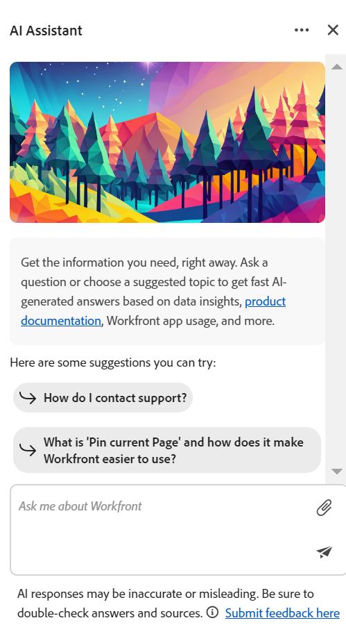

# Présentation de l’assistant IA Planification d’Adobe Workfront

<!--The highlighted information on this page refers to functionality not yet generally available. It is available only in the Preview environment for all customers. After the monthly releases to Production, the same features are also available in the Production environment for customers who enabled fast releases.    

For information about fast releases, see [Enable or disable fast releases for your organization](/help/quicksilver/administration-and-setup/set-up-workfront/configure-system-defaults/enable-fast-release-process.md).  -->

{{planning-important-intro}}

Vous pouvez utiliser l’assistant d’IA pour générer, mettre à jour ou supprimer des enregistrements en fonction du contexte de page et de la structure d’enregistrement actuels.

Les commandes de l’utilisateur et l’exécution par l’IA de ces commandes fonctionnent ensemble pour s’assurer que les modifications apportées par l’IA sont reflétées avec précision dans votre environnement.

## Conditions d’accès

+++ Développez pour afficher les exigences d’accès aux fonctionnalités de cet article. 

<table style="table-layout:auto"> 
<col> 
</col> 
<col> 
</col> 
<tbody> 
<tr> 
   <td role="rowheader">
Packages Adobe Workfront
</td> 
   <td> 

Tout package Workfront and Planning

Tout package Workflow et Planning

   </td> </tr>

</tr> 
  <tr> 
   <td role="rowheader">
Licence Adobe Workfront
</td> 
   <td>
Standard
 
  </td> 
  </tr> 
  <tr> 
   <td role="rowheader">
Autorisations d’objet
</td> 
   <td>   
Gérer des autorisations relatives à un espace de travail</a> 
  
   
L’administration système a accès à tous les espaces de travail, y compris ceux qu’elle n’a pas créés.
  </td> 
  </tr>  
</tbody> 
</table>

Pour plus d’informations sur les exigences d’accès à Workfront, voir [Exigences d’accès dans la documentation de Workfront](/help/quicksilver/administration-and-setup/add-users/access-levels-and-object-permissions/access-level-requirements-in-documentation.md).

+++

## Considérations relatives à l’assistant d’IA

* L’assistant AI doit être activé pour votre organisation avant d’être disponible pour les utilisateurs de votre entreprise. Pour plus d’informations, voir [&#x200B; Présentation de l’assistant AI &#x200B;](/help/quicksilver/workfront-basics/ai-assistant/ai-assistant-overview.md).
* Une fois que Workfront a activé l’assistant AI pour votre organisation, il est disponible pour l’administrateur Workfront principal. Pour plus d’informations, voir [Configurer les informations de base de votre système](/help/quicksilver/administration-and-setup/get-started-wf-administration/configure-basic-info.md).

* L’administrateur Workfront doit activer l’assistant AI pour tous les autres utilisateurs. Pour plus d’informations, voir [Activer ou désactiver l’assistant AI](/help/quicksilver/workfront-basics/ai-assistant/enable-or-disable-assistant.md).

* L’assistant d’IA fonctionne dans le contexte de chaque page. Les requêtes que vous envoyez pour l’assistant AI doivent faire référence à la fonctionnalité disponible dans la page que vous avez ouverte.

* Les actions effectuées par l’assistant AI dans la zone Planning s’inscrivent dans le cadre de vos autorisations Workfront Planning et de votre niveau d’accès Workfront. Pour plus d’informations, voir les articles suivants :

   * [Vue d’ensemble du partage d’autorisations dans Adobe Workfront Planning](/help/quicksilver/planning/access/sharing-permissions-overview.md)
   * [Vue d’ensemble du type de licence lors de l’utilisation d’Adobe Workfront Planning](/help/quicksilver/planning/access/license-type-overview.md)

* Les modifications apportées par l’assistant AI au nom de l’utilisateur sont suivies dans le panneau Historique de l’enregistrement.

* Les actions effectuées par l’assistant d’IA sont permanentes et peuvent être irréversibles. Par exemple, la suppression d’un champ est irréversible. Examinez toutes les actions proposées par l’assistant AI avant de les accepter.

* Lors de la création, de la mise à jour ou de la suppression d’un objet par le biais de l’assistant AI, celui-ci affiche les actions prévues et demande confirmation. Vous pouvez ensuite confirmer ou annuler les actions.

## Fonctionnalité actuellement disponible pour l’assistant d’IA

Actuellement, l’assistant AI est disponible dans la zone Planification de Workfront pour les pages suivantes :

* Page Workspace
* Page Type d’enregistrement
* Page Enregistrement

Vous pouvez utiliser l’assistant d’IA pour effectuer les actions suivantes à ce stade :

* Rechercher des enregistrements. Vous pouvez effectuer une recherche en fonction des informations contenues dans n’importe quel champ d’enregistrement.
* Créer des enregistrements. Un identifiant avec un lien vers le nouvel enregistrement s’affiche une fois l’enregistrement créé. Vous pouvez spécifier les champs que vous souhaitez mettre à jour pendant le processus de création, tels que les dates ou la description.
* Créez des enregistrements basés sur un document que vous téléchargez. Workfront prend en charge les formats de document suivants pour l’assistant AI :

  PPTX, PDF, DOCX, XLSX, PPT, DOC, TXT et la plupart des formats d’image
* Mettre à jour les champs des enregistrements affichés à l’écran
* Supprimer des enregistrements
* Restaurer les enregistrements que vous venez de supprimer

## Recherchez l’assistant AI dans Workfront Planning.

L’assistant d’IA se trouve dans les zones suivantes de Workfront Planning :

* La barre de navigation principale, dans le coin supérieur droit de l’écran.
* Dans la zone des détails d&#39;un enregistrement, après avoir ouvert l&#39;enregistrement dans l&#39;aperçu ou après avoir ouvert la page de l&#39;enregistrement.

## Accéder à l’assistant d’IA dans la zone Planification

1. Connectez-vous à Workfront, puis cliquez sur l’icône **Menu principal**  dans le coin supérieur droit de l’écran, ou sur l’icône **Menu principal**  dans le coin supérieur gauche, le cas échéant.

. Cliquez sur **Planification**. La zone Planification s’ouvre.

1. Cliquez sur une carte **espace de travail**.

1. (Facultatif) Cliquez sur une carte **type d’enregistrement**.

1. (Facultatif) Cliquez sur un **enregistrement** pour ouvrir la page **Détails** de l’enregistrement.

1. Cliquez sur l’icône **Assistant IA** dans le coin supérieur droit de l’écran dans la barre de navigation globale ou dans le coin supérieur droit de l’aperçu ou de la page de l’enregistrement.

   

1. Dans l’espace prévu à cet effet, commencez à saisir les commandes de l’assistant d’IA, puis cliquez sur Entrée lorsque vous avez terminé.

   

   Par exemple, vous pouvez saisir l’une des valeurs suivantes :

   * Créez une campagne dont la date de début est le 4 juillet et la date de fin le 30 juillet
   * Mettez à jour le champ Description de l’enregistrement Campagne d’été avec une date à déterminer
   * Supprimer le dernier enregistrement
   * Restaurer l’enregistrement

   Un indicateur visuel s’affiche pendant que l’assistant AI traite les commandes, définissant les attentes en matière de temps de réponse.

   Après avoir reçu une réponse réussie, suivez les liens fournis ou notez les modifications sur la gauche.

