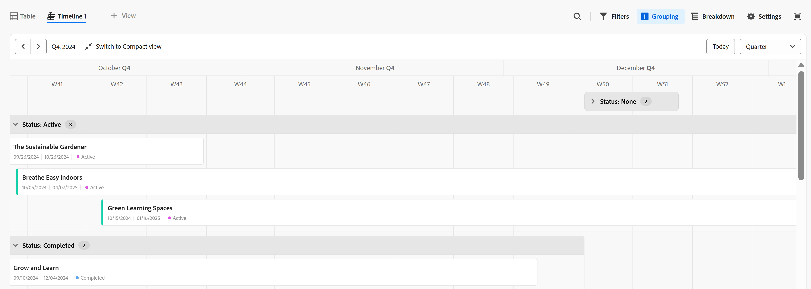

# Prise en main d’Adobe Workfront Planning

<!--this article is linked to the WF Planning landing page - do not change URL or move it; send the team a new URL after we add the redirects for this page-->

<!--do not use the snippet for IMPORTANT as it links to this article-->

<!--The highlighted information on this page refers to functionality not yet generally available. It is available only in the Preview environment for all customers. After the monthly releases to Production, the same features are also available in the Production environment for customers who enabled fast releases.    

For information about fast releases, see [Enable or disable fast releases for your organization](/help/quicksilver/administration-and-setup/set-up-workfront/configure-system-defaults/enable-fast-release-process.md).  -->

>[!IMPORTANT]
>
>Les informations de cet article font référence à Adobe Workfront Planning, une fonctionnalité supplémentaire d’Adobe Workfront.
>
>Pour obtenir la liste des conditions requises pour accéder à Workfront Planning, consultez [Présentation de l&#39;accès à Adobe Workfront Planning](/help/quicksilver/planning/access/access-overview.md).

Cet article contient des informations générales sur Workfront Planning.

Pour obtenir la liste complète des articles contenant de la documentation pour Workfront Planning, voir [Informations générales sur Adobe Workfront Planning](/help/quicksilver/planning/planning-information.md).

## Présentation d’Adobe Workfront Planning

Adobe Workfront Planning est une fonctionnalité supplémentaire proposée par Adobe Workfront. Workfront Planning a pour objectif d’offrir une visibilité complète sur les détails opérationnels d’une entreprise et de répondre aux questions métier critiques à chaque étape du cycle de vie de la gestion du travail.

Workfront Planning peut répondre à des questions telles que :

* Combien de campagnes réalisons-nous dans la zone EMEA au quatrième trimestre ?
* Des audiences se chevauchent-elles entre des campagnes simultanées ?
* Quelle est l’efficacité actuelle des programmes de sensibilisation ?
* À quoi ressemblent les ressources d’une campagne spécifique ? Lesquelles doivent encore être approuvées ?

Pour répondre à ces questions, les dirigeantes et dirigeants doivent pouvoir disposer d’une solution offrant une vision globale de chaque étape de travail, de la planification à l’exécution en passant par la livraison et la mesure des résultats. Actuellement, les entreprises disposent d’outils qui peuvent couvrir certaines parties du processus, mais nombre d’entre eux ne sont pas bien en connectés à toutes les phases du travail et ne peuvent pas fournir de résultats fiables.

Voici quelques-unes des principales fonctionnalités :

* Résolvez le problème de la gestion du travail à toutes les étapes et pour toutes les parties prenantes qui participent au processus de travail.
* Personnaliser entièrement vos workflows, depuis le choix des types d’objets (ou d’enregistrements) utilisés par votre entreprise jusqu’à la configuration de la façon dont ces objets sont liés les uns aux autres.
* Lier des types d’objets provenant d’autres systèmes, créant ainsi un cadre cohérent pour tous vos processus.

<!--
## Currently available Workfront Planning features
(*****for GA just make a list of what features ARE included in Planning and eliminate the last 2 columns; also update the title of this section*****)

(*****at GA: update the link below to the new place for release notes *****)

For information about new features and when they are released, see [Adobe Workfront Planning release activity for 2024](/help/quicksilver/planning/general/release-activity.md). 

The following features are currently available in Workfront Planning:

* Create workspaces             
* Create record types             
* Create record custom fields             
(************ * Import record types and fields using an Excel or CSV file*****)
          
* Display records in a table view            
* Display records in a timeline view            
* Display records in a calendar view            
* Filter, sort, and group records in a table view
* Filter, group, and color code records in the timeline view
* Filter records in the calendar view 
* Search for records in the table and timeline views             
* Connect records that belong to the same workspace  
* Connect records that belong to different workspaces   
* Connect Workfront Planning records to Workfront projects, programs, portfolios, companies, groups             
* Connect Workfront Planning records to Adobe Experience Manager assets          
    You must have an Adobe Experience Manager Assets license and an integration between AEM Assets and Workfront.
    For information, see [Adobe Workfront for Experience Manager Assets and Assets Essentials: article index](/help/quicksilver/documents/adobe-workfront-for-experience-manager-assets-essentials/workfront-for-aem-asset-essentials.md). 
* View record information in the Details tab
* View record connections in the Connections tab
* Customize the layout of a record's page             
* Share workspaces             
* Share views             
* Share views publicly with any external resource, even people who are not Workfront users         
* Duplicate views             
* Submit requests to create records            
* Export record details to Word and PDF.
* Add comments to records             
* Receive in-app notifications             
* Receive email notifications             
* Add thumbnails and cover pages to records             
* View the history of changes on a record             
* Rich Text formatting for Paragraph fields             
* Access Planning records from Workfront objects             
* Connect and disconnect Planning records from Workfront objects 
* Create Planning records by submitting a request form            
* Workfront Planning public API             
* Adobe Workfront Planning modules for Adobe Workfront Fusion             
* Workfront Planning AI Assistant
* Reporting on Workfront Planning information
    You can report on Planning information using the Canvas Dashboard. For information, see [Canvas Dashboards overview](/help/quicksilver/reports-and-dashboards/canvas-dashboards/canvas-dashboards-overview.md). 

-->

<!--OLD: 

|       Feature                                      |     Available now  |     Coming soon   |     In research  |
|----------------------------------------------------|:-----------------------------:|:--------------------------------:|:----------------:|
|     Create workspaces                              |   ✓                           |                                  |                  |
|     Create record types                |   ✓                           |                                  |                  |
|     Create record custom fields                    |   ✓                           |                                  |                  |
|     Import record types and fields using an Excel  or CSV file                              |                              |           ✓                       |                  |
|     Link records                                   |   ✓                           |                                  |                  |
|     View records in a table                        |   ✓                           |                                  |                  |
|     View records in a timeline                     |   ✓                           |                                  |                  |
|     View records in a calendar                     |   ✓                           |                                  |                  |
|     Filter records                                 |   ✓                           |                                  |                  |
|     Group records in the timeline view             |   ✓                           |                                  |                  |
|     Group records in the table view                | ✓                              |                                 |                  |
|     Sort records in the table view                                 |  ✓                             |                                 |                  |
|     Sort records in the timeline view                                 |                               |   ✓                              |                  |
|     Sort groupings in the table view                                 |                               |   ✓                              |                  |
|     Sort groupings in the timeline view                                 |                               |   ✓                              |                  |
|   Search for records in the table view    | ✓    |   |
|   Search for records in the timeline view    | ✓    |   |
|     Connect Workfront Planning records to Workfront projects, programs, portfolios, companies, groups  |   ✓                            |                                 |                  |
|     Connect Workfront Planning records to Adobe Experience Manager assets                                  |      ✓                         |                                  |                 |
|     Connect Planning records from different workspaces                                  |      ✓                         |                                  |                 |
|     Record page with detailed information                            |   ✓                           |                                  |                  |
|     Update the layout of the record's page              |    ✓                           |                                 |                  |
|  Share workspaces | ✓| |  |
|  Share views |✓ | |  |
|  Share views publicly with external resources |✓ | |  |
|  Duplicate views |✓ | |  |
|     Submit requests                                |                               |          ✓                        |                 |
|     Export record details to Word                                 |    ✓                           |                                  |                 |
|     Export record details to PDF                                 |                               |                                  |       ✓          |
|     Customize the color and icon of a record                                 |      ✓                         |                                  |                 |
|     Add comments to records                                 | ✓                              |                                  |                 |
|     Receive in-app notifications                                 | ✓                              |                                  |                 |
|     Receive email notifications                                 | ✓                              |                                  |                 |
|     Add thumbnails to records                                 | ✓                              |                                  |                 |
|     View history of changes on a record                                 | ✓                              |                                  |                 |
|     Rich Text formatting for Paragraph fields                                 |      ✓                         |                                  |                 |
|     Adobe Workfront Planning modules for Adobe Workfront Fusion                                 |      ✓                         |                                  |                 |
|     Copy and paste information from one field to another                                  |      ✓                         |                                  |                 |
|     Access Planning records from Workfront objects                                  |      ✓                         |                                  |                 |
|     Connect Planning records from Workfront objects                                  |      ✓                         |                                  |                 |
|     Workfront Planning public API                                 |      ✓                         |                                  |                 |
|     Workfront Planning AI Assistant*                                 |      ✓                         |                                  |                 |
|     Reporting on Workfront Planning information (Canvas Dashboard)                              |                               |       ✓                           |                 |
-->

## Activez Workfront Planning pour les utilisateurs de votre instance Workfront.

Une fois que votre entreprise a acheté un package Workfront Planning, en tant qu’administrateur Workfront, vous devez vous assurer que les éléments suivants sont en place avant que les utilisateurs puissent accéder à Workfront Planning :

* Affectez aux utilisateurs suivants un modèle de mise en page qui inclut Planning dans le menu principal :

   * Attribuez le modèle de mise en page aux utilisateurs Light et Contribute.

     Planning est activé par défaut pour les utilisateurs standard et les administrateurs système.

  Pour plus d&#39;informations, voir [Personnaliser le menu principal à l&#39;aide d&#39;un modèle de mise en page](/help/quicksilver/administration-and-setup/customize-workfront/use-layout-templates/customize-main-menu.md) et [Affecter des utilisateurs à un modèle de mise en page](/help/quicksilver/administration-and-setup/customize-workfront/use-layout-templates/assign-users-to-layout-template.md).

* Attribuez aux utilisateurs une licence Workfront et des autorisations Workfront Planning qui leur permettront d&#39;afficher ou de créer des objets dans Workfront Planning. Pour plus d’informations sur l’octroi de l’accès à et l’autorisation d’autres utilisateurs à utiliser Workfront Planning, voir [Présentation de l’accès à Adobe Workfront Planning](/help/quicksilver/planning/access/access-overview.md).

## Terminologie de Workfront Planning

Bien que Workfront Planning fasse partie de Workfront, il s’accompagne de concepts et de terminologie propres. Assurez-vous d’être familiarisé avec ces concepts avant de vous lancer dans la configuration de la planification Workfront pour votre organisation.

Le cadre de Workfront Planning est entièrement personnalisable. Vous pouvez créer tous les types d’enregistrements, leurs attributs et tous les champs qui leur sont associés en fonction des besoins exacts de votre organisation.

Le nombre d’objets Workfront Planning que vous pouvez créer est limité. Pour plus d&#39;informations, voir Présentation des limites d&#39;objet d&#39;Adobe Workfront Planning .

Vous trouverez ci-dessous les principaux objets et concepts Workfront Planning :

* **Espace de travail** : collection de types d’enregistrements qui définissent le cycle de vie opérationnel d’une certaine organisation. Un espace de travail est le cadre de travail d’une entité organisationnelle.

  

  Pour plus d’informations, voir la section [Créer des espaces de travail](/help/quicksilver/planning/architecture/create-workspaces.md).

* **Type d’enregistrement** : nom des types d’objet dans Workfront Planning.

  Les types d’enregistrements renseignent les espaces de travail.

  Contrairement à Workfront, où les types d’objets sont prédéfinis, dans Workfront Planning, vous pouvez créer vos propres types d’objets.

  Par exemple, dans Workfront, les types d’objets Programme, Portfolio, Projet, Tâche ou Problème sont déjà créés.

  Dans Workfront Planning, vous pouvez créer tous les types d’enregistrements qui correspondent aux workflows de votre organisation. Vous pouvez ensuite définir la manière dont les types d’enregistrements sont associés les uns aux autres ou aux dépendances des formulaires.

  Pour plus d’informations, voir [Présentation des types d’enregistrements](/help/quicksilver/planning/architecture/overview-of-record-types.md).

* **Enregistrement** : instance d’un type d’enregistrement.

  

  Une fois qu’un type d’enregistrement a été ajouté à un espace de travail, vous pouvez commencer à ajouter des enregistrements de ce type sur la page du type d’enregistrement.

  Par exemple, « Campagne » peut être un type d’enregistrement et « Campagne d’été pour la zone EMEA » est un enregistrement du type d’enregistrement Campagne .

  Pour plus d’informations, voir la section [Créer des enregistrements](/help/quicksilver/planning/records/create-records.md).

* **Modèle d’espace de travail** : vous pouvez créer un espace de travail à l’aide de modèles prédéfinis. Vous pouvez utiliser les types d’enregistrements et les champs prédéfinis qui se trouvent dans un modèle, ou bien ajouter les vôtres.

  

  Adobe Workfront Planning contient les modèles suivants :

   * De base : Marketing Management
   * Avancé : Marketing Management
   * Entreprise : Marketing Management
   * Gestion des ventes
   * Gestion des produits

  Pour plus d’informations, voir [Liste des modèles d’espace de travail](/help/quicksilver/planning/architecture/workspace-templates.md).

* **Champs** : les champs sont des attributs que vous pouvez ajouter aux types d’enregistrements. Les champs contiennent des informations sur le type d’enregistrement. <!--check the shot below, "Connection" needs to be in lowercase-->

  

  Considérations relatives aux champs d’enregistrement :

   * Les champs que vous ajoutez pour un type d’enregistrement deviennent automatiquement associés à tous les enregistrements de ce type et peuvent être utilisés pour capturer des données sur ces enregistrements.

   * Les champs s’affichent sous forme de colonnes dans la vue Tableau appliquée à une page de type enregistrement. Elles s’affichent également dans la page de l’enregistrement.

   * Les champs sont propres à un type d’enregistrement et ne sont pas transférés d’un type d’enregistrement à un autre.

   * Les champs sont entièrement personnalisables et ne sont accessibles que dans Workfront Planning. Vous ne pouvez pas accéder aux champs Workfront Planning à partir de Workfront.

  Pour plus d’informations, voir [Créer des champs](/help/quicksilver/planning/fields/create-fields.md).

  Par défaut, un nouveau type d’enregistrement est associé aux champs prédéfinis suivants :

   * Nom
   * Description
   * Date de début
   * Date de fin
   * Statut

  Vous pouvez créer des champs personnalisés des types suivants :

   * Texte à une ligne
   * Paragraphe
   * Sélection multiple
   * Sélection unique
   * Date
   * Nombre
   * Pourcentage
   * Devise
   * Case à cocher
   * Formule
   * Personnes
   * Créé par
   * Date de création
   * Dernière modification par
   * Date de dernière modification

* **Types d’enregistrements connectés**, **Enregistrements connectés** et **Champs connectés** : dans Workfront Planning, vous pouvez établir une connexion entre les entités suivantes :

   * Deux types d’enregistrements Workfront Planning.
   * Un type d’enregistrement et un type d’objet de projet, de programme, de portfolio, d’entreprise ou de groupe Workfront.
   * Un type d’enregistrement et une ressource ou un dossier Adobe Experience Manager.

     Vous devez disposer d’une licence Adobe Experience Manager pour connecter des types d’enregistrements à des objets Experience Manager.

     

   * Un type d’enregistrement et une marque Adobe GenStudio for Performance Marketing.

     Vous devez disposer d’une licence Adobe GenStudio for Performance Marketing pour connecter les types d’enregistrements aux marques GenStudio.

     

  Après avoir établi une connexion entre les types d&#39;enregistrements, vous pouvez connecter des enregistrements individuels ou des objets de ces types les uns aux autres. La connexion entre les enregistrements s’affiche sous la forme d’un champ d’enregistrement connecté ou d’une connexion.

  La connexion de types d’enregistrements s’avère utile lorsque plusieurs types d’objets de travail se touchent. Par exemple, vous pouvez utiliser des campagnes, chacune d’elles pouvant correspondre à plusieurs marques. Pour indiquer cette relation, vous pouvez connecter des campagnes à des marques. De plus, le travail de chaque campagne peut être planifié dans plusieurs projets dans Workfront. Pour indiquer cela, vous pouvez connecter les campagnes aux projets appropriés. La connexion de types d’enregistrements et, par la suite, de différents enregistrements permet d’établir cette relation dans Workfront Planning.

* **Champs de recherche** (ou champs liés) : après avoir établi la connexion entre deux types d’enregistrements et connecté des enregistrements individuels, vous pouvez référencer les champs des enregistrements connectés à partir de l’enregistrement à partir duquel vous vous connectez.

  Par exemple, si vous connectez un type d’enregistrement Campaign à un type d’objet Projet Workfront, vous pouvez afficher le champ Budget des projets connectés sur les enregistrements Campaign.

  

  >[!TIP]
  >
  > Vous ne pouvez pas ajouter les types de champ suivants en tant que champs de recherche à partir des types d’objet ou d’enregistrement connectés :
  >
  >* Personnes
  >* Créé par
  >* Dernière modification par
  >* Champs de saisie semi-automatique Workfront (y compris les champs tels que le propriétaire ou le sponsor du projet)

  Pour plus d’informations sur la connexion des types d’enregistrements et la création de champs liés, consultez les articles suivants :

   * [Connecter les types d’enregistrements](/help/quicksilver/planning/architecture/connect-record-types.md)
   * [Connect records](/help/quicksilver/planning/records/connect-records.md)

<!--not yet:* Fields are reusable across Record Types.  -->

* **Vues** : les enregistrements s’affichent sous leur page de type d’enregistrement respective dans différents types de vues.

  

  Les vues contiennent des paramètres personnalisés d’un type d’affichage spécifique, tels que la liste des champs (colonnes), une liste d’enregistrements (lignes), leur ordre (tri), un filtre appliqué ou applicable et un regroupement.

  Les types de vue suivants peuvent être appliqués à la page des types d’enregistrement :

   * **Vue Tableau** : affiche les enregistrements et leurs champs, y compris les champs connectés et de recherche, sous la forme d’un tableau. Les lignes du tableau sont les enregistrements individuels et les colonnes sont les champs de l’enregistrement. La vue Tableau est la vue par défaut.

     

   * **Vue Chronologie** : affiche les enregistrements qui comportent au moins deux champs de type Date dans une chronologie. Vous pouvez afficher jusqu’à 5 types d’enregistrements connectés et leurs enregistrements dans la vue chronologique.

     

   * **Vue Calendrier** : affiche les enregistrements comportant au moins deux champs de type Date au format d’un calendrier.
     

Pour plus d’informations, consultez la section [Gérer les vues des enregistrements](/help/quicksilver/planning/views/manage-record-views.md).

## Localiser Adobe Workfront Planning

Pour localiser Adobe Planning, assurez-vous que votre organisation a eu accès à Workfront Planning et que votre administrateur système ou de groupe a ajouté la zone Planning à votre menu principal. Pour plus d’informations, consultez [Présentation de l’accès à Adobe Planning](/help/quicksilver/planning/access/access-overview.md).

Pour localiser Workfront Planning :

1. Connectez-vous à Workfront.

{{step1-click-main-menu}}

1. Cliquez sur **Planning** .

   La page principale Planification de Workfront s’ouvre.

   

   >[!TIP]
   >
   >    Votre administrateur Workfront peut ajouter la zone Planification à l’option Sélectionner une page de destination de votre modèle de mise en page. Vous pouvez ainsi ouvrir Planning dès que vous vous connectez à Workfront. Pour plus d’informations, voir [Personnaliser la page de destination à l’aide d’un modèle de mise en page](/help/quicksilver/administration-and-setup/customize-workfront/use-layout-templates/customize-landing-page.md).

1. (Conditionnel et facultatif) Si vous êtes un administrateur Workfront, cliquez sur l’un des onglets suivants :
   * **Espaces de travail sur lesquels je me trouve** : affiche les espaces de travail que vous avez créés ou les espaces de travail partagés avec vous.
   * **Autres espaces de travail** : affiche tous les autres espaces de travail du système.

   Pour tous les autres utilisateurs, les espaces de travail qu’ils ont créés ou qui sont partagés avec eux s’affichent dans la zone **Espaces de travail**.

1. (Facultatif et recommandé) Passez à certaines des actions suivantes pour créer votre structure de travail :

   1. Créez entièrement un espace de travail ou à l’aide d’un modèle. Pour plus d’informations, voir [Créer des espaces de travail](/help/quicksilver/planning/architecture/create-workspaces.md).

   1. Ajoutez des sections au nouvel espace de travail. Pour plus d’informations, voir [Modifier les espaces de travail](/help/quicksilver/planning/architecture/edit-workspaces.md).
   1. Renommez les sections existantes dans le nouvel espace de travail.
   1. Ajoutez des types d’enregistrements au nouvel espace de travail. Pour plus d’informations, consultez la section [Créer des types d’enregistrement](/help/quicksilver/planning/architecture/create-record-types.md).

   1. Cliquez sur le nom d’un type d’enregistrement pour ouvrir la page du type d’enregistrement. Par défaut, la page du type enregistrement s’ouvre dans la vue Tableau.

      Vous pouvez également créer une vue Chronologie ou Calendrier. Pour plus d’informations, consultez la section [Gérer les vues d’enregistrement](/help/quicksilver/planning/views/manage-record-views.md).

   1. En mode Tableau, commencez à ajouter des enregistrements en ajoutant des lignes.

      Ou

      Commencez à ajouter des champs d’enregistrement en ajoutant des colonnes.

      Pour plus d’informations, voir les articles suivants :

      * [Créer des enregistrements](/help/quicksilver/planning/records/create-records.md)
      * [Créer des champs](/help/quicksilver/planning/fields/create-fields.md).

## Activité de publication de Workfront Planning

<!--update this with the new release activity page - the article index for all Planning releases-->

Nous publions régulièrement de nouvelles fonctionnalités dans Workfront Planning.

Pour obtenir une liste à jour des fonctionnalités publiées, voir [Activité de version d’Adobe Workfront Planning : index d’article](/help/quicksilver/product-announcements/product-releases/planning-release-activity/planning-release-activity-article-index.md).

## Ressources supplémentaires pour Workfront Planning

* [Informations générales sur Adobe Workfront Planning](/help/quicksilver/planning/planning-information.md) : index de tous les articles contenant de la documentation sur Workfront Planning, regroupés par domaine ciblé.
* [Aperçu de l&#39;assistant IA Planning d&#39;Adobe Workfront ](/help/quicksilver/planning/general/planning-ai-assistant-overview.md) : avec l&#39;assistant AI Workfront pour Planning, vous pouvez rechercher des enregistrements ou créer, mettre à jour et supprimer des enregistrements à l&#39;aide de commandes et laisser l&#39;assistant faire le travail à votre place.

  <!--
    >[!NOTE]
    >
    >    The Workfront AI Assistant has been temporarily removed and it will be available at a later date.-->

* [Modules Adobe Workfront Planning pour Workfront Fusion ](https://experienceleague.adobe.com/en/docs/workfront-fusion/using/references/apps-and-their-modules/adobe-connectors/workfront-planning-modules) : grâce aux modules Adobe Workfront Planning, vous pouvez déclencher un scénario lorsque des événements se produisent dans Workfront Planning. Vous pouvez également créer, lire, mettre à jour et supprimer des enregistrements ou effectuer un appel API personnalisé vers votre compte Adobe Workfront Planning.

* [Principes de base de l’API Adobe Workfront Planning ](/help/quicksilver/planning/general/planning-api-basics.md) : l’objectif de l’API Adobe Workfront Planning est de simplifier la création d’intégrations avec Planning en introduisant une architecture REST-ful qui fonctionne via HTTP.

* [Prise en main de l’intégration d’Adobe Workfront Planning et d’Adobe GenStudio for Performance Marketing](/help/quicksilver/planning/planning-and-genstudio-integration/get-started-with-workfront-planning-and-genstudio-integration.md) : vous pouvez gérer les enregistrements de GenStudio for Performance Marketing dans l’espace de travail GenStudio de Workfront Planning.

* **Fonctionnalités de création de rapports de Workfront Planning** : vous pouvez désormais afficher les informations de Workfront Planning dans un rapport de Workfront à l’aide du tableau de bord de la zone de travail de Workfront. Pour plus d’informations, voir [ Présentation des tableaux de bord de la zone de travail ](/help/quicksilver/reports-and-dashboards/canvas-dashboards/canvas-dashboards-overview.md).

