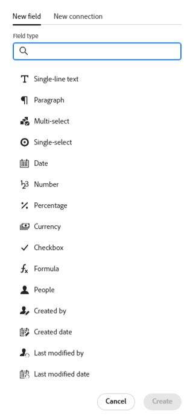

# Vue d’ensemble d’Adobe Workfront Planning

<!--this article is linked to the WF Planning landing page - do not change URL or move it; send the team a new URL after we add the redirects for this page-->

<!--do not use the snippet for IMPORTANT as it links to this article-->

<!--The highlighted information on this page refers to functionality not yet generally available. It is available only in the Preview environment for all customers, or in the Production environment for customers who enabled fast releases.

For information about fast releases, see [Enable or disable fast releases for your organization](/help/quicksilver/administration-and-setup/set-up-workfront/configure-system-defaults/enable-fast-release-process.md).

For information about the current release, see [Fourth Quarter 2023 release overview](/help/quicksilver/product-announcements/product-releases/23-q4-release-activity/23-q4-release-overview.md).-->

>[!IMPORTANT]
>
>Les informations de cet article font référence à la planification Adobe Workfront, une fonctionnalité supplémentaire d’Adobe Workfront.
>
>Pour accéder à Workfront Planning, vous devez disposer des éléments suivants :
>
>* Un nouveau forfait et une nouvelle licence Workfront. Workfront Planning n’est pas disponible pour les licences ou les forfaits Workfront hérités.
>* Une licence supplémentaire pour la planification Workfront.
>* L’instance Workfront de votre entreprise doit être intégrée à l’expérience unifiée Adobe.
>
> Pour obtenir la liste complète des exigences d’accès à Workfront Planning, consultez la [présentation de l’accès à Adobe Planning](/help/quicksilver/planning/access/access-overview.md).
> 

Cet article contient des informations générales sur la planification Workfront.

Pour obtenir la liste complète des articles qui contiennent de la documentation pour la planification Workfront, voir [Adobe Workfront Planning : article index](/help/quicksilver/planning/planning-information.md).

## Présentation d’Adobe Workfront Planning

La planification Adobe Workfront est une fonctionnalité supplémentaire d’Adobe Workfront. Workfront Planning a pour objectif d’offrir une visibilité complète sur les détails opérationnels d’une entreprise et de répondre aux questions métier critiques à chaque étape du cycle de vie de la gestion du travail.

Workfront Planning peut répondre à des questions telles que :

* Combien de campagnes réalisons-nous dans la zone EMEA au quatrième trimestre ?
* Des audiences se chevauchent-elles entre des campagnes simultanées ?
* Quelle est l’efficacité actuelle des programmes de sensibilisation ?
* À quoi ressemblent les ressources d’une campagne spécifique ? Lesquelles doivent encore être approuvées ?

Pour répondre à ces questions, les dirigeantes et dirigeants doivent pouvoir disposer d’une solution offrant une vision globale de chaque étape de travail, de la planification à l’exécution en passant par la livraison et la mesure des résultats. Actuellement, les entreprises disposent d’outils qui peuvent couvrir certaines parties du processus, mais nombre d’entre eux ne sont pas bien en connectés à toutes les phases du travail et ne peuvent pas fournir de résultats fiables.

Voici quelques-unes des principales fonctionnalités :

* Résolvez le problème de la gestion du travail à toutes les étapes et pour toutes les parties prenantes qui participent au processus de travail.
* Personnaliser entièrement vos workflows, depuis le choix des types d’objets (ou d’enregistrements) utilisés par votre entreprise jusqu’à la configuration de la façon dont ces objets sont liés les uns aux autres.
* Lier des types d’objets provenant d’autres systèmes, créant ainsi un cadre cohérent pour tous vos processus.

## Fonctionnalités de planification Workfront actuellement disponibles

<!--for GA just make a list of what features ARE included in Planning and eliminate the last 2 columns; also update the title of this section-->

<!--at GA: update the link below to the new place for release notes-->

Pour plus d’informations sur les nouvelles fonctionnalités et leur date de publication, voir [Activité de mise à jour de la planification Adobe Workfront pour 2024](/help/quicksilver/planning/general/release-activity.md).

Les fonctionnalités suivantes sont actuellement disponibles dans la planification Workfront :

* Créer des espaces de travail
* Créer des types d’enregistrement
* Créer des champs personnalisés d’enregistrement\
  <!--* Import record types and fields using an Excel or CSV file-->

* Affichage des enregistrements dans une vue de tableau
* Affichage des enregistrements dans une vue chronologique
* Affichage des enregistrements dans une vue Calendrier
* Filtrage, tri et groupement d’enregistrements dans une vue de tableau
* Filtrage, groupe et code couleur des enregistrements dans la vue de chronologie
* Filtrage des enregistrements dans la vue Calendrier
* Recherche d’enregistrements dans les vues de tableau et de chronologie
* Connexion d’enregistrements appartenant au même espace de travail
* Connexion d’enregistrements appartenant à différents espaces de travail
* Connecter les enregistrements Workfront Planning aux projets, programmes, portfolios, entreprises et groupes Workfront
* Connecter les enregistrements Workfront Planning aux ressources Adobe Experience Manager\
  Vous devez disposer d’une licence Adobe Experience Manager Assets et d’une intégration entre AEM Assets et Workfront.
Pour plus d’informations, voir [Adobe Workfront for Experience Manager Assets and Assets Essentials : article index](/help/quicksilver/documents/adobe-workfront-for-experience-manager-assets-essentials/workfront-for-aem-asset-essentials.md).
* Afficher les informations d’enregistrement dans l’onglet Détails
* Afficher les connexions d’enregistrement dans l’onglet Connexions
* Personnalisation de la mise en page d’une page d’enregistrement
* Partager des espaces de travail
* Partager des affichages
* Partager publiquement les vues avec toute ressource externe, même les personnes qui ne sont pas des utilisateurs de Workfront
* Dupliquer les vues
* Envoi de requêtes pour créer des enregistrements
* Exportez les détails de l’enregistrement dans Word et PDF.
* Ajouter des commentaires aux enregistrements
* Réception de notifications in-app
* Recevoir des notifications par e-mail
* Ajout de miniatures et de pages de garde aux enregistrements
* Afficher l’historique des modifications sur un enregistrement
* Formatage de texte enrichi pour les champs de paragraphe
* Accès aux enregistrements de planification à partir d’objets Workfront
* Connexion d’enregistrements de planification à partir d’objets Workfront
* Créer des enregistrements de planification en envoyant un formulaire de demande
* API publique de planification Workfront
* Modules Adobe Workfront Planning pour Adobe Workfront Fusion
* Assistant de planification Workfront
* Reporting sur les informations de la planification Workfront
Vous pouvez générer des rapports sur les informations de planification à l’aide du tableau de bord de la zone de travail. Pour plus d’informations, voir [Présentation des tableaux de bord de canevas](/help/quicksilver/reports-and-dashboards/canvas-dashboards/canvas-dashboards-overview.md).

<!--OLD: 

|       Feature                                      |     Available now  |     Coming soon   |     In research  |
|----------------------------------------------------|:-----------------------------:|:--------------------------------:|:----------------:|
|     Create workspaces                              |   ✓                           |                                  |                  |
|     Create record types                |   ✓                           |                                  |                  |
|     Create record custom fields                    |   ✓                           |                                  |                  |
|     Import record types and fields using an Excel  or CSV file                              |                              |           ✓                       |                  |
|     Link records                                   |   ✓                           |                                  |                  |
|     View records in a table                        |   ✓                           |                                  |                  |
|     View records in a timeline                     |   ✓                           |                                  |                  |
|     View records in a calendar                     |   ✓                           |                                  |                  |
|     Filter records                                 |   ✓                           |                                  |                  |
|     Group records in the timeline view             |   ✓                           |                                  |                  |
|     Group records in the table view                | ✓                              |                                 |                  |
|     Sort records in the table view                                 |  ✓                             |                                 |                  |
|     Sort records in the timeline view                                 |                               |   ✓                              |                  |
|     Sort groupings in the table view                                 |                               |   ✓                              |                  |
|     Sort groupings in the timeline view                                 |                               |   ✓                              |                  |
|   Search for records in the table view    | ✓    |   |
|   Search for records in the timeline view    | ✓    |   |
|     Connect Workfront Planning records to Workfront projects, programs, portfolios, companies, groups  |   ✓                            |                                 |                  |
|     Connect Workfront Planning records to Adobe Experience Manager assets                                  |      ✓                         |                                  |                 |
|     Connect Planning records from different workspaces                                  |      ✓                         |                                  |                 | 
|     Record page with detailed information                            |   ✓                           |                                  |                  |
|     Update the layout of the record's page              |    ✓                           |                                 |                  |
|  Share workspaces | ✓| |  |
|  Share views |✓ | |  |
|  Share views publicly with external resources |✓ | |  |
|  Duplicate views |✓ | |  |
|     Submit requests                                |                               |          ✓                        |                 |
|     Export record details to Word                                 |    ✓                           |                                  |                 |
|     Export record details to PDF                                 |                               |                                  |       ✓          |
|     Customize the color and icon of a record                                 |      ✓                         |                                  |                 |
|     Add comments to records                                 | ✓                              |                                  |                 |
|     Receive in-app notifications                                 | ✓                              |                                  |                 |
|     Receive email notifications                                 | ✓                              |                                  |                 |
|     Add thumbnails to records                                 | ✓                              |                                  |                 |
|     View history of changes on a record                                 | ✓                              |                                  |                 |
|     Rich Text formatting for Paragraph fields                                 |      ✓                         |                                  |                 | 
|     Adobe Workfront Planning modules for Adobe Workfront Fusion                                 |      ✓                         |                                  |                 | 
|     Copy and paste information from one field to another                                  |      ✓                         |                                  |                 | 
|     Access Planning records from Workfront objects                                  |      ✓                         |                                  |                 |
|     Connect Planning records from Workfront objects                                  |      ✓                         |                                  |                 |
|     Workfront Planning public API                                 |      ✓                         |                                  |                 |
|     Workfront Planning AI Assistant*                                 |      ✓                         |                                  |                 |
|     Reporting on Workfront Planning information (Canvas Dashboard)                              |                               |       ✓                           |                 |
-->

## Activation de la planification Workfront pour les utilisateurs de votre instance Workfront

Une fois que votre entreprise a acheté une licence pour Workfront Planning, en tant qu’administrateur Workfront, vous devez vous assurer que les éléments suivants sont en place avant que les utilisateurs puissent accéder à Workfront Planning :

* Affectez aux utilisateurs qui doivent accéder à l’option Planification d’un modèle de mise en page qui inclut la planification dans le menu principal. Pour plus d’informations, voir [Personnaliser le menu principal à l’aide d’un modèle de mise en page](/help/quicksilver/administration-and-setup/customize-workfront/use-layout-templates/customize-main-menu.md) et [Affecter des utilisateurs à un modèle de mise en page](/help/quicksilver/administration-and-setup/customize-workfront/use-layout-templates/assign-users-to-layout-template.md).

* Attribuez aux utilisateurs une licence Workfront et des autorisations de planification Workfront qui vous permettraient d’afficher 554 ou de créer des objets dans Workfront Planning. Pour plus d’informations sur l’octroi de l’accès à et la possibilité pour d’autres utilisateurs d’utiliser Workfront Planning, consultez la [présentation de l’accès à Adobe Planning](/help/quicksilver/planning/access/access-overview.md).

## Terminologie de la planification Workfront

Bien que Workfront Planning fasse partie de Workfront, il s’accompagne de concepts et de terminologie propres. Assurez-vous de connaître les nouveaux concepts avant de commencer à configurer Workfront Planning pour votre organisation.

Le cadre de Workfront Planning est entièrement personnalisable. Vous pouvez créer tous les types d’enregistrements, leurs attributs et tous les champs qui leur sont associés en fonction des besoins exacts de votre organisation.

Le nombre d’objets de planification Workfront que vous pouvez créer est limité. Pour plus d’informations, reportez-vous à la section [Présentation des limitations d’objets de la planification Adobe Workfront](/help/quicksilver/planning/general/limitations-overview.md).

Vous trouverez ci-dessous les principaux objets et concepts Workfront Planning :

* **Espace de travail** : collection de types d’enregistrements qui définissent le cycle de vie opérationnel d’une certaine organisation. Un espace de travail est le cadre de travail d’une entité organisationnelle.

  

  Pour plus d’informations, voir la section [Créer des espaces de travail](/help/quicksilver/planning/architecture/create-workspaces.md).

* **Type d’enregistrement** : nom des types d’objets dans Workfront Planning.

  Contrairement à Workfront, où les types d’objets sont prédéfinis, dans Workfront Planning, vous pouvez créer vos propres types d’objets.

  Par exemple, dans Workfront, les types d’objets Programme, Portfolio, Projet, Tâche ou Problème sont déjà créés.

  Dans Workfront Planning, vous pouvez créer tous les types d’enregistrements qui correspondent aux workflows de votre organisation. Vous pouvez ensuite définir la manière dont les types d’enregistrements sont associés les uns aux autres ou aux dépendances des formulaires.

  Pour plus d’informations, voir [Présentation des types d’enregistrements](/help/quicksilver/planning/architecture/overview-of-record-types.md).

* **Enregistrement** : instance d’un type d’enregistrement.

  

  Après avoir ajouté un type d’enregistrement à un espace de travail, vous pouvez commencer à ajouter des enregistrements de ce type sur la page du type d’enregistrement.

  Par exemple, &quot;Campagne&quot; peut être un type d’enregistrement et &quot;Campagne d’été pour la région EMEA&quot; un enregistrement du type d’enregistrement Campaign.

  Pour plus d’informations, voir la section [Créer des enregistrements](/help/quicksilver/planning/records/create-records.md).

* **Modèle d’espace de travail** : vous pouvez créer un espace de travail à l’aide de modèles prédéfinis. Vous pouvez utiliser les types d’enregistrements et les champs prédéfinis qui se trouvent dans un modèle, ou bien ajouter les vôtres.

  

  Adobe Workfront Planning contient les modèles suivants :

   * De base : gestion marketing
   * Avancé : Gestion marketing
   * Entreprise : gestion marketing
   * Gestion des ventes
   * Gestion des produits

  Pour plus d’informations, voir [Liste des modèles d’espace de travail](/help/quicksilver/planning/architecture/workspace-templates.md).

* **Champs** : les champs sont des attributs que vous pouvez ajouter aux types d’enregistrements. Les champs contiennent des informations sur le type d’enregistrement. <!--check the shot below, "Connection" needs to be in lowercase-->

  

  Considérations relatives aux champs d’enregistrement :

   * Les champs que vous ajoutez pour un type d’enregistrement deviennent automatiquement associés à tous les enregistrements de ce type et peuvent être utilisés pour capturer des données sur ces enregistrements.

   * Les champs s’affichent sous forme de colonnes dans la vue Tableau appliquée à une page de type enregistrement. Elles s’affichent également dans la page de l’enregistrement.

   * Les champs sont propres à un type d’enregistrement et ne sont pas transférés d’un type d’enregistrement à un autre.

   * Les champs sont entièrement personnalisables et ne sont accessibles que dans Workfront Planning. Vous ne pouvez pas accéder aux champs Workfront Planning à partir de Workfront.

  Pour plus d’informations, voir [Créer des champs](/help/quicksilver/planning/fields/create-fields.md).

  Par défaut, un nouveau type d’enregistrement est associé aux champs prédéfinis suivants :

   * Nom
   * Description
   * Date de début
   * Date de fin
   * Statut

  Vous pouvez créer des champs personnalisés des types suivants :

   * Texte à une ligne
   * Paragraphe
   * Sélection multiple
   * Sélection unique
   * Date
   * Nombre
   * Pourcentage
   * Devise
   * Case à cocher
   * Formule
   * Personnes
   * Créé par
   * Date de création
   * Dernière modification par
   * Date de dernière modification

* **Types d’enregistrements connectés**, **Enregistrements connectés** et **Champs connectés** : vous pouvez créer une connexion entre les entités suivantes dans la planification Workfront :

   * Deux types d’enregistrement de la planification Workfront.
   * Un type d’enregistrement et un type d’objet de projet, de programme, de portfolio, d’entreprise ou de groupe Workfront.
   * Un type d’enregistrement et une ressource ou un dossier Adobe Experience Manager.

     Vous devez disposer d’une licence Adobe Experience Manager pour lier les types d’enregistrement aux objets Experience Manager.

     

  Une fois que vous avez établi une connexion entre les types d’enregistrements, vous pouvez connecter les enregistrements individuels de ces types les uns aux autres. La connexion entre les enregistrements s’affiche sous la forme d’un champ d’enregistrement lié.

* **Champs liés** (ou champs de recherche) : après avoir établi la connexion entre deux types d’enregistrement et lier des enregistrements individuels les uns aux autres, vous pouvez référencer les champs des enregistrements liés sur l’enregistrement à partir duquel vous vous connectez.

  Par exemple, si vous connectez un type d’enregistrement Campaign à un type d’objet Projet Workfront , vous pouvez afficher le champ Budget des projets connectés dans les enregistrements de campagne.

  

  >[!TIP]
  >
  > Vous ne pouvez pas ajouter les types de champ suivants en tant que champs de recherche à partir de l’enregistrement ou des types d’objet connectés :
  >
  >* Personnes
  >* Créé par
  >* Dernière modification par
  >* Champs de saisie anticipée Workfront (y compris les champs tels que Propriétaire du projet ou Parrain du projet)

  Pour plus d’informations sur la création de liens entre les types d’enregistrements et les enregistrements, ainsi que sur la création de champs liés, consultez les articles suivants :

   * [Connecter les types d’enregistrements](/help/quicksilver/planning/architecture/connect-record-types.md)
   * [Connect records](/help/quicksilver/planning/records/connect-records.md)

<!--not yet:* Fields are reusable across Record Types.  -->

* **Vues** : les enregistrements s’affichent sous leur page de type d’enregistrement respective dans différents types de vues.

  

  Les vues contiennent des paramètres personnalisés d&#39;un type de vue spécifique, tels que la liste des champs (colonnes), une liste d&#39;enregistrements (lignes), leur ordre (tri), un filtre appliqué ou applicable et un regroupement.

  Les types de vue suivants peuvent être appliqués à la page des types d’enregistrement :

   * **Vue Tableau** : affiche les enregistrements et leurs champs, y compris les champs connectés et de recherche, dans un format de tableau. Les lignes du tableau sont les enregistrements individuels et les colonnes sont les champs de l’enregistrement. La vue de tableau est la vue par défaut.

     

   * **Mode Chronologie** : affiche les enregistrements comportant au moins deux champs de type Date dans une chronologie chronologique. Vous pouvez afficher jusqu’à 5 types d’enregistrements connectés et leurs enregistrements dans la vue de chronologie.

     

   * **Vue Calendrier** : affiche les enregistrements comportant au moins deux champs de type Date au format d’un calendrier.
     

Pour plus d’informations, voir [Gérer les vues d’enregistrement](/help/quicksilver/planning/views/manage-record-views.md).

## Localiser Adobe Workfront Planning

Pour localiser Adobe Planning, assurez-vous que votre entreprise a accès à Workfront Planning et que l’administrateur du système ou du groupe a ajouté la zone Planning à votre menu principal. Pour plus d’informations, voir [Aperçu de l’accès à Adobe Planning](/help/quicksilver/planning/access/access-overview.md).

Pour localiser Workfront Planning :

1. Connectez-vous à Adobe Workfront.

{{step1-click-main-menu}}

1. Cliquez sur **Planning** .

   La page principale Planification Workfront s’affiche.

   

   >[!TIP]
   >
   >    Votre administrateur Workfront peut ajouter la zone Planning à l&#39;option Sélectionner une page d&#39;entrée de votre modèle de mise en page afin que vous puissiez ouvrir la Planification dès que vous vous connectez à Workfront. Pour plus d’informations, voir [Personnaliser la landing page à l’aide d’un modèle de mise en page](/help/quicksilver/administration-and-setup/customize-workfront/use-layout-templates/customize-landing-page.md).

1. (Conditionnel et facultatif) Si vous êtes administrateur Workfront, cliquez sur l’un des onglets suivants :
   * **Espaces de travail sur lesquels je me trouve** : affiche les espaces de travail que vous avez créés ou les espaces de travail partagés avec vous.
   * **Autres espaces de travail** : affiche tous les autres espaces de travail du système.

   Pour tous les autres utilisateurs, les deux espaces de travail qu’ils ont créés ou qu’ils ont partagés avec eux s’affichent dans la zone **Espaces de travail**.

1. (Facultatif et recommandé) Passez à certaines des actions suivantes pour créer votre structure de travail :

   1. Créez un espace de travail entièrement ou à l’aide d’un modèle. Pour plus d’informations, voir [Créer des espaces de travail](/help/quicksilver/planning/architecture/create-workspaces.md).

   1. Ajoutez des sections au nouvel espace de travail. Pour plus d’informations, voir [Modifier les espaces de travail](/help/quicksilver/planning/architecture/edit-workspaces.md).
   1. Renommez les sections existantes dans le nouvel espace de travail.
   1. Ajoutez des types d’enregistrement au nouvel espace de travail. Pour plus d’informations, consultez la section [Créer des types d’enregistrement](/help/quicksilver/planning/architecture/create-record-types.md).

   1. Cliquez sur le nom d’un type d’enregistrement pour ouvrir la page du type d’enregistrement. Par défaut, la page du type enregistrement s’ouvre dans la vue Tableau.

      Vous pouvez également créer une vue Chronologie ou Calendrier. Pour plus d’informations, consultez la section [Gérer les vues d’enregistrement](/help/quicksilver/planning/views/manage-record-views.md).

   1. En mode Tableau, commencez à ajouter des enregistrements en ajoutant des lignes.

      Ou

      Commencez à ajouter des champs d’enregistrement en ajoutant des colonnes.

      Pour plus d’informations, voir les articles suivants :

      * [Créer des enregistrements](/help/quicksilver/planning/records/create-records.md)
      * [Créer des champs](/help/quicksilver/planning/fields/create-fields.md).

## Activité de mise à jour du calendrier Workfront

<!--update this with the new release activity page - the article index for all Planning releases-->

Nous publions régulièrement de nouvelles fonctionnalités dans Workfront Planning.

Pour obtenir une liste à jour des fonctionnalités publiées, voir [Activité de publication de la planification Adobe Workfront : index de l’article](/help/quicksilver/product-announcements/product-releases/planning-release-activity/planning-release-activity-article-index.md).

## Ressources supplémentaires pour la planification Workfront

* [Adobe Workfront Planning : index de l’article](/help/quicksilver/planning/planning-information.md) : index de tous les articles qui contiennent de la documentation sur Workfront Planning, regroupés par domaine d’intérêt.
* [Présentation de l’assistant de planification Adobe Workfront AI](/help/quicksilver/planning/general/planning-ai-assistant-overview.md) : avec l’assistant de planification Workfront AI, vous pouvez rechercher des enregistrements, ou créer, mettre à jour et supprimer des enregistrements à l’aide de commandes et laisser l’assistant effectuer le travail à votre place.
  <!--
    >[!NOTE]
    >
    >    The Workfront AI Assistant has been temporarily removed and it will be available at a later date.-->

* [Modules de planification Adobe Workfront pour Workfront Fusion](/help/quicksilver/workfront-fusion/apps-and-their-modules/workfront-planning-modules.md) : avec les modules de planification Adobe Workfront, vous pouvez déclencher un scénario lorsque des événements se produisent dans la planification Workfront. Vous pouvez également créer, lire, mettre à jour et supprimer des enregistrements, ou effectuer un appel API personnalisé vers votre compte de planification Adobe Workfront.

* [Principes de base de l’API de planification Adobe Workfront](/help/quicksilver/planning/general/planning-api-basics.md) : l’objectif de l’API de planification Adobe Workfront est de simplifier la création d’intégrations avec la planification en introduisant une architecture REST-ful qui fonctionne sur HTTP.

* **Fonctionnalités de reporting de la planification Workfront** : vous pouvez désormais afficher les informations de planification Workfront dans un rapport dans Workfront à l’aide du tableau de bord du canevas de Workfront. Pour plus d’informations, voir [Prise en main des tableaux de bord de canevas](/help/quicksilver/reports-and-dashboards/canvas-dashboards/manage-canvas-dashboards/get-started-canvas-dashboards.md).

