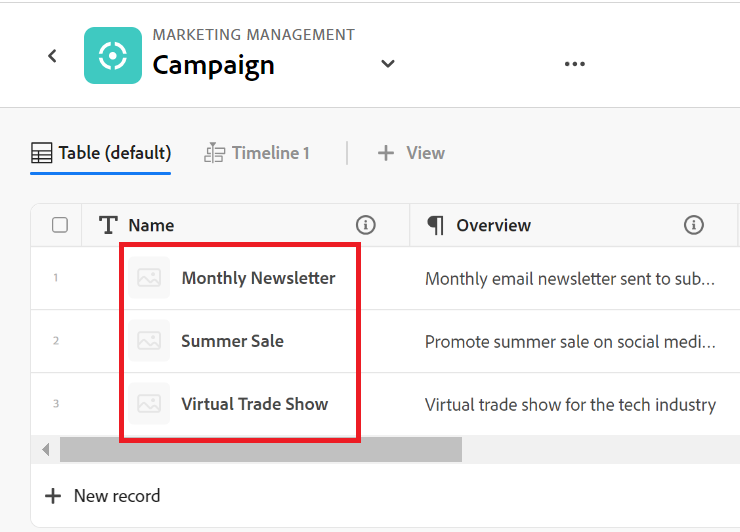
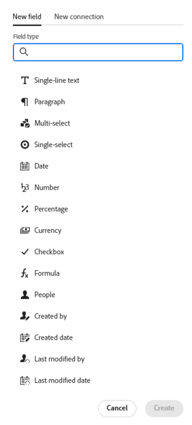
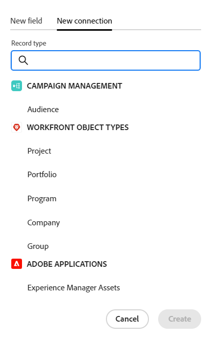

# Présentation de la terminologie de Workfront Planning

<!--do not use the snippet for IMPORTANT as it links to this article-->

<!--
The highlighted information on this page refers to functionality not yet generally available. It is available only in the Preview environment for all customers. After the release to Preview, the same features are also available monthly in the Production environment for customers who enabled fast releases.    

For information about fast releases, see [Enable or disable fast releases for your organization](/help/quicksilver/administration-and-setup/set-up-workfront/configure-system-defaults/enable-fast-release-process.md). 
-->

>[!IMPORTANT]
>
>Les informations de cet article se rapportent à Adobe Workfront Planning. Workfront Planning est un produit autonome ou une fonctionnalité d’Adobe Workfront achetée en plus.
>
>
>Cet article contient des informations générales sur Workfront Planning lorsque les clients achètent également un Workfront ou un package de workflow.
>
>Pour obtenir la liste complète des articles contenant de la documentation pour Workfront Planning, consultez [Informations générales et index des articles pour Adobe Workfront Planning](/help/quicksilver/planning/planning-information.md).
>
>Pour plus d’informations sur Workfront Planning en tant que produit autonome, voir [Prise en main d’Adobe Workfront Planning en tant que produit autonome](/help/quicksilver/planning/planning-sta/planning-sta-overview.md).

Bien que Workfront Planning fasse partie de Workfront, il s’accompagne de concepts et de terminologie qui lui sont propres. Assurez-vous de connaître ces concepts avant de commencer à configurer Workfront Planning pour votre organisation.

Le cadre de Workfront Planning est entièrement personnalisable. Vous pouvez créer tous les types d’enregistrements, leurs attributs et tous les champs qui leur sont associés en fonction des besoins exacts de votre organisation.

Le nombre d’objets Workfront Planning que vous pouvez créer est limité. Pour plus d’informations, voir [Vue d’ensemble des limites d’objets d’Adobe Workfront Planning](/help/quicksilver/planning/general/limitations-overview.md).

Vous trouverez ci-dessous les principaux objets et concepts Workfront Planning :

* [Espaces de travail](#workspaces)
* [Types d’enregistrement](#record-types)
* [Enregistrements](#records)
* [Modèles Workspace](#workspace-templates)
* [Champs](#fields)
* [Types d’enregistrements, enregistrements et champs connectés](#connected-record-types-records-and-fields)
* [Champs de recherche](#lookup-fields)
* [Hiérarchies](#hierarchies)
* [Vues](#views)
* [Automatisations](#automations)
* [Formulaires de demande](#request-forms)

## Espaces de travail

Les espaces de travail représentent le cadre d’une entité organisationnelle. Il s’agit d’ensembles de types d’enregistrements qui définissent le cycle de vie opérationnel d’une certaine organisation.

Pour plus d’informations, voir la section [Créer des espaces de travail](/help/quicksilver/planning/architecture/create-workspaces.md).

## Types d’enregistrement

Les types d&#39;enregistrement sont les types d&#39;objet dans Workfront Planning.

Les types d’enregistrements renseignent les espaces de travail.

Contrairement à Workfront, où les types d’objets sont prédéfinis, dans Workfront Planning, vous pouvez créer vos propres types d’objets.

Par exemple, dans Workfront, les types d’objets Programme, Portfolio, Projet, Tâche ou Problème sont déjà créés.

Dans Workfront Planning, vous pouvez créer tous les types d’enregistrements qui correspondent aux workflows de votre organisation. Vous pouvez ensuite définir la manière dont les types d’enregistrements sont associés les uns aux autres ou aux dépendances des formulaires.

Pour en savoir plus, voir [Vue d’ensemble des types d’enregistrement](/help/quicksilver/planning/architecture/overview-of-record-types.md).

## Enregistrements

Un enregistrement est une instance d’un type d’enregistrement.

Une fois qu’un type d’enregistrement a été ajouté à un espace de travail, vous pouvez commencer à ajouter des enregistrements de ce type sur la page du type d’enregistrement.

Par exemple, « Campagne » peut être un type d’enregistrement et « Campagne d’été pour la région EMEA » un enregistrement du type d’enregistrement Campagne.

Pour plus d’informations, voir la section [Créer des enregistrements](/help/quicksilver/planning/records/create-records.md).

## Modèles Workspace

Vous pouvez créer un espace de travail à l’aide de modèles prédéfinis. Vous pouvez utiliser les types d’enregistrements et les champs prédéfinis qui se trouvent dans un modèle, ou bien ajouter les vôtres.

Adobe Workfront Planning contient les modèles suivants :

* Studio de l&#39;initiative des opérations
* Studio de planification des communications
* De base : Gestion marketing
* Avancé : Gestion marketing
* Entreprise : Gestion marketing
* Gestion des ventes
* Gestion des produits

Les administrateurs et administratrices système peuvent également installer 6 espaces de travail lorsqu’ils utilisent le modèle multiespace des bonnes pratiques. Le modèle multi-espace contient les modèles suivants qui génèrent 6 espaces de travail distincts mais connectés en même temps :

* 1.Classifications et taxonomies globales
* 2.Fréscopa Global Marketing
* 3.Fréscopa Social Marketing
* 4.Fréscopa Media &amp; PR
* 5.Événements globaux Fréscopa
* 6.Fréscopa Direction d&#39;entreprise

Pour plus d’informations, consultez les articles suivants :

* [Liste des modèles Workspace](/help/quicksilver/planning/architecture/workspace-templates.md).
* [Créer des espaces de travail](/help/quicksilver/planning/architecture/create-workspaces.md).

## Champs

Les champs sont des attributs que vous pouvez ajouter aux types d’enregistrements. Les champs contiennent des informations sur le type d’enregistrement.

Considérations relatives aux champs d’enregistrement :

* Les champs que vous ajoutez pour un type d’enregistrement deviennent automatiquement associés à tous les enregistrements de ce type et peuvent être utilisés pour capturer des données sur ces enregistrements.

* Les champs s’affichent sous forme de colonnes dans la vue Tableau appliquée à une page de type d’enregistrement. Elles s’affichent également dans la page de l’enregistrement.

* Les champs sont propres à un type d’enregistrement et ne sont pas transférés d’un type d’enregistrement à un autre.

* Les champs sont entièrement personnalisables et ne sont accessibles que dans Workfront Planning. Vous ne pouvez pas accéder aux champs Workfront Planning à partir de Workfront.

Pour plus d’informations, voir [Créer des champs](/help/quicksilver/planning/fields/create-fields.md).

Par défaut, un nouveau type d’enregistrement est associé aux champs prédéfinis suivants :

* Nom
* Description
* Date de début
* Date de fin
* Statut

Vous pouvez créer des champs personnalisés des types suivants :

* Texte à une ligne
* Paragraphe
* Sélection multiple
* Sélection unique
* Date
* Nombre
* Pourcentage
* Devise
* Case à cocher
* Formule
* Personnes
* Créé par
* Date de création
* Dernière modification par
* Date de dernière modification
* Approbation par
* Date d’approbation
* ID de l’enregistrement

<!--update the screen shot above-->

## Types d’enregistrements, enregistrements et champs connectés

Vous pouvez créer une connexion entre les entités suivantes dans Workfront Planning :

* Deux types d’enregistrements Workfront Planning.
* Un type d’enregistrement et un type d’objet de projet, de programme, de portfolio, d’entreprise ou de groupe Workfront.
* Un type d’enregistrement et une ressource ou un dossier Adobe Experience Manager.

  Vous devez disposer d’une licence Adobe Experience Manager pour connecter les types d’enregistrement aux objets Experience Manager.

  

* Un type d’enregistrement et une marque Adobe GenStudio for Performance Marketing.

  Vous devez disposer d’une licence Adobe GenStudio for Performance Marketing pour connecter les types d’enregistrements aux marques GenStudio.

  

Après avoir établi une connexion entre les types d&#39;enregistrement ou l&#39;enregistrement et les types d&#39;objet, vous pouvez connecter des enregistrements individuels ou des objets de ces types les uns aux autres. La connexion entre les enregistrements s’affiche sous la forme d’un champ d’enregistrement connecté ou une connexion.

Connecter les types d’enregistrements est utile lorsque plusieurs types d’objets de travail s’influencent mutuellement. Par exemple, vous pouvez utiliser des campagnes, chacune d’elles pouvant correspondre à plusieurs marques. Pour indiquer cette relation, vous pouvez connecter des campagnes à des marques. De plus, le travail de chaque campagne peut être planifié dans plusieurs projets dans Workfront. Pour indiquer cela, vous pouvez connecter les campagnes aux projets appropriés. La connexion de types d’enregistrements et, par la suite, de différents enregistrements permet d’établir cette relation dans Workfront Planning.

## Champs de recherche

Après avoir établi la connexion entre deux types d&#39;enregistrements et connecté des enregistrements individuels, vous pouvez référencer les champs des enregistrements connectés à partir de l&#39;enregistrement à partir duquel vous vous connectez.

Par exemple, si vous connectez un type d’enregistrement Campaign à un type d’objet Projet Workfront, vous pouvez afficher le champ Budget des projets connectés dans les enregistrements de campagne.

>[!TIP]
>
>* Vous ne pouvez pas ajouter les types de champ suivants en tant que champs de recherche à partir des types d’objet ou d’enregistrement connectés :
>
>   * Créé par
>   * Dernière modification par
>   * Champs de saisie semi-automatique Workfront (y compris les champs tels que le ou la propriétaire ou le sponsor du projet)
>

Pour plus d’informations sur la connexion entre les types d’enregistrements et les enregistrements, ainsi que sur la création de champs liés, consultez les articles suivants :

* [Connecter les types d’enregistrements](/help/quicksilver/planning/architecture/connect-record-types.md)
* [Connecter des enregistrements](/help/quicksilver/planning/records/connect-records.md)

<!--
not yet:* Fields are reusable across Record Types.
-->

## Hiérarchies

Une fois les types d’enregistrements connectés dans un espace de travail, vous pouvez créer des hiérarchies qui organisent ces connexions. Les hiérarchies organisent les types d&#39;enregistrements et d&#39;objets en relations parent-enfant et peuvent contenir jusqu&#39;à quatre types d&#39;objets.

S’il n’existe pas encore de connexion entre deux types d’enregistrements, elle peut être créée lorsque vous configurez la hiérarchie. Une fois définie, la hiérarchie établit un chemin d’accès structuré entre les types d’enregistrements associés dans l’espace de travail.

Les hiérarchies génèrent des chemins de navigation pour leurs enregistrements respectifs qui s’affichent dans leurs en-têtes. Ainsi, les utilisateurs savent où ils se trouvent dans la hiérarchie à n’importe quelle étape de leur workflow.

Pour obtenir des informations générales sur les hiérarchies et les chemins de navigation, voir [&#x200B; Présentation des hiérarchies et des chemins de navigation &#x200B;](/help/quicksilver/planning/architecture/hierarchy-and-breadcrumb-overview.md).

## Vues

Les enregistrements s’affichent dans leur page de type d’enregistrement respective dans différents types de vues.

Les vues contiennent les paramètres personnalisés d’un type de vue spécifique, tels que la liste des champs (colonnes), une liste des enregistrements (lignes), leur ordre (tri), un filtre appliqué ou applicable et un regroupement.

Les types de vue suivants peuvent être appliqués à la page des types d’enregistrement :

* **Vue Tableau** : affiche les enregistrements et leurs champs, y compris les champs connectés et de recherche, sous la forme d’un tableau. Les lignes du tableau sont les enregistrements individuels et les colonnes sont les champs de l’enregistrement. La vue Tableau est la vue par défaut.

  

* **Vue Chronologie** : affiche les enregistrements comportant au moins deux champs de type Date dans une ligne de temps chronologique. Vous pouvez afficher jusqu’à 5 types d’enregistrements connectés et leurs enregistrements dans la vue chronologique.

  

* **Vue Calendrier** : affiche les enregistrements comportant au moins deux champs de type Date au format d’un calendrier.
  

<!--
add List view here when it's possible to display Planning RTs in it??
-->

Vue supplémentaire :

* **Vue Liste** : vous pouvez afficher les objets dans une vue Liste dans les zones suivantes de Workfront Planning :

  * Pages connectées aux projets.
  * Liste des formulaires de demande

  

Pour plus d’informations, consultez la section [Gérer les vues des enregistrements](/help/quicksilver/planning/views/manage-record-views.md).

## Automatisations

Vous pouvez configurer des automatisations dans Adobe Workfront Planning qui, lorsqu&#39;elles sont activées, créent des enregistrements dans Workfront Planning lorsqu&#39;ils sont déclenchés à partir d&#39;un enregistrement Planning. Les enregistrements créés sont automatiquement connectés aux enregistrements à partir desquels vous déclenchez l’automatisation.

Vous pouvez configurer et activer l’automatisation dans la page du type d’enregistrement dans Workfront Planning.

Par exemple, vous pouvez créer une automatisation qui prend une campagne Workfront Planning et crée une marque à associer à la campagne.

Pour plus d&#39;informations sur la création d&#39;objets à l&#39;aide d&#39;une automatisation existante, consultez [Création d&#39;objets à l&#39;aide des automatisations d&#39;enregistrements Adobe Workfront Planning](/help/quicksilver/planning/records/create-wf-objects-using-planning-automations.md).

## Formulaires de demande

Vous pouvez créer un formulaire de demande et l&#39;associer à un type d&#39;enregistrement dans Adobe Workfront Planning. Vous pouvez ensuite partager le formulaire avec d’autres utilisateurs qui peuvent envoyer des demandes pour créer des enregistrements de ce type.

Pour plus d’informations, voir [Création et gestion d’un formulaire de demande dans Adobe Workfront Planning](/help/quicksilver/planning/requests/create-request-form.md).