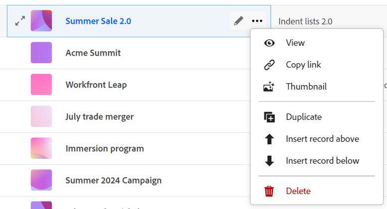

# Ajouter une miniature à un enregistrement

<!--The highlighted information on this page refers to functionality not yet generally available. It is available only in the Preview environment for all customers. After the monthly releases to Production, the same features are also available in the Production environment for customers who enabled fast releases.    

For information about fast releases, see [Enable or disable fast releases for your organization](/help/quicksilver/administration-and-setup/set-up-workfront/configure-system-defaults/enable-fast-release-process.md). -->

{{planning-important-intro}}

Vous pouvez associer des enregistrements à des miniatures uniques dans Adobe Workfront Planning afin de les rendre facilement reconnaissables.

Vous devez créer des types d’enregistrement avant de pouvoir commencer à créer et modifier des enregistrements.
Pour plus d’informations, consultez [Créer des types d’enregistrements](/help/quicksilver/planning/architecture/create-record-types.md).

## Conditions d’accès

<!--************double-check permissions here - asking Isk and Lilit what permissions users need for adding thumbnails-->

+++ Développez pour afficher les exigences d’accès.

Vous devez disposer des accès suivants pour effectuer les étapes décrites dans cet article :

<table style="table-layout:auto"> 
<col> 
</col> 
<col> 
</col> 
<tbody> 
    <tr> 
<tr> 
<td> 
   
 Produits
 </td> 
   <td> 
   <ul><li>
 Adobe Workfront
</li> 
   <li>
 Planification d’Adobe Workfront
</li></ul></td> 
  </tr>   
<tr> 
   <td role="rowheader">
Formule Adobe Workfront*
</td> 
   <td> 

L’un des plans Workfront suivants :
 
<ul><li>Sélectionner</li> 
<li>Principal</li> 
<li>Final</li></ul> 

Workfront Planning n’est pas disponible pour les plans Workfront hérités
 
   </td> 
<tr> 
   <td role="rowheader">
Package Adobe Workfront Planning*
</td> 
   <td> 

Tous 
 

Pour plus d’informations sur les éléments inclus dans chaque plan de planification Workfront, contactez votre gestionnaire de compte Workfront. 
 
   </td> 
 <tr> 
   <td role="rowheader">
Plateforme Adobe Workfront
</td> 
   <td> 

L’instance de Workfront de votre entreprise doit être intégrée à l’expérience unifiée Adobe pour pouvoir accéder à toutes les fonctionnalités de Workfront Planning.
 

Pour plus d’informations, voir <a href="/help/quicksilver/workfront-basics/navigate-workfront/workfront-navigation/adobe-unified-experience.md">Adobe Unified Experience pour Workfront</a>. 
 
   </td> 
   </tr> 
  </tr> 
  <tr> 
   <td role="rowheader">
Licence Adobe Workfront*
</td> 
   <td>
 Standard 

   
Workfront Planning n’est pas disponible pour les licences Workfront héritées
 
  </td> 
  </tr> 
  <tr> 
   <td role="rowheader">
Configuration du niveau d’accès
</td> 
   <td> 
Il n’existe aucun contrôle de niveau d’accès pour Adobe Workfront Planning.
   
</td> 
  </tr> 
<tr> 
   <td role="rowheader">
Autorisations d’objet
</td> 
   <td>   
Autorisations de niveau Contributeur ou supérieur à un espace de travail <!--and record type-->  
  
   
L’administration système a accès à tous les espaces de travail, y compris ceux qu’elle n’a pas créés.
 </td> 
  </tr> 
<tr> 
   <td role="rowheader">
Modèle de disposition
</td> 
   <td> 
Toutes les personnes, y compris les administrateurs et administratrices de Workfront, doivent se voir attribuer un modèle de mise en page incluant la zone Planning dans le menu principal. 
 </td> 
  </tr> 
</tbody> 
</table>

* Pour plus d’informations sur les exigences d’accès à Workfront, voir [Conditions d’accès requises dans la documentation Workfront](/help/quicksilver/administration-and-setup/add-users/access-levels-and-object-permissions/access-level-requirements-in-documentation.md).

+++

## Remarques sur les miniatures d’enregistrements

Pour faire la distinction visuelle entre les enregistrements dans une vue de tableau, vous pouvez associer une miniature unique à chaque enregistrement.

Tenez compte des points suivants :

* Une miniature est propre à un enregistrement et ne s’applique pas à tous les enregistrements du même type.
* Vous pouvez uniquement ajouter des fichiers image sous forme de miniatures.
  <!--above: when you know exactly what type of files are allowed, add the exact extensions above-->
* Vous pouvez ajouter une miniature à des enregistrements individuels en mode Tableau ou depuis la page ou la zone d&#39;aperçu de l&#39;enregistrement.
* Workfront charge automatiquement une miniature à chaque création d’enregistrement. Vous pouvez modifier cette image ultérieurement.
* Les miniatures appartiennent aux informations d’enregistrement et s’affichent dans les zones où s’affichent les enregistrements. Par exemple, les miniatures s’affichent avec les informations des enregistrements dans les zones suivantes :

   * Champ principal d’un enregistrement dans la vue de tableau
   * Barre d’enregistrement dans la vue chronologique.
   * Aperçu et page des détails de l’enregistrement.

## Ajouter une miniature à un enregistrement

Vous pouvez ajouter une miniature des manières suivantes :

* [Ajout d’une miniature à un enregistrement à partir de la vue Tableau](#add-a-thumbnail-to-a-record-from-the-table-view)
* [Ajouter une miniature à un enregistrement à partir de la page de détails](#add-a-thumbnail-to-a-record-from-the-details-page)

### Ajout d’une miniature à un enregistrement à partir de la vue Tableau

{{step1-to-planning}}

1. Cliquez sur l’espace de travail pour lequel vous souhaitez ajouter des miniatures, puis cliquez sur la carte type d’enregistrement .

   Cela ouvre la page du type d’enregistrement.
1. Sélectionnez une vue de tableau dans le menu déroulant **Vue**. Tous les enregistrements du type que vous avez sélectionné s’affichent dans un tableau.
1. Pointez sur les informations du champ principal, cliquez sur le menu **Plus** , puis sur **Miniature**.

   

   >[!TIP]
   >
   >   Le champ principal est le champ qui s’affiche dans la première colonne d’une vue de tableau. Le champ principal est toujours figé et ne peut pas être masqué ni déplacé. L’option Miniature n’est pas disponible dans le menu Plus lorsque le champ principal est un champ de formule.

   L’onglet **Charger** s’ouvre par défaut dans la zone **Enregistrer la miniature**.

   Pour plus d’informations sur le téléchargement de la miniature, consultez la section [Ajouter une miniature à un enregistrement à partir de la page de détails](#add-a-thumbnail-to-a-record-from-the-details-page) dans cet article, en commençant par l’étape 6. <!--see if this is accurate-->

<!--
    

  *****update screen shot with correct casing****

1. Drag and drop a file to add as a thumbnail
   
   Or
   
   Click **Browse images**, then browse for an image file to add. The file must be saved on your computer. 
1. (Optional) After the image uploads in the **Record thumbnail** box, use the sizing tool to crop and resize the image.
1. (Optional) Click the **Upload new image** icon  to upload another image. 
1. (Optional) To remove a thumbnail before it is saved, click  **Remove uploaded image** icon  to the right of the image. 
1. (Optional) Click the **Gallery** tab, then click an image. The gallery of images cannot be modified.

   
1. Click **Use image** to add the image as a thumbnail. 
   This closes the **Record thumbnail** box.
   The thumbnail displays in areas of Workfront Planning where the record displays. 

   >[!TIP]
   >
   >   You must enable the Thumbnail field in the table view to display thumbnails in this view. It is disabled by default.

1. (Optional) To remove the thumbnail after it is saved, hover over the primary field and click the **More** menu > **Thumbnail** > the **Remove** icon , then click **Save changes**. -->

### Ajouter une miniature à un enregistrement à partir de la page de détails

{{step1-to-planning}}

1. Cliquez sur l’espace de travail pour lequel vous souhaitez ajouter des miniatures, puis cliquez sur la carte type d’enregistrement .

   Cela ouvre la page du type d’enregistrement.
1. Dans n’importe quel affichage, cliquez sur un enregistrement pour l’ouvrir.

   La zone d’aperçu des détails s’affiche.
1. (Facultatif) Cliquez sur l’icône **Ouvrir dans un nouvel onglet**  dans le coin supérieur droit.

   La page de détails de l’enregistrement s’ouvre.

1. (Conditionnel) Dans la page d’aperçu ou de détails de l’enregistrement, passez le curseur sur l’image ou l’icône de miniature , puis passez le curseur sur l’espace au-dessus du nom de l’enregistrement et cliquez sur **Ajouter une miniature** ou **Modifier la miniature**.

   L’onglet **Charger** s’ouvre par défaut dans la zone **Enregistrer la miniature**.

   

1. Glissez-déposez un fichier à ajouter en tant que miniature

   Ou

   Cliquez sur **Parcourir les images**, puis recherchez un fichier image à ajouter. Le fichier doit être enregistré sur votre ordinateur.

1. (Facultatif) Une fois l’image téléchargée dans la zone **Enregistrer la miniature**, utilisez l’outil de redimensionnement pour recadrer et redimensionner l’image.
1. (Facultatif) Cliquez sur l’icône **Charger une nouvelle image**  pour charger une autre image.
1. (Facultatif) Cliquez sur l’onglet **Galerie**, puis sur une image. La galerie d’images ne peut pas être modifiée.

   

1. (Facultatif) Pour supprimer la miniature avant de l’enregistrer, cliquez sur l’icône **Supprimer**  à droite de l’image.

1. Cliquez sur **Utiliser l’image** pour ajouter l’image en tant que miniature.
Cette action ferme la boîte de dialogue **Miniature d’enregistrement**.
La miniature s’affiche dans les zones de Workfront Planning où s’affiche l’enregistrement.

   >[!TIP]
   >
   >   Vous devez activer le champ Miniature dans la vue Tableau pour afficher les miniatures dans cette vue. Il est désactivé par défaut.

1. (Facultatif) Pour supprimer la miniature après son enregistrement, cliquez sur un enregistrement dans n’importe quel mode pour ouvrir la page de détails, puis survolez l’image miniature avec la souris et cliquez sur l’icône **Plus** du menu > **Supprimer** icône . La miniature est supprimée.

<!--
### Generate a thumbnail for a record

{{step1-to-planning}}

1. Click the workspace for whose records you want to add thumbnails, then click the record type card. 

   This opens the record type page. 
1. Select a table view from the **View** drop-down menu. All records of the type you selected display in a table. 
1. Hover over the primary field information, click the **More** menu , then click **Thumbnail**. 

   

      >[!TIP]
      >
      >   The primary field is the field that displays in the first column of a table view. The primary field is always frozen and cannot be hidden or relocated. 

   The **Record thumbnail** box opens.

(*************** update the screenshot below*************)
    

1. Click the **Generate** tab, and type a prompt describing the type of image you want to add in the space provided. 
1. Click **Generate**. 

   A set of four suggested images displays. 

1. Click an image to select it, then click **Use image**. 

   The Record thumbnail box closes and the thumbnail is attached to the record. All users who can view the records can now see the selected thumbnail. 
1. (Optional) Click the **More** menu  to the right of the record name in the table view, then click **Thumbnail**. 

   The generated image opens in the **Upload** tab where you can modify or remove it, as described in the section [Upload a thumbnail to a record](#upload-a-thumbnail-to-a-record) in this article. 
-->