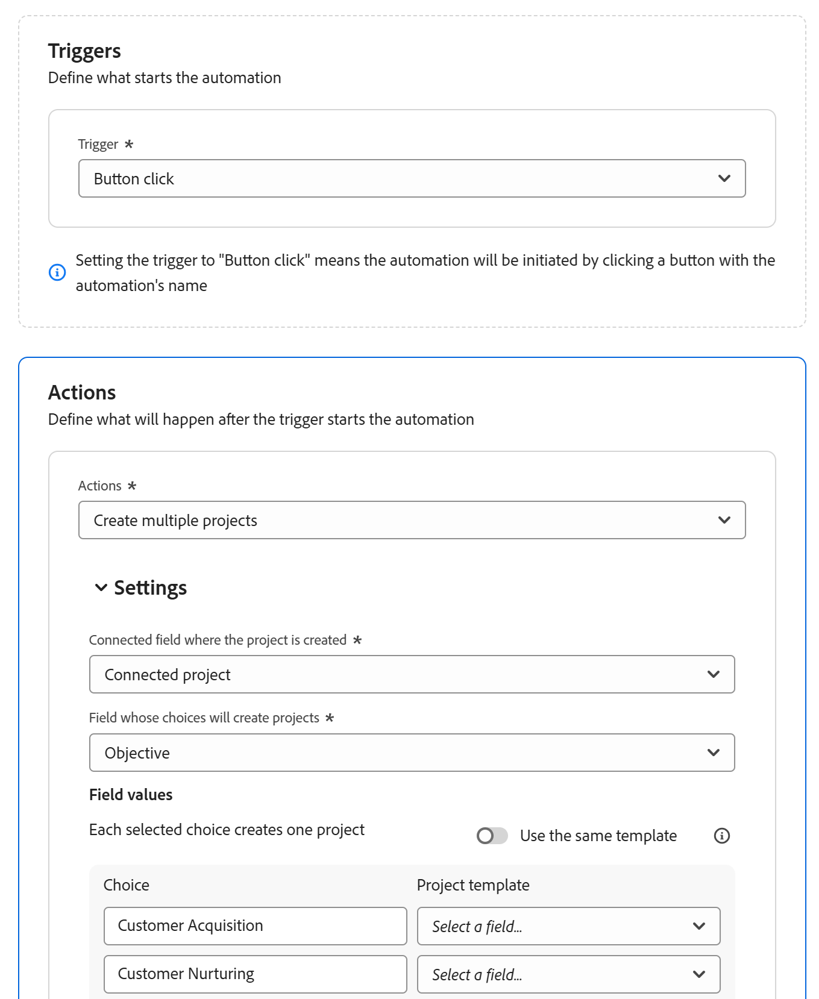

# Configuration des automatisations d’Adobe Workfront Planning

<!--add screen shots when UI is finalized AND redo all the steps - some things got changed and moved around-->

<!--you might need to add something about notifications and emails?!-->
<!--add a new section to this article to mention a new way to create objects: help/quicksilver/planning/records/create-records.md-->
<!-- add a new section to this article to mention a new way to create WF objects from Planning: help/quicksilver/planning/records/create-workfront-objects-from-workfront-planning.md-->

<!-- if they give access to use the automation to people with LESS than Manage permissions to a workspace, split this article in two: the Configure section should be for admins and the "Use a Workfront Planning automation to create an object" should be for all other users-->

Les informations mises en surbrillance sur cette page font référence à des fonctionnalités qui ne sont pas encore disponibles de manière générale. Elle est disponible uniquement dans l’environnement de Prévisualisation pour tous les clients. Après les versions mensuelles en production, les mêmes fonctionnalités sont également disponibles dans l’environnement de production pour les clients qui ont activé les versions rapides. 

Pour plus d’informations sur les versions rapides, voir [Activation ou désactivation des versions rapides pour votre organisation](/help/quicksilver/administration-and-setup/set-up-workfront/configure-system-defaults/enable-fast-release-process.md). 

Vous pouvez configurer des automatisations dans Adobe Workfront Planning qui, lorsqu&#39;elles sont activées, créent des objets dans Workfront ou des enregistrements dans Workfront Planning lorsqu&#39;ils sont déclenchés à partir d&#39;un enregistrement Planning. Les objets ou enregistrements créés sont automatiquement connectés aux enregistrements à partir desquels vous déclenchez l’automatisation.

Vous pouvez configurer et activer l’automatisation dans la page du type d’enregistrement dans Workfront Planning.

Par exemple, vous pouvez créer une automatisation qui prend une campagne Workfront Planning et crée un projet dans Workfront pour suivre la progression de cette campagne.

Cet article décrit comment gérer les automatisations, notamment comment les modifier, les désactiver, les supprimer et les déclencher pour créer des objets et des enregistrements.

Pour plus d&#39;informations sur la création d&#39;enregistrements ou d&#39;objets à l&#39;aide d&#39;une automatisation existante, voir [Création d&#39;objets à l&#39;aide des automatisations d&#39;enregistrements Adobe Workfront Planning](/help/quicksilver/planning/records/create-wf-objects-using-planning-automations.md).

## Conditions d’accès

+++ Développez pour afficher les exigences d’accès.

Vous devez disposer des accès suivants pour effectuer les étapes décrites dans cet article :

<table style="table-layout:auto"> 
<col> 
</col> 
<col> 
</col> 
<tbody> 
    <tr> 
<tr> 
<td> 
   
 Produits
 </td> 
   <td> 
   <ul><li>
 Adobe Workfront
</li> 
   <li>
 Planification d’Adobe Workfront
</li></ul></td> 
  </tr>   
<tr> 
   <td role="rowheader">
Formule Adobe Workfront*
</td> 
   <td> 

L’un des plans Workfront suivants :
 
<ul><li>Sélectionner</li> 
<li>Principal</li> 
<li>Final</li></ul> 

La planification de front de travail n’est pas disponible pour les plans de front hérités
 
   </td> 
<tr> 
   <td role="rowheader">
Adobe Workfront Planning package*
</td> 
   <td> 

Tous 
 

Pour plus d’informations sur ce qui est inclus dans chaque plan Workfront Planning, contactez votre responsable de compte Workfront. 
 
   </td> 
 <tr> 
   <td role="rowheader">
Adobe Plateforme Workfront
</td> 
   <td> 

L’instance Workfront de votre organisation doit être intégrée à l’expérience unifiée Adobe pour pouvoir accéder à toutes les fonctionnalités de Workfront Planning.
 

Pour plus d’informations, voir <a href="/help/quicksilver/workfront-basics/navigate-workfront/workfront-navigation/adobe-unified-experience.md">Adobe Unified Experience pour Workfront</a>. 
 
   </td> 
   </tr> 
  </tr> 
  <tr> 
   <td role="rowheader">
Licence Adobe Workfront*
</td> 
   <td> Standard
   
Workfront Planning n’est pas disponible pour les licences Workfront héritées
 
  </td> 
  </tr> 
  <tr> 
   <td role="rowheader">
Configuration du niveau d’accès
</td> 
   <td> 
Il n’existe aucun contrôle de niveau d’accès pour Adobe Workfront Planning.
 
   
Modifiez l’accès avec l’accès à Créer des objets dans Workfront pour les types d’objets que vous souhaitez créer (projets, portfolios, programmes). 
  
</td> 
  </tr> 
<tr> 
   <td role="rowheader">
Autorisations d’objet
</td> 
   <td> 
Manage permissions to the workspace and to the record type where you want to create automations. 

   
System Administrators have Manage permissions to all workspaces, including the ones they did not create

   </td> 
  </tr> 
<tr> 
   <td role="rowheader">
Modèle de mise en page
</td> 
   <td> 
Dans l’environnement de production, tous les utilisateurs, y compris les administrateurs système, doivent être affectés à un modèle de mise en page qui inclut Planning.

Dans l’environnement de Prévisualisation, les utilisateurs et utilisatrices standard et les administrateurs et administratrices système ont Planning activé par défaut.
 </td> 
  </tr> 
</tbody> 
</table>

* Pour plus d’informations sur les exigences d’accès à Workfront, voir [Conditions d’accès requises dans la documentation Workfront](/help/quicksilver/administration-and-setup/add-users/access-levels-and-object-permissions/access-level-requirements-in-documentation.md).

+++

## Configuration d’une automatisation dans Workfront Planning

Vous devez configurer une automatisation pour un type d&#39;enregistrement dans Workfront Planning avant de pouvoir l&#39;utiliser pour créer des objets.

{{step1-to-planning}}

1. Cliquez sur une carte de type d’enregistrement, puis sur le nom d’un enregistrement.

   La page de type d’enregistrement s’ouvre.
1. Cliquez sur le menu **Plus**  à droite du nom du type d’enregistrement, puis cliquez sur **Gérer les automatisations**.

   La liste des automatisations disponibles pour le type d’enregistrement sélectionné s’ouvre.

1. Cliquez sur **Nouvelle automatisation** dans le coin supérieur droit de l’écran. La boîte de dialogue **Nouvelle automatisation** s’ouvre.
1. Mettez à jour les champs suivants :

   * Remplacez **Automatisation sans titre** par le texte qui doit apparaître sur le bouton d’automatisation. Les utilisateurs cliqueront sur ce bouton lors de l&#39;utilisation de l&#39;automatisation pour créer un objet Workfront ou un enregistrement Planning.
   * **Description** : ajoutez une description pour identifier l’objectif de l’automatisation.
1. Cliquez sur **Enregistrer**.
La page d’informations sur l’automatisation s’ouvre.

1. Sur la page des détails de l&#39;automatisation, mettez à jour les champs suivants dans la section **Triggers** :

   * **Déclencheur** : sélectionnez l’action qui déclenchera l’automatisation. Par exemple, sélectionnez **Clic sur un bouton**. <!--update this step with a list of all possible triggers; right now only Button click is available-->

1. Mettez à jour les champs suivants dans la section **Actions** : <!--submitted bugs for these fields - see if they need changing here-->
   * **Actions** : sélectionnez l’action que Workfront doit effectuer lors du déclenchement de l’automatisation. Ce champ est obligatoire.
Sélectionnez l’une des actions suivantes :

      * Création de plusieurs projets
      * Créer un seul projet
      * Créer un projet
      * Créer un enregistrement
      * Créer un programme
      * Créer un portfolio
      * Créer un groupe

     >[!TIP]
     >
     >Après avoir enregistré l’automatisation, vous ne pouvez plus modifier l’action sélectionnée dans ce champ.

1. (Conditionnel) Selon l’action sélectionnée, mettez à jour les champs suivants :

   * **Créer un seul projet** : <!--replace to the left: Create a single project-->
      * **Champ connecté où le projet est créé** : il s’agit du champ connecté où le nouveau projet s’affichera. Champ obligatoire.
      * **Modèle de projet** : sélectionnez un modèle de projet que Workfront utilisera pour créer le projet.

   * Créez plusieurs projets :
      * **Champ connecté où le projet est créé** : il s’agit du champ connecté où le nouveau projet s’affichera. Champ obligatoire.
      * **Champ dont les choix créeront les enregistrements** : choisissez un champ à sélection multiple ou à sélection unique parmi le type d’enregistrement sélectionné. Workfront crée un projet pour chaque choix de champ actuellement sélectionné dans l’enregistrement à partir duquel vous déclenchez l’automatisation.

     >[!TIP]
     >
     >Un projet est créé uniquement pour les options actuellement sélectionnées sur le champ à sélection multiple ou unique de l’enregistrement à partir duquel vous exécutez l’automatisation, et pas pour tous les choix possibles pour ce champ.
     >

      * **Utiliser le même modèle** : sélectionnez cette option pour utiliser le même modèle pour chaque nouveau projet. Si l’option est désélectionnée, sélectionnez un **modèle de projet** pour chaque choix de champ.
      * **Modèle de projet** : si vous avez sélectionné l’option **Utiliser le même modèle**, sélectionnez un modèle de projet que Workfront utilisera pour créer les projets.

   * **Créer un portefeuille** :
      * **Champ connecté où le portefeuille est créé** : il s’agit du champ connecté où le nouveau portefeuille s’affichera. Champ obligatoire.
      * **Formulaire personnalisé à joindre au nouveau porte-documents** : Sélectionnez un formulaire personnalisé à joindre au nouveau porte-documents. Vous devez créer un formulaire personnalisé de porte-documents avant de pouvoir le sélectionner.
   * **Créer le programme** :
      * **Champ connecté où le programme est créé :** Il s’agit du champ connecté où le nouveau programme s’affichera. Champ obligatoire.
      * **Portefeuille** de programmes : Sélectionnez un portefeuille où le nouveau programme sera ajouté. Champ obligatoire.
      * **Formulaire personnalisé à joindre au nouveau programme** : Sélectionnez un formulaire personnalisé à joindre au nouveau programme. Vous devez créer un formulaire personnalisé de programme avant de pouvoir le sélectionner.
   * **Créer un groupe** :
      * **Champ connecté où le groupe est créé** : Il s’agit du champ connecté où le nouveau groupe s’affichera. Champ obligatoire.
      * **Formulaire personnalisé à joindre au nouveau groupe** : sélectionnez un formulaire personnalisé à joindre au nouveau programme. Vous devez créer un formulaire personnalisé de programme avant de pouvoir le sélectionner.
   * **Créer un enregistrement** :
      * **Type d’enregistrement** : sélectionnez le type d’enregistrement à créer.

        La sous-section **Paramètres** s’affiche. Mettez à jour les champs suivants de la sous-section **Paramètres** :

         * **Champ sur le type d’enregistrement connecté où l’enregistrement actif s’affichera** : il s’agit du champ connecté sur le type d’enregistrement sélectionné pour l’action où l’enregistrement actif s’affichera.

        Par exemple, si vous créez une automatisation à partir de laquelle les campagnes peuvent connecter des enregistrements de produit, il s’agit du champ connecté sur le type d’enregistrement de produit où les campagnes s’afficheront, une fois les produits créés à l’aide de l’automatisation.

        Champ obligatoire.

        <!--submitted a change in functionality and UI text for this - revise??-->
Dans la **zone Champs** de carte, mettez à jour les informations suivantes :

         * **Transférer de** : sélectionnez des champs dans le type d’enregistrement pour lequel l’automatisation est créée pour les mapper aux champs du type d’enregistrement connecté.
         * **Transférer vers** : sélectionnez des champs de l’enregistrement nouvellement créé qui seront remplis avec les informations de l’enregistrement à partir duquel vous exécutez l’automatisation.

        >[!TIP]
        >
        >* Les types de champ du type d’enregistrement d’origine doivent correspondre aux types de champ du type d’enregistrement nouvellement créé.
        >* Si vous choisissez Aucun champ, les noms des nouveaux enregistrements seront **Enregistrement** sans titre.

1. (Facultatif et conditionnel) Si vous avez choisi de créer un enregistrement, cliquez sur **Ajouter des champs** pour mapper des champs de recherche supplémentaires d’un enregistrement à un autre.
1. (Conditionnel) S’il n’existe aucun champ de connexion entre le type d’enregistrement d’origine et le type d’enregistrement sélectionné dans le champ Type d’enregistrement **&#x200B;**, cliquez sur **Ajouter un champ** connecté.

   

   Les deux champs suivants sont créés :

   * Un nouveau champ de connexion nommé **Enregistrement connecté** est créé pour le type d’enregistrement que vous avez indiqué dans le champ **Type d’enregistrement**.
   * Un nouveau champ de connexion portant le même nom que celui indiqué dans le champ **Type d’enregistrement** est créé pour le type d’enregistrement pour lequel vous configurez l’automatisation.

     Par exemple, si vous configurez une automatisation pour les campagnes afin de créer automatiquement un autre type d’enregistrement appelé Marques et que vous cliquez sur **Ajouter un champ connecté**, les champs suivants sont créés :

      * Le champ de connexion **Enregistrement connecté** est créé pour le type d’enregistrement **Marques**.
      * Le champ de connexion **Marques** est créé pour le type d’enregistrement **Campagnes**.

1. (Facultatif) S’il n’existe aucun champ de connexion entre le type d’enregistrement d’origine et l’objet Workfront sélectionné dans la zone Actions, cliquez sur **Ajouter un champ connecté**.

   

   Les éléments suivants sont créés :

   * Un nouveau champ de connexion nommé **Connected &lt; name of Workfront object >** est créé pour le type d’enregistrement pour lequel vous créez l’automatisation. Par exemple, un champ **Projet connecté** est créé pour le type d’enregistrement pour lequel vous créez l’automatisation, lorsque vous choisissez de créer automatiquement des projets.
   * Une nouvelle carte de type d’enregistrement est ajoutée à la section Planification d’un projet Workfront, dans Workfront avec le nom du type d’enregistrement pour lequel vous configurez l’automatisation.

1. Cliquez sur **Enregistrer** dans le coin supérieur droit de la page des détails d’automatisation.

   L’automatisation s’affiche dans la liste des automatisations et peut être utilisée dans les enregistrements.

## Gestion des automatisations existantes

{{step1-to-planning}}

1. Cliquez sur une carte de type d’enregistrement, puis sur le nom d’un enregistrement.

   La page de type d’enregistrement s’ouvre.
1. Cliquez sur le menu **Plus**  à droite du nom du type d’enregistrement, puis cliquez sur **Gérer les automatisations**.

   La liste des automatisations disponibles pour le type d’enregistrement sélectionné s’ouvre.

1. (Facultatif) Pour modifier, désactiver ou supprimer une automatisation, effectuez l’une des opérations suivantes :

   1. Dans la liste des automatisations, pointez sur le nom d’une automatisation enregistrée, puis cliquez sur le menu **Plus** .

   1. Cliquez sur **Modifier** pour mettre à jour les informations suivantes :

      * Cliquez sur le menu **Plus**  à droite du nom de l&#39;automatisation, puis cliquez sur **Modifier** pour modifier le nom de l&#39;automatisation.
      * Tous les champs de l’automatisation, à l’exception du champ **Actions**.

        >[!TIP]
        >
        >Vous ne pouvez pas modifier l’action que vous avez initialement sélectionnée pour une automatisation.

   1. Cliquez sur **Désactiver** pour supprimer l’automatisation de la vue Tableau de l’enregistrement et empêcher les utilisateurs de l’utiliser pour créer des enregistrements ou des objets.

      Les enregistrements créés à l&#39;aide d&#39;une automatisation désactivée restent connectés à l&#39;enregistrement sélectionné à l&#39;origine.

      Pour le rendre à nouveau disponible, cliquez de nouveau sur le menu **Plus** , puis cliquez sur **Activer**.
   1. Cliquez sur **Supprimer** pour supprimer l’automatisation. Impossible de récupérer une automatisation supprimée.

      Les enregistrements qui ont été créés à l&#39;aide d&#39;une automatisation supprimée restent connectés à l&#39;enregistrement sélectionné à l&#39;origine.