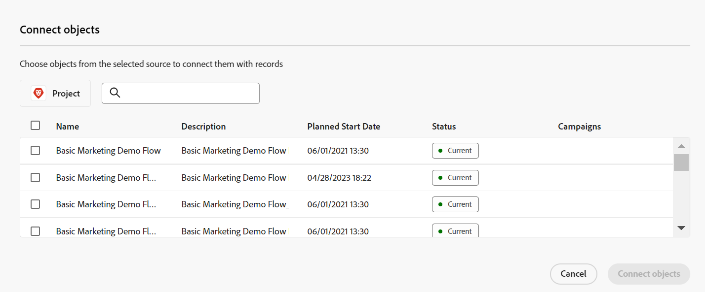

# Connect records

<!--

The highlighted information on this page refers to functionality not yet generally available. It is available only in the Preview environment for all customers. After the monthly releases to Production, the same features are also available in the Production environment for customers who enabled fast releases.    

For information about fast releases, see [Enable or disable fast releases for your organization](/help/quicksilver/administration-and-setup/set-up-workfront/configure-system-defaults/enable-fast-release-process.md). 

-->

{{planning-important-intro}}

Vous pouvez connecter des enregistrements Adobe Workfront Planning entre eux ou à des objets provenant d&#39;autres applications. Vous pouvez afficher les informations d&#39;un enregistrement sur un autre lorsque vous les connectez.

Cet article décrit comment connecter des enregistrements. Pour plus d&#39;informations générales sur la connexion des enregistrements, voir [Présentation des enregistrements connectés](/help/quicksilver/planning/records/connected-records-overview.md).

Vous devez d’abord connecter deux types d’enregistrement l’un à l’autre, ou un type d’enregistrement à un type d’objet à partir d’une autre application. Cela crée des champs d’enregistrement connectés. Vous pouvez ensuite connecter des enregistrements entre eux ou des enregistrements à d&#39;autres objets à partir d&#39;autres applications dans les champs d&#39;enregistrement connectés.

La connexion d’enregistrements est similaire à la connexion d’enregistrements à des objets à partir d’une autre application.

Pour plus d’informations sur la connexion des types d’enregistrement les uns aux autres ou à des types d’objets d’autres applications, voir [Connecter des types d’enregistrements](/help/quicksilver/planning/architecture/connect-record-types.md).

Pour obtenir un exemple de connexion de types d’enregistrement, voir [Exemple de connexion de types d’enregistrements et d’enregistrements](/help/quicksilver/planning/architecture/example-connect-record-types-and-records.md).

Vous pouvez connecter les éléments suivants :

* Enregistrements Adobe Workfront Planning entre eux
* Enregistrements d’Adobe Workfront Planning avec des objets provenant d’autres applications

  Vous pouvez connecter des enregistrements avec des objets des types répertoriés ci-dessous à partir des applications suivantes :

   * Adobe Workfront

      * Projets
      * Portefeuilles
      * Programmes
      * Entreprises
      * Groupes

   * Adobe Experience Manager Assets

      * Fichiers d’images
      * Dossiers

  <!--when you add more objects, fix the Access Requirements below which right now refer only to projects-->

## Conditions d’accès

+++ Développez pour afficher les conditions d’accès requises pour la fonctionnalité de cet article. 

<table style="table-layout:auto"> 
<col> 
</col> 
<col> 
</col> 
<tbody> 
    <tr> 
<tr> 
</tr>   
<tr> 
   <td role="rowheader">
Package Adobe Workfront
</td> 
   <td> 

Tout Workfront et tout package Planning

Tout workflow et tout package Planning

Pour plus d’informations sur les composants inclus dans chaque package Workfront Planning, contactez votre représentant de compte Workfront. 
 
   </td> 
<tr> 
<td> 
   
 Produits supplémentaires
 </td> 
   <td> 
   
 Outre Adobe Workfront, vous devez disposer des éléments suivants si vous souhaitez connecter des enregistrements à des objets provenant des applications suivantes :

   <ul><li>
Une licence Adobe Experience Manager Assets et une intégration entre AEM Assets et Workfront pour connecter les ressources AEM aux types Planning.

   
Pour plus d’informations, voir <a href="/help/quicksilver/documents/adobe-workfront-for-experience-manager-assets-essentials/workfront-for-aem-asset-essentials.md">Adobe Workfront pour Experience Manager Assets et Assets Essentials : index d’article</a>. 
</li>
   <li>
 Une licence Adobe GenStudio for Performance Marketing permettant de connecter des types d’enregistrements aux marques GenStudio

   
Pour plus d’informations, voir <a href="https://experienceleague.adobe.com/en/docs/genstudio-for-performance-marketing/user-guide/get-started">Prise en main d’Adobe GenStudio for Performance Marketing</a>.
</li></ul>
   </td> 
  </tr>   
<tr> 
  <tr> 
   <td role="rowheader">
Licence Adobe Workfront
</td> 
   <td>
Standard

   </td> 
  </tr> 
   <tr> 
   <td role="rowheader">
Configuration du niveau d’accès
</td> 
   <td> 
Il n’existe aucun contrôle de niveau d’accès pour Adobe Workfront Planning.
 
   
Accédez à l’affichage ou à un accès supérieur pour les types d’objets dont vous souhaitez vous connecter aux objets dans Workfront et AEM Assets. 
  
</td> 
  </tr>
  <tr> 
   <td role="rowheader">
Autorisations d’objet
</td> 
   <td>   
Autorisations de niveau Contribution ou supérieur à un espace de travail et type d’enregistrement pour connecter les enregistrements. 
  
   
Autorisations d’affichage ou supérieures à un espace de travail et à un type d’enregistrement pour afficher toutes les connexions aux objets et champs d’autres applications, quel que soit votre accès dans l’autre application. 

   
Autorisations d’affichage ou supérieures aux objets que vous souhaitez lier à partir de Workfront ou Experience Manager Assets. 

   
Les équipes d’administration système ont des droits sur tous les espaces de travail, y compris ceux qu’ils n’ont pas créés.
 </td> 
  </tr>   
</tbody> 
</table>

Pour plus d’informations sur les exigences d’accès à Workfront, voir [Exigences d’accès dans la documentation de Workfront](/help/quicksilver/administration-and-setup/add-users/access-levels-and-object-permissions/access-level-requirements-in-documentation.md).

+++   

<!--Old:

<table style="table-layout:auto"> 
<col> 
</col> 
<col> 
</col> 
<tbody> 
    <tr> 
<tr> 
<td> 
   
 Products
 </td> 
   <td> 
   <ul><li>
 Adobe Workfront
</li> 
   <li>
 Adobe Workfront Planning
</li>
   <li>
Adobe Experience Manager Assets, if you want to connect AEM assets with Planning records

   
You must have an Adobe Experience Manager Assets license and an integration between AEM Assets and Workfront.
    For information, see <a href="/help/quicksilver/documents/adobe-workfront-for-experience-manager-assets-essentials/workfront-for-aem-asset-essentials.md">Adobe Workfront for Experience Manager Assets and Assets Essentials: article index</a>. 

   </li>  
   </ul></td> 
  </tr>   
<tr> 
   <td role="rowheader">
Adobe Workfront plan*
</td> 
   <td> 

Any of the following Workfront plans:
 
<ul><li>Select</li> 
<li>Prime</li> 
<li>Ultimate</li></ul> 

Workfront Planning is not available for legacy Workfront plans
 
   </td> 
<tr> 
   <td role="rowheader">
Adobe Workfront Planning package*
</td> 
   <td> 

Any 
 

For more information about what is included in each Workfront Planning plan, contact your Workfront account manager. 
 
   </td> 
 <tr> 
   <td role="rowheader">
Adobe Workfront platform
</td> 
   <td> 

Your organization's instance of Workfront must be onboarded to the Adobe Unified Experience to be able to access Workfront Planning.
 

For more information, see <a href="/help/quicksilver/workfront-basics/navigate-workfront/workfront-navigation/adobe-unified-experience.md">Adobe Unified Experience for Workfront</a>. 
 
   </td> 
   </tr> 
  </tr> 
  <tr> 
   <td role="rowheader">
Adobe Workfront license*
</td> 
   <td> Standard
   
Workfront Planning is not available for legacy Workfront licenses
 
  </td> 
  </tr> 
  <tr> 
   <td role="rowheader">
Access level configuration
</td> 
   <td> 
There are no access level controls for Adobe Workfront Planning objects
 
   
View or higher permissions to the object types you want to link from Workfront.
   
</td> 
  </tr> 
<tr> 
   <td role="rowheader">
Object permissions
</td> 
   <td>   
Contribute or higher permissions to a workspace and record type to connect records 
  
   
View or higher permissions to a workspace and record type to view all connections to objects and fields from other applications, regardless of your access in the other application. 

   
View or higher permissions to the objects you want to link from Workfront or Experience Manager Assets. 

   
System Administrators have permissions to all workspaces, including the ones they did not create.
 </td> 
  </tr> 
</tbody> 
</table> -->

## Considérations relatives à la connexion des enregistrements

* Pour connecter des enregistrements à d&#39;autres enregistrements ou objets, vous devez disposer des éléments suivants :

   * Au moins un espace de travail, un type d’enregistrement et un enregistrement

     Pour plus d’informations, consultez les articles suivants :

      * [Créer des espaces de travail](/help/quicksilver/planning/architecture/create-workspaces.md)
      * [Créer des types d’enregistrement](/help/quicksilver/planning/architecture/create-record-types.md)
      * [Créer des enregistrements](/help/quicksilver/planning/records/create-records.md)

   * Connexions entre types d’enregistrement ou entre types d’enregistrement et objets d’autres applications. Pour plus d’informations, consultez la section [Connecter des types d’enregistrements](/help/quicksilver/planning/architecture/connect-record-types.md).

* Vous pouvez connecter un ou plusieurs enregistrements ou objets les uns aux autres. Cela dépend du type de connexion que vous avez sélectionné lors de la connexion des types d&#39;enregistrement ou d&#39;objet. Pour plus d’informations, voir [Présentation des types d’enregistrements Connect](/help/quicksilver/planning/architecture/connect-record-types-overview.md).

## Connecter des enregistrements à partir de Workfront Planning

Vous pouvez connecter des enregistrements de Workfront Planning dans les zones suivantes d&#39;un enregistrement Planning :

* Champs d’enregistrement connectés en mode Tableau.
* la zone ou la page d’aperçu de l’enregistrement dans les champs d’enregistrement connectés sur l’onglet Détails ;
* La zone ou la page d&#39;aperçu de l&#39;enregistrement dans l&#39;onglet Connexions.
* La page de l’enregistrement dans l’onglet Page des enregistrements connectés .

### Connecter des enregistrements Workfront Planning à partir de la vue Tableau ou de la zone Détails d&#39;un enregistrement

{{step1-to-planning}}

1. Cliquez sur l’espace de travail dont vous souhaitez connecter les enregistrements.

   L’espace de travail s’ouvre et les types d’enregistrements s’affichent sous forme de cartes.
1. Cliquez sur la vignette d’un type d’enregistrement pour ouvrir la page du type d’enregistrement.
1. Cliquez sur le nom d’une vue de tableau pour l’ouvrir.
1. (Facultatif) Ajoutez des enregistrements au type d’enregistrement que vous avez sélectionné en ajoutant une nouvelle ligne au tableau. Pour plus d’informations, voir [Créer des enregistrements](/help/quicksilver/planning/records/create-records.md).
1. (Conditionnel) Après avoir connecté le type d’enregistrement sélectionné à un autre type d’enregistrement, accédez au champ connecté d’un enregistrement et cliquez dans le champ ou cliquez sur **Connecter** pour ajouter un enregistrement.

   

1. Utilisez l’une des méthodes suivantes :

   * Cliquez sur le nom d’un enregistrement connecté dans la liste pour l’ajouter à l’enregistrement sélectionné. L’enregistrement est ajouté automatiquement.
   * Commencez à saisir le nom d’un enregistrement et cliquez dessus lorsqu’il s’affiche dans la liste. L’enregistrement est ajouté automatiquement.

   >[!TIP]
   >
   >Si seule l’image de l’enregistrement a été sélectionnée pour s’afficher lorsque les types d’enregistrement étaient connectés, seule la miniature ou l’icône de l’enregistrement s’affiche dans le champ connecté. Pour plus d’informations, voir [Connecter les types d’enregistrements](/help/quicksilver/planning/architecture/connect-record-types.md).
   >

1. (Conditionnel) Si vous avez sélectionné Un à plusieurs ou Un à un pour le type de connexion lorsque vous avez connecté les types d&#39;enregistrements, et que vous essayez de connecter un enregistrement ou un objet déjà connecté ailleurs, vous recevrez un avertissement indiquant que le connecter à nouveau le supprimera de la connexion d&#39;origine. Cliquez sur **Connecter** pour autoriser la suppression et connecter l’enregistrement, ou **Annuler** pour revenir au champ et sélectionner un autre enregistrement.
1. (Facultatif) Si vous ne trouvez pas un objet à connecter et que vous souhaitez l’ajouter, cliquez sur **+ Ajouter**

   Ou

   Commencez à saisir un nom pour l’objet, puis cliquez sur **+ Ajouter** pour le créer et l’ajouter.

   Pour plus d&#39;informations, reportez-vous à la section « Créer des enregistrements en les connectant à partir d&#39;autres enregistrements » de l&#39;article [Créer des enregistrements](/help/quicksilver/planning/records/create-records.md).

   >[!TIP]
   >
   >    Vous pouvez ouvrir la page d&#39;un enregistrement et connecter d&#39;autres enregistrements en procédant comme suit en mode Tableau :
   >1. Cliquez sur le nom de l’enregistrement dans la vue.
   >1. Recherchez le champ d&#39;enregistrement lié et double-cliquez sur le champ (si des enregistrements sont déjà connectés)
   >Ou
   >Cliquez sur **Connecter des enregistrements** (si le champ est vide) pour ajouter des enregistrements du type d&#39;objet ou d&#39;enregistrement connecté.
   >
   >

1. (Facultatif) Cliquez sur **Voir tout** pour afficher tous les enregistrements.

1. (Le cas échéant) Si vous avez cliqué sur **Afficher tout** à l’étape précédente, la zone **Connecter des objets** s’affiche.

   

1. Commencez à saisir le nom d’un enregistrement dans la zone de recherche, puis sélectionnez-le lorsqu’il s’affiche dans la liste.

   Ou

   Sélectionnez le nom d&#39;un ou de plusieurs enregistrements dans la zone, puis cliquez sur **Connecter des objets**.

   Les éléments suivants sont ajoutés :

   * Les enregistrements liés s&#39;affichent dans le champ d&#39;enregistrement lié de l&#39;enregistrement que vous avez sélectionné à l&#39;étape précédente.
   * Les champs liés sont renseignés avec les informations des enregistrements liés, si vous avez ajouté des champs de recherche liés lorsque vous avez connecté les types d’enregistrement.

   La mise à jour des enregistrements liés met à jour automatiquement les champs liés pour les enregistrements à partir desquels vous effectuez la liaison. Vous ne pouvez pas modifier manuellement les champs liés.

   >[!TIP]
   >
   >* Nous utilisons de manière interchangeable « champs liés » et « champs de recherche ».
   >
   >* Lorsque vous choisissez de connecter plusieurs enregistrements lors de la connexion des types d’enregistrements, les valeurs des champs des différents objets sont affichées séparées par des virgules ou sont agrégées en fonction de l’agrégateur que vous avez choisi lors de la connexion des types d’enregistrements.
   >* Vous ne pouvez pas ajouter de champs de saisie semi-automatique Workfront (y compris des champs tels que Propriétaire du projet ou Sponsor du projet) en tant que champs de recherche.
   >
   >* Les informations du champ de date des objets Workfront s’affichent au format 24 heures dans Workfront Planning, quelle que soit la manière dont elles s’affichent dans Workfront.
   >
   >   Par exemple, si la date de début prévue d’un projet s’affiche à 15 :00 dans Workfront, elle s’affiche à 15 :00 dans Workfront Planning dans un champ de recherche importé.

1. (Facultatif) Fermez la page du type enregistrement et accédez à l’espace de travail que vous avez sélectionné.
1. Cliquez sur la carte correspondant au type d’enregistrement que vous avez lié.

   Par exemple, si vous avez connecté l’enregistrement **Campagne** avec l’enregistrement Produit, cliquez sur la carte **Produit**.

   La carte de type d’enregistrement doit s’ouvrir en mode Tableau. Dans le cas contraire, sélectionnez une vue Tableau.

   Notez que le champ d’enregistrements liés **Campagne** affiche les noms des campagnes que vous avez liées à des produits dans la page type d’enregistrement du Produit. La mise à jour des informations de Campagne met automatiquement à jour le champ d’enregistrement lié Campagne pour le type d’enregistrement Produit.

### Connectez les enregistrements Workfront Planning aux objets Workfront à partir de la vue Tableau ou de la zone Détails d&#39;un enregistrement

<!--when we will have more applications to link to from Planning, change the title to something like: Connect Workfront Planning records to objects from other applications-->

Après avoir établi une connexion entre un type d’enregistrement et un type d’objet Workfront, vous pouvez connecter des enregistrements individuels à des objets dans Workfront. Les champs Workfront que vous avez connectés sont automatiquement renseignés sur les enregistrements à partir desquels vous liez les objets.

>[!NOTE]
>
>Vous ne pouvez pas connecter des types d’objet Workfront à des types d’enregistrement Workfront Planning à partir de Workfront.

{{step1-to-planning}}

1. Cliquez sur l’espace de travail dont vous souhaitez connecter les enregistrements.

   L’espace de travail s’ouvre et les types d’enregistrements s’affichent sous forme de cartes.
1. Cliquez sur la vignette d’un type d’enregistrement pour ouvrir la page du type d’enregistrement.
1. Sélectionnez une vue en **Tableau** dans le menu déroulant **Affichage**.

1. Cliquez sur **Nouvel enregistrement** pour ajouter des enregistrements individuels au type d’enregistrement que vous avez sélectionné. Pour plus d’informations, consultez la section [Créer des enregistrements](/help/quicksilver/planning/records/create-records.md).

1. (Conditionnel) Après avoir connecté le type d’enregistrement sélectionné à un type d’objet Workfront, accédez au champ connecté d’un enregistrement et cliquez sur le champ ou cliquez sur **Connexion** pour ajouter des objets Workfront.

   

1. Utilisez l’une des méthodes suivantes :

   * Cliquez sur un objet de la liste pour l’ajouter à l’enregistrement sélectionné. Les objets sont répertoriés par ordre alphabétique. L’objet est ajouté automatiquement.
   * Commencez à saisir le nom d’un objet et cliquez dessus lorsqu’il s’affiche dans la liste. L’objet est ajouté automatiquement.

   >[!TIP]
   >
   >Vous pouvez ouvrir la page d&#39;un enregistrement à partir de la vue, double-cliquer sur le champ d&#39;enregistrement lié ou cliquer sur **Connecter** dans le champ pour ajouter des objets à partir du type d&#39;objet connecté.

1. (Facultatif) Si vous ne trouvez pas un objet à connecter et que vous souhaitez l’ajouter, cliquez sur **+ Ajouter**

   Ou

   Commencez à saisir un nom pour l’objet, puis cliquez sur **+ Ajouter** pour créer et ajouter un nouveau projet, portfolio ou programme.

   Pour plus d’informations, voir [Création d’objets Workfront à partir de Workfront Planning](/help/quicksilver/planning/records/create-workfront-objects-from-workfront-planning.md)

1. (Facultatif) Cliquez sur **Voir tout** pour afficher tous les objets que vous êtes au moins autorisé à consulter.

   Si vous avez cliqué sur **Voir tout** à l’étape précédente, la zone **Connecter des objets** s’affiche.

   

1. Commencez à saisir le nom d’un objet Workfront dans la zone de recherche, puis sélectionnez-le lorsqu’il s’affiche dans la liste.

   Ou

   Sélectionnez le nom d&#39;un ou de plusieurs objets dans la zone, puis cliquez sur **Connecter des objets**.

   >[!IMPORTANT]
   >
   >* Vous ne pouvez ajouter que des objets Workfront pour lesquels vous disposez d’une autorisation d’affichage.
   >
   >* Une fois que vous avez ajouté des objets Workfront, toutes les personnes disposant d’autorisations d’affichage ou supérieures de l’espace de travail peuvent afficher les objets Workfront et leurs informations de champ, indépendamment de leurs autorisations ou de leur accès dans Workfront.

   Les éléments suivants sont ajoutés :

   * Les objets Workfront sélectionnés sont ajoutés au champ d’enregistrement lié.
   * Si vous les avez ajoutés lorsque vous avez connecté le type d’enregistrement à Workfront, les champs liés (ou les champs de recherche) des objets Workfront sont automatiquement renseignés avec les informations de Workfront.

   Pour plus d’informations sur la connexion des types d’enregistrement à des objets à partir d’une autre application, voir [Connecter des types d’enregistrements](/help/quicksilver/planning/architecture/connect-record-types.md).

1. (Facultatif) Cliquez sur le nom d’un objet Workfront connecté à un enregistrement Workfront Planning dans le champ lié d’une vue de tableau ou du champ lié dans la page d’enregistrement.

   L’objet Workfront s’ouvre alors dans Workfront, si vous disposez au moins des autorisations d’affichage sur l’objet.

   >[!TIP]
   >
   >* Lorsque vous choisissez de connecter plusieurs enregistrements lors de la connexion des types d’enregistrements, les valeurs des champs de recherche sont affichées séparées par des virgules ou sont agrégées en fonction de l’agrégateur que vous avez choisi.
   >
   >* Un champ d’enregistrement lié n’est pas créé pour les objets Workfront liés dans Workfront.

1. (Facultatif) Dans la vue de tableau du type d’enregistrement, pointez sur l’en-tête de colonne de l’objet Workfront lié, cliquez sur le menu déroulant, puis sur **Modifier les champs de recherche**.

1. Ajoutez des champs d’objet Workfront à partir de la zone **Champs non sélectionnés**

   Ou

   Supprimez des champs d’objet Workfront à partir de la zone **Champs sélectionnés**.

   Cela permet d’ajouter ou de supprimer des champs liés dans les enregistrements Workfront Planning. Les informations associées aux champs supprimés restent dans Workfront.

### Connectez les enregistrements Workfront Planning aux objets Adobe Experience Manager à partir de la vue Tableau ou de la zone Détails d&#39;un enregistrement

<!--when we will have more applications to link to from Planning, change the title to something like: Connect Workfront Planning records to objects from other applications-->

>[!IMPORTANT]
>
>Vous devez disposer d’une licence Adobe Experience Manager Assets et l’instance Workfront de votre entreprise doit être intégrée à Adobe Business Platform ou à Adobe Admin Console pour pouvoir connecter des enregistrements Workfront Planning à Adobe Experience Manager Assets.
>
>Si vous avez des questions relatives à l’intégration à Adobe Admin Console, voir les [Questions fréquentes sur Adobe Unified Experience](/help/quicksilver/workfront-basics/navigate-workfront/workfront-navigation/unified-experience-faq.md).

Après avoir créé une connexion entre un type d’enregistrement et Adobe Experience Manager Assets, vous pouvez connecter des enregistrements individuels à des ressources Experience Manager. Les champs de ressource que vous avez connectés à partir d’Experience Manager Assets lors de la création de la connexion sont automatiquement renseignés sur le type d’enregistrement à partir duquel vous avez créé un lien.

>[!NOTE]
>
>Les enregistrements Planning et leurs champs sont accessibles depuis Experience Manager Assets lorsque votre administrateur Workfront configure le mappage des métadonnées par le biais de l’intégration entre Workfront et Adobe Experience Manager Assets. Pour plus d’informations, consultez [Configuration du mappage des métadonnées de ressource entre Adobe Workfront et Experience Manager Assets](https://experienceleague.adobe.com/en/docs/experience-manager-cloud-service/content/assets/integrations/configure-asset-metadata-mapping).

Pour connecter des enregistrements à des ressources Experience Manager :

{{step1-to-planning}}

1. Cliquez sur l’espace de travail dont vous souhaitez connecter les enregistrements.

   L’espace de travail et les types d’enregistrement s’affichent.
1. Cliquez sur la vignette d’un type d’enregistrement pour ouvrir la page du type d’enregistrement.
1. Sélectionnez une vue en **Tableau** à partir du menu déroulant **Affichage** dans le coin supérieur droit de la page du type enregistrement.

1. (Facultatif) Cliquez sur **Nouvel enregistrement** pour ajouter de nouveaux enregistrements au type d’enregistrement que vous avez sélectionné. Pour plus d’informations, voir [Créer des enregistrements](/help/quicksilver/planning/records/create-records.md).
1. (Conditionnel) Après avoir connecté le type d’enregistrement sélectionné à Experience Manager Assets, accédez au champ connecté d’un enregistrement et cliquez sur le champ ou cliquez sur **Connexion** pour ajouter des ressources Experience Manager à l’enregistrement, puis cliquez sur l’icône **+**.

   >[!TIP]
   >
   >  Vous pouvez cliquer sur l’icône **+** dans le champ d’objet lié de la page d’enregistrement pour connecter les ressources à l’enregistrement.

   La zone **Sélectionner les ressources** s’affiche. <!--we might change this to Connect assets-->

   

1. Cliquez pour sélectionner certains des types de ressource suivants :

   * Images
   * Dossiers

   Vous pouvez sélectionner plusieurs ressources.

   >[!IMPORTANT]
   >
   > Vous pouvez connecter uniquement les ressources que vous pouvez afficher dans Experience Manager. Une fois connectées, toutes les personnes de Workfront Planning peuvent afficher les ressources dans Workfront Planning, quel que soit leur accès dans Experience Manager Assets.

1. Cliquez sur **Sélectionner**. <!-- we might change this to Connect-->

   Les éléments suivants sont ajoutés :

   * Les ressources d’Experience Manager sélectionnées sont ajoutées au champ d’enregistrement lié.
   * Les champs liés (ou champs de recherche) sont renseignés avec les informations des ressources connectées d’Experience Manager.

     Toutes les informations existantes provenant des champs des ressources d’Experience Manager s’affichent automatiquement dans les champs liés ou de recherche.

     >[!TIP]
     >
     >* Lorsque vous choisissez de connecter plusieurs enregistrements lors de la connexion des types d’enregistrements, les valeurs des différents objets s’affichent séparées par des virgules ou agrégées en fonction de l’agrégateur de votre choix.
     >
     >* Un champ d’enregistrement lié aux enregistrements liés de Workfront Planning n’est pas créé pour les ressources de Experience Manager liées dans l’application Experience Manager Assets.

1. (Facultatif) Accédez au type d’enregistrement à partir duquel vous avez créer un lien ver Experience Manager Assets et cliquez sur le nom d’une ressource dans le champ d’enregistrement lié. Les détails Experience Manager de la ressource s’affichent dans une fenêtre pop-up.

   

   Les champs suivants s’affichent pour un fichier image :

   * Une miniature de l’image
   * Le nom du fichier image
   * Dimensions
   * Taille
   * Description
   * Le chemin d’accès au fichier dans Experience Manager
   * Le type de ressource
   * Date de création
   * Date de modification

1. (Facultatif) Pour ouvrir la page d’enregistrement des ressources Experience Manager dans Experience Manager, accédez à la page de type d’enregistrement de l’enregistrement à partir duquel vous effectuez le lien, cliquez sur le nom d’une ressource dans le champ Enregistrement lié pour ouvrir la fenêtre pop-up, puis cliquez sur l’icône **Ouvrir dans AEM**  pour ouvrir la ressource.

   Cette opération ouvre la ressource Experience Manager dans Adobe Experience Manager Assets.

1. (Facultatif) Dans la vue Tableau du type d’enregistrement, pointez sur l’en-tête de colonne de la ressource Experience Manager liée, cliquez sur le menu déroulant, puis sur **Modifier les champs de recherche**.

1. Ajoutez des champs d’objet Experience Manager Assets à partir de la zone **Champs non sélectionnés**

   Ou

   Supprimez des champs d’objet Workfront de la zone **Champs sélectionnés**.

   Cela permet d’ajouter ou de supprimer des champs liés des enregistrements. Les informations associées aux champs supprimés restent dans Adobe Experience Assets.

### Connectez les enregistrements Workfront Planning à d’autres enregistrements ou objets à partir de l’onglet Connexions de la page d’enregistrement

1. Accédez à n&#39;importe quelle vue d&#39;un type d&#39;enregistrement qui a été connecté à d&#39;autres types d&#39;enregistrement Planning ou à d&#39;autres types d&#39;objet d&#39;autres applications.
1. Suivez les étapes décrites dans les sous-sections précédentes pour trouver un enregistrement dans la vue que vous souhaitez connecter à d&#39;autres enregistrements ou objets.
1. Cliquez sur le nom d’un enregistrement.

   La page d’aperçu s’ouvre.
1. (Facultatif) Cliquez sur l’icône **Ouvrir dans un nouvel onglet**  pour ouvrir la page de l’enregistrement dans un nouvel onglet du navigateur.
   <!--1. (Optional and conditional) Click the name of a record type in the breadcrumb of the record page header to access another record type in the same hierarchy. Hierarchies must exist for the record type of the record you are connecting before you can view them in the breadcrumb. For information, see [Create workspace hierarchies](/help/quicksilver/planning/architecture/create-workspace-hierarchies.md). -->
1. Cliquez sur l&#39;onglet **Connexions** dans la page ou l&#39;aperçu de l&#39;enregistrement.

   

   Tous les types d&#39;enregistrement ou d&#39;objet liés au type d&#39;enregistrement sélectionné s&#39;affichent sous forme de sections. Les enregistrements ou objets connectés s’affichent sous leur nom d’enregistrement ou de type d’objet sur les cartes.

   >[!TIP]
   >
   >    Seuls les enregistrements connectés ayant des enregistrements individuels connectés s’affichent par défaut.

1. (Facultatif) Cliquez sur **Afficher toutes les connexions** pour afficher tous les types d’enregistrements connectés, y compris ceux sans enregistrements connectés.

1. (Facultatif) Cliquez sur la flèche pointant vers le bas à gauche d’une section pour la réduire.

1. (Conditionnel) Cliquez sur **Connexion** pour ajouter d’autres enregistrements ou objets du même type.
1. (Facultatif) Si vous ne parvenez pas à trouver un enregistrement ou un objet à connecter et que vous souhaitez l’ajouter, cliquez sur **+ Ajouter**

   Ou

   Commencez à saisir un nom pour l’objet, puis cliquez sur **+ Ajouter** pour le créer et l’ajouter à l’enregistrement.

   Pour plus d&#39;informations, reportez-vous à la section « Créer des enregistrements en les connectant à partir d&#39;autres enregistrements » de l&#39;article [Créer des enregistrements](/help/quicksilver/planning/records/create-records.md).
1. Suivez les étapes décrites dans les sections précédentes pour connecter des enregistrements de Workfront Planning ou des objets de Workfront ou Experience Manager Assets.
Les enregistrements et les objets sont immédiatement ajoutés.
1. (Facultatif) Pointez sur la carte connectée d’un enregistrement ou d’un objet, puis cliquez sur l’icône **Déconnecter l’enregistrement**  pour le déconnecter de l’enregistrement sélectionné.

   

   L&#39;enregistrement est immédiatement déconnecté de toutes les zones de Workfront Planning ou d&#39;autres applications où il peut apparaître comme connecté. Toutes les valeurs de champ de recherche sont également supprimées.

### Connecter des enregistrements à partir de la page Enregistrements connectés d’un enregistrement

1. Accédez à n&#39;importe quelle vue d&#39;un type d&#39;enregistrement qui a été connecté à d&#39;autres types d&#39;enregistrement Planning ou à d&#39;autres types d&#39;objet d&#39;autres applications.
1. Suivez les étapes décrites dans les sous-sections précédentes pour trouver un enregistrement dans la vue que vous souhaitez connecter à d&#39;autres enregistrements ou objets.
1. Cliquez sur le nom d’un enregistrement.

   La page d’aperçu s’ouvre.
1. (Facultatif) Cliquez sur l’icône **Ouvrir dans un nouvel onglet**  pour ouvrir la page de l’enregistrement.
1. Cliquez sur un onglet existant **Page des enregistrements connectés** dans la page de l’enregistrement. Vous devez d’abord créer une **page Enregistrements connectés**.

   Une page de type d’enregistrement connectée s’affiche en mode Tableau.

   Tous les enregistrements connectés d’un type s’affichent dans le tableau.

   >[!TIP]
   >
   >Vous devez ajouter les enregistrements connectés à l’enregistrement actif pour les afficher dans la page des enregistrements connectés.

1. Cliquez sur **Connecter** dans une liste d’enregistrements ou **Connecter des enregistrements** dans une liste de projets pour ajouter ou supprimer des enregistrements ou des projets existants.

   

   Pour plus d’informations, voir [Ajouter une page Enregistrements connectés à un enregistrement](/help/quicksilver/planning/records/add-a-connected-records-page-to-a-record.md).
1. Cliquez sur **Nouvelle ligne** dans une liste de projets pour créer un projet sans modèle. Les nouveaux projets sont automatiquement connectés à l’enregistrement actif.
1. (Facultatif) Si vous ne trouvez pas d’enregistrement connecté, cliquez sur **+ Ajouter** pour les créer et les connecter.

## Connecter des enregistrements à partir d’objets Workfront

Vous devez disposer des éléments suivants pour connecter les enregistrements Workfront Planning à partir d’objets Workfront :

* Connexions entre les types d&#39;enregistrements et les types d&#39;objets Workfront établis dans Workfront Planning.
* Votre administrateur Workfront ou de groupe doit ajouter l’un des éléments suivants à un type d’objet Workfront :

   * La section Planification des projets, portfolios et programmes Workfront dans votre modèle de mise en page.

   * Le champ personnalisé Planification se connecte à un formulaire personnalisé pour l&#39;un des objets suivants :

      * Projet
      * Portfolio
      * Programme
      * Groupe
      * Entreprise

  Pour plus d’informations, voir [Gérer les connexions d’enregistrement à partir d’objets Workfront](/help/quicksilver/planning/records/manage-records-in-planning-section.md).
