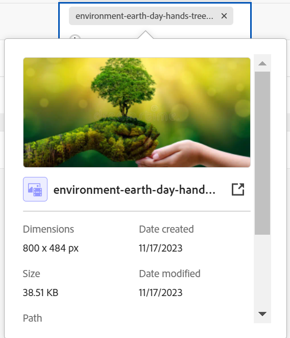

<!--when you make this live, update the metadata above to this: 
---
title: Connect records and objects
description: In addition to connecting records to one another, you can also connect records to objects from other applications.  
topic: Architecture
role: User
hidefromtoc: yes
hide: yes
---
-->
<!--update the metadata with real information when making this available in TOC and in the left nav-->

<!--if you change steps here, also update steps in the "Connect records" article-->

# Connecter des enregistrements

{{planning-important-intro}}

Vous pouvez connecter des enregistrements d’Adobe Workfront Planning les uns aux autres ou aux objets d’autres applications.

Cet article décrit comment connecter des enregistrements. Pour plus d’informations sur la connexion des enregistrements, voir [Présentation des enregistrements connectés](/help/quicksilver/planning/records/connected-records-overview.md).

Vous devez d’abord connecter deux types d’enregistrement l’un à l’autre, ou un type d’enregistrement à un type d’objet à partir d’une autre application. Cela crée des champs d’enregistrement liés. Vous pouvez ensuite connecter des enregistrements les uns aux autres ou des enregistrements à d’autres objets à partir d’autres applications à l’aide des champs d’enregistrement liés.

La connexion d’enregistrements est similaire à la connexion d’enregistrements à des objets à partir d’une autre application.

Pour plus d’informations sur la connexion des types d’enregistrement les uns aux autres ou sur les types d’objets d’autres applications, voir [Connecter des types d’enregistrement](/help/quicksilver/planning/architecture/connect-record-types.md).

Pour un exemple de connexion des types d’enregistrement, voir [Exemple de connexion de types d’enregistrement et d’enregistrements](/help/quicksilver/planning/architecture/example-connect-record-types-and-records.md).

Vous pouvez connecter les éléments suivants :

* Enregistrements d’Adobe Workfront Planning
* Enregistrements d’Adobe Workfront Planning avec des objets provenant d’autres applications

  Vous pouvez connecter des enregistrements à des objets des types répertoriés ci-dessous à partir des applications suivantes :

   * Adobe Workfront

      * Projets
      * Portefeuilles
      * Programmes
      * Entreprise
      * Groupe

   * Adobe Experience Manager Assets

      * Fichiers d’image
      * Dossiers

  <!--when you add more objects, fix the Access Requirements below which right now refer only to projects-->

## Conditions d’accès

+++ Développez pour afficher les exigences d’accès à la planification Workfront.

<table style="table-layout:auto">
 <col>
 </col>
 <col>
 </col>
 <tbody>
    <tr>
<tr>
<td>Produit
 </td>
   <td>
   
 Adobe Workfront
 
   
Pour connecter les enregistrements de planification Adobe Workfront à Experience Manager Assets, vous devez disposer d’une licence Adobe Experience Manager Assets et l’instance de Workfront de votre entreprise doit être intégrée à l’expérience unifiée Adobe. Pour plus d’informations, voir <a href="/help/quicksilver/workfront-basics/navigate-workfront/workfront-navigation/adobe-unified-experience.md">Adobe Unified Experience for Workfront</a>.

   </td>
  </tr>  
 <td role="rowheader">
Accord Adobe Workfront
</td>
   <td>

Votre entreprise doit être inscrite à l’étape d’accès anticipé pour la planification Workfront 

   </td>
  </tr>
  <tr>
   <td role="rowheader">
Forfait Adobe Workfront
</td>
   <td>

N’importe quelle

   </td>
  </tr>
  <tr>
   <td role="rowheader">
Licence Adobe Workfront*
</td>
   <td>
   
Nouvelle : standard

   
Actuelle : formule
 
  </td>
  </tr>

<tr>
   <td role="rowheader">
Configuration du niveau d’accès
</td>
   <td> 
Il n’existe aucun contrôle de niveau d’accès pour Workfront Planning
  
</td>
  </tr>
<tr>
   <td role="rowheader">
Autorisations
</td>
   <td> 
Gérer les autorisations d’un espace de travail pour connecter des enregistrements 
  
   
Afficher ou des autorisations supérieures à un espace de travail pour afficher toutes les connexions aux objets et aux champs d’autres applications, quel que soit votre accès dans l’autre application. 

   
Afficher ou des autorisations supérieures aux objets que vous souhaitez lier à partir de Workfront ou Experience Manager Assets. 

   
Les équipes d’administration système ont des droits sur tous les espaces de travail, y compris ceux qu’elles n’ont pas créés.

</td>
  </tr>

<tr>
   <td role="rowheader">
Modèle de disposition
</td>
   <td> 
Votre administrateur ou administratrice Workfront ou de groupes doit ajouter la zone Planning dans votre modèle de disposition. Pour plus d’informations, voir <a href="/help/quicksilver/planning/access/access-overview.md">Vue d’ensemble des accès</a>. 
  
</td>
  </tr>

</tbody>
</table>

Pour plus d’informations, consultez les [Conditions d’accès dans la documentation de Workfront](/help/quicksilver/administration-and-setup/add-users/access-levels-and-object-permissions/access-level-requirements-in-documentation.md).

+++

<!--Maybe enable this at GA - but Planning is not supposed to have Access controls in the Workfront Access Level: 
>[!NOTE]
>
>If you don't have access, ask your Workfront administrator if they set additional restrictions in your access level. For information on how a Workfront administrator can change your access level, see [Create or modify custom access levels](/help/quicksilver/administration-and-setup/add-users/configure-and-grant-access/create-modify-access-levels.md). -->

## Prérequis pour la connexion des enregistrements

Pour connecter des enregistrements à d&#39;autres enregistrements ou objets, vous devez disposer des éléments suivants :

* Au moins un espace de travail, un type d’enregistrement et un enregistrement

  Pour plus d’informations, consultez les articles suivants :

   * [Créer des espaces de travail](/help/quicksilver/planning/architecture/create-workspaces.md)
   * [Créer des types d’enregistrements](/help/quicksilver/planning/architecture/create-record-types.md)
   * [Créer des enregistrements](/help/quicksilver/planning/records/create-records.md)

* Connexions entre types d’enregistrement ou entre types d’enregistrement et objets d’autres applications Pour plus d’informations, voir [Connecter des types d’enregistrement](/help/quicksilver/planning/architecture/connect-record-types.md).

## Connexion d’enregistrements à partir de Workfront Planning

Vous pouvez connecter des enregistrements de Workfront Planning dans les zones suivantes :

* À partir d’un enregistrement Planning dans Workfront Planning dans les champs d’enregistrement connectés dans la vue de tableau.
* À partir d’un enregistrement Planning dans Workfront Planning dans l’aperçu de l’enregistrement ou la page dans les champs d’enregistrement connectés.
  <!--
  * From a Planning record in Workfront Planning in the record preview or page in the connected record fields on the Details tab.
  * From a Planning record in the record's preview or page on the Connections tab.-->

### Connecter les enregistrements de planification Adobe Workfront à partir de la vue de table ou de la page d’enregistrement <!--Details tab of the-->

{{step1-to-planning}}

1. Cliquez sur l&#39;espace de travail dont vous souhaitez connecter les enregistrements.

   L’espace de travail s’ouvre et les types d’enregistrement s’affichent sous forme de cartes.
1. Cliquez sur la vignette d’un type d’enregistrement pour ouvrir la page du type d’enregistrement.
1. Cliquez sur le nom d&#39;une vue **Table** pour l&#39;ouvrir.
1. (Facultatif) Ajoutez des enregistrements au type d’enregistrement que vous avez sélectionné en ajoutant une nouvelle ligne au tableau. Pour plus d’informations, consultez la section [Créer des enregistrements](/help/quicksilver/planning/records/create-records.md).
1. (Le cas échéant) Une fois que vous avez connecté le type d’enregistrement sélectionné à un autre type d’enregistrement, accédez à la colonne de l’enregistrement lié et double-cliquez sur la cellule correspondant à l’enregistrement que vous souhaitez lier à d’autres enregistrements.

   

1. Utilisez l’une des méthodes suivantes :

   * Cliquez sur le nom d’un enregistrement connecté dans la liste pour l’ajouter à l’enregistrement sélectionné. L’enregistrement est ajouté automatiquement.
   * Commencez à saisir le nom d’un enregistrement et cliquez dessus lorsqu’il s’affiche dans la liste. L’enregistrement est ajouté automatiquement.

   <!--1. (Optional) If you cannot find a record or an object to connect, and you want to add it, click **+ Add** to add a new record. For more information, see the "Create records as you connect them" in the article [Create records](/help/quicksilver/planning/records/create-records.md).
    
    You can also create projects and portfolios by adding them to a record in the connected record field. You can create only blank projects, without a template by adding them to a record. 
    
     -->

   >[!TIP]
   >
   >    Vous pouvez ouvrir la page d’un enregistrement en cliquant sur le nom de l’enregistrement dans la vue, recherchez le champ d’enregistrement lié et double-cliquez sur le champ (s’il existe déjà des enregistrements connectés), ou cliquez sur **Connecter des enregistrements** (si le champ est vide) pour ajouter des enregistrements de l’enregistrement ou du type d’objet connecté.
   >
   >

1. (Facultatif) Cliquez sur **Afficher tout** pour afficher tous les enregistrements.

1. (Conditionnel) Si vous avez cliqué sur **Afficher tout** à l’étape précédente, la zone **Connecter des objets** s’affiche.

   

1. Commencez à saisir le nom d’un enregistrement dans la zone de recherche, puis sélectionnez-le lorsqu’il apparaît dans la liste.

   Ou

   Sélectionnez le nom d&#39;un ou plusieurs enregistrements dans la zone, puis cliquez sur **Connecter des objets**.

   Les éléments suivants sont ajoutés :

   * Les enregistrements liés s&#39;affichent dans le champ enregistrement lié de l&#39;enregistrement que vous avez sélectionné à l&#39;étape précédente.
   * Les champs liés sont renseignés avec les informations des enregistrements liés, si vous avez ajouté des champs de recherche liés lorsque vous avez connecté les types d’enregistrements.

   La mise à jour des enregistrements liés met à jour automatiquement les champs liés pour les enregistrements à partir desquels vous effectuez la liaison. Vous ne pouvez pas modifier manuellement les champs liés.

   >[!TIP]
   >
   >* Les termes « champs liés » et « champs de recherche » désignent le même concept.
   >
   >* Lorsque vous choisissez de connecter plusieurs enregistrements lorsque vous connectez les types d&#39;enregistrements, les valeurs des champs de plusieurs objets sont affichées séparées par des virgules ou sont agrégées selon l&#39;agrégateur que vous avez choisi.

1. (Facultatif) Fermez la page du type enregistrement et accédez à l’espace de travail que vous avez sélectionné.
1. Cliquez sur la carte correspondant au type d’enregistrement que vous avez lié.

   Par exemple, si vous avez lié l’enregistrement **Campagne** à l’enregistrement Produit, cliquez sur la carte **Produit**.

   La carte du type d’enregistrement doit s’ouvrir dans la vue tableau. Dans le cas contraire, sélectionnez une vue tableau.

   Notez que le champ d’enregistrement lié **Campagne** affiche les noms des campagnes auxquelles vous avez lié des produits dans la page du type d’enregistrement Produit. La mise à jour des informations de l’enregistrement Campagne met automatiquement à jour le champ d’enregistrement lié à celui-ci pour le type d’enregistrement Produit.

### Connecter des enregistrements de planification Adobe Workfront à des objets Workfront depuis la vue de table ou la page d’enregistrement <!--Details tab of the-->

<!--when we will have more applications to link to from Planning, change the title to something like: Connect Workfront Planning records to objects from other applications-->

Une fois que vous avez créé une connexion entre un type d’enregistrement et un type d’objet Workfront, vous pouvez connecter des enregistrements individuels à des objets dans Workfront. Les champs Workfront que vous avez connectés sont automatiquement renseignés sur les enregistrements à partir desquels vous liez les objets.

>[!NOTE]
>
>Vous ne pouvez pas connecter les types d’objets Workfront aux types d’enregistrement Workfront Planning de Workfront.

{{step1-to-planning}}

1. Cliquez sur l&#39;espace de travail dont vous souhaitez vous connecter.

   L’espace de travail s’ouvre et les types d’enregistrement s’affichent sous forme de cartes.
1. Cliquez sur la vignette d’un type d’enregistrement pour ouvrir la page du type d’enregistrement.
1. Sélectionnez une vue de **Tableau** dans le menu déroulant **Afficher**.

1. Cliquez sur **Nouvel enregistrement** pour ajouter des enregistrements individuels au type d’enregistrement que vous avez sélectionné. Pour plus d’informations, voir [Créer des enregistrements](/help/quicksilver/planning/records/create-records.md).
1. (Conditionnel) Une fois que vous avez connecté le type d’enregistrement sélectionné à un type d’objet Workfront, accédez à la colonne d’objet lié et double-cliquez sur la cellule correspondant à l’enregistrement que vous souhaitez lier aux objets de Workfront.

   

1. Utilisez l’une des méthodes suivantes :

   * Cliquez sur un objet dans la liste pour l’ajouter à l’enregistrement sélectionné. Les objets sont répertoriés par ordre alphabétique. L’objet est ajouté automatiquement.
   * Commencez à saisir le nom d’un objet et cliquez dessus lorsqu’il s’affiche dans la liste. L’objet est ajouté automatiquement.

   >[!TIP]
   >
   >Vous pouvez ouvrir la page d’un enregistrement à partir de la vue, double-cliquer sur le champ d’enregistrement lié ou cliquer sur **Se connecter** dans le champ pour ajouter des objets du type d’objet connecté.

1. (Facultatif) Cliquez sur **Afficher tout** pour afficher tous les objets que vous avez au moins les autorisations d’afficher.

1. (Conditionnel) Si vous avez cliqué sur **Afficher tout** à l’étape précédente, la zone **Connecter des objets** s’affiche.

   

1. Commencez à saisir le nom d’un objet Workfront dans la zone de recherche, puis sélectionnez-le lorsqu’il s’affiche dans la liste.

   Ou

   Sélectionnez le nom d&#39;un ou plusieurs objets dans la zone, puis cliquez sur **Connecter des objets**.

   >[!IMPORTANT]
   >
   >* Vous ne pouvez ajouter que des objets Workfront auxquels vous avez accès en affichage.
   >
   >* Une fois que vous avez ajouté des objets Workfront, toutes les personnes disposant d’autorisations d’affichage ou supérieures sur l’espace de travail peuvent afficher les objets Workfront et leurs informations de champ, indépendamment de leurs autorisations ou de leur accès dans Workfront.

   Les éléments suivants sont ajoutés :

   * Les objets Workfront sélectionnés sont ajoutés au champ d’enregistrement lié.
   * Si vous les avez ajoutés lorsque vous avez connecté le type d’enregistrement à Workfront, les champs liés (ou les champs de recherche) des objets Workfront sont automatiquement renseignés avec les informations de Workfront.

   Pour plus d’informations sur la connexion des types d’enregistrement à des objets à partir d’une autre application, voir [Connecter des types d’enregistrements](/help/quicksilver/planning/architecture/connect-record-types.md).

1. (Facultatif) Cliquez sur le nom d’un objet Workfront connecté à un enregistrement Workfront Planning dans le champ lié d’une vue de tableau ou du champ lié dans la page d’enregistrement.

   L’objet Workfront s’ouvre alors dans Workfront, si vous disposez au moins des autorisations d’affichage sur l’objet.

   >[!TIP]
   >
   >* Lorsque vous choisissez de connecter plusieurs enregistrements lors de la connexion des types d&#39;enregistrements, les valeurs des champs de recherche sont affichées séparées par des virgules ou sont agrégées en fonction de l&#39;agrégateur que vous avez choisi.
   >
   >* Un champ d’enregistrement lié n’est pas créé pour les objets Workfront liés dans Workfront.

1. (Facultatif) Dans la vue de tableau du type d’enregistrement, pointez sur l’en-tête de colonne de l’objet Workfront lié, cliquez sur le menu déroulant, puis sur **Modifier les champs de recherche**.

1. Ajoutez des champs d’objet Workfront à partir de la zone **Champs non sélectionnés**

   Ou

   Supprimez des champs d’objet Workfront à partir de la zone **Champs sélectionnés**.

   Cela permet d’ajouter ou de supprimer des champs liés dans les enregistrements Workfront Planning. Les informations associées aux champs supprimés restent dans Workfront.

### Connecter des enregistrements de planification Workfront à des objets Adobe Experience Manager à partir de la vue de table ou de la page d’enregistrement <!--Details tab of the-->

<!--when we will have more applications to link to from Planning, change the title to something like: Connect Workfront Planning records to objects from other applications-->

>[!IMPORTANT]
>
>Vous devez disposer d’une licence Adobe Experience Manager Assets et l’instance Workfront de votre entreprise doit être intégrée à Adobe Business Platform ou à Adobe Admin Console pour pouvoir connecter des enregistrements Workfront Planning à Adobe Experience Manager Assets.
>
>Si vous avez des questions relatives à l’intégration à Adobe Admin Console, voir les [Questions fréquentes sur Adobe Unified Experience](/help/quicksilver/workfront-basics/navigate-workfront/workfront-navigation/unified-experience-faq.md).

Après avoir créé une connexion entre un type d’enregistrement et Adobe Experience Manager Assets, vous pouvez connecter des enregistrements individuels à des ressources Experience Manager. Les champs de ressource que vous avez connectés à partir d’Experience Manager Assets lors de la création de la connexion sont automatiquement renseignés sur le type d’enregistrement à partir duquel vous avez créé un lien.

>[!NOTE]
>
>La planification des enregistrements et de leurs champs est accessible à partir de Experience Manager Assets lorsque votre administrateur Workfront configure le mappage des métadonnées par le biais de l’intégration entre Workfront et Adobe Experience Manager Assets. Pour plus d’informations, voir [Configuration du mappage des métadonnées de ressource entre Adobe Workfront et Experience Manager Assets](https://experienceleague.adobe.com/docs/experience-manager-cloud-service/content/assets/integrations/configure-asset-metadata-mapping.html?lang=fr).

Pour connecter des enregistrements à des ressources AEM :

{{step1-to-planning}}

1. Cliquez sur l&#39;espace de travail dont vous souhaitez vous connecter.

   L’espace de travail et les types d’enregistrement s’affichent.
1. Cliquez sur la vignette d’un type d’enregistrement pour ouvrir la page du type d’enregistrement.
1. Sélectionnez une vue de **Tableau** dans le menu déroulant **Afficher** dans le coin supérieur droit de la page du type d’enregistrement.

1. (Facultatif) Cliquez sur **Nouvel enregistrement** pour ajouter des enregistrements au type d’enregistrement que vous avez sélectionné. Pour plus d’informations, voir [Créer des enregistrements](/help/quicksilver/planning/records/create-records.md).
1. (Le cas échéant) Une fois que vous avez connecté le type d’enregistrement sélectionné à Experience Manager Assets, accédez à la colonne d’objet lié et pointez sur la cellule correspondant à l’enregistrement que vous souhaitez lier à d’autres objets d’Experience Manager, puis cliquez sur l’icône **+**.

   >[!TIP]
   >
   >  Vous pouvez ajouter l’icône **+** dans le champ d’objet lié de la page d’enregistrement pour connecter les ressources à l’enregistrement.

   La zone **Sélectionner les ressources** s’affiche. <!--we might change this to Connect assets-->

   

1. Cliquez pour sélectionner certains des types de ressources suivants :

   * Images
   * Dossiers

   Vous pouvez sélectionner plusieurs ressources.

   >[!IMPORTANT]
   >
   > Vous pouvez connecter uniquement les ressources que vous pouvez afficher dans Experience Manager. Une fois connectées, toutes les personnes de Workfront Planning peuvent afficher les ressources dans Workfront Planning, quel que soit leur accès dans Experience Manager Assets.

1. Cliquez sur **Sélectionner**. <!-- we might change this to Connect-->

   Les éléments suivants sont ajoutés :

   * Les ressources d’Experience Manager sélectionnées sont ajoutées au champ d’enregistrement lié.
   * Les champs liés (ou champs de recherche) sont renseignés avec les informations des ressources connectées d’Experience Manager.

     Toutes les informations existantes provenant des champs des ressources d’Experience Manager s’affichent automatiquement dans les champs liés ou de recherche.

     >[!TIP]
     >
     >* Lorsque vous choisissez de connecter plusieurs enregistrements lors de la connexion des types d&#39;enregistrements, les valeurs de plusieurs objets s&#39;affichent séparés par des virgules ou agrégés selon l&#39;agrégateur que vous choisissez.
     >
     >* Un champ d’enregistrement lié aux enregistrements liés de Workfront Planning n’est pas créé pour les ressources de Experience Manager liées dans l’application Experience Manager Assets.

1. (Facultatif) Accédez au type d’enregistrement à partir duquel vous avez créer un lien ver Experience Manager Assets et cliquez sur le nom d’une ressource dans le champ d’enregistrement lié. Les détails Experience Manager de la ressource s’affichent dans une fenêtre contextuelle. <!--update screen shot with hi-rez picture-->

   

   Les champs suivants s’affichent pour un fichier image :

   * Miniature de l’image
   * Nom du fichier image
   * Dimensions
   * Taille
   * Description
   * Chemin d’accès dans Experience Manager
   * Type de fichier
   * Date de création
   * Date de modification

1. (Facultatif) Pour ouvrir la page d’enregistrement des ressources Experience Manager dans Experience Manager, accédez à la page de type d’enregistrement de l’enregistrement à partir duquel vous liez, cliquez sur le nom d’une ressource dans le champ d’enregistrement lié pour ouvrir la fenêtre contextuelle, puis cliquez sur l’icône **Ouvrir dans AEM**  pour ouvrir la ressource.

   Cette opération ouvre la ressource Experience Manager dans Adobe Experience Manager Assets.

1. (Facultatif) Dans la vue Tableau du type d’enregistrement, pointez sur l’en-tête de colonne de la ressource Experience Manager liée, cliquez sur le menu déroulant, puis sur **Modifier les champs de recherche**.

1. Ajoutez des champs d’objet Experience Manager Assets à partir de la zone **Champs non sélectionnés**

   Ou

   Supprimez des champs d’objet Workfront de la zone **Champs sélectionnés**.

   Cela permet d’ajouter ou de supprimer des champs liés des enregistrements. Les informations associées aux champs supprimés restent dans Adobe Experience Assets.

<!--
### Connect Workfront Planning records from the Connections tab of the record page

1. Go to any view of a record type that has been connected to other record types or object types from other applications. 
1. Follow the steps described in the previous subsections to find a record in the view that you want to connect with other records or objects. 
1. Click the name of a record. 

    The preview page opens. 
1. (Optional) Click the **Open in new tab** icon  to open the record's page. 
1. Click the **Connections** tab in the record's preview or page. 

    

    All record or object types that are linked to the selected record type display as sections. Connected records or objects display under their record or object type names on cards. 

    >[!TIP]
    >
    >    Only connected records that have individual records connected display by default.

1. (Optional) Click **Show all connections** to show all connected record types, including the ones without connected records. 

1. (Optional) Click the downward-pointing arrow to the left of a section to collapse it. 

1. (Conditional) If there are records or objects connected to the selected record, click **Connect** to add more records or objects of the same type. 
    The Connect button does not display if there are no records currently connected to the selected record. 
1. Follow the steps describes in the previous sections to connect records from Workfront Planning or objects from Workfront or AEM Assets. 
    The records and objects are added immediately.
1. (Optional) Hover over the connected card of a record or object, then click the **Disconnect record** icon to disconnect it from the selected record. 

    

    The record is immediately disconnected from all areas of Workfront Planning or from other applications where it might show as connected. Any lookup field values are also removed. 

-->

## Connexion d’enregistrements à partir d’objets Workfront

Vous devez disposer des éléments suivants pour connecter les enregistrements Workfront Planning des objets Workfront :

* Connexions entre les types d’enregistrements et les types d’objets Workforce qui sont établis dans Workfront Planning.
* L’administrateur de Workfront ou de groupe doit ajouter la section Planification aux types d’objets Workfront qui peuvent se connecter à la section Planification des types d’enregistrements dans votre modèle de mise en page.

Pour plus d’informations, voir [Gestion des enregistrements dans la section Planification des objets Adobe Workfront](/help/quicksilver/planning/records/manage-records-in-planning-section.md).
