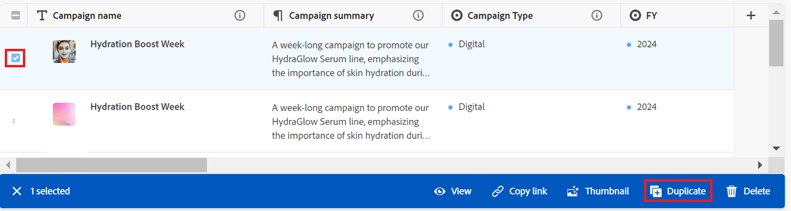

# Dupliquer les enregistrements

<!--The highlighted information on this page refers to functionality not yet generally available. It is available only in the Preview environment for all customers. After the monthly releases to Production, the same features are also available in the Production environment for customers who enabled fast releases.    

For information about fast releases, see [Enable or disable fast releases for your organization](/help/quicksilver/administration-and-setup/set-up-workfront/configure-system-defaults/enable-fast-release-process.md). -->

{{planning-important-intro}}

Dans Adobe Workfront Planning, un enregistrement est une instance d’un type d’enregistrement.

Vous pouvez dupliquer un enregistrement existant dans la vue Tableau. Une copie identique de l’enregistrement existant est ajoutée à la page du type d’enregistrement.

## Conditions d’accès

+++ Développez pour afficher les exigences d’accès.

Vous devez disposer des accès suivants pour effectuer les étapes décrites dans cet article :

<table style="table-layout:auto"> 
<col> 
</col> 
<col> 
</col> 
<tbody> 
    <tr> 
<tr> 
<td> 
   
 Produits
 </td> 
   <td> 
   <ul><li>
 Adobe Workfront
</li> 
   <li>
 Planification d’Adobe Workfront
</li></ul></td> 
  </tr>   
<tr> 
   <td role="rowheader">
Formule Adobe Workfront*
</td> 
   <td> 

L’un des plans Workfront suivants :
 
<ul><li>Sélectionner</li> 
<li>Principal</li> 
<li>Final</li></ul> 

Workfront Planning n’est pas disponible pour les plans Workfront hérités
 
   </td> 
<tr> 
   <td role="rowheader">
Package Adobe Workfront Planning*
</td> 
   <td> 

Tous 
 

Pour plus d’informations sur les éléments inclus dans chaque plan de planification Workfront, contactez votre gestionnaire de compte Workfront. 
 
   </td> 
 <tr> 
   <td role="rowheader">
Plateforme Adobe Workfront
</td> 
   <td> 

L’instance de Workfront de votre organisation doit être intégrée à l’expérience unifiée Adobe pour pouvoir accéder à Workfront Planning.
 

Pour plus d’informations, voir <a href="/help/quicksilver/workfront-basics/navigate-workfront/workfront-navigation/adobe-unified-experience.md">Adobe Unified Experience pour Workfront</a>. 
 
   </td> 
   </tr> 
  </tr> 
  <tr> 
   <td role="rowheader">
Licence Adobe Workfront*
</td> 
   <td>
 Standard

   
Workfront Planning n’est pas disponible pour les licences Workfront héritées
 
  </td> 
  </tr> 
  <tr> 
   <td role="rowheader">
Configuration du niveau d’accès
</td> 
   <td> 
Il n’existe aucun contrôle de niveau d’accès pour Adobe Workfront Planning.
   
</td> 
  </tr> 
<tr> 
   <td role="rowheader">
Autorisations d’objet
</td> 
   <td>   
Autorisations de niveau Contribution ou supérieur à un espace de travail et à un type d’enregistrement</a> 
  
   
L’administration système a accès à tous les espaces de travail, y compris ceux qu’elle n’a pas créés.
 </td> 
  </tr> 
</tbody> 
</table>

* Pour plus d’informations sur les exigences d’accès à Workfront, voir [Conditions d’accès requises dans la documentation Workfront](/help/quicksilver/administration-and-setup/add-users/access-levels-and-object-permissions/access-level-requirements-in-documentation.md).

+++

## Dupliquer une <!--in a record type table (I don't think you can create them elsewhere right now)--> d’enregistrement

Vous pouvez créer des enregistrements dans la vue Tableau d&#39;une page de type d&#39;enregistrement en dupliquant une page existante. Un enregistrement identique à l&#39;enregistrement existant est créé et ajouté sous l&#39;enregistrement d&#39;origine.

{{step1-to-planning}}

1. Cliquez sur l’espace de travail dans lequel vous souhaitez ajouter des enregistrements.

   L’espace de travail s’ouvre et les types d’enregistrements s’affichent sous forme de cartes.

1. Cliquez sur la vignette d’un type d’enregistrement pour plus de détails. Pour plus d’informations sur la création d’un type d’enregistrement, consultez la section [Créer des types d’enregistrement](/help/quicksilver/planning/architecture/create-record-types.md).

   La page du type d’enregistrement s’ouvre dans la dernière vue à laquelle vous avez accédé. Par défaut, une page de type enregistrement s’ouvre sous la forme d’un tableau.
Tous les enregistrements du type sélectionné s&#39;affichent dans la vue.

1. (Conditionnel) Sélectionnez une vue de tableau.

1. Utilisez l’une des méthodes suivantes :

   * Pointez sur le nom d’un enregistrement, puis cliquez sur le menu **Plus** aligné avec le nom d’enregistrement, puis cliquez sur l’icône **Dupliquer**  .

     

   * Sélectionnez un enregistrement, puis cliquez sur l&#39;icône **Dupliquer**  dans la barre d&#39;outils située en bas de la page.

     

   Un enregistrement identique avec un nom identique est créé sous l’enregistrement d’origine. Tous les champs du nouvel enregistrement sont remplis avec les mêmes informations que dans l&#39;enregistrement d&#39;origine.

1. (Facultatif) Commencez à mettre à jour les informations sur le nouvel enregistrement dans les champs disponibles en mode Tableau ou cliquez sur l’enregistrement et mettez à jour les informations dans la page ou l’aperçu de l’enregistrement.

   >[!NOTE]
   >
   >  * Il n’y a pas de champs obligatoires pour les enregistrements. Toutefois, nous vous recommandons d&#39;ajouter des informations pour le champ principal d&#39;un enregistrement, car il est utile d&#39;identifier les enregistrements lors de la liaison d&#39;enregistrements entre eux. Pour plus d’informations sur les champs principaux, consultez [Gérer la vue du tableau](/help/quicksilver/planning/views/manage-the-table-view.md) et la présentation des champs de Principal .
   >
   >  * Les champs qui renvoient à d’autres types d’enregistrements ou à des champs calculés sont en lecture seule.

   Pour plus d&#39;informations sur la modification des enregistrements, voir [Modifier les enregistrements](/help/quicksilver/planning/records/edit-records.md).

1. (Facultatif) Utilisez les raccourcis clavier suivants pour annuler ou rétablir l’ajout de nouveaux enregistrements ou de leurs informations lors de leur ajout en mode Tableau :

   * Ctrl + Z (⌘ + Z pour Mac) pour annuler une modification
   * Ctrl+Maj+Z (⌘+Maj+Z pour Mac) pour rétablir une modification.
