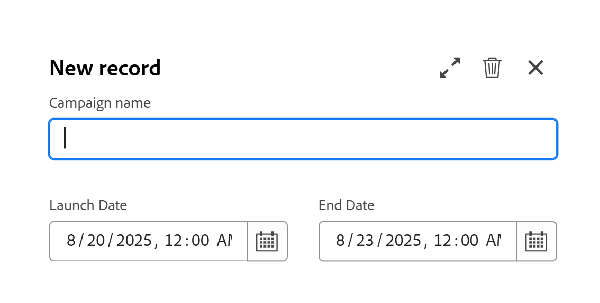

# Créer des enregistrements

<!--
The highlighted information on this page refers to functionality not yet generally available. It is available only in the Preview environment for all customers. After the monthly releases to Production, the same features are also available in the Production environment for customers who enabled fast releases.    

For information about fast releases, see [Enable or disable fast releases for your organization](/help/quicksilver/administration-and-setup/set-up-workfront/configure-system-defaults/enable-fast-release-process.md). 

-->

{{planning-important-intro}}

Dans Adobe Workfront Planning, un enregistrement est une instance d’un type d’enregistrement.

Vous pouvez créer des enregistrements en effectuant l’une des opérations suivantes :

* [Utilisez le bouton Nouvel enregistrement ou Demander un enregistrement depuis n&#39;importe quelle vue de type d&#39;enregistrement](#create-records-using-the-new-record-or-request-record-button-from-any-record-type-view)
* [Ajoutez-les en ligne à partir de la vue de tableau du type d’enregistrement](#create-records-by-adding-them-inline-from-the-record-type-table-view)
* [Ajoutez-les dans la vue chronologique du type d’enregistrement.](#create-records-by-adding-them-in-the-record-type-timeline-view)
* [Ajoutez-les dans la vue Calendrier du type d’enregistrement](#create-records-by-adding-them-in-the-record-type-calendar-view)
* [Copier-coller une liste d&#39;enregistrements depuis une liste externe](#create-records-by-copying-and-pasting-them-from-an-external-list)
* [Dupliquer les enregistrements depuis une vue Tableau](#create-records-by-duplicating-them)
* [Les connecter à partir d&#39;autres enregistrements](#create-records-as-you-connect-them)
* [Envoyer un formulaire de demande à un type d’enregistrement](#create-records-by-submitting-a-request-form-to-a-record-type)
* [Importer des informations depuis un fichier CSV ou Excel](#create-records-by-importing-records-from-a-csv-or-excel-file)
* [Utiliser les automatisations](#create-records-by-using-automations)

Pour plus d’informations sur la gestion des enregistrements dans les vues « Tableau » ou « Chronologie », consultez les articles suivants :

* [Gérer la vue de tableau](/help/quicksilver/planning/views/manage-the-table-view.md)
* [Gérer la vue chronologique](/help/quicksilver/planning/views/manage-the-timeline-view.md)

## Conditions d’accès

+++ Développez pour afficher les conditions d’accès requises pour la fonctionnalité de cet article. 

<table style="table-layout:auto"> 
<col> 
</col> 
<col> 
</col> 
<tbody> 
    <tr> 
<tr> 
</tr>   
<tr> 
   <td role="rowheader">
Package Adobe Workfront
</td> 
   <td> 

Tout Workfront et tout package Planning
 
Tout workflow et tout package Planning

Pour plus d’informations sur les composants inclus dans chaque package Workfront Planning, contactez votre représentant de compte Workfront. 
 
   </td> 
  <tr> 
   <td role="rowheader">
Licence Adobe Workfront
</td> 
   <td>
Standard

   </td> 
  </tr> 
  <tr> 
   <td role="rowheader">
Autorisations d’objet
</td> 
   <td> 
Autorisations de niveau Contribution ou supérieur à l’espace de travail et au type d’enregistrement dans lesquels vous souhaitez ajouter des enregistrements. 

   
Autorisations d’affichage ou supérieures pour l’espace de travail et le type d’enregistrement pour créer des enregistrements à l’aide du bouton Demander un enregistrement sur la page d’enregistrement

   
L’administration système a accès à tous les espaces de travail, y compris ceux qu’elle n’a pas créés.

   
Gérez les autorisations sur les objets Workfront (portfolios) pour ajouter des objets enfants (projets).

   </td> 
  </tr>  
</tbody> 
</table>

Pour plus d’informations sur les exigences d’accès à Workfront, voir [Exigences d’accès dans la documentation de Workfront](/help/quicksilver/administration-and-setup/add-users/access-levels-and-object-permissions/access-level-requirements-in-documentation.md).

+++   

<!--Old:
<table style="table-layout:auto"> 
<col> 
</col> 
<col> 
</col> 
<tbody> 
    <tr> 
<tr> 
<td> 
   
 Products
 </td> 
   <td> 
   <ul><li>
 Adobe Workfront
</li> 
   <li>
 Adobe Workfront Planning
</li></ul></td> 
  </tr>   
<tr> 
   <td role="rowheader">
Adobe Workfront plan*
</td> 
   <td> 

Any of the following Workfront plans:
 
<ul><li>Select</li> 
<li>Prime</li> 
<li>Ultimate</li></ul> 

Workfront Planning is not available for legacy Workfront plans
 
   </td> 
<tr> 
   <td role="rowheader">
Adobe Workfront Planning package*
</td> 
   <td> 

Any 
 

For more information about what is included in each Workfront Planning plan, contact your Workfront account manager. 
 
   </td> 
 <tr> 
   <td role="rowheader">
Adobe Workfront platform
</td> 
   <td> 

Your organization's instance of Workfront must be onboarded to the Adobe Unified Experience to be able to access Workfront Planning.
 

For more information, see <a href="/help/quicksilver/workfront-basics/navigate-workfront/workfront-navigation/adobe-unified-experience.md">Adobe Unified Experience for Workfront</a>. 
 
   </td> 
   </tr> 
  </tr> 
  <tr> 
   <td role="rowheader">
Adobe Workfront license*
</td> 
   <td> Standard
   
Workfront Planning is not available for legacy Workfront licenses
 
  </td> 
  </tr> 
  <tr> 
   <td role="rowheader">
Access level configuration
</td> 
   <td> 
There are no access level controls for Adobe Workfront Planning
 
   
Edit access in Workfront for the object types that you want to create (projects, programs, and portfolios) as you connect the records to them. 
  
</td> 
  </tr> 
<tr> 
   <td role="rowheader">
Object permissions
</td> 
   <td> 
Contribute or higher permissions to the workspace and record type where you want to add records. 

   
View or higher permissions to the workspace and record type to create records using the Request record button on the record page

   
System Administrators have permissions to all workspaces, including the ones they did not create

   
Manage permissions to Workfront objects (portfolios) to add children objects (projects).

   </td> 
  </tr> 

</tbody> 
</table> -->

## Remarques concernant la création d’enregistrements

* En fonction de l’espace de travail à partir duquel ils sont ajoutés, les enregistrements ajoutés aux types d’enregistrements globaux sont visibles par les types d’utilisateurs suivants :

   * Les enregistrements ajoutés à l’espace de travail d’origine d’un type d’enregistrement global sont visibles à partir de l’espace de travail d’origine.
   * Les enregistrements ajoutés à un espace de travail secondaire d&#39;un type d&#39;enregistrement global ne sont visibles qu&#39;à partir de l&#39;espace de travail dans lequel ils ont été créés et de l&#39;espace de travail d&#39;origine du type d&#39;enregistrement global.
Pour plus d’informations, voir [&#x200B; Présentation du type d’enregistrement de l’espace de travail croisé &#x200B;](/help/quicksilver/planning/architecture/cross-workspace-record-types-overview.md).

* En fonction de leurs autorisations sur l’espace de travail et des types d’enregistrements, les utilisateurs peuvent créer des enregistrements des manières suivantes :

   * Les utilisateurs disposant d’autorisations en lecture seule sur l’espace de travail et du type d’enregistrement peuvent créer des enregistrements uniquement à l’aide du bouton Demander l’enregistrement sur la page du type d’enregistrement.
   * Les utilisateurs disposant d’autorisations de niveau Contribuer et Gérer sur l’espace de travail et le type d’enregistrement peuvent créer des enregistrements à l’aide du bouton Nouvel enregistrement de la page du type d’enregistrement.

  >[!IMPORTANT]
  >
  >Un gestionnaire d’espace de travail doit créer un formulaire de demande pour le type d’enregistrement afin que les utilisateurs disposant des autorisations d’affichage puissent ajouter des enregistrements à l’aide d’un formulaire de demande. Dans le cas contraire, les utilisateurs disposant d’une autorisation d’affichage ne peuvent pas créer d’enregistrements.

## Créez des enregistrements à l’aide du bouton Nouvel enregistrement ou Demander un enregistrement depuis n’importe quelle vue de type d’enregistrement

{{step1-to-planning}}

1. Cliquez sur l’espace de travail dans lequel vous souhaitez ajouter des enregistrements.

   L’espace de travail s’ouvre et les types d’enregistrements s’affichent sous forme de cartes.

1. Cliquez sur la vignette d’un type d’enregistrement pour plus de détails. Pour plus d’informations sur la création d’un type d’enregistrement, consultez la section [Créer des types d’enregistrement](/help/quicksilver/planning/architecture/create-record-types.md).

   La page du type d’enregistrement s’ouvre dans la dernière vue à laquelle vous avez accédé. Par défaut, une page de type enregistrement s’ouvre sous la forme d’un tableau.
Tous les enregistrements du type sélectionné s&#39;affichent dans la vue.

1. (Conditionnel) Dans n’importe quel mode, cliquez sur l’un des éléments suivants dans le coin supérieur droit de l’écran, en fonction des autorisations de l’espace de travail et du type d’enregistrement :

   * Cliquez sur **Nouvel enregistrement** si vous disposez des autorisations de niveau Contribute ou supérieur sur l’espace de travail et le type d’enregistrement

     Ou

   * Cliquez sur **Demander un enregistrement** si vous disposez des autorisations en lecture seule sur l&#39;espace de travail et le type d&#39;enregistrement.

1. (Conditionnel) Si vous avez cliqué sur **Nouvel enregistrement**, procédez comme suit :

   1. Cliquez sur l’une des méthodes suivantes pour créer un enregistrement, puis sur **Continuer** :

      * **Ajouter manuellement**. La zone d&#39;aperçu de l&#39;enregistrement s&#39;ouvre.\
        Ajoutez des informations sur l’enregistrement, comme décrit dans la section [Créer des enregistrements en les ajoutant sur la ligne à partir de la vue de tableau de type d’enregistrement](#create-records-by-adding-them-inline-from-the-record-type-table-view) de cet article, en commençant par l’étape 6. <!--insure this stays accurate-->
      * **Charger depuis un fichier**
Ajoutez des enregistrements, comme décrit dans l’article [Créer des enregistrements en important des informations à partir d’un fichier CSV ou Excel](/help/quicksilver/planning/records/import-file-to-create-records.md), à partir de l’étape 6. <!--ensure this stays accurate-->
      * **Soumettre une demande**
Le formulaire de demande du type d’enregistrement s’ouvre.

        Un gestionnaire d’espace de travail doit créer un formulaire de demande pour pouvoir ajouter un enregistrement à l’aide d’un formulaire de demande.

        >[!TIP]
        >
        >Certains types d’enregistrements peuvent avoir plusieurs formulaires. Cliquez dessus pour l’ouvrir.

        Ajoutez l’enregistrement, comme décrit dans l’article [&#x200B; Envoyer des demandes Adobe Workfront Planning pour créer des enregistrements &#x200B;](/help/quicksilver/planning/requests/submit-requests.md), en commençant par l’étape 6. <!--ensure this stays accurate-->

      

1. (Conditionnel) Si vous avez cliqué sur **Demander un enregistrement**, procédez comme suit :

   1. (Conditionnel) Si le type d’enregistrement comporte plusieurs formulaires de demande, cliquez sur l’un d’eux pour le sélectionner.
   2. Continuez à ajouter des informations dans le formulaire pour créer l’enregistrement, comme décrit dans l’article [Envoyer des demandes Adobe Workfront Planning pour créer des enregistrements](/help/quicksilver/planning/requests/submit-requests.md), en commençant par l’étape 6. <!--ensure this stays accurate-->

1. (Conditionnel) Vérifiez les nouveaux enregistrements.

   Selon la manière dont vous avez choisi d’ajouter l’enregistrement, certaines des choses suivantes peuvent se produire :

   * Un nouvel enregistrement est ajouté au type d&#39;enregistrement, sauf si vous choisissez de l&#39;ajouter à l&#39;aide d&#39;un formulaire de demande avec un processus d&#39;approbation. L&#39;approbation doit être accordée par tous les approbateurs avant la création de l&#39;enregistrement.
   * Plusieurs enregistrements sont ajoutés au type d’enregistrement, si vous avez ajouté des enregistrements à l’aide d’une feuille de calcul CSV ou Excel.
   * Une nouvelle demande est ajoutée à la zone des Demandes Workfront si vous avez ajouté la demande en soumettant un formulaire de demande.

<!-- this is not possible anymore: 

## Create records by connecting them from another application

You can import records from other applications by linking them to existing records. This creates a linked record for the other application's connected object. 

1. Create a record type, as described in the [Create record types](/help/quicksilver/planning/architecture/create-record-types.md).

1. Create records for the record type you created in the previous step. For information, see the section [Create records by manually adding them to a record type](#create-records-by-manually-adding-them-to-a-record-type) in this article. 

1. Create a connection to an object type from another application for the record type you created. For information, see [Connect record types](/help/quicksilver/planning/architecture/connect-record-types.md).

1. Add objects from another application to the records you created above using the linked record field you created in the previous step. For information, see [Connect records](/help/quicksilver/planning/records/connect-records.md). 

    The following items are created in Workfront Planning:

    * A read-only record type that refers to the other application's record type you linked to in the connected record field. 

      For example, if you connect a Planning record type to Workfront project, a read-only record type named "Workfront project" is created in the same workspace. You can access the read-only Workfront record types from the table view of the Planning records you're linking from. 
   
-->

## Créez des enregistrements en les ajoutant sur la ligne à partir de la vue de tableau de type d’enregistrement

Vous pouvez créer des enregistrements dans la vue Tableau d’une page de type d’enregistrement, au fur et à mesure que vous les ajoutez en ligne.

Pour plus d’informations sur la modification des informations relatives aux enregistrements, consultez la section [Modifier les enregistrements](/help/quicksilver/planning/records/edit-records.md).

{{step1-to-planning}}

1. Cliquez sur l’espace de travail dans lequel vous souhaitez ajouter des enregistrements.

   L’espace de travail s’ouvre et les types d’enregistrements s’affichent sous forme de cartes.

1. Cliquez sur la vignette d’un type d’enregistrement pour plus de détails. Pour plus d’informations sur la création d’un type d’enregistrement, consultez la section [Créer des types d’enregistrement](/help/quicksilver/planning/architecture/create-record-types.md).

   La page du type d’enregistrement s’ouvre dans la dernière vue à laquelle vous avez accédé. Par défaut, une page de type enregistrement s’ouvre sous la forme d’un tableau.
Les enregistrements du type sélectionné s&#39;affichent dans la vue.

1. (Conditionnel) En mode Tableau, effectuez l’une des opérations suivantes :

   * Cliquez sur **Nouvel enregistrement** dans la dernière ligne du tableau, ou après le dernier enregistrement d&#39;un regroupement

     >[!TIP]
     >
     >Lorsque vous ajoutez un nouvel enregistrement après le dernier enregistrement d&#39;un regroupement ou d&#39;un sous-regroupement, Workfront renseigne automatiquement les champs inclus dans les regroupements. Si nécessaire, vous pouvez modifier manuellement ces champs, afin que les enregistrements puissent être supprimés du regroupement.

   * Cliquez sur **Maj + Entrée** sur votre clavier à partir de n’importe quelle colonne ou ligne du tableau. Cela ajoute une ligne vide sous l’enregistrement à partir duquel vous commencez.
   * Pointez sur le champ principal d’un enregistrement, cliquez sur le menu **Plus**  à droite du champ, puis cliquez sur **Insérer un enregistrement au-dessus** ou **Insérer un enregistrement au-dessous**.

   

   Workfront charge automatiquement une miniature pour chaque nouvel enregistrement. Vous pouvez modifier ces images ultérieurement. Pour plus d’informations, voir [Ajouter une image de couverture à un enregistrement](/help/quicksilver/planning/records/add-a-cover-image-to-a-record.md).

   Un nouvel enregistrement est ajouté dans le tableau.

1. Cliquez sur le champ principal du nouvel enregistrement

   Ou

   Cliquez sur l’icône **Ouvrir les détails**  à gauche du nom de l’enregistrement.

   La zone d’aperçu s’ouvre dans le tableau.

1. Commencez à saisir des informations sur le nouvel enregistrement dans les champs que vous voyez dans la zone d’aperçu.

   >[!NOTE]
   >
   >  * Il n’y a pas de champs obligatoires pour les enregistrements. Toutefois, nous vous recommandons d&#39;ajouter des informations pour le champ principal d&#39;un enregistrement, car il est utile d&#39;identifier les enregistrements lors de la liaison d&#39;enregistrements entre eux. Pour plus d’informations sur les champs principaux, consultez [Gérer la vue du tableau](/help/quicksilver/planning/views/manage-the-table-view.md) et la présentation des champs de Principal [&#128279;](/help/quicksilver/planning/fields/primary-field-overview.md).
   >
   >  * Les champs qui renvoient à d’autres types d’enregistrements ou à des champs calculés sont en lecture seule.

1. (Conditionnel) Lors de l’ajout d’enregistrements dans le tableau, avant d’ouvrir la zone d’aperçu de l’enregistrement, continuez à ajouter des informations sur chaque ligne, puis cliquez sur **Entrée** sur le clavier pour enregistrer vos modifications.

   Ou

   Cliquez sur le nom du nouvel enregistrement ou sur l’icône **Ouvrir les détails**  à gauche du nom de l’enregistrement pour ouvrir la zone d’aperçu et modifier les informations de l’enregistrement dans la zone des détails.

   >[!TIP]
   >
   >Vous ne pouvez accéder à l’icône **Ouvrir les détails** qu’à partir du champ nom de l’enregistrement lorsque le champ Nom est un champ principal.

1. (Facultatif) Dans la zone d’aperçu de l’enregistrement, cliquez sur l’icône **Ouvrir dans un nouvel onglet**  dans le coin supérieur droit pour ouvrir la page de l’enregistrement dans un nouvel onglet. Poursuivez la modification de l’enregistrement sur la page d’enregistrement. Pour plus d’informations, voir [Modifier des enregistrements](/help/quicksilver/planning/records/edit-records.md).

   Workfront enregistre automatiquement vos modifications.

1. (Facultatif) Fermez la zone d’aperçu ou cliquez sur la flèche vers l’arrière à gauche du nom de l’enregistrement, si vous avez ouvert la page de l’enregistrement.

1. (Facultatif) En mode Tableau, utilisez les raccourcis clavier suivants pour annuler ou rétablir l’ajout de nouveaux enregistrements ou de leurs informations lors de leur ajout en mode Tableau :

   * Ctrl + Z (⌘ + Z pour Mac) pour annuler une modification
   * Ctrl+Maj+Z (⌘+Maj+Z pour Mac) pour rétablir une modification

## Créer des enregistrements en les ajoutant dans la vue chronologique du type d&#39;enregistrement

Vous pouvez créer des enregistrements dans la vue chronologique d’une page de type d’enregistrement, en double-cliquant dans la chronologie.

Pour plus d’informations sur la création d’une vue chronologique, voir [Gérer la vue chronologique](/help/quicksilver/planning/views/manage-the-timeline-view.md).

{{step1-to-planning}}

1. Cliquez sur l’espace de travail dans lequel vous souhaitez ajouter des enregistrements.

   L’espace de travail s’ouvre et les types d’enregistrements s’affichent sous forme de cartes.

1. Cliquez sur la vignette d’un type d’enregistrement pour plus de détails.

   La page de type d’enregistrement s’ouvre dans la vue à laquelle vous avez accédé pour la dernière fois.

1. Cliquez pour ouvrir une vue chronologique ou pour créer d’abord une vue chronologique.

   >[!NOTE]
   >
   >Vous ne pouvez créer une vue chronologique que s’il existe au moins deux champs de date associés au type d’enregistrement.
1. Double-cliquez n’importe où dans le journal.

   La boîte de dialogue **Nouvel enregistrement** s’ouvre. <!--might need a new screen shot for Production - might add a title etc-->

   

   >[!NOTE]
   >
   >Vous ne pouvez pas créer d&#39;enregistrements dans la vue Chronologie lorsque les barres d&#39;enregistrements s&#39;affichent dans un regroupement nommé.
1. Mettez à jour les informations suivantes :

   * **Nom** : saisissez le nom de l’enregistrement. Si vous le laissez vide, Workfront le nomme **Sans titre** par défaut.

     >[!TIP]
     >
     >Si vous affichez le Nom de l’enregistrement dans les barres d’enregistrement en fonction des paramètres de la chronologie, le nom n’est pas visible dans la barre d’enregistrement s’il est laissé vide.

   * **Champs de date d’enregistrement** : mettez à jour les dates de l’enregistrement.

     Les noms des champs de date sont personnalisés en fonction des champs sélectionnés pour les dates de début et de fin au moment de la création de la vue chronologique.

     Par défaut, les valeurs de date sont présélectionnées en fonction de la manière dont vous affichez la vue chronologique. Les scénarios suivants sont possibles :

      * Par **Année** : les dates de début et de fin des enregistrements s’étendent sur un mois.
      * Par **trimestre** : les dates de début et de fin d’enregistrement s’étendent sur une semaine.
      * Par **mois** : les dates de début et de fin des enregistrements s’étendent sur trois jours.

1. (Facultatif) Cliquez sur l’une des icônes suivantes :

   * **Développer**  pour ouvrir les détails de l’enregistrement dans la fenêtre d’aperçu.
   * **Icône Supprimer**  pour supprimer l’enregistrement.
   * **Fermer**  pour fermer la nouvelle zone d’enregistrement.

   L’enregistrement est immédiatement ajouté à la chronologie, ainsi qu’aux vues Tableau et Calendrier, sauf si vous avez cliqué sur l’icône **Supprimer**.

1. (Facultatif) Passez la souris sur l’une des marges de la barre d’enregistrement dans le journal, puis faites glisser les extrémités de la barre vers une autre date. Cela modifie automatiquement les dates de début et de fin de l’enregistrement.

   Pour plus d’informations, voir [Modifier des enregistrements](/help/quicksilver/planning/records/edit-records.md).

1. (Facultatif) Cliquez sur la barre d&#39;enregistrement de la chronologie pour ouvrir la fenêtre de détails de l&#39;enregistrement et mettre à jour ses informations, la supprimer ou ajouter des commentaires.

   >[!TIP]
   >
   >Par défaut, Workfront associe l’enregistrement à une miniature et à une image de couverture.
   >
   >La miniature s’affiche dans la vue Chronologie uniquement lorsqu’elle est activée dans les Paramètres de la vue.

## Créer des enregistrements en les ajoutant dans la vue Calendrier du type d&#39;enregistrement

Vous pouvez créer des enregistrements dans la vue Calendrier d’une page de type d’enregistrement, en double-cliquant n’importe où sur le calendrier.

Pour plus d’informations sur la création d’une vue Calendrier, voir [Gérer la vue Calendrier](/help/quicksilver/planning/views/manage-the-calendar-view.md).

{{step1-to-planning}}

1. Cliquez sur l’espace de travail dans lequel vous souhaitez ajouter des enregistrements.

   L’espace de travail s’ouvre et les types d’enregistrements s’affichent sous forme de cartes.

1. Cliquez sur la vignette d’un type d’enregistrement pour plus de détails.

   La page de type d’enregistrement s’ouvre dans la vue à laquelle vous avez accédé pour la dernière fois.

1. Cliquez pour ouvrir une vue Calendrier ou pour créer une vue Calendrier.

   >[!NOTE]
   >
   >Vous ne pouvez créer une vue Calendrier que s’il existe au moins deux champs de date associés au type d’enregistrement.
1. Double-cliquez n&#39;importe où sur le calendrier.

   La boîte de dialogue **Nouvel enregistrement** s’ouvre. <!--(********might need a new screen shot for Production - might add a title etc*********ALSO CHECK IF THE SAME ONE NEEDS REPLACING FOR TIMELINE?????)-->

   

1. Mettez à jour les informations suivantes :

   * **Nom** : saisissez le nom de l’enregistrement. Si vous le laissez vide, Workfront le nomme **Sans titre** par défaut.

     >[!TIP]
     >
     >Si vous affichez le Nom de l’enregistrement dans les barres d’enregistrements en fonction des paramètres du calendrier, le nom n’est pas visible dans la barre d’enregistrement s’il est laissé vide.

   * **Champs de date d’enregistrement** : mettez à jour les dates de l’enregistrement.

     Les noms des champs de date sont personnalisés en fonction des champs sélectionnés pour les dates de début et de fin au moment de la création de la vue Calendrier.

     Par défaut, les valeurs de date sont présélectionnées en fonction de la manière dont vous affichez la vue Calendrier. Les scénarios suivants sont possibles :

      * Par **mois** : les dates de début et de fin de l’enregistrement s’étendent sur un jour.
      * Par **Semaine** : les dates de début et de fin des enregistrements s’étendent sur deux jours.

1. (Facultatif) Cliquez sur l’une des icônes suivantes :

   * **Développer**  pour ouvrir les détails de l’enregistrement dans la fenêtre d’aperçu.
   * **Icône Supprimer**  pour supprimer l’enregistrement.
   * **Fermer**  pour fermer la nouvelle zone d’enregistrement.

   L’enregistrement est immédiatement ajouté au calendrier, ainsi qu’aux vues Tableau et Chronologie, sauf si vous avez cliqué sur l’icône **Supprimer**.
1. (Facultatif et conditionnel) Choisissez **Mois** dans le menu déroulant du coin supérieur, passez la souris sur l’une des marges de la barre d’enregistrement du calendrier, puis faites glisser et déposez les extrémités de la barre sur une autre date. Cela modifie automatiquement les dates de début et de fin de l’enregistrement.

   Pour plus d’informations, voir [Modifier des enregistrements](/help/quicksilver/planning/records/edit-records.md).
1. (Facultatif) Cliquez sur la barre d&#39;enregistrements du calendrier pour ouvrir la fenêtre de détails de l&#39;enregistrement et mettre à jour ses informations, la supprimer ou ajouter des commentaires.

   >[!TIP]
   >
   >Par défaut, Workfront associe l’enregistrement à une miniature et à une image de couverture.
   >
   >La miniature s’affiche dans la vue Calendrier uniquement lorsqu’elle est activée dans les Paramètres de la vue.

   <!--(*********when this is available in both monthly and weekly, add more steps to show resizing the timeline and dragging and dropping the record in the calendar*******)-->

## Créer des enregistrements en les copiant et en les collant depuis une liste externe

1. Commencez à créer des enregistrements dans la vue Tableau, comme décrit dans la section [Créer des enregistrements en les ajoutant manuellement à un type d’enregistrement](#create-records-by-manually-adding-them-to-a-record-type) dans cet article.

   Assurez-vous que la vue de tableau contient les colonnes (ou les champs) que vous souhaitez renseigner avec les nouvelles informations d’enregistrement.

1. Cliquez sur **Nouveau &lt; Nom du type d’enregistrement >** dans la dernière ligne du tableau pour ajouter autant de nouvelles lignes au tableau que vous souhaitez.

   Par exemple, ajoutez 10 lignes à la vue de tableau si vous souhaitez coller les informations relatives à 10 nouveaux enregistrements d’une autre application.

1. Dans une autre application, créez une liste d’enregistrements à importer.

   Vous pouvez par exemple utiliser une feuille de calcul Excel pour créer votre liste.

   La liste doit contenir des informations sous forme de tableau.

   >[!TIP]
   >
   > Les colonnes de la liste doivent contenir des informations sur les champs existants que vous avez dans Workfront.
   >
   > Assurez-vous que les champs de votre choix ont déjà été créés dans Workfront et que les informations de votre feuille s’affichent au format correct qui correspond à celui de chaque champ de Workfront.

1. Dans une autre application, sélectionnez plusieurs lignes et colonnes, puis collez les informations dans la vue de tableau de type enregistrement, en commençant par le premier nouvel enregistrement.

   Les informations suivantes sont importées dans la zone Workfront Planning :

   * Les lignes contiennent les nouveaux enregistrements.
   * Les colonnes fournissent des informations sur les champs des enregistrements.

## Créer des enregistrements en les dupliquant

Pour plus d&#39;informations sur la duplication des enregistrements, voir [Dupliquer des enregistrements](/help/quicksilver/planning/records/copy-or-duplicate-records.md).

## Créer des enregistrements au fur et à mesure que vous les connectez

Vous pouvez créer les types d&#39;objets suivants en les connectant à partir d&#39;autres enregistrements :

* Enregistrements Workfront Planning
* Objets Workfront

Cette section décrit comment créer des enregistrements Workfront Planning en les connectant à partir d&#39;autres enregistrements.

>[!NOTE]
>
>La création de projets et de portfolios Workfront lorsque vous les connectez à des enregistrements Workfront Planning est similaire à la création d&#39;enregistrements Planning lorsque vous les connectez à partir d&#39;autres enregistrements.
>
>Pour plus d&#39;informations sur la création d&#39;objets Workfront à partir de Workfront Planning, consultez [Création d&#39;objets Workfront à partir de Workfront Planning lorsque vous les connectez à des enregistrements](/help/quicksilver/planning/records/create-workfront-objects-from-workfront-planning.md).

Vous devez disposer des éléments suivants avant de pouvoir ajouter de nouveaux enregistrements en les connectant à partir d’enregistrements existants :

* Types d’enregistrements connectés. Pour plus d’informations, consultez la section [Connecter des types d’enregistrements](/help/quicksilver/planning/architecture/connect-record-types.md).
* Enregistrements.
* L’accès et les autorisations appropriés dans Workfront Planning et Workfront, comme décrit dans la section [Exigences d’accès](#access-requirements) de cet article.

Pour créer des enregistrements au fur et à mesure que vous les connectez à partir d&#39;autres enregistrements :

1. Commencez à connecter les enregistrements Workfront Planning, comme décrit dans l&#39;article [Connecter des enregistrements](/help/quicksilver/planning/records/connect-records.md). Vous pouvez connecter des enregistrements à partir des zones suivantes :

   * Un champ de connexion dans les domaines suivants de Workfront Planning :

      * Vue Tableau
      * Page de détails ou zone de prévisualisation d’un enregistrement

   * Champ de connexion de la section Planification d’un projet, d’un portfolio ou d’un programme dans Workfront.

     Pour plus d’informations, voir [Gérer les connexions d’enregistrement à partir d’objets Workfront](/help/quicksilver/planning/records/manage-records-in-planning-section.md).

1. (Conditionnel) Si vous ne trouvez pas un enregistrement lors de la tentative de connexion, cliquez sur **+ Ajouter**

   Ou
Commencez à saisir un nom, puis cliquez sur **+ Ajouter**. Le bouton **+ Ajouter** est suivi du nom du type d’enregistrement auquel vous vous connectez. Par exemple, « Ajouter des marques » lors de l’ajout d’une marque à une campagne existante. Le nom saisi suit également le bouton Ajouter .

   

   L’enregistrement est créé et ajouté au champ d’enregistrement connecté.

   >[!IMPORTANT]
   >
   >* Vous ne pouvez créer que des projets, portfolios et programmes dans Workfront lors de leur connexion à partir d’un enregistrement.
   >
   >* Vous ne pouvez pas créer de groupes ou de sociétés lors de leur connexion à partir d&#39;un enregistrement dans Workfront Planning.
   > 

1. (Facultatif) Accédez à la vue Table du type d’enregistrement dont vous avez créé l’enregistrement. Un nouvel enregistrement s&#39;affiche dans la dernière ligne de la vue.
1. (Facultatif) Commencez à ajouter des informations pour le nouvel enregistrement en mode Tableau
Ou
Cliquez sur son nom pour ouvrir la page de détails et y ajouter des informations.

## Créer des enregistrements en soumettant un formulaire de demande à un type d’enregistrement

Une fois qu’une personne a créé un formulaire de demande pour un type d’enregistrement et partagé un lien vers celui-ci avec vous, vous pouvez soumettre une demande qui crée un enregistrement pour ce type d’enregistrement.

Pour plus d’informations, voir [Création et gestion d’un formulaire de demande dans Adobe Workfront Planning](/help/quicksilver/planning/requests/create-request-form.md).

Les utilisateurs de Workfront et les utilisateurs externes à votre organisation peuvent envoyer des demandes aux types d&#39;enregistrements Planning et créer des enregistrements, s&#39;ils possèdent un lien vers le formulaire de demande.

Pour plus d’informations, voir [Soumettre des demandes Adobe Workfront Planning pour créer des enregistrements](/help/quicksilver/planning/requests/submit-requests.md).

## Créer des enregistrements lors de l’import de types d’enregistrements depuis un fichier CSV ou Excel

Vous pouvez importer des enregistrements lorsque vous importez des types d&#39;enregistrements à l&#39;aide d&#39;un fichier CSV ou Excel.

Pour plus d’informations, consultez la section [Créer des types d’enregistrement](/help/quicksilver/planning/architecture/create-record-types.md).

## Créer des enregistrements en important depuis un fichier CSV ou Excel

Vous pouvez importer des enregistrements pour les types d&#39;enregistrements existants lorsque vous importez des informations à partir d&#39;un fichier CSV ou Excel.

Pour plus d’informations, voir [Créer des enregistrements en important des informations à partir d’un fichier CSV ou Excel](/help/quicksilver/planning/records/import-file-to-create-records.md).

## Création d’enregistrements à l’aide d’automatisations

Vous pouvez configurer des automatisations dans Workfront Planning qui, une fois activées, créent des enregistrements lorsqu&#39;elles sont déclenchées à partir d&#39;un enregistrement Planning. Les enregistrements créés sont automatiquement connectés aux enregistrements à partir desquels vous déclenchez l’automatisation.

Vous pouvez configurer et activer l’automatisation dans la page de l’enregistrement dans Workfront Planning. L’enregistrement connecté créé est placé dans le champ connecté du type d’enregistrement à partir duquel vous exécutez l’automatisation.

Pour plus d’informations, voir [Création d’objets à l’aide des automatisations d’enregistrements Adobe Workfront Planning](/help/quicksilver/planning/records/create-wf-objects-using-planning-automations.md).

