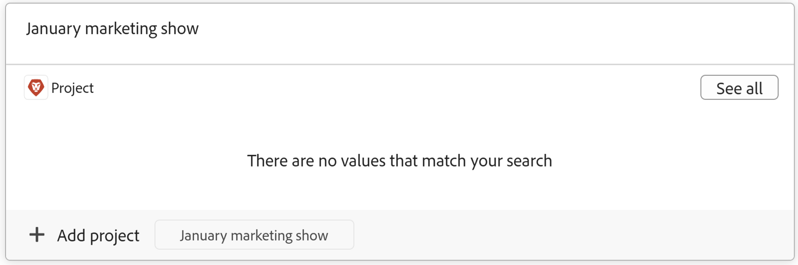

<!--update the metadata with real information when making this available in TOC and in the left nav-->

# Créer des objets Workfront à partir de Workfront Planning en les connectant à des enregistrements

<!-- update the title (and all the links to this article) at preview, to be this: Create Workfront objects from Workfront Planning as you connect them to records-->
<!-- remove preview and production at release time-->

<!--The information highlighted on this page refers to functionality not yet generally available. It is available only in the Preview environment for all customers. After the monthly releases to Production, the same features are also available in the Production environment for customers who enabled fast releases.    

For information about fast releases, see [Enable or disable fast releases for your organization](/help/quicksilver/administration-and-setup/set-up-workfront/configure-system-defaults/enable-fast-release-process.md). -->

{{planning-important-intro}}

Vous pouvez créer des objets Adobe Workfront à partir de Workfront Planning des manières suivantes :

* Connexion d&#39;objets Workfront à partir d&#39;enregistrements Planning

  Cet article décrit comment créer des objets Workfront à partir de Workfront Planning en les connectant à partir d&#39;enregistrements Planning.
* Lorsque vous utilisez des automatisations à partir d’une page d’enregistrement.

  Pour plus d’informations sur la création d’objets Workfront à l’aide d’automatisations, voir [Création d’objets à l’aide des automatisations d’enregistrements Adobe Workfront Planning](/help/quicksilver/planning/records/create-wf-objects-using-planning-automations.md).

Vous pouvez créer les types d&#39;objets Workfront suivants à partir de Workfront Planning lorsque vous connectez un enregistrement Workfront Planning aux types d&#39;objets Workfront suivants :

* Projets
* Portefeuilles
* Programmes

>[!IMPORTANT]
>
>* Vous ne pouvez créer que des projets, portfolios et programmes dans Workfront lors de leur connexion à partir d’un enregistrement.
>
>* Vous ne pouvez pas créer de groupes ou de sociétés lors de leur connexion à partir d&#39;un enregistrement dans Workfront Planning.
>

Vous pouvez connecter des projets, des portfolios et des programmes à partir d’un champ de connexion dans les zones suivantes de Workfront Planning :

* Vue Tableau d’un type d’enregistrement
* Page de détails ou zone de prévisualisation d’un enregistrement
* Onglet Connexions d’un enregistrement

Pour plus d&#39;informations sur la connexion des enregistrements Planning aux objets Workfront, voir [Connexion des enregistrements](/help/quicksilver/planning/records/connect-records.md).

## Conditions d’accès

+++ Développez pour afficher les exigences d’accès.

<table style="table-layout:auto"> 
<col> 
</col> 
<col> 
</col> 
<tbody> 
    <tr> 
<tr> 
<td> 
   
 Produits
 </td> 
   <td> 
   <ul><li>
 Adobe Workfront
</li> 
   <li>
 Planification d’Adobe Workfront
</li></ul></td> 
  </tr>   
<tr> 
   <td role="rowheader">
Formule Adobe Workfront*
</td> 
   <td> 

L’un des plans Workfront suivants :
 
<ul><li>Sélectionner</li> 
<li>Principal</li> 
<li>Final</li></ul> 

Workfront Planning n’est pas disponible pour les plans Workfront hérités
 
   </td> 
<tr> 
   <td role="rowheader">
Package Adobe Workfront Planning*
</td> 
   <td> 

Tous 
 

Pour plus d’informations sur les éléments inclus dans chaque plan de planification Workfront, contactez votre gestionnaire de compte Workfront. 
 
   </td> 
 <tr> 
   <td role="rowheader">
Plateforme Adobe Workfront
</td> 
   <td> 

L’instance de Workfront de votre organisation doit être intégrée à l’expérience unifiée Adobe pour pouvoir accéder à Workfront Planning.
 

Pour plus d’informations, voir <a href="/help/quicksilver/workfront-basics/navigate-workfront/workfront-navigation/adobe-unified-experience.md">Adobe Unified Experience pour Workfront</a>. 
 
   </td> 
   </tr> 
  </tr> 
  <tr> 
   <td role="rowheader">
Licence Adobe Workfront*
</td> 
   <td> Standard
   
Workfront Planning n’est pas disponible pour les licences Workfront héritées
 
  </td> 
  </tr> 
  <tr> 
   <td role="rowheader">
Configuration du niveau d’accès
</td> 
   <td> 
Il n’existe aucun contrôle de niveau d’accès pour Adobe Workfront Planning.
 
   
Modifiez l’accès avec l’accès à Créer des objets dans Workfront pour les types d’objets que vous souhaitez créer (projets, portfolios, programmes). 
  
</td> 
  </tr> 
<tr> 
   <td role="rowheader">
Autorisations d’objet
</td> 
   <td> 
Gérez les autorisations de l’espace de travail et du type d’enregistrement dans lequel vous souhaitez ajouter des enregistrements. 
  
   
L’administration système a accès à tous les espaces de travail, y compris ceux qu’elle n’a pas créés.

   
Gérez les autorisations sur les objets Workfront (portfolios) pour ajouter des objets enfants (projets).

   </td> 
  </tr> 
</tbody> 
</table>

* Pour plus d’informations sur les exigences d’accès à Workfront, voir [Conditions d’accès requises dans la documentation Workfront](/help/quicksilver/administration-and-setup/add-users/access-levels-and-object-permissions/access-level-requirements-in-documentation.md).

+++

## Conditions préalables à la création d&#39;objets Workfront lors de leur connexion avec des enregistrements de Workfront Planning

Vous devez disposer des éléments suivants avant de pouvoir ajouter de nouveaux projets ou portfolios en les connectant à partir d’enregistrements existants :

* Types d’enregistrements liés aux projets, portfolios ou programmes Workfront. Pour plus d’informations, consultez la section [Connecter des types d’enregistrements](/help/quicksilver/planning/architecture/connect-record-types.md).
* Enregistrements. Pour plus d’informations, voir [Créer des enregistrements](/help/quicksilver/planning/records/create-records.md).
* L’accès et les autorisations appropriés dans Workfront Planning et Workfront, comme décrit dans la section [Exigences d’accès](#access-requirements) de cet article.

## Créer des projets en les connectant à des enregistrements de Workfront Planning

Pour créer des projets au fur et à mesure que vous les connectez à partir d’autres enregistrements :

1. Accédez à la page de détails d’un enregistrement ou à la table du type d’enregistrement et commencez à connecter les enregistrements Workfront Planning aux projets Workfront, comme décrit dans l’article [Connecter des enregistrements](/help/quicksilver/planning/records/connect-records.md).

1. (Conditionnel) Cliquez sur **Ajouter un projet**
Ou
Commencez à saisir le nom d’un projet, puis cliquez sur **Ajouter un projet** si vous ne le trouvez pas. Le bouton Ajouter est suivi du nom du projet que vous avez saisi.

   

   La boîte **Créer un projet** s’ouvre.

1. (Facultatif) Mettez à jour le **nom du projet**. Par défaut, le projet est nommé en fonction de ce que vous avez ajouté comme élément de recherche lors de sa connexion à partir de l’enregistrement .
1. (Facultatif) Sélectionnez un **modèle de projet**. Si vous ne sélectionnez pas de modèle, Workfront crée un projet vierge sans tâche.
1. Cliquez sur **Créer**.
1. (Conditionnel) Si vous avez choisi de créer un projet à partir d’un modèle, suivez les étapes de l’article [Créer un projet à l’aide d’un modèle](/help/quicksilver/manage-work/projects/create-projects/create-project-from-template.md) pour terminer l’ajout du projet.

   Le nouveau projet est créé et ajouté au champ connecté de l&#39;enregistrement sélectionné.

1. (Facultatif) Cliquez sur le nom du nouveau projet dans Workfront Planning pour ouvrir la page du projet dans Workfront et apporter des mises à jour supplémentaires au projet.

## Créer des portfolios en les connectant à des enregistrements de Workfront Planning

Pour créer des portefeuilles au fur et à mesure que vous les connectez à partir d&#39;enregistrements Planning :

1. Accédez à la page de détails d’un enregistrement ou à la table du type d’enregistrement et commencez à connecter les enregistrements Workfront Planning aux portfolios Workfront, comme décrit dans l’article [Connecter des enregistrements](/help/quicksilver/planning/records/connect-records.md).

1. (Conditionnel) Cliquez sur **Ajouter un portfolio**

   Ou

   Commencez à saisir le nom d’un portfolio, puis cliquez sur **Ajouter un portfolio** si vous ne le trouvez pas. Le bouton Ajouter est suivi du nom du portfolio que vous avez saisi.

   

   Le portfolio est créé et ajouté au champ de connexion de l’enregistrement que vous avez sélectionné.

1. (Facultatif) Cliquez sur le nom du nouveau portefeuille dans Workfront Planning pour ouvrir la page du portefeuille dans Workfront et effectuer des mises à jour supplémentaires sur le portefeuille.

## Créer des programmes en les connectant à des enregistrements de Workfront Planning

Pour créer des programmes au fur et à mesure que vous les connectez à partir des enregistrements Planning :

1. Accédez à la page de détails d’un enregistrement ou à la table du type d’enregistrement et commencez à connecter les enregistrements Workfront Planning aux portfolios Workfront, comme décrit dans l’article [Connecter des enregistrements](/help/quicksilver/planning/records/connect-records.md).

1. Cliquez sur **Ajouter un programme**

   Ou

   Commencez à saisir le nom d’un programme, puis cliquez sur **Ajouter un programme** si vous ne le trouvez pas. Le bouton Ajouter est suivi du nom du programme que vous avez saisi.

   

   La boîte de dialogue **Créer un programme** s’ouvre.

1. Mettez à jour le **nom du programme**. Champ obligatoire.
1. Choisissez un **Portfolio** dans la liste déroulante ou commencez à saisir le nom d&#39;un portfolio, puis sélectionnez-le lorsqu&#39;il s&#39;affiche dans la liste. Champ obligatoire.
1. Cliquez sur **Créer**.

   Le programme est créé et ajouté dans le champ de connexion de l&#39;enregistrement que vous avez sélectionné.

1. (Facultatif) Cliquez sur le nom du nouveau programme dans Workfront Planning pour ouvrir la page du programme dans Workfront et y apporter des mises à jour supplémentaires.

