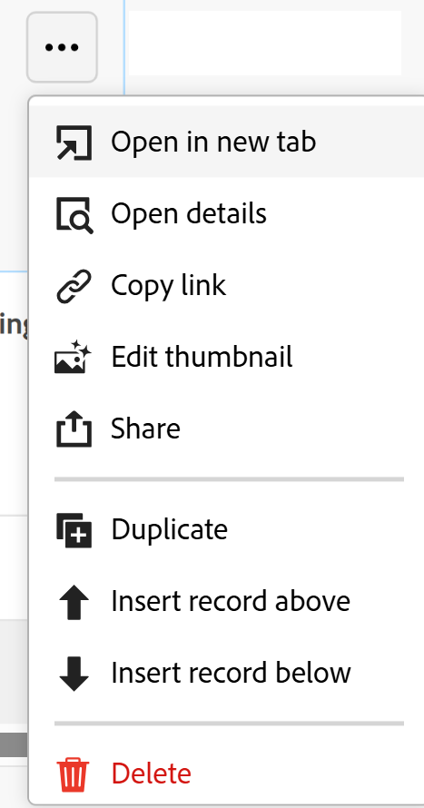

# Supprimer des enregistrements

Les informations mises en surbrillance sur cette page font référence à des fonctionnalités qui ne sont pas encore disponibles de manière générale. Elle est disponible uniquement dans l’environnement de Prévisualisation pour tous les clients. Après les versions mensuelles en production, les mêmes fonctionnalités sont également disponibles dans l’environnement de production pour les clients qui ont activé les versions rapides. 

Pour plus d’informations sur les versions rapides, voir [Activation ou désactivation des versions rapides pour votre organisation](/help/quicksilver/administration-and-setup/set-up-workfront/configure-system-defaults/enable-fast-release-process.md). 

{{planning-important-intro}}

Vous pouvez supprimer des enregistrements qui ne sont plus pertinents dans Adobe Workfront Planning. Vous pouvez récupérer les enregistrements supprimés pendant 30 jours après leur suppression. Pour plus d’informations sur la récupération des enregistrements supprimés, voir [ Récupérer les enregistrements supprimés ](/help/quicksilver/planning/records/restore-deleted-records.md).

## Conditions d’accès

+++ Développez pour afficher les conditions d’accès requises pour la fonctionnalité de cet article. 

<table style="table-layout:auto"> 
<col> 
</col> 
<col> 
</col> 
<tbody> 
    <tr> 
<tr> 
</tr>   
<tr> 
   <td role="rowheader">
Package Adobe Workfront
</td> 
   <td> 

Tout Workfront et tout package Planning
 
Tout workflow et tout package Planning

Pour plus d’informations sur les composants inclus dans chaque package Workfront Planning, contactez votre représentant de compte Workfront. 
 
   </td> 
  <tr> 
   <td role="rowheader">
Licence Adobe Workfront
</td> 
   <td>
Standard

   </td> 
  </tr> 
  <tr> 
   <td role="rowheader">
Autorisations d’objet
</td> 
   <td>   
Accorder des autorisations supérieures ou égales à un espace de travail, un type d’enregistrement et gérer les autorisations d’un enregistrement 
   
   
L’administration système a accès à tous les espaces de travail, y compris ceux qu’elle n’a pas créés.
 </td> 
  </tr>   
</tbody> 
</table>

Pour plus d’informations sur les exigences d’accès à Workfront, voir [Exigences d’accès dans la documentation de Workfront](/help/quicksilver/administration-and-setup/add-users/access-levels-and-object-permissions/access-level-requirements-in-documentation.md).

+++   

<!--
Old:
<table style="table-layout:auto"> 
<col> 
</col> 
<col> 
</col> 
<tbody> 
    <tr> 
<tr> 
<td> 
   
 Products
 </td> 
   <td> 
   <ul><li>
 Adobe Workfront
</li> 
   <li>
 Adobe Workfront Planning
</li></ul></td> 
  </tr>   
<tr> 
   <td role="rowheader">
Adobe Workfront plan*
</td> 
   <td> 

Any of the following Workfront plans:
 
<ul><li>Select</li> 
<li>Prime</li> 
<li>Ultimate</li></ul> 

Workfront Planning is not available for legacy Workfront plans
 
   </td> 
<tr> 
   <td role="rowheader">
Adobe Workfront Planning package*
</td> 
   <td> 

Any 
 

For more information about what is included in each Workfront Planning plan, contact your Workfront account manager. 
 
   </td> 
 <tr> 
   <td role="rowheader">
Adobe Workfront platform
</td> 
   <td> 

Your organization's instance of Workfront must be onboarded to the Adobe Unified Experience to be able to access Workfront Planning.
 

For more information, see <a href="/help/quicksilver/workfront-basics/navigate-workfront/workfront-navigation/adobe-unified-experience.md">Adobe Unified Experience for Workfront</a>. 
 
   </td> 
   </tr> 
  </tr> 
  <tr> 
   <td role="rowheader">
Adobe Workfront license*
</td> 
   <td>
 Standard

   
Workfront Planning is not available for legacy Workfront licenses
 
  </td> 
  </tr> 
  <tr> 
   <td role="rowheader">
Access level configuration
</td> 
   <td> 
There are no access level controls for Adobe Workfront Planning
   
</td> 
  </tr> 
<tr> 
   <td role="rowheader">
Object permissions
</td> 
   <td>   
Contribute or higher permissions to a workspace and record type </a> 
  
   
System Administrators have permissions to all workspaces, including the ones they did not create
 </td> 
  </tr> 
</tbody> 
</table>
-->

## Considérations sur la suppression des enregistrements

* Vous pouvez supprimer des enregistrements que vous ou une autre personne avez créés.
* Vous pouvez récupérer les enregistrements supprimés que vous ou d&#39;autres personnes avez supprimés.
* Lorsque des enregistrements supprimés sont liés à d’autres enregistrements, ces enregistrements liés restent intacts, bien que les informations de l’enregistrement supprimé soient éliminées.
* Vous ne pouvez pas supprimer des enregistrements des vues Chronologie ou Calendrier.

## Supprimer des enregistrements

Vous pouvez supprimer un enregistrement à partir des zones suivantes :

* [À partir de la page de l’enregistrement](#delete-a-record-from-the-records-page)
* [À partir de la vue de tableau d’un type d’enregistrement](#delete-a-record-from-the-record-type-table-view)

### Supprimer un enregistrement à partir de la page de l’enregistrement

{{step1-to-planning}}

1. Cliquez sur l’espace de travail dont vous souhaitez supprimer les enregistrements.

   L’espace de travail s’ouvre et les types d’enregistrements s’affichent sous forme de cartes.

1. Cliquez sur la vignette d’un type d’enregistrement pour plus de détails.

   La page de type d’enregistrement s’ouvre.
1. Utilisez l’une des méthodes suivantes :

   * À partir d’une vue en tableau, cliquez sur le nom d’un enregistrement.
   * En mode Tableau, passez la souris sur le nom d’un enregistrement, puis cliquez sur le menu **Plus** , puis sur **Affichage**

     
   * Dans une vue de chronologie, cliquez sur une barre d’un enregistrement.

   La page de l’enregistrement s’ouvre.

1. Cliquez sur le menu **Plus**  à droite du nom de l’enregistrement, puis cliquez de nouveau sur **Supprimer**, **Supprimer** pour confirmer.

    <!--ensure the options have not changed or been renamed-->
L’enregistrement est supprimé.
1. (Facultatif) Accédez à la vue Tableau de la page d’enregistrement, puis cliquez sur l’icône **Annuler**  dans le coin supérieur droit de la vue, puis cliquez sur **Récemment supprimé** pour récupérer les enregistrements supprimés.

Pour plus d’informations sur la récupération des enregistrements supprimés, voir [ Récupérer les enregistrements supprimés ](/help/quicksilver/planning/records/restore-deleted-records.md).

### Supprimer un enregistrement de la vue en tableau d’un type enregistrement

{{step1-to-planning}}

1. Cliquez sur l’espace de travail dont vous souhaitez supprimer les enregistrements.

   L’espace de travail s’ouvre et les types d’enregistrements s’affichent sous forme de cartes.

1. Cliquez sur la vignette d’un type d’enregistrement pour plus de détails.

   La page de type d’enregistrement s’ouvre.
1. (Conditionnel) Dans le menu déroulant **Afficher** situé dans le coin supérieur gauche du tableau, sélectionnez une vue de tableau. Il s’agit de la vue par défaut, sauf si vous avez visualisé le type d’enregistrement dans la vue chronologique lors de votre dernier accès.

   Les enregistrements associés au type d’enregistrement sélectionné s’affichent dans la vue Tableau.
1. Utilisez l’une des méthodes suivantes :

   * Cliquez avec le bouton droit de la souris sur une ligne d’enregistrement, puis cliquez sur **Supprimer**.
   * Cliquez sur le menu **Plus**  à droite du nom de l’enregistrement, puis cliquez sur **Supprimer**.

     

   * Cliquez sur l’icône **Ouvrir les détails**  pour ouvrir la zone contenant les informations détaillées de l’enregistrement, puis cliquez sur le menu **Plus**  à droite du nom de l’enregistrement, puis sur **Supprimer**.

   L’enregistrement est supprimé.

1. (Facultatif) Effectuez l’une des opérations suivantes pour annuler ou rétablir la suppression d’un enregistrement :

   * Cliquez sur l&#39;icône **Annuler** , puis **Récemment supprimé** pour récupérer les enregistrements supprimés. Pour plus d’informations sur la récupération des enregistrements supprimés, voir [ Récupérer les enregistrements supprimés ](/help/quicksilver/planning/records/restore-deleted-records.md).
   * Utilisez les raccourcis clavier suivants pour annuler ou rétablir la suppression d’un enregistrement :

      * Ctrl + Z (⌘ + Z pour Mac) pour annuler la suppression d’un enregistrement
      * Ctrl+Maj+Z (⌘+Maj+Z pour Mac) pour rétablir la suppression de l’enregistrement.

