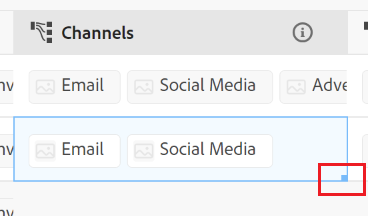

<!--update the metadata with real information when making this avilable in TOC and in the left nav-->

# Modifier des enregistrements

{{planning-important-intro}}

Vous pouvez modifier les informations d&#39;enregistrement dans Adobe Workfront Planning en modifiant les valeurs des champs associés aux enregistrements.

Vous devez créer des types d’enregistrement avant de pouvoir commencer à créer et modifier des enregistrements.

Pour plus d’informations, voir [Créer des types d’enregistrements](/help/quicksilver/planning/architecture/create-record-types.md).

Pour plus d’informations sur la création d’enregistrements, voir [Créer des enregistrements](/help/quicksilver/planning/records/create-records.md).

&lt;! -- indiquez ici que les champs de la vue de détails sont identiques à ceux de la vue de tableau -- le lien vers cet article est fourni sur la page Gérer les vues d’enregistrements pour faire référence à ces informations-->

## Conditions d’accès

+++ Développez pour afficher les exigences d’accès à la planification Workfront.

<table style="table-layout:auto">
 <col>
 </col>
 <col>
 </col>
 <tbody>
    <tr>
<tr>
<td>
   
 Produit
 </td>
   <td>
   
 Adobe Workfront
 </td>
  </tr>  
 <td role="rowheader">
Accord Adobe Workfront
</td>
   <td>

Votre entreprise doit être inscrite à l’étape d’accès anticipé pour la planification Workfront 

   </td>
  </tr>
  <tr>
   <td role="rowheader">
Forfait Adobe Workfront
</td>
   <td>

N’importe quelle

   </td>
  </tr>
  <tr>
   <td role="rowheader">
Licence Adobe Workfront*
</td>
   <td>
   
Nouvelle : standard

   Ou
   
Actuelle : formule
 
  </td>
  </tr>

<tr>
   <td role="rowheader">
Configurations du niveau d’accès
</td>
   <td> 
Il n’existe aucun contrôle d’accès pour Adobe Workfront Planning
  
</td>
  </tr>
<tr>
   <td role="rowheader">
Autorisations
</td>
   <td> 
Autorisations Contribuer ou supérieures pour à un espace de travail</a> 
  
   
Les équipes d’administration système ont des droits sur tous les espaces de travail, y compris ceux qu’ils n’ont pas créés.

</td>
  </tr>
<tr>
   <td role="rowheader">
Modèle de disposition
</td>
   <td> 
Votre administrateur ou administratrice Workfront ou de groupes doit ajouter la zone Planning dans votre modèle de disposition. Pour plus d’informations, voir <a href="/help/quicksilver/planning/access/access-overview.md">Vue d’ensemble des accès</a>. 
  
</td>
  </tr>

</tbody>
</table>

Pour plus d’informations, consultez les [Conditions d’accès dans la documentation de Workfront](/help/quicksilver/administration-and-setup/add-users/access-levels-and-object-permissions/access-level-requirements-in-documentation.md).

+++

## Remarques concernant la modification d’enregistrements

* Vous pouvez modifier les enregistrements que vous avez créés ou qui ont été créés par d’autres personnes, si des autorisations vous ont été accordées à l’espace de travail.
* Vous pouvez modifier les champs d’enregistrement à partir des zones suivantes :

   * Aperçu de l’enregistrement dans une vue d’enregistrement
   * La page de l’enregistrement
   * En ligne, dans une vue de tableau

* Lorsqu’un utilisateur modifie un enregistrement dans une vue, les modifications sont immédiatement visibles dans toutes les vues et les pages d’enregistrement pour tous les autres utilisateurs.

* Les types de champs suivants sont automatiquement mis à jour et vous ne pouvez pas modifier leurs valeurs manuellement :
   * Champs liés à partir d’autres enregistrements
   * Champs de type formule
   * Champs système (Créé par, Date de création, Dernière modification par, Date de dernière modification)
* Si les enregistrements que vous affichez sont liés à d’autres enregistrements, les modifications et nouvelles informations apportées aux enregistrements sont reflétées dans les enregistrements liés.
* Vous ne pouvez pas modifier des enregistrements en masse. <!--this will probably change-->
* Les URL sont reconnues comme des liens dans les types de champ de texte sur une seule ligne lorsqu’elles commencent par les préfixes suivants : http://, https://, ftp:// ou www.
* Vous pouvez ajouter une image de couverture à chaque enregistrement. L’image est unique pour chaque enregistrement et ne s’applique pas à tous les enregistrements en même temps.
* Vous pouvez modifier l’ordre des champs dans une page d’enregistrement et ajouter une image de couverture pour un enregistrement. Pour plus d’informations, voir [Gestion de la mise en page de la page d’enregistrement](/help/quicksilver/planning/records/manage-the-record-page.md).

## Modifier des enregistrements

Vous pouvez modifier un enregistrement à partir des zones suivantes :

* [Dans la vue de tableau d’un type d’enregistrement](#edit-a-record-inline-in-the-table-view-of-a-record-type)
* [Aperçu de l’enregistrement dans une vue](#edit-a-record-from-the-records-preview-in-a-view)
* [À partir de la page de l’enregistrement](#edit-a-record-from-the-records-page)
* [À partir d’un objet Workfront dans la section Planification](#edit-a-record-from-a-workfront-object-in-the-planning-section)

### Modifier un enregistrement en ligne dans la vue de tableau d’un type d’enregistrement

{{step1-to-planning}}

1. Cliquez sur l&#39;espace de travail dont vous souhaitez modifier les enregistrements.

   L’espace de travail s’ouvre et les types d’enregistrement s’affichent sous forme de cartes.
1. Cliquez sur une carte de type d’enregistrement.

   La page du type d’enregistrement s’ouvre.
1. (La cas échéant) Cliquez sur l’onglet d’une vue de tableau ou sur **+ Affichage** pour créer une vue de tableau. La vue de tableau doit être la vue par défaut, sauf si vous avez consulté le type d’enregistrement dans un autre type de vue lors de votre dernier accès.

   Les enregistrements associés au type d’enregistrement sélectionné s’affichent dans la vue Tableau.
1. Cliquez dans la ligne d’un enregistrement pour commencer à modifier les informations sur l’enregistrement en ligne.

   

   >[!TIP]
   >
   >  Vous ne pouvez pas modifier les informations des champs suivants, car ils sont en lecture seule et Workfront les met automatiquement à jour :
   >  
   >  * Champs liés créés par la connexion de types d’enregistrement Pour plus d’informations, consultez la section [Connecter des types d’enregistrements](/help/quicksilver/planning/architecture/connect-record-types.md).
   >  * Champs des types suivants : Créé par, Date de création, Dernière modification par, Date de dernière modification et Formule

1. (Facultatif et la cas échéant) Lorsque vous modifiez un champ de type Paragraphe, utilisez les options de mise en forme de **Texte enrichi** suivantes :

   * Gras
   * Italiques
   * Souligner
   * Ajouter un lien
   * Ajouter une liste à puces
   * Ajouter une liste numérotée

   

1. (Facultatif) Double-cliquez sur un champ d’enregistrement connecté pour ajouter des enregistrements ou des objets connectés à un autre enregistrement. Pour plus d’informations, consultez la section [Connecter des enregistrements](/help/quicksilver/planning/records/connect-records.md).
1. Appuyez sur **Entrée** à l’aide du clavier ou cliquez en dehors d’une ligne pour enregistrer vos modifications. Les modifications sont enregistrées automatiquement. Un indicateur **Enregistré** s’affiche brièvement dans le coin supérieur droit de la vue de tableau pour indiquer que les modifications ont été enregistrées.

1. (Facultatif) Pour copier et coller des informations d’un champ vers un autre, effectuez l’une des opérations suivantes :

   * Copiez une ou plusieurs valeurs existantes d’un champ, puis collez-les dans un champ du même type sur un autre enregistrement
   * Cliquez sur l’en-tête d’une colonne pour la sélectionner et la copier, puis cliquez sur l’en-tête d’une autre colonne et collez le contenu de la colonne copiée. Les colonnes doivent contenir des types de champ similaires.
   * Lorsque vous appuyez sur la touche Maj, cliquez pour sélectionner plusieurs lignes d’un tableau, copiez les informations des lignes sélectionnées, puis cliquez sur une autre ligne et collez les informations sélectionnées dans la nouvelle ligne, puis sur les lignes suivantes.
   * Copiez les informations d’une cellule, sélectionnez plusieurs cellules, puis collez les mêmes informations dans plusieurs cellules. Vous pouvez sélectionner plusieurs cellules et coller les mêmes informations dans plusieurs cellules à partir des lignes et colonnes adjacentes.
   * Sélectionnez le coin inférieur droit d’une cellule existante qui contient les informations à copier, puis faites-la glisser sur les cellules adjacentes où vous souhaitez coller les mêmes informations. Toutes les cellules doivent contenir le même type d’informations.

     

   >[!NOTE]
   >
   >Tenez compte des points suivants :
   >
   >* Utilisez les raccourcis clavier suivants pour copier et coller des informations :
   >   * Copier : Ctrl+C (⌘+C pour Mac)
   >   * Coller : Ctrl+V ( ⌘+V pour Mac)
   >
   >* Vous ne pouvez pas copier et coller des valeurs de champ dans la page d’enregistrement. Cette fonctionnalité n’est prise en charge que dans la vue de tableau d’un type d’enregistrement.
   >* Vous ne pouvez pas copier et coller des valeurs de champ pour les types de champs suivants :
   >
   >
   >    * Champs liés (ou champs de recherche) créés par la connexion des types d’enregistrement. Vous pouvez copier et coller des champs d’enregistrements liés. Pour plus d’informations, consultez la section [Connecter des types d’enregistrements](/help/quicksilver/planning/architecture/connect-record-types.md).
   >    * Champs des types suivants : Créé par, Date de création, Dernière modification par et Date de dernière modification

1. (Facultatif) Utilisez les raccourcis clavier suivants pour annuler ou rétablir la modification ou la copie et le collage des informations d’enregistrement :

   * Ctrl+Z (⌘+Z pour Mac) pour annuler une modification
   * Ctrl+Maj+Z (⌘+Maj+Z pour Mac) pour rétablir une modification

   >[!TIP]
   >
   >    Vous pouvez utiliser les raccourcis clavier plusieurs fois de suite pour annuler plusieurs modifications.

1. (Facultatif) Ajoutez une miniature à un enregistrement. Pour plus d’informations, consultez la section [Ajouter une miniature à un enregistrement](/help/quicksilver/planning/records/add-thumbnails-to-records.md).

### Modification d’un enregistrement à partir de l’aperçu de l’enregistrement dans une vue

{{step1-to-planning}}

1. Cliquez sur l&#39;espace de travail dont vous souhaitez modifier les enregistrements.

   L’espace de travail s’ouvre et les types d’enregistrement s’affichent sous forme de cartes.

1. Cliquez sur une carte de type d’enregistrement.

   La page du type d’enregistrement s’ouvre.

1. Dans une vue de n&#39;importe quel type, cliquez sur l&#39;enregistrement

   Ou

   Dans la vue de tableau, cliquez sur l&#39;icône **Ouvrir les détails**  dans la première colonne. L’aperçu de l’enregistrement s’ouvre dans la vue.

   

1. (Facultatif) Cliquez sur le menu **Plus** à droite du titre de l’enregistrement, puis cliquez sur **Renommer**. Cela met à jour le champ qui s’affiche comme titre de l’enregistrement.

   Le titre de l’enregistrement est le champ principal de l’enregistrement lorsqu’il est affiché dans une vue de tableau. Pour plus d’informations, voir [Présentation des champs de Principal](/help/quicksilver/planning/fields/primary-field-overview.md).

1. Commencez à modifier les informations du champ dans l’aperçu de l’enregistrement.

   >[!TIP]
   >
   >  Vous ne pouvez pas modifier les informations des champs suivants, car ils sont en lecture seule et Workfront les met automatiquement à jour :
   >  
   >  * Champs de recherche d’autres enregistrements créés en connectant des types d’enregistrements. Pour plus d’informations, consultez la section [Connecter des types d’enregistrements](/help/quicksilver/planning/architecture/connect-record-types.md).
   >  * Champs des types suivants : Créé par, Date de création, Dernière modification par, Date de dernière modification et Formule

1. (Facultatif) Cliquez sur **Ajouter une couverture** pour ajouter une image de couverture à l’enregistrement. Pour plus d’informations, voir [Ajout d’une image de couverture à un enregistrement](/help/quicksilver/planning/records/add-a-cover-image-to-a-record.md).

1. (Facultatif) Pointez sur l’icône de miniature, puis cliquez sur **Plus**  > **Modifier la miniature** pour ajouter une miniature. Pour plus d’informations, consultez la section [Ajouter une miniature à un enregistrement](/help/quicksilver/planning/records/add-thumbnails-to-records.md).

   Workfront enregistre automatiquement vos modifications.

1. (Facultatif) Cliquez sur l’icône **Ouvrir dans un nouvel onglet**  <!--check the icon; they are changing it--> dans le coin supérieur droit de l’aperçu de l’enregistrement pour ouvrir la page de l’enregistrement dans un nouvel onglet. Poursuivez la modification de l’enregistrement, comme décrit dans la section [Modifier un enregistrement à partir de la page de l’enregistrement](#edit-a-record-from-the-records-page) de cet article.

### Modifier un enregistrement à partir de la page de l’enregistrement

{{step1-to-planning}}

1. Cliquez sur l&#39;espace de travail dont vous souhaitez modifier les enregistrements.

   L’espace de travail s’ouvre et les types d’enregistrement s’affichent sous forme de cartes.

1. Cliquez sur une carte de type d’enregistrement.

   La page du type d’enregistrement s’ouvre.

1. Utilisez l’une des méthodes suivantes :

   * Dans n’importe quelle vue, accédez à l’aperçu de l’enregistrement, comme décrit dans la section [Modifier un enregistrement de l’aperçu de l’enregistrement dans une vue](#edit-a-record-from-the-records-preview-in-a-view) de cet article, puis cliquez sur l’icône **Ouvrir dans un nouvel onglet**  <!--check the icon; they are changing it--> dans le coin supérieur droit de l’aperçu de l’enregistrement pour ouvrir la page de l’enregistrement dans un nouvel onglet.

   * Dans la vue de **Tableau**, pointez sur le nom d’un enregistrement, puis cliquez sur le menu **Plus** , puis sur **Afficher**.

     

     La page de l’enregistrement s’ouvre.

     

1. (Facultatif) Cliquez sur le menu **Plus** à droite du titre de l’enregistrement, puis cliquez sur **Renommer**. Cela met à jour le champ qui s’affiche comme titre de l’enregistrement.

   Le titre de l’enregistrement est le champ principal de l’enregistrement lorsqu’il est affiché dans une vue de tableau. Pour plus d’informations, voir [Gérer la vue de tableau](/help/quicksilver/planning/views/manage-the-table-view.md).

1. Cliquez sur un champ modifiable de la page d’enregistrement pour l’éditer.

   >[!TIP]
   >
   >  Vous ne pouvez pas modifier les informations des champs suivants, car ils sont en lecture seule et Workfront les met automatiquement à jour :
   >  
   >  * Champs liés créés par la connexion de types d’enregistrement Pour plus d’informations, consultez la section [Connecter des types d’enregistrements](/help/quicksilver/planning/architecture/connect-record-types.md).
   >  * Champs des types suivants : Créé par, Date de création, Dernière modification par, Date de dernière modification et Formule

1. (Facultatif) Cliquez sur **Ajouter une couverture** pour ajouter une image de couverture à l’enregistrement.

   Ou

   Passez la souris sur l’image de couverture existante, puis cliquez sur le menu **Plus**  > **Télécharger** pour ajouter une nouvelle image de couverture pour l’enregistrement.

   Pour plus d’informations, voir [Ajout d’une image de couverture à un enregistrement](/help/quicksilver/planning/records/add-a-cover-image-to-a-record.md).

1. (Facultatif) Passez la souris sur une miniature existante ou sur l’icône **miniature** , puis cliquez sur le menu **Plus**  > **Modifier la miniature** pour ajouter une miniature pour l’enregistrement.

   Pour plus d’informations, voir [Ajout d’une miniature à un enregistrement](/help/quicksilver/planning/records/add-thumbnails-to-records.md).

   Workfront enregistre automatiquement vos modifications.

## Modification d’un enregistrement à partir d’un objet Workfront dans la section Planification

Après avoir connecté des enregistrements aux objets Workfront, vous pouvez modifier les enregistrements de planification Workfront dans Workfront à partir de la section Planification de l’objet.

Pour plus d’informations, voir [Gestion des enregistrements dans la section Planification des objets Adobe Workfront](/help/quicksilver/planning/records/manage-records-in-planning-section.md).