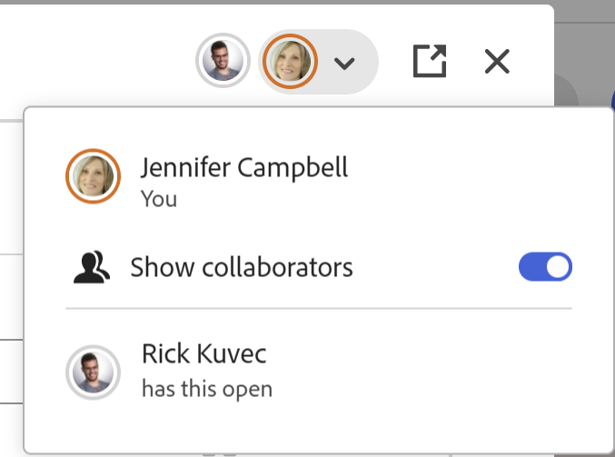

# Modifier des enregistrements

<!--The highlighted information on this page refers to functionality not yet generally available. It is available only in the Preview environment for all customers. After the monthly releases to Production, the same features are also available in the Production environment for customers who enabled fast releases.    

For information about fast releases, see [Enable or disable fast releases for your organization](/help/quicksilver/administration-and-setup/set-up-workfront/configure-system-defaults/enable-fast-release-process.md). -->

{{planning-important-intro}}

Vous pouvez modifier les informations d&#39;enregistrement dans Adobe Workfront Planning en modifiant les valeurs des champs associés aux enregistrements.

Vous devez créer des types d’enregistrement avant de pouvoir commencer à créer et modifier des enregistrements.

Pour plus d’informations, consultez [Créer des types d’enregistrements](/help/quicksilver/planning/architecture/create-record-types.md).

Pour plus d’informations sur la création d’enregistrements, voir [Créer des enregistrements](/help/quicksilver/planning/records/create-records.md).

&lt;!— mentionnez ici que les champs de la vue Détails sont identiques à ceux de la vue de tableau — cet article est lié à la vue Gestion des enregistrements pour faire référence à ces informations—>

## Conditions d’accès

+++ Développez pour afficher les conditions d’accès requises pour la fonctionnalité de cet article. 

<table style="table-layout:auto"> 
<col> 
</col> 
<col> 
</col> 
<tbody> 
    <tr> 
<tr> 
</tr>   
<tr> 
   <td role="rowheader">
Package Adobe Workfront
</td> 
   <td> 

Tout Workfront et tout package Planning
 
Tout workflow et tout package Planning

Pour plus d’informations sur les composants inclus dans chaque package Workfront Planning, contactez votre représentant de compte Workfront. 
 
   </td> 
  <tr> 
   <td role="rowheader">
Licence Adobe Workfront
</td> 
   <td>
Standard

   </td> 
  </tr> 
  <tr> 
   <td role="rowheader">
Autorisations d’objet
</td> 
   <td>   
Autorisations de niveau Contribution ou supérieur à un espace de travail et à un type d’enregistrement  
  
   
L’administration système a accès à tous les espaces de travail, y compris ceux qu’elle n’a pas créés.
 </td> 
  </tr>   
</tbody> 
</table>

Pour plus d’informations sur les exigences d’accès à Workfront, voir [Exigences d’accès dans la documentation de Workfront](/help/quicksilver/administration-and-setup/add-users/access-levels-and-object-permissions/access-level-requirements-in-documentation.md).

+++   

<!--Old:
<table style="table-layout:auto"> 
<col> 
</col> 
<col> 
</col> 
<tbody> 
    <tr> 
<tr> 
<td> 
   
 Products
 </td> 
   <td> 
   <ul><li>
 Adobe Workfront
</li> 
   <li>
 Adobe Workfront Planning
</li></ul></td> 
  </tr>   
<tr> 
   <td role="rowheader">
Adobe Workfront plan*
</td> 
   <td> 

Any of the following Workfront plans:
 
<ul><li>Select</li> 
<li>Prime</li> 
<li>Ultimate</li></ul> 

Workfront Planning is not available for legacy Workfront plans
 
   </td> 
<tr> 
   <td role="rowheader">
Adobe Workfront Planning package*
</td> 
   <td> 

Any 
 

For more information about what is included in each Workfront Planning plan, contact your Workfront account manager. 
 
   </td> 
 <tr> 
   <td role="rowheader">
Adobe Workfront platform
</td> 
   <td> 

Your organization's instance of Workfront must be onboarded to the Adobe Unified Experience to be able to access Workfront Planning.
 

For more information, see <a href="/help/quicksilver/workfront-basics/navigate-workfront/workfront-navigation/adobe-unified-experience.md">Adobe Unified Experience for Workfront</a>. 
 
   </td> 
   </tr> 
  </tr> 
  <tr> 
   <td role="rowheader">
Adobe Workfront license*
</td> 
   <td> 
Standard
 
   
Workfront Planning is not available for legacy Workfront licenses
 
  </td> 
  </tr> 
  <tr> 
   <td role="rowheader">
Access level configuration
</td> 
   <td> 
There are no access level controls for Adobe Workfront Planning
   
</td> 
  </tr> 
<tr> 
   <td role="rowheader">
Object permissions
</td> 
   <td>  
Contribute or higher permissions to a workspace and record type </a> 
  
   
System Administrators have permissions to all workspaces, including the ones they did not create
  </td> 
  </tr> -->

## Remarques concernant la modification des enregistrements

* Vous pouvez modifier les enregistrements que vous avez créés ou qui ont été créés par d’autres personnes, si des autorisations vous ont été accordées à l’espace de travail.
* Vous pouvez modifier les champs d’enregistrement à partir des zones suivantes :

   * Aperçu de l’enregistrement dans une vue d’enregistrement
   * Page des détails de l’enregistrement
   * En ligne, dans une vue de tableau
   * La vue Calendrier et Chronologie, lors du redimensionnement ou du déplacement des enregistrements. Cette opération met à jour les dates des enregistrements.

* Lorsque l’utilisateur modifie un enregistrement dans une vue, les modifications sont immédiatement visibles dans toutes les vues et dans les pages d’enregistrement pour tous les autres utilisateurs.

* Les types de champs suivants sont automatiquement mis à jour et vous ne pouvez pas modifier leurs valeurs manuellement :
   * Champs liés à partir d’autres enregistrements
   * Champs de type Formule
   * Champs système (Créé par, Date de création, Dernière modification par, Date de dernière modification, Date d’approbation, Approuvé par)
* Si les enregistrements que vous affichez sont liés à d&#39;autres enregistrements, les nouvelles informations des enregistrements que vous modifiez sont répercutées sur les enregistrements liés dans tous les espaces de travail où cet enregistrement est lié.
* Vous ne pouvez pas modifier les enregistrements en masse. <!--this will probably change-->
* Les URL sont reconnues comme des liens dans les types de champ de texte sur une seule ligne uniquement lorsqu’elles commencent par les éléments suivants : http://, https://, ftp:// ou www.
* Vous pouvez ajouter une image de couverture à chaque enregistrement. L’image est unique pour chaque enregistrement et ne s’applique pas à tous les enregistrements en même temps. Pour plus d’informations, voir [Ajouter une image de couverture à un enregistrement](/help/quicksilver/planning/records/add-a-cover-image-to-a-record.md).
* Vous pouvez modifier l’ordre des champs dans la page de détails d’un enregistrement. Pour plus d’informations, voir [Gérer la mise en page des enregistrements](/help/quicksilver/planning/records/manage-the-record-page.md).
* Vous pouvez modifier les dates de début et de fin d&#39;un enregistrement en redimensionnant ou en repositionnant les enregistrements dans les vues Chronologie et Calendrier.

  Vous ne pouvez pas redimensionner ou repositionner des enregistrements lorsque les dates de début et de fin que vous avez choisies pour l&#39;enregistrement sont en lecture seule. Par exemple, vous ne pouvez pas redimensionner ou repositionner l&#39;enregistrement dans une vue chronologique et calendrier lors de l&#39;utilisation de champs de recherche ou de formule pour les dates de début et de fin d&#39;un enregistrement. <!--this also repeats below, for the timeline and the calendar views; also update there, if this changes-->

  Pour modifier les dates des enregistrements, consultez l’une des sections suivantes de cet article :

   * [Modifier un enregistrement dans la vue Calendrier d’un type d’enregistrement](#edit-a-record-in-the-calendar-view-of-a-record-type)
   * [Modifier un enregistrement dans la vue chronologique d’un type d’enregistrement](#edit-a-record-in-the-timeline-view-of-a-record-type)

## Modifier des enregistrements

Vous pouvez modifier un enregistrement à partir des zones suivantes :

* [Vue Tableau](#edit-a-record-inline-in-the-table-view-of-a-record-type)
* [La vue Chronologie](#edit-a-record-in-the-timeline-view-of-a-record-type)
* [La vue Calendrier](#edit-a-record-in-the-calendar-view-of-a-record-type)
* [Aperçu de l’enregistrement dans une vue](#edit-a-record-from-the-records-preview-in-a-view)
* [La page de l’enregistrement](#edit-a-record-from-the-records-page)
* [Objet Workfront dans la section Planning](#edit-a-record-from-a-workfront-object-in-the-planning-section)

### Modifier un enregistrement en ligne dans la vue de tableau d’un type d’enregistrement

Lorsque vous modifiez des enregistrements dans la vue Tableau, le champ qui est modifié par d’autres utilisateurs au moment où vous affichez l’enregistrement est indiqué.

Pour plus d’informations, consultez la section [Gérer les vues des enregistrements](/help/quicksilver/planning/views/manage-record-views.md).

Lorsque vous ajoutez un nouvel enregistrement après le dernier enregistrement d&#39;un regroupement ou d&#39;un sous-regroupement, Workfront met automatiquement à jour les champs inclus dans les regroupements pour les nouveaux enregistrements. Si nécessaire, vous pouvez modifier manuellement ces champs, afin que les enregistrements puissent être supprimés du regroupement.

Pour plus d’informations, voir [Créer des enregistrements](/help/quicksilver/planning/records/create-records.md).

{{step1-to-planning}}

1. Cliquez sur l’espace de travail dont vous souhaitez modifier les enregistrements

   L’espace de travail s’ouvre et les types d’enregistrements s’affichent sous forme de cartes.
1. Cliquez sur la vignette d’un type d’enregistrement pour plus de détails.

   La page du type d’enregistrement s’ouvre.
1. (La cas échéant) Cliquez sur l’onglet d’une vue de tableau ou sur **+ Affichage** pour créer une vue de tableau. La vue de tableau doit être la vue par défaut, sauf si vous avez consulté le type d’enregistrement dans un autre type de vue lors de votre dernier accès.

   Les enregistrements associés au type d’enregistrement sélectionné s’affichent dans la vue Tableau.
1. Cliquez dans la ligne d’un enregistrement pour commencer à modifier les informations sur l’enregistrement intégré.

   

   >[!TIP]
   >
   >  Vous ne pouvez pas modifier les informations des champs suivants, car ils sont en lecture seule et Workfront les met automatiquement à jour :
   >  
   >  * Champs liés créés par la connexion des types d’enregistrements. Pour plus d’informations, consultez la section [Connecter des types d’enregistrements](/help/quicksilver/planning/architecture/connect-record-types.md).
   >  * Champs des types suivants : Créé par, Date de création, Dernière modification par, Date de dernière modification et Formule

1. (Facultatif et la cas échéant) Lorsque vous modifiez un champ de type Paragraphe, utilisez les options de mise en forme de **Texte enrichi** suivantes :

   * Gras
   * Italiques
   * Souligner
   * Ajouter un lien
   * Ajouter une liste à puces
   * Ajouter une liste numérotée

   

1. (facultatif) Double-cliquez sur un champ d’enregistrement connecté pour ajouter des enregistrements ou des objets connectés à un autre enregistrement. Pour plus d’informations, consultez [Connecter des enregistrements](/help/quicksilver/planning/records/connect-records.md).
1. Appuyez sur **Entrée** sur votre clavier ou cliquez en dehors d’une ligne pour enregistrer vos modifications. Les modifications sont enregistrées automatiquement. Un indicateur **Enregistré** s’affiche brièvement dans le coin supérieur droit de la vue Tableau pour indiquer que les modifications ont été enregistrées.

1. (Facultatif) Pour copier et coller des informations d’un champ vers un autre, effectuez l’une des opérations suivantes :

   * Copiez une ou plusieurs valeurs existantes d&#39;un champ, puis collez-les dans un champ du même type sur un autre enregistrement
   * Cliquez sur l’en-tête de colonne d’une colonne pour la sélectionner et la copier, puis cliquez sur l’en-tête de colonne d’une autre colonne et collez le contenu de la colonne copiée. Les colonnes doivent contenir des types de champ similaires.
   * Lorsque vous appuyez sur la touche Maj, cliquez pour sélectionner plusieurs lignes d’un tableau, copiez les informations des lignes sélectionnées, puis cliquez sur une autre ligne et collez les informations sélectionnées dans la nouvelle ligne, puis sur les lignes suivantes.
   * Copiez les informations d’une cellule, puis sélectionnez plusieurs cellules et collez les mêmes informations dans plusieurs cellules. Vous pouvez sélectionner plusieurs cellules et coller les mêmes informations dans plusieurs cellules à partir de lignes et de colonnes adjacentes.
   * Sélectionnez le coin inférieur droit d’une cellule existante contenant les informations à copier, puis faites-la glisser sur les cellules adjacentes où vous souhaitez coller les mêmes informations. Toutes les cellules doivent contenir le même type d’informations.

     

   * Copiez une ou plusieurs cellules d’une source externe (par exemple, un fichier Excel), puis collez-les dans l’un des types de champs suivants :

      * Champs de connexion Workfront Planning.
      * Champs Personnes. Seuls les champs comportant une seule valeur sont pris en charge.

     Vous ne pouvez pas copier d’informations provenant d’une source externe et les coller dans d’autres types de champs, y compris les champs de connexion de Workfront ou d’autres applications.

   >[!NOTE]
   >
   >Tenez compte des points suivants :
   >
   >* Utilisez les raccourcis clavier suivants pour copier et coller des informations :
   >   * Copier : Ctrl + C (⌘ + C pour Mac)
   >   * Coller : Ctrl + V (⌘ + V pour Mac)
   >
   >* Vous ne pouvez pas copier et coller des valeurs de champ dans la page d’enregistrement. Cette fonctionnalité n’est prise en charge que dans la vue de tableau d’un type d’enregistrement.
   >* Vous ne pouvez pas copier et coller les valeurs des champs suivants :
   >
   >    * Champs de recherche créés lors de la connexion de types d’enregistrements. Vous pouvez copier et coller des champs d’enregistrement liés. Pour plus d’informations, voir [Connecter des types d’enregistrement](/help/quicksilver/planning/architecture/connect-record-types.md).
   >    * Champs des types suivants : Créé par, Date de création, Dernière modification par, Date de dernière modification

1. (Facultatif) Utilisez les raccourcis clavier suivants pour annuler ou rétablir la modification ou la copie et le collage des informations d’enregistrement :

   * Ctrl + Z (⌘ + Z pour Mac) pour annuler une modification
   * Ctrl+Maj+Z (⌘+Maj+Z pour Mac) pour rétablir une modification

   >[!TIP]
   >
   >    Vous pouvez utiliser les raccourcis clavier plusieurs fois de suite pour annuler plusieurs modifications.

1. (Facultatif) Ajoutez une miniature à un enregistrement. Pour plus d’informations, voir [Ajouter une miniature à un enregistrement](/help/quicksilver/planning/records/add-thumbnails-to-records.md).

### Modifier un enregistrement dans la vue chronologique d’un type d’enregistrement

<!--add another step about drag and drop here when that is available-->

1. Ouvrez la page de type d’enregistrement dans une vue chronologique. Pour plus d’informations, consultez [Gérer la vue chronologique](/help/quicksilver/planning/views/manage-the-timeline-view.md).

1. Pointez sur les extrémités de la barre d&#39;un enregistrement, cliquez, faites glisser et déposez sa marge sur une autre date. Cette opération met automatiquement à jour la date de début ou de fin de l’enregistrement.

   

1. Cliquez et maintenez une barre d’enregistrement enfoncée, puis faites-la glisser et déposez-la à un autre emplacement pour mettre à jour sa chronologie et ses dates. Les dates de début et de fin de l’enregistrement sont mises à jour automatiquement.

   >[!IMPORTANT]
   >
   >Vous ne pouvez pas faire glisser et déposer les extrémités d&#39;une barre d&#39;enregistrement, ni faire glisser et déposer l&#39;enregistrement vers une autre date lorsque les dates de début et de fin que vous avez choisies pour l&#39;enregistrement sont en lecture seule. Par exemple, vous ne pouvez pas redimensionner ou repositionner l&#39;enregistrement dans une vue chronologique lors de l&#39;utilisation de champs de recherche ou de formule pour les dates de début et de fin d&#39;un enregistrement. <!--this also repeats in Considerations and in editing in the calendar view; also update there, if this changes-->

1. Cliquez sur la barre d’un enregistrement pour ouvrir sa zone de détails et modifier tous les champs.

   Pour plus d&#39;informations, consultez la section [Modifier un enregistrement à partir de l&#39;aperçu de l&#39;enregistrement dans une vue](#edit-a-record-from-the-records-preview-in-a-view) de cet article.

### Modifier un enregistrement dans la vue Calendrier d’un type d’enregistrement

1. Ouvrez la page de type d’enregistrement dans une vue Calendrier. Pour plus d’informations, voir [ Gérer la vue Calendrier ](/help/quicksilver/planning/views/manage-the-calendar-view.md).
1. (Conditionnel) Pointez sur les extrémités de la barre d’un enregistrement dans la vue Calendrier, puis cliquez sur ses marges, faites-les glisser et déposez-les vers une autre date. Cette opération met automatiquement à jour la date de début ou de fin de l’enregistrement.

   

1. Cliquez et maintenez une barre d’enregistrement enfoncée, puis faites-la glisser et déposez-la à un autre emplacement pour mettre à jour sa chronologie et ses dates. Les dates de début et de fin de l’enregistrement sont mises à jour automatiquement.

   >[!IMPORTANT]
   >
   >Vous ne pouvez pas faire glisser et déposer les extrémités d&#39;une barre d&#39;enregistrement, ni faire glisser et déposer l&#39;enregistrement vers une autre date lorsque les dates de début et de fin que vous avez choisies pour l&#39;enregistrement sont en lecture seule. Par exemple, vous ne pouvez pas redimensionner ou repositionner l&#39;enregistrement dans une vue Calendrier lors de l&#39;utilisation de champs de recherche ou de formule pour les dates de début et de fin d&#39;un enregistrement. <!--this also repeats in Considerations and in editing in the timeline view; also update there, if this changes-->

1. Cliquez sur la barre d’un enregistrement pour ouvrir sa zone de détails et modifier tous les champs.

   Pour plus d&#39;informations, consultez la section [Modifier un enregistrement à partir de l&#39;aperçu de l&#39;enregistrement dans une vue](#edit-a-record-from-the-records-preview-in-a-view) de cet article.

### Modifier un enregistrement à partir de l&#39;aperçu de l&#39;enregistrement dans une vue

{{step1-to-planning}}

1. Cliquez sur l’espace de travail dont vous souhaitez modifier les enregistrements

   L’espace de travail s’ouvre et les types d’enregistrements s’affichent sous forme de cartes.

1. Cliquez sur la vignette d’un type d’enregistrement pour plus de détails.

   La page de type d’enregistrement s’ouvre.

1. Dans une vue de n’importe quel type, cliquez sur l’enregistrement

   Ou

   Dans la vue Tableau, cliquez sur l’icône **Ouvrir les détails**  dans la première colonne. L’aperçu de l’enregistrement s’ouvre dans la vue.

   

1. (Facultatif) Cliquez sur le menu **Plus** à droite du titre de l’enregistrement, puis cliquez sur **Renommer**. Cette action met à jour le champ qui s’affiche en tant que titre de l’enregistrement.

   Le titre de l’enregistrement est le champ principal de l’enregistrement lorsqu’il est affiché dans une vue Tableau. Pour plus d&#39;informations, consultez Présentation des champs de Principal .

1. Commencez à modifier les informations du champ dans l’aperçu de l’enregistrement.

   >[!TIP]
   >
   >  Vous ne pouvez pas modifier les informations des champs suivants, car ils sont en lecture seule et Workfront les met automatiquement à jour :
   >  
   >  * Champs de recherche d&#39;autres enregistrements créés en connectant des types d&#39;enregistrements. Pour plus d’informations, consultez la section [Connecter des types d’enregistrements](/help/quicksilver/planning/architecture/connect-record-types.md).
   >  * Champs des types suivants : Créé par, Date de création, Dernière modification par, Date de dernière modification et Formule

1. (Facultatif) Cliquez sur **Ajouter une couverture** pour ajouter une image de couverture à l’enregistrement. Pour plus d’informations, voir [Ajouter une image de couverture à un enregistrement](/help/quicksilver/planning/records/add-a-cover-image-to-a-record.md).

1. (Facultatif) Pointez sur l’icône de miniature, puis cliquez sur **Plus**  > **Modifier la miniature** pour ajouter une image miniature. Pour plus d’informations, voir [Ajouter une miniature à un enregistrement](/help/quicksilver/planning/records/add-thumbnails-to-records.md).

   Workfront enregistre automatiquement vos modifications.

1. (Facultatif) Cliquez sur l’**indicateur en temps réel**  dans le coin supérieur droit de la zone de prévisualisation de l’enregistrement, puis activez le paramètre **Afficher les collaborateurs** pour mettre en surbrillance les champs modifiés par d’autres personnes en temps réel.

   Les noms et avatars de tous les utilisateurs accédant à l’enregistrement en même temps s’affichent dans cette zone.

   Lorsque le paramètre est désactivé, les avatars et les noms sont répertoriés dans la zone des indicateurs en temps réel, et les champs en cours d’édition ne sont pas mis en surbrillance.

   

1. (Facultatif) Cliquez sur le menu **Exporter**  pour exporter les détails de l’enregistrement. Pour plus d’informations, voir [Exporter les détails d’un enregistrement](/help/quicksilver/planning/records/export-the-record-page.md).

1. (Facultatif) Cliquez sur l’icône **Ouvrir dans un nouvel onglet**  <!--check the icon; they are changing it--> dans le coin supérieur droit de l’aperçu de l’enregistrement pour ouvrir la page de l’enregistrement dans un nouvel onglet. Poursuivez la modification de l’enregistrement, comme décrit dans la section [Modifier un enregistrement à partir de la page de l’enregistrement](#edit-a-record-from-the-records-page) de cet article.

### Modifier un enregistrement à partir de la page de l’enregistrement

{{step1-to-planning}}

1. Cliquez sur l’espace de travail dont vous souhaitez modifier les enregistrements

   L’espace de travail s’ouvre et les types d’enregistrements s’affichent sous forme de cartes.

1. Cliquez sur la vignette d’un type d’enregistrement pour plus de détails.

   La page du type d’enregistrement s’ouvre.

1. Utilisez l’une des méthodes suivantes :

   * Depuis n&#39;importe quel affichage, accédez à l&#39;aperçu de l&#39;enregistrement, comme décrit dans la section [Modifier un enregistrement à partir de l&#39;aperçu de l&#39;enregistrement dans un affichage](#edit-a-record-from-the-records-preview-in-a-view) de cet article, puis cliquez sur l&#39;icône **Ouvrir dans un nouvel onglet**  <!--check the icon; they are changing it--> dans le coin supérieur droit de l&#39;aperçu de l&#39;enregistrement pour ouvrir la page de l&#39;enregistrement dans un nouvel onglet.

   * Dans la vue **Tableau**, pointez sur le nom d’un enregistrement, puis cliquez sur le menu **Plus** , puis sur **Affichage**

     

     La page de l’enregistrement s’ouvre.

     

1. (Facultatif) Cliquez sur le menu **Plus** à droite du titre de l’enregistrement, puis cliquez sur **Renommer**. Cette action met à jour le champ qui s’affiche en tant que titre de l’enregistrement.

   Le titre de l’enregistrement est le champ principal de l’enregistrement lorsqu’il est affiché dans une vue Tableau. Pour plus d’informations, consultez la section [Gérer la vue en tableau](/help/quicksilver/planning/views/manage-the-table-view.md).

1. Cliquez sur un champ modifiable de la page d’enregistrement pour le modifier.

   >[!TIP]
   >
   >  Vous ne pouvez pas modifier les informations des champs suivants, car ils sont en lecture seule et Workfront les met automatiquement à jour :
   >  
   >  * Champs liés créés par la connexion des types d’enregistrements. Pour plus d’informations, consultez la section [Connecter des types d’enregistrements](/help/quicksilver/planning/architecture/connect-record-types.md).
   >  * Champs des types suivants : Créé par, Date de création, Dernière modification par, Date de dernière modification et Formule

1. (Facultatif) Cliquez sur l’icône d’information située à droite de n’importe quel champ qui l’affiche pour afficher la description d’un champ.
1. (Facultatif) Cliquez sur **Ajouter une couverture** pour ajouter une image de couverture à l’enregistrement

   Ou

   Pointez sur l’image de couverture existante, puis cliquez sur le menu **Plus**  > **Télécharger** pour ajouter une nouvelle image de couverture pour l’enregistrement.

   Pour plus d’informations, voir [Ajouter une image de couverture à un enregistrement](/help/quicksilver/planning/records/add-a-cover-image-to-a-record.md).

1. (Facultatif) Pointez sur une miniature existante, ou sur l’icône **miniature** , puis cliquez sur le menu **Plus**  > **Modifier la miniature** pour ajouter une miniature à l’enregistrement.

   Pour plus d’informations, voir [Ajouter une miniature à un enregistrement](/help/quicksilver/planning/records/add-thumbnails-to-records.md).

   Workfront enregistre automatiquement vos modifications.

1. (Facultatif) Cliquez sur l’**indicateur en temps réel**  dans le coin supérieur droit de la page de l’enregistrement, puis activez le paramètre **Afficher les collaborateurs** pour mettre en surbrillance les champs modifiés par d’autres personnes en temps réel.

   Les noms et avatars de tous les utilisateurs accédant à l’enregistrement en même temps s’affichent dans cette zone.

   Lorsque le paramètre est désactivé, les avatars et les noms sont répertoriés dans la zone des indicateurs en temps réel, et les champs en cours d’édition ne sont pas mis en surbrillance.

   

1. (Facultatif) Cliquez sur le menu **Exporter**  pour exporter les détails de l’enregistrement. Pour plus d’informations, voir [Exporter les détails d’un enregistrement](/help/quicksilver/planning/records/export-the-record-page.md).

## Modifier un enregistrement à partir d&#39;un objet Workfront dans la section Planning

Après avoir connecté des enregistrements à des objets Workfront, vous pouvez modifier les enregistrements Workfront Planning dans Workfront à partir de la section Planning de l’objet.

Pour plus d’informations, voir [Gérer les connexions d’enregistrement à partir d’objets Workfront](/help/quicksilver/planning/records/manage-records-in-planning-section.md).

## Modifier les paramètres de champ à sélection unique ou multiple lors de la mise à jour de leurs valeurs

<!--some of this information is also available in Edit fields article - update both when necessary-->

Lorsque vous mettez à jour les informations d’un champ à sélection unique ou multiple, vous pouvez ajouter de nouveaux choix au champ, sans avoir à modifier le champ.

>[!IMPORTANT]
>
>La fonctionnalité décrite dans cette section n’est disponible que dans la vue Tableau. Il n’est disponible dans aucune autre zone où des champs à sélection unique ou multiple s’affichent.

**EXEMPLE**

Vous pouvez avoir un champ à sélection unique appelé Statut qui comporte les choix Nouveau et Fermé, et vous souhaitez ajouter un choix pour un statut En cours . Vous pouvez ajouter ce choix en effectuant l’une des opérations suivantes :

* Modification du champ. Pour plus d’informations, voir [Modifier les champs](/help/quicksilver/planning/fields/edit-fields.md)
* Ajout d’une nouvelle option lors de la modification de l’enregistrement en mode Tableau, comme décrit ci-dessous.

Pour ajouter un nouveau choix à un champ de sélection existant lors de la modification d’un enregistrement :

1. Accédez à une page de type d’enregistrement et ouvrez la vue Tableau .
1. Ajoutez le champ à sélection unique ou multiple auquel vous souhaitez ajouter un choix en mode Tableau sous la forme d’une nouvelle colonne. Pour plus d’informations, consultez [Créer des champs](/help/quicksilver/planning/fields/create-fields.md).
1. Commencez à modifier le champ en ligne en double-cliquant sur la cellule du champ.
1. Saisissez le nom du choix à ajouter, puis cliquez sur **Ajouter un choix**.

   

   Le nouveau choix est ajouté immédiatement au champ à sélection unique.

   Une nouvelle valeur de choix est également ajoutée à chaque choix. Vous pouvez utiliser les valeurs de choix dans les appels API ou d’autres intégrations. Pour plus d’informations, consultez [Créer des champs](/help/quicksilver/planning/fields/create-fields.md).

