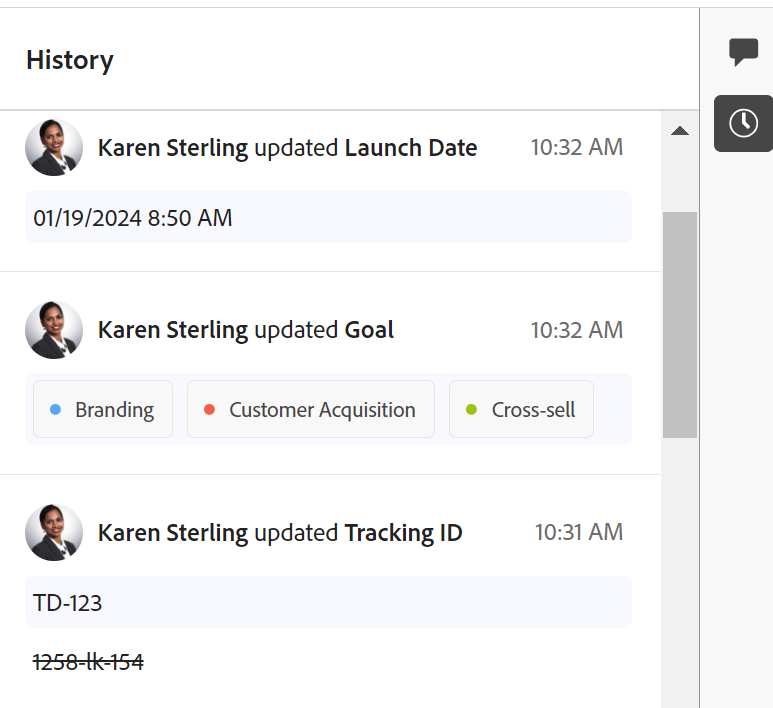

# Vue d’ensemble de la section Historique

Les informations mises en surbrillance sur cette page font référence à des fonctionnalités qui ne sont pas encore disponibles de manière générale. Elles ne sont disponibles que dans l’environnement de prévisualisation pour toute la clientèle ou dans l’environnement de production pour les clientes et les clients qui ont activé les versions rapides.

Pour plus d’informations sur les versions rapides, consultez la section [Activer ou désactiver les versions rapides pour votre entreprise](/help/quicksilver/administration-and-setup/set-up-workfront/configure-system-defaults/enable-fast-release-process.md).

{{planning-important-intro}}

Vous pouvez collaborer sur les enregistrements Adobe Workfront Planning en ajoutant des commentaires ou des réponses dans le panneau droit d’un enregistrement. Vous pouvez également afficher d’autres modifications apportées à l’enregistrement et enregistrées par le système dans cette zone.

Le panneau de droite d’un enregistrement affiche les sections suivantes :

* **Commentaires** : affiche les commentaires et réponses ajoutées aux enregistrements. Pour plus d’informations sur la gestion des commentaires dans les enregistrements Workfront Planning, voir [Gérer les commentaires d’enregistrement](/help/quicksilver/planning/records/manage-record-comments.md).
* **Historique** : affiche les modifications apportées aux champs d’enregistrement et enregistrées par le système.

## Conditions d’accès

+++ Développez pour afficher les exigences d’accès.

Vous devez disposer des accès suivants pour effectuer les étapes décrites dans cet article :

<table style="table-layout:auto"> 
<col> 
</col> 
<col> 
</col> 
<tbody> 
    <tr> 
<tr> 
<td> 
   
 Produits
 </td> 
   <td> 
   <ul><li>
 Adobe Workfront
</li> 
   <li>
 Planification d’Adobe Workfront
</li></ul></td> 
  </tr>   
<tr> 
   <td role="rowheader">
Formule Adobe Workfront*
</td> 
   <td> 

L’un des plans Workfront suivants :
 
<ul><li>Sélectionner</li> 
<li>Principal</li> 
<li>Final</li></ul> 

Workfront Planning n’est pas disponible pour les plans Workfront hérités
 
   </td> 
<tr> 
   <td role="rowheader">
Package Adobe Workfront Planning*
</td> 
   <td> 

Tous 
 

Pour plus d’informations sur les éléments inclus dans chaque plan de planification Workfront, contactez votre gestionnaire de compte Workfront. 
 
   </td> 
 <tr> 
   <td role="rowheader">
Plateforme Adobe Workfront
</td> 
   <td> 

L’instance de Workfront de votre entreprise doit être intégrée à l’expérience unifiée Adobe pour pouvoir accéder à toutes les fonctionnalités de Workfront Planning.
 

Pour plus d’informations, voir <a href="/help/quicksilver/workfront-basics/navigate-workfront/workfront-navigation/adobe-unified-experience.md">Adobe Unified Experience pour Workfront</a>. 
 
   </td> 
   </tr> 
  </tr> 
  <tr> 
   <td role="rowheader">
Licence Adobe Workfront*
</td> 
   <td> 
Licence de contributeur ou d’une licence supérieure

   
Workfront Planning n’est pas disponible pour les licences Workfront héritées
 
  </td> 
  </tr> 
  <tr> 
   <td role="rowheader">
Configuration du niveau d’accès
</td> 
   <td> 
Il n’existe aucun contrôle de niveau d’accès pour Adobe Workfront Planning.
   
</td> 
  </tr> 
<tr> 
   <td role="rowheader">
Autorisations d’objet
</td> 
   <td>   
Autorisations d’affichage ou supérieures pour un espace de travail et un type d’enregistrement </a> 
  
   
L’administration système a accès à tous les espaces de travail, y compris ceux qu’elle n’a pas créés.
 </td> 
  </tr> 
<tr> 
   <td role="rowheader">
Modèle de disposition
</td> 
   <td> 
Toutes les personnes, y compris les administrateurs et administratrices de Workfront, doivent se voir attribuer un modèle de mise en page incluant la zone Planning dans le menu principal. 
 </td> 
  </tr> 
</tbody> 
</table>

* Pour plus d’informations sur les exigences d’accès à Workfront, voir [Conditions d’accès requises dans la documentation Workfront](/help/quicksilver/administration-and-setup/add-users/access-levels-and-object-permissions/access-level-requirements-in-documentation.md).

+++

<!--replace the layout template info in the table with this at release: 

 Users with a Light or Contributor license must be assigned a layout template that includes the Planning option  in the following areas:

   <ul><li>Main Menu</li>
   <li>Left panel of projects, portfolios, and programs</li>
   <li>Landing page</li>
   <li>Pins</li></ul>
   
For more information, see <a href="/help/quicksilver/administration-and-setup/customize-workfront/use-layout-templates/create-and-manage-layout-templates.md">Create and manage layout templates</a>.

   
Standard users and System Administrators have the Planning areas enabled by default.

   
<b>NOTE</b>

   
In the Production environment, all users including the System administrators must be assigned to a layout template that includes the Planning areas.

-->

## Rechercher la section Historique d’un enregistrement

{{step1-to-planning}}

1. Cliquez sur la vignette d’un espace de travail.

   L’espace de travail s’ouvre et les types d’enregistrements s’affichent sur les cartes.

1. Cliquez sur une carte de type d’enregistrement.
La page de type d’enregistrement s’ouvre et tous les enregistrements de ce type s’affichent.

1. Dans n’importe quel affichage, cliquez sur le nom d’un enregistrement.

   La page de l’enregistrement s’ouvre. La zone Commentaires s’ouvre par défaut dans le panneau de droite.
1. Cliquez sur l’icône **Afficher l’historique** . Toutes les modifications apportées aux champs de l’enregistrement s’affichent dans le panneau de droite, en commençant par la plus récente.
1. (Facultatif) Cliquez sur l’icône **Masquer l’historique**  pour fermer le panneau de droite.

## Remarques relatives à la section Historique

Vous pouvez passer en revue les modifications apportées aux champs d’enregistrement dans la section Historique du panneau droit de la page d’un enregistrement.

* Workfront Planning enregistre les informations suivantes dans la section Historique :

   * Toute modification de champ

   * Les anciennes et nouvelles valeurs des champs, en cas de modification des valeurs. Les anciennes valeurs apparaissent barrées.

   * Le nom complet de l’utilisateur ou de l’utilisatrice qui a effectué la modification.

   * La date et l’heure de la modification.

* Les champs des types suivants affichent toujours l’ancienne valeur (en caractères barrés) et la nouvelle valeur :

   * Texte
   * Paragraphe
   * Devise
   * Date
   * Nombre
   * Pourcentage
   * Sélection unique

* Si au moins l’une des valeurs multiples a été supprimée, les champs des types suivants affichent uniquement l’ancienne valeur en caractères barrés :

   * Sélection multiple
   * Champs d’enregistrement liés
   * Personnes

  Si la modification a consisté uniquement à ajouter des valeurs au champ, l’ancienne valeur ne s’affiche pas et seule la nouvelle valeur du champ s’affiche.

* Les champs de type case à cocher n’affichent jamais l’ancienne valeur en caractères barrés. Si le champ est modifié, seul l’état actuel au moment de la modification s’affiche.

  Pour plus d’informations sur les champs Workfront Planning, voir [Créer des champs](/help/quicksilver/planning/fields/create-fields.md).

* Les modifications apportées aux champs des types suivants ne s’affichent pas dans la section Historique :

   * Champs liés (de recherche)
   * Formule
   * Créé par
   * Créé le
   * Dernière modification par
   * Date de dernière modification

* Si un champ est supprimé du système, les mises à jour effectuées sur ce champ restent dans la section Historique. Rien n’indique que le champ a été supprimé dans la section Historique d’un enregistrement.
