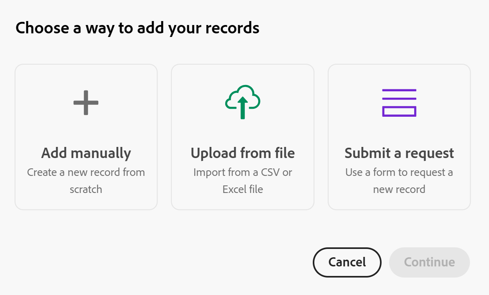

# Créer des enregistrements en important des informations depuis un fichier CSV ou Excel

Les informations de cette page font référence à des fonctionnalités qui ne sont pas encore disponibles de façon générale. Elle est disponible uniquement dans l’environnement de Prévisualisation pour tous les clients. Après les versions mensuelles en production, les mêmes fonctionnalités sont également disponibles dans l’environnement de production pour les clients qui ont activé les versions rapides. 

Pour plus d’informations sur les versions rapides, voir [Activation ou désactivation des versions rapides pour votre organisation](/help/quicksilver/administration-and-setup/set-up-workfront/configure-system-defaults/enable-fast-release-process.md). 

{{planning-important-intro}}

Les enregistrements sont des instances individuelles de types d&#39;enregistrements, qui sont les types d&#39;objet d&#39;Adobe Workfront Planning. Dans Workfront Planning, vous pouvez créer des enregistrements en important des informations à partir d&#39;un fichier CSV ou Excel.

Pour plus d&#39;informations sur la création d&#39;enregistrements, voir [Créer des enregistrements](/help/quicksilver/planning/records/create-records.md).

## Conditions d’accès

+++ Développez pour afficher les exigences d’accès.

Vous devez disposer des accès suivants pour effectuer les étapes décrites dans cet article :

<table style="table-layout:auto"> 
<col> 
</col> 
<col> 
</col> 
<tbody> 
    <tr> 
<tr> 
<td> 
   
 Produits
 </td> 
   <td> 
   <ul><li>
 Adobe Workfront
</li> 
   <li>
 Planification d’Adobe Workfront
</li></ul></td> 
  </tr>   
<tr> 
   <td role="rowheader">
Formule Adobe Workfront*
</td> 
   <td> 

L’un des plans Workfront suivants :
 
<ul><li>Sélectionner</li> 
<li>Principal</li> 
<li>Final</li></ul> 

Workfront Planning n’est pas disponible pour les plans Workfront hérités
 
   </td> 
<tr> 
   <td role="rowheader">
Package Adobe Workfront Planning*
</td> 
   <td> 

Tous 
 

Pour plus d’informations sur les éléments inclus dans chaque plan de planification Workfront, contactez votre gestionnaire de compte Workfront. 
 
   </td> 
 <tr> 
   <td role="rowheader">
Plateforme Adobe Workfront
</td> 
   <td> 

L’instance de Workfront de votre organisation doit être intégrée à l’expérience unifiée Adobe pour pouvoir accéder à Workfront Planning.
 

Pour plus d’informations, voir <a href="/help/quicksilver/workfront-basics/navigate-workfront/workfront-navigation/adobe-unified-experience.md">Adobe Unified Experience pour Workfront</a>. 
 
   </td> 
   </tr> 
  </tr> 
  <tr> 
   <td role="rowheader">
Licence Adobe Workfront*
</td> 
   <td> Standard
   
Workfront Planning n’est pas disponible pour les licences Workfront héritées
 
  </td> 
  </tr> 
  <tr> 
   <td role="rowheader">
Configuration du niveau d’accès
</td> 
   <td> 
Il n’existe aucun contrôle de niveau d’accès pour Adobe Workfront Planning.
 
   
Modifiez l’accès dans Workfront pour les types d’objets que vous souhaitez créer (projets, programmes et portfolios) à mesure que vous les connectez à partir de nouveaux enregistrements  
  
</td> 
  </tr> 
<tr> 
   <td role="rowheader">
Autorisations d’objet
</td> 
   <td> 
Autorisations de niveau Contribution ou supérieur à l’espace de travail et au type d’enregistrement dans lequel vous souhaitez ajouter des enregistrements. 
  
   
L’administration système a accès à tous les espaces de travail, y compris ceux qu’elle n’a pas créés.

   
Gérez les autorisations sur les objets Workfront (portfolios) pour ajouter des objets enfants (projets).

   </td> 
  </tr> 
<tr> 
   <td role="rowheader">
Modèle de mise en page
</td> 
   <td> 
Dans l’environnement de production, tous les utilisateurs, y compris les administrateurs système, doivent être affectés à un modèle de mise en page qui inclut Planning.

Dans l’environnement de Prévisualisation, les utilisateurs et utilisatrices standard et les administrateurs et administratrices système ont Planning activé par défaut.
 </td> 
  </tr> 
</tbody> 
</table>

* Pour plus d’informations sur les exigences d’accès à Workfront, voir [Conditions d’accès requises dans la documentation Workfront](/help/quicksilver/administration-and-setup/add-users/access-levels-and-object-permissions/access-level-requirements-in-documentation.md).

+++

## Remarques concernant l’importation d’enregistrements à l’aide d’un fichier Excel ou CSV

* Les en-têtes des colonnes de chaque feuille deviennent les champs associés aux enregistrements.
* Chaque ligne de chaque feuille devient un enregistrement unique associé.
* Si le fichier Excel contient plusieurs feuilles, seules les informations d&#39;une feuille que vous sélectionnez lors du processus d&#39;importation sont importées.
* Le fichier ne doit pas dépasser les valeurs suivantes :
   * 25 000 lignes
   * 500 colonnes
* La taille du fichier ne doit pas dépasser 5 Mo.
* Les feuilles vides ne sont pas prises en charge.
* Les champs des types suivants ne sont pas pris en charge et ne peuvent pas être mappés aux champs de la feuille d’importation :

   * Champs de connexion, selon l’environnement utilisé :

      * Dans l’environnement de production, les champs de connexion aux enregistrements Planning ou aux objets Workfront et AEM Assets ne peuvent pas être mappés

      * Dans l&#39;environnement Aperçu, vous pouvez mapper et importer des champs de connexion vers des enregistrements Planning. Vous ne pouvez pas mapper des champs à Workfront et AEM Assets.

   * Champs de recherche des enregistrements Planning connectés ou des objets Workfront et AEM Assets
   * Champs de formule
   * Date de création, Créé par
   * Date de dernière modification, Dernière modification par
   * Personnes
   * Si un champ à sélection multiple ou unique est importé et qu&#39;il offre plus de choix qu&#39;un champ similaire dans Planning, les options supplémentaires sont créées lors de l&#39;importation. Seuls les utilisateurs disposant d’autorisations de niveau Gérer pour l’espace de travail peuvent importer de nouveaux choix.

## Créer des enregistrements en important un fichier CSV ou Excel

{{step1-to-planning}}

1. Cliquez sur l’espace de travail dans lequel vous souhaitez créer des enregistrements,

   Ou

   Depuis un espace de travail, développez la flèche pointant vers le bas à droite d’un nom d’espace de travail existant, recherchez un espace de travail, puis sélectionnez-le lorsqu’il s’affiche dans la liste.
1. Cliquez sur la carte du type d’enregistrement sur lequel vous souhaitez importer les enregistrements.
1. Cliquez sur **Nouvel enregistrement** dans le coin supérieur droit de l’écran.

   
1. Cliquez sur **Télécharger à partir du fichier**, puis sur **Continuer**. <!--add screen shot when all three buttons are added - with the Submit a request button-->
1. Faites glisser un fichier Excel ou CSV préalablement enregistré sur votre ordinateur ou cliquez sur **Sélectionner un fichier CSV ou Excel** pour en rechercher un.
1. Cliquez sur **Prévisualiser et modifier**.
1. (Conditionnel) Si le fichier importé comporte plusieurs feuilles, sélectionnez le bouton radio de la feuille à importer dans la zone **Sélectionner une feuille à importer**, puis cliquez sur **Suivant**. Sinon, passez à l’étape suivante.

   
1. Dans la **Mapper les champs Planning à vos en-têtes de colonne** sélectionnez le **champ Planning** qui correspond le mieux aux informations de chacune des colonnes de la feuille.

   

   Chaque ligne représente un nouvel enregistrement. Seuls les 10 premiers enregistrements s’affichent dans la zone Prévisualiser et modifier.

   >[!TIP]
   >
   >Tous les types de champ ne sont pas pris en charge. Pour plus d’informations, consultez la section [Considérations relatives à l’importation d’enregistrements à l’aide d’un fichier Excel ou CSV](#considerations-about-importing-records-using-an-excel-or-csv-file) dans cet article.

1. (Facultatif et conditionnel) Si vous disposez d’autorisations de niveau Gérer pour l’espace de travail, sélectionnez l’option **Créer les options manquantes** dans le coin inférieur gauche de l’écran. Lorsqu’ils sont activés, les choix manquants de champs à sélection unique et à sélection multiple sont ajoutés.

   >[!NOTE]
   >
   >Par exemple, si le type d’enregistrement sélectionné comporte un champ Statut à sélection unique avec les choix Nouveau, En cours et Fermé et qu’un champ Statut importé d’un fichier comporte également un choix Statut En attente , le choix Statut En attente est également ajouté.
   >
   >Si vous ne disposez pas des autorisations de niveau Gérer pour l&#39;espace de travail, vous pouvez importer des enregistrements, mais les choix supplémentaires ne seront pas créés. Au lieu de cela, vous recevez le message suivant dans le coin supérieur droit de la zone Mapper les champs Planning à vos en-têtes de colonne : **Les choix qui n’existent pas dans le cadre d’une connexion, les champs à sélection unique ou multiple ne seront pas ajoutés**.

1. Cliquez sur **Importer**.

   Les informations suivantes sont importées dans Workfront Planning :

   * Nouveaux enregistrements qui s’affichent au bas de la vue Tableau du type d’enregistrement sélectionné.
   * Nouvelles valeurs de champs pour les champs existants associés à chaque enregistrement.
   * Nouveaux choix d&#39;un champ à sélection multiple ou unique qui n&#39;existait pas dans Planning.  <!--when we add connected records - add those here too-->

   Vous pouvez commencer à gérer les champs et les enregistrements dans la page des types d’enregistrements.

   Toute personne ayant accès à Workfront Planning et à l’espace de travail peut désormais afficher et modifier les enregistrements importés et leurs informations.

   <!--when we add connected records and the info icon in the tool changes, also add those items to the Import step and to the NOTE above it-->
