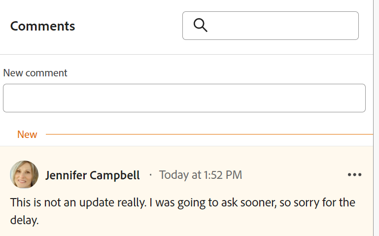

# Gérer les commentaires d’enregistrement

<!--The highlighted information on this page refers to functionality not yet generally available. It is available only in the Preview environment for all customers. After the monthly releases to Production, the same features are also available in the Production environment for customers who enabled fast releases.    

For information about fast releases, see [Enable or disable fast releases for your organization](/help/quicksilver/administration-and-setup/set-up-workfront/configure-system-defaults/enable-fast-release-process.md). -->

{{planning-important-intro}}

Vous pouvez collaborer sur les enregistrements Adobe Workfront Planning en ajoutant des commentaires ou des réponses dans le panneau droit d’un enregistrement. Vous pouvez également afficher d’autres modifications apportées à l’enregistrement et enregistrées par le système dans cette zone.

Le panneau de droite d’un enregistrement affiche les sections suivantes :

* **Commentaires** : affiche les commentaires et réponses que les utilisateurs et les utilisatrices ajoutent aux enregistrements.
* **Historique** : affiche les modifications enregistrées dans le système que les utilisateurs et les utilisatrices apportent aux champs des enregistrements. Pour plus d’informations, consultez la [Vue d’ensemble de la section Historique](/help/quicksilver/planning/records/history-section-overview.md).

## Conditions d’accès

+++ Développez pour afficher les exigences d’accès.

<table style="table-layout:auto"> 
<col> 
</col> 
<col> 
</col> 
<tbody> 
    <tr> 
<tr> 
<td> 
   
 Produits
 </td> 
   <td> 
   <ul><li>
 Adobe Workfront
</li> 
   <li>
 Planification d’Adobe Workfront
</li></ul></td> 
  </tr>   
<tr> 
   <td role="rowheader">
Formule Adobe Workfront*
</td> 
   <td> 

L’un des plans Workfront suivants :
 
<ul><li>Sélectionner</li> 
<li>Principal</li> 
<li>Final</li></ul> 

Workfront Planning n’est pas disponible pour les plans Workfront hérités
 
   </td> 
<tr> 
   <td role="rowheader">
Package Adobe Workfront Planning*
</td> 
   <td> 

Tous 
 

Pour plus d’informations sur les éléments inclus dans chaque plan de planification Workfront, contactez votre gestionnaire de compte Workfront. 
 
   </td> 
 <tr> 
   <td role="rowheader">
Plateforme Adobe Workfront
</td> 
   <td> 

L’instance de Workfront de votre organisation doit être intégrée à l’expérience unifiée Adobe pour pouvoir accéder à Workfront Planning.
 

Pour plus d’informations, voir <a href="/help/quicksilver/workfront-basics/navigate-workfront/workfront-navigation/adobe-unified-experience.md">Adobe Unified Experience pour Workfront</a>. 
 
   </td> 
   </tr> 
  </tr> 
  <tr> 
   <td role="rowheader">
Licence Adobe Workfront*
</td> 
   <td>
 Licence de contributeur ou d’une licence supérieure

   
Workfront Planning n’est pas disponible pour les licences Workfront héritées
 
  </td> 
  </tr> 
  <tr> 
   <td role="rowheader">
Configuration du niveau d’accès
</td> 
   <td> 
Il n’existe aucun contrôle de niveau d’accès pour Adobe Workfront Planning.
   
</td> 
  </tr> 
<tr> 
   <td role="rowheader">
Autorisations d’objet
</td> 
   <td>   
Autorisations d’affichage ou supérieures pour un espace de travail et un type d’enregistrement</a> 
  
   
L’administration système a accès à tous les espaces de travail, y compris ceux qu’elle n’a pas créés.
 </td> 
  </tr> 
<tr>
   <td role="rowheader">
Modèle de mise en page
</td>
   <td> Les utilisateurs disposant d'une licence light ou contributor doivent se voir attribuer un modèle de mise en page incluant Planning.
   
Les zones Planning sont activées par défaut pour les utilisateurs standard et les administrateurs système.

</li></ul>

</td>
  </tr>
</tbody> 
</table>

* Pour plus d’informations sur les exigences d’accès à Workfront, voir [Conditions d’accès requises dans la documentation Workfront](/help/quicksilver/administration-and-setup/add-users/access-levels-and-object-permissions/access-level-requirements-in-documentation.md).

+++

## Remarques concernant les commentaires sur un enregistrement

* Vous pouvez ajouter des commentaires et des réponses aux enregistrements dans la section Commentaires d’un enregistrement de Workfront Planning.

* Les commentaires ajoutés aux enregistrements liés ne s’affichent pas dans les enregistrements à partir desquels vous créez un lien. Par exemple, si vous commentez un enregistrement de produit Workfront Planning lié à un enregistrement Campaign, le commentaire s’affiche uniquement sur l’enregistrement de produit dans Workfront Planning et non sur l’enregistrement Campaign à partir duquel vous effectuez la liaison.

* Vous pouvez ajouter des commentaires aux enregistrements Workfront Planning créés suite à une connexion entre un enregistrement et un objet provenant d’une autre application.

  Ainsi, vous pouvez ajouter des commentaires à l’enregistrement Workfront Planning du projet après avoir connecté les projets Workfront aux enregistrements Workfront Planning. Pour plus d’informations, voir [Connecter des enregistrements](/help/quicksilver/planning/records/connect-records.md).

* Les commentaires ajoutés aux objets liés dans d’autres applications ne s’affichent pas dans Workfront Planning et les commentaires ajoutés aux objets liés dans Workfront Planning ne s’affichent pas dans d’autres applications.

  Par exemple, les commentaires ajoutés aux projets dans Workfront ne s’affichent pas sur le même projet lié à une campagne dans Workfront Planning et les commentaires ajoutés à l’enregistrement Workfront Planning du projet ne s’affichent pas dans Workfront.

* Vous pouvez marquer des utilisateurs ou des équipes pour attirer leur attention sur une mise à jour. Les utilisateurs balisés individuellement et les utilisateurs des équipes balisées reçoivent une notification in-app et un e-mail à propos de votre mise à jour.

  >[!NOTE]
  >
  >   Seuls les utilisateurs des clients qui ont intégré l’expérience unifiée Adobe reçoivent à la fois une notification in-app et une notification par e-mail. Pour déterminer si votre société utilise l’expérience unifiée Adobe, consultez [Expérience unifiée Adobe pour Workfront](/help/quicksilver/workfront-basics/navigate-workfront/workfront-navigation/adobe-unified-experience.md).

* Vous pouvez ajouter une mise à jour aux enregistrements et consulter l’historique des modifications dans les sections suivantes de Workfront Planning :

   * À partir de la page des détails de l’enregistrement.
   * D’une vue, dans la zone Détails de l’enregistrement .

### Gérer les commentaires sur les enregistrements

{{step1-to-planning}}

1. Cliquez sur la vignette d’un espace de travail.

   L’espace de travail s’ouvre et les types d’enregistrements s’affichent sur les cartes.

1. Cliquez sur une carte de type d’enregistrement.
La page de type d’enregistrement s’ouvre et tous les enregistrements de ce type s’affichent.

1. Choisissez une vue en tableau dans le menu déroulant **Affichage**.
1. Cliquez sur le nom d’un enregistrement dans la vue de tableau.

   La page **Détails** de l’enregistrement s’ouvre. La zone Commentaires s’ouvre par défaut dans le panneau de droite.

1. (Conditionnel) Si le panneau de droite ne s’ouvre pas par défaut, cliquez sur l’icône **Afficher les commentaires**  dans le coin supérieur droit pour ouvrir la section Commentaires.

1. Commencez à saisir un commentaire dans la zone **Nouveau commentaire**.

   

   >[!TIP]
   >
   >Si vous quittez la section Commentaires avant d’avoir terminé la saisie et l’envoi d’un commentaire, le commentaire reste sur la page en mode brouillon même après la déconnexion et la reconnexion. <!--this is no longer possible for records: Any images that are added to the comment are also saved in the draft. Drafts are saved for 7 days after which they are discarded and cannot be recovered. Drafted comments are only visible to the user entering them.-->

1. (Facultatif) Pour annuler ou rétablir une modification, utilisez les raccourcis clavier suivants :
   * Ctrl + Z (⌘ + z pour Mac) pour annuler une modification
   * Ctrl + Y (⌘ + y pour Mac) pour rétablir une modification
1. (Facultatif et conditionnel) Si votre instance Workfront fait partie de l’expérience unifiée Adobe, ajoutez **@** suivi du nom d’un utilisateur ou d’une équipe pour les baliser dans la mise à jour. Pour plus d’informations, consultez la section [Considérations relatives aux commentaires sur un enregistrement](#considerations-about-commenting-on-a-record) dans cet article.

1. (Facultatif) Utilisez les options de la barre d’outils Texte enrichi pour mettre en forme votre texte, ajouter des émoticônes ou des liens vers votre mise à jour afin d’améliorer votre contenu.

   >[!TIP]
   >
   >Vous ne pouvez pas ajouter d’images à un commentaire d’enregistrement.

1. Continuez à ajouter des commentaires à l’enregistrement.

   Pour plus d&#39;informations sur la mise à jour des objets, y compris les enregistrements Workfront Planning, voir [Mettre à jour le travail](/help/quicksilver/workfront-basics/updating-work-items-and-viewing-updates/update-work.md).

1. (Facultatif) Cliquez sur l’icône **Plus**  dans le coin supérieur droit du commentaire, puis cliquez sur **Supprimer** pour supprimer le commentaire.
1. (Facultatif) Cliquez sur l’icône **Masquer les commentaires**  pour fermer le panneau de droite.

<!--
      >[!TIP]
      >
      >If another user submits a comment to the same item you are updating, there is a red line with a "New" indicator to inform you of the newer comments. 
      >
      >The indicator displays only after the comment was submitted on the item, and not when the comment is still composed. 
      >
      >
1. Click **Submit** to add the update to the record. 
1. (Optional) To edit a comment, click the **More** menu  in the upper-right corner of the comment, then click **Edit**.
   >[!IMPORTANT]
   >
   >You can edit your comment only within 15 minutes from submitting it.  
1. Edit the information in the comment, add or remove images or remove any of the tagged users. An "edited" indicator is added to the left of the comment.
      >[!TIP]
      >
      >Comments from the current year do not display the year in the date stamp. Hovering over a timestamp displays the full date, including the year.
1. (Optional and conditional) To search for an existing comment, start typing a keyword in the search box in the upper-right corner of the **Comments** area.     
   
1. (Optional) Click **Reply** or start typing a comment in the **Add reply ..** area, to reply to an existing comment, then follow steps 4-8 above. (**************accurate??***********)
1. (Conditional and optional) If other users have added comments that display outside of the visible area in the Comments section while you were adding your comments, click **View** inside the **new comments banner** at the bottom of the screen  to display these comments.
   

    Additional comments display at the bottom of the screen.
1. (Optional) Click the **Like** icon to like an update or acknowledge that you read it. The icon updates with the number of likes.
1. (Conditional and optional) If you included additional people in your comment, click the avatars of the users included in the update to display a list of users that the comment is shared with. 
1. (Optional) Click the **More** icon  in the upper-right corner of the comment and click one of the following options, to copy a information from a comment: 
    * **Copy link**: This copies a link to the comment to your clipboard.
    * **Copy body text**: This copies the text of the comment to your clipboard.
    * **Quote reply**: This copies the content of your comment into a new reply. Images are not included in the copied reply. 

    For more information, see [Update work](/help/quicksilver/workfront-basics/updating-work-items-and-viewing-updates/update-work.md). -->

## Vue d’ensemble de la section Historique

Vous pouvez consulter les modifications apportées à l’enregistrement dans la section Historique du panneau droit d’un enregistrement.

Pour plus d’informations, consultez la [Vue d’ensemble de la section Historique](/help/quicksilver/planning/records/history-section-overview.md).
