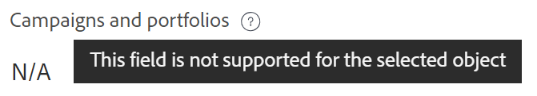

<!--add also Group and Company when they are available-->

# Gestion des connexions d’enregistrement à partir d’objets Workfront

{{planning-important-intro}}

Vous pouvez afficher les enregistrements de planification Workfront associés aux objets Adobe Workfront dans la section Planification d’un objet Workfront, dans le panneau de gauche.

<!--replace above with this: 

You can display Workfront Planning records and their respective records connected to Adobe Workfront objects in the following areas in Workfront:

* The Planning section of a Workfront object: Displays all record types connected to an object and their respective connected records. 
* A Planning connection custom field: Displays one record type and its respective connected records .-->

La section Planification est disponible pour les objets Workfront suivants :

* Projet
* Portfolio
* Programme
<!--* Group
* Company-->

<!--move the above to a lower place below when releasing Planning connection custom field-->

## Conditions d’accès

+++ Développez pour afficher les exigences d’accès à la planification Workfront.

Vous devez disposer des accès suivants pour effectuer les étapes décrites dans cet article :

<table style="table-layout:auto">
 <col>
 </col>
 <col>
 </col>
 <tbody>
    <tr>
<tr>
<td>
   
 Produits
 </td>
   <td>
   <ul><li>
 Adobe Workfront
</li>
   <li>
 Planification d’Adobe Workfront
</li></ul></td>
  </tr>  
 <tr>
   <td role="rowheader">
Formule Adobe Workfront*
</td>
   <td>

L’un des projets Workfront suivants est prévu :

<ul><li>Sélectionner</li>
<li>Principal</li>
<li>Final</li></ul>

La planification Workfront n’est pas disponible pour les plans Workfront hérités

   </td>

<tr>
   <td role="rowheader">
Formule de planification Adobe Workfront*
</td>
   <td>

Tous

Pour plus d’informations sur les éléments inclus dans chaque plan de planification Workfront, contactez votre gestionnaire de compte Workfront. 

   </td>

<tr>
   <td role="rowheader">
Plateforme Adobe Workfront
</td>
   <td>

L’instance de Workfront de votre entreprise doit être intégrée à l’expérience unifiée Adobe pour pouvoir accéder à toutes les fonctionnalités de la planification Workfront.

Pour plus d’informations, voir <a href="/help/quicksilver/workfront-basics/navigate-workfront/workfront-navigation/adobe-unified-experience.md">Adobe Unified Experience pour Workfront</a>. 

   </td>

</tr>
  </tr>
  <tr>
   <td role="rowheader">
Licence Adobe Workfront*
</td>
   <td>
   
Standard

   
La planification Workfront n’est pas disponible pour les licences Workfront héritées

  </td>
  </tr>
  <tr>
   <td role="rowheader">
Configuration du niveau d’accès
</td>
   <td> 
Affichage ou accès supérieur à Projets, programmes et Portfolios
  
</td>
  </tr>
<tr>
   <td role="rowheader">
Autorisations d’objet
</td>
   <td>
   
Dans Workfront, affichez ou autorisations supérieures à un projet, un portfolio ou un programme</a> 
 
   
Dans Workfront Planning, Contribute ou autorisations supérieures à un espace de travail</a> 
  
   
Les administrateurs système disposent d’autorisations pour tous les espaces de travail de planification Workfront, y compris ceux qu’ils n’ont pas créés.
 
  </td>
  </tr>
<tr>
   <td role="rowheader">
Modèle de mise en page
</td>
   <td> 
Tous les utilisateurs, y compris les administrateurs de Workfront, doivent se voir attribuer un modèle de mise en page comprenant la zone Planification du menu principal et la zone Planification des projets, portefeuilles et programmes. 
 Pour plus d’informations, consultez la <a href="/help/quicksilver/planning/access/access-overview.md">présentation de l’accès à Adobe Planning</a>. 
  
  
</td>
  </tr>
 </tbody>
</table>

* Pour plus d’informations sur les exigences d’accès à Workfront, voir [Conditions d’accès requises dans la documentation Workfront](/help/quicksilver/administration-and-setup/add-users/access-levels-and-object-permissions/access-level-requirements-in-documentation.md).

+++

## Gestion des enregistrements dans la section Planification

Vous pouvez utiliser la section Planification d’un objet Workfront pour afficher tous les types d’enregistrements et leurs enregistrements respectifs connectés à l’objet Workfront.

<!--move the section above starting with "The Planning section is available ..." here-->

### Points à prendre en compte concernant la section Planification des objets Workfront

Tenez compte de ce qui suit lorsque vous affichez des enregistrements de planification Workfront à partir de la section Planification d’un objet Workfront :

* Les types d’enregistrement de la planification Workfront doivent d’abord être connectés aux types d’objets Workfront.

  Pour plus d’informations, voir les articles suivants :

   * [Connecter les types d’enregistrements](/help/quicksilver/planning/architecture/connect-record-types.md)
   * [Connect records](/help/quicksilver/planning/records/connect-records.md)
* Vous pouvez afficher la section Planification à partir d’un objet Workfront, même lorsqu’aucun enregistrement n’est associé à l’objet Workfront.

### Gestion des connexions d’enregistrement à partir de la section Planification

{{step1-to-planning}}

1. Cliquez sur la carte d’un espace de travail.

   L’espace de travail s’ouvre et les types d’enregistrement s’affichent sous forme de cartes.

1. Cliquez sur la carte d’un type d’enregistrement connecté à un projet, un portfolio ou un programme Workfront.
1. Accédez à un champ d’enregistrement connecté qui a une connexion avec un objet Workfront, soit en mode Tableau, soit à partir de la page de détails d’un enregistrement. Pour plus d’informations, consultez la section [Connecter les enregistrements](/help/quicksilver/planning/records/connect-records.md).
1. Cliquez sur le nom d’un objet Workfront dans le champ d’enregistrement connecté.
La page de l’objet s’ouvre dans Workfront.

   >[!NOTE]
   >
   >  Si vous connaissez un objet Workfront déjà connecté à un enregistrement Planning, vous pouvez accéder à la section Planning à partir de l’objet Workfront.

1. Cliquez sur **Planning** dans le panneau de gauche.

   >[!NOTE]
   >
   >   L’administrateur de Workfront ou de groupe doit ajouter la section Planification à votre modèle de mise en page avant qu’elle ne s’affiche pour un projet, un portfolio ou un programme Workfront.

   La section Planification affiche les informations suivantes :

   * Les enregistrements connectés s’affichent sur des cartes individuelles contenant les informations suivantes :
      * Nom de l’enregistrement
      * Miniature de l’enregistrement
      * Nom du champ d’enregistrement connecté tel qu’il s’affiche dans Workfront Planning.
   * Les enregistrements s’affichent sous leur espace de travail respectif.

   

1. (Facultatif) Cliquez sur **Afficher toutes les connexions** pour afficher tous les types d’enregistrements connectés, y compris ceux sans enregistrements connectés. Par défaut, les types d’enregistrements sans enregistrements connectés ne s’affichent pas.
1. Cliquez sur une carte d’enregistrement pour afficher plus d’informations sur l’enregistrement. La zone d’aperçu des enregistrements s’affiche.
1. (Facultatif) Commencez à modifier les champs dans la zone d’aperçu de l’enregistrement. Vos modifications sont enregistrées automatiquement.
1. (Facultatif) Cliquez sur l’icône **Ouvrir dans un nouvel onglet**  dans le coin supérieur droit de la zone d’aperçu pour ouvrir la page de détails de l’enregistrement. La page de détails de l’enregistrement s’ouvre dans Workfront Planning.
1. (Facultatif) Pointez sur une carte d’enregistrement, puis cliquez sur l’icône de déconnexion d’enregistrement **-**, puis cliquez sur **Déconnecter**.
Les événements suivants se produisent :
   * L’enregistrement n’est plus connecté à l’objet Workfront.
   * L’objet Workfront est également supprimé du champ connecté de l’enregistrement de Workfront Planning.
   * Les valeurs des champs de recherche Workfront connectés à l’enregistrement Planning sont également supprimées.
1. Cliquez sur **Connect** pour connecter plus d’enregistrements pour les types d’enregistrements connectés. Pour plus d’informations, consultez [Connecter les enregistrements](/help/quicksilver/planning/records/connect-records.md).

   Les événements suivants se produisent :

   * Les enregistrements sont immédiatement connectés à l’objet Workfront et s’affichent dans la section Planification .
   * L’objet Workfront est ajouté au champ connecté de l’enregistrement Workfront Planning.
   * Les valeurs des champs de recherche Workfront connectés à l’enregistrement Planning sont renseignées dans Workfront Planning.

<!--

## Manage records in the Planning connection field type

You can use a Planning connection custom field on a Workfront object to view one record type and its respective records connected to the Workfront object. 

You can control which Planning records display for the Workfront object when you create Planning connection custom fields. 

* The Planning connection field can be populated with Planning records when it is attached to forms for the following Workfront objects:

   * Project
   * Portfolio
   * Program
   * Group
   * Company

For more information, see [Create a form](/help/quicksilver/administration-and-setup/customize-workfront/create-manage-custom-forms/form-designer/design-a-form/design-a-form.md). 

### Considerations about the Planning connection field type

Consider the following when you view Workfront Planning records from a Planning connection field of a Workfront object: 

* You can associate only one record type with one Planning connection field.
* Your Workfront or group administrator must add a Planning connection field on a Workfront custom form.
* You must attach the custom form to a Workfront object that can be connected from Workfront Planning, if you have the correct access.
* Workfront Planning record types must first be connected to Workfront object types. For information, see [Connect record types](/help/quicksilver/planning/architecture/connect-record-types.md). 
* You can connect or disconnect records from the Planning connection field of a Workfront object only for objects that can have Workfront Planning connections.
* You must have Contribute permissions for a workspace in Workfront Planning to be able to connect or disconnect records from the Planning connection field of a Workfront object.
* You can view a Planning connection field for a Workfront object, even when there are no records connected to the object yet. 
* You cannot edit a Planning connection field when editing Workfront objects in bulk. 

### Manage record connections from the Planning connection field type

1. Go to one of the following object types that has been connected with a Workfront Planning record type: 

   * Project
   * Portfolio
   * Program
   * Company
   * Group

1. Click **< Object > Details** in the left panel.
1. (Conditional) Add a custom form with at least one Planning connection field for the object you selected, if one is not present. 

   >[!NOTE]
   >
   >Your Workfront or group administrator must first create the form and add a Planning connection field on it before you can add it to an object. 

1. Click inside the field to add connected records.
1. Click the downward-pointing arrow inside the field, to select records from the list. 

   

   >[!TIP]
   >
   >   You cannot add records to Planning connection fields that are associated with Workfront objects other than the object you selected. 
   >
   >For example, you cannot add records to a Planning connection field created for a Portfolio connection from a Project's custom form. 
   >
   >There is an indication that the object of the field and the object you selected don't match.  
   >
   >

1. Click outside the list to close it. 

   The following things occur:

   * The records are immediately connected to the Workfront object and they display in the Planning connection field as well as the Planning section of the Workfront object. 
   * The Workfront object is added to the Workfront Planning record's connected field. 
   * The values for the Workfront lookup fields connected to the Planning record are populated in Workfront Planning. 
1. (Optional) Click the name of a record in the Planning connection field to open it in Workfront Planning. 
   The record details tab opens in Workfront Planning. 
   You can review information about the record, or navigate to the record type page. 

1. (Optional) From the custom form in Workfront, click the **Remove** icon  on a record to remove it from the Planning connection field and disconnect it from the Workfront object. 
   The Workfront object is disconnected from the Planning record, and any lookup information from Workfront is removed from the record. 

-->