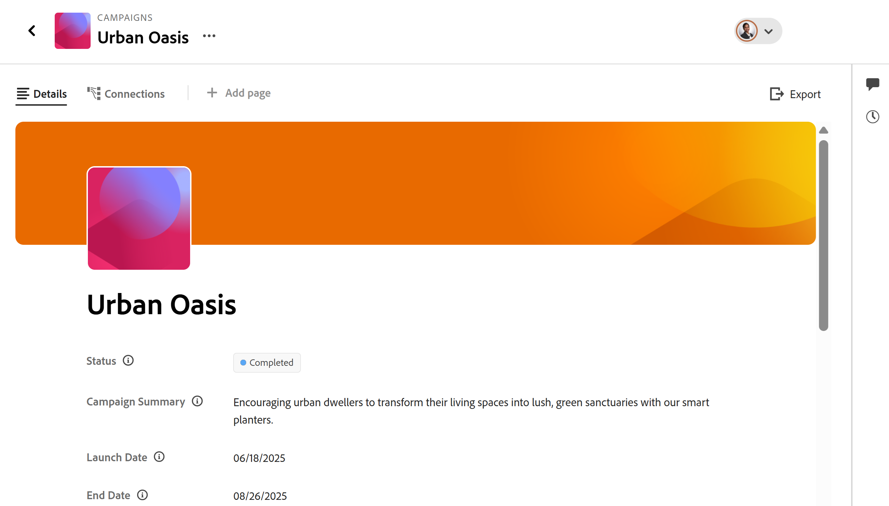

# Gérer la mise en page de la page d’enregistrement

Les informations mises en évidence sur cette page font référence à des fonctionnalités qui ne sont pas encore disponibles pour tous. Elle est disponible uniquement dans l’environnement de Prévisualisation pour tous les clients. Après les versions mensuelles en production, les mêmes fonctionnalités sont également disponibles dans l’environnement de production pour les clients qui ont activé les versions rapides. 

Pour plus d’informations sur les versions rapides, voir [Activation ou désactivation des versions rapides pour votre organisation](/help/quicksilver/administration-and-setup/set-up-workfront/configure-system-defaults/enable-fast-release-process.md). 

{{planning-important-intro}}

Vous pouvez modifier la disposition de la page et de l’aperçu de l’enregistrement dans Adobe Workfront Planning.

La prévisualisation d’enregistrement est une vue plus petite de la page d’enregistrement qui s’affiche dans la vue d’un type d’enregistrement.

Lorsque vous modifiez la disposition d&#39;un aperçu d&#39;enregistrement et d&#39;une page, les modifications affectent les zones d&#39;aperçu et les pages de détails de tous les enregistrements du même type.

Cet article décrit comment modifier la disposition et l&#39;aspect d&#39;une zone d&#39;aperçu d&#39;enregistrement ou d&#39;une page d&#39;enregistrement. Pour plus d’informations sur la modification des enregistrements, voir [Modifier les enregistrements](/help/quicksilver/planning/records/edit-records.md).

Vous devez créer des types d&#39;enregistrements et des enregistrements avant de pouvoir commencer à modifier les pages d&#39;enregistrement.

Pour plus d’informations, voir les articles suivants :

* [Créer des types d’enregistrement](/help/quicksilver/planning/architecture/create-record-types.md)

* [Créer des enregistrements](/help/quicksilver/planning/records/create-records.md)

## Conditions d’accès

+++ Développez pour afficher les exigences d’accès.

Vous devez disposer des accès suivants pour effectuer les étapes décrites dans cet article :

<table style="table-layout:auto">
 <col>
 </col>
 <col>
 </col>
 <tbody>
    <tr>
<tr>
<td>
   
 Produits
 </td>
   <td>
   <ul><li>
 Adobe Workfront
</li>
   <li>
 Planification d’Adobe Workfront
</li></ul></td>
  </tr>  
 <tr>
   <td role="rowheader">
Formule Adobe Workfront*
</td>
   <td>

L’un des plans Workfront suivants :

<ul><li>Sélectionner</li>
<li>Principal</li>
<li>Final</li></ul>

Workfront Planning n’est pas disponible pour les plans Workfront hérités

   </td>

<tr>
   <td role="rowheader">
Package Adobe Workfront Planning*
</td>
   <td>

Tous

Pour plus d’informations sur les éléments inclus dans chaque plan de planification Workfront, contactez votre gestionnaire de compte Workfront. 

   </td>

<tr>
   <td role="rowheader">
Plateforme Adobe Workfront
</td>
   <td>

L’instance de Workfront de votre entreprise doit être intégrée à l’expérience unifiée Adobe pour pouvoir accéder à toutes les fonctionnalités de Workfront Planning.

Pour plus d’informations, voir <a href="/help/quicksilver/workfront-basics/navigate-workfront/workfront-navigation/adobe-unified-experience.md">Adobe Unified Experience pour Workfront</a>. 

   </td>

</tr>
  </tr>
  <tr>
   <td role="rowheader">
Licence Adobe Workfront*
</td>
   <td>
   
Standard

   
Workfront Planning n’est pas disponible pour les licences Workfront héritées

  </td>
  </tr>
  <tr>
   <td role="rowheader">
Configuration du niveau d’accès
</td>
   <td> 
Il n’existe aucun contrôle de niveau d’accès pour Adobe Workfront Planning.
  
</td>
  </tr>
<tr>
   <td role="rowheader">
Autorisations d’objet
</td>
   <td>
   
Autorisations de niveau Contributeur ou supérieur à un espace de travail <!--and record type--> </a> 
  
   
L’administration système a accès à tous les espaces de travail, y compris ceux qu’elle n’a pas créés.
 
  </td>
  </tr>
<tr>
   <td role="rowheader">
Modèle de mise en page
</td>
   <td> 
Un modèle de mise en page comprenant la zone Planification du menu principal et la zone Planification des projets, portfolios et programmes doit être affecté à tous les utilisateurs, y compris les administrateurs Workfront. 
 Pour plus d'informations, consultez <a href="/help/quicksilver/planning/access/access-overview.md">Présentation de l'accès à Adobe Planning</a>. 
  
  
</td>
  </tr>
 </tbody>
</table>

* Pour plus d’informations sur les exigences d’accès à Workfront, voir [Conditions d’accès requises dans la documentation Workfront](/help/quicksilver/administration-and-setup/add-users/access-levels-and-object-permissions/access-level-requirements-in-documentation.md).

+++

## Considérations relatives à la modification des pages d’enregistrement

* Par défaut, les détails et les pages de prévisualisation d&#39;un enregistrement affichent tous les champs associés à l&#39;enregistrement.

* Vous ne pouvez pas ajouter de nouveaux champs pour un enregistrement dans la page de prévisualisation ou de détails. Vous devez ajouter de nouveaux champs en mode Tableau pour les afficher dans les pages de prévisualisation et de détails.

* Vous pouvez ajouter des sections à une page d’aperçu d’enregistrement ou de détails, afin d’organiser les informations selon des critères communs et de les retrouver plus facilement.

* Les modifications suivantes affectent tous les enregistrements du même type et sont visibles par tous les utilisateurs qui accèdent à ces enregistrements :

   * Réorganisation des champs
   * Ajout ou suppression de sections

* Les modifications d’affichage effectuées dans la prévisualisation de l’enregistrement sont immédiatement visibles dans la page des détails de l’enregistrement. Les modifications apportées à la page d’enregistrement sont également visibles dans la zone d’aperçu de l’enregistrement.

* L’ajout d’une image de couverture ou d’une miniature à un enregistrement ne fait pas partie de la mise en page globale de l’aperçu de l’enregistrement ou de la page. Vous pouvez ajouter des images de couverture ou des miniatures uniques à chaque enregistrement. Pour plus d’informations, voir [Ajouter une image de couverture à un enregistrement](/help/quicksilver/planning/records/add-a-cover-image-to-a-record.md) et [Ajouter une miniature à un enregistrement](/help/quicksilver/planning/records/add-thumbnails-to-records.md).

## Ajouter des sections à un aperçu d’enregistrement ou à une page

Tenez compte des points suivants lors de l’ajout de sections à une page d’enregistrement :

* Le nombre de sections que vous pouvez avoir sur une page n’est pas limité.
* Une section ne peut pas être vide. Vous devez avoir au moins un champ dans une section.
* Vous pouvez faire glisser des champs d’une section à une autre. Pour plus d’informations, consultez la section [Réorganiser les champs dans la page de prévisualisation des enregistrements ou de détails](#rearrange-fields-in-the-record-preview-or-details-page) dans cet article.
* Lorsque vous supprimez tous les champs d’une section, celle-ci est automatiquement supprimée et ne peut pas être récupérée.

Pour ajouter une section à une prévisualisation d’enregistrement ou à une page :

{{step1-to-planning}}

1. Cliquez sur la vignette d’un espace de travail.

   L’espace de travail s’ouvre et les types d’enregistrements s’affichent sous forme de cartes.

1. Cliquez sur la vignette d’un type d’enregistrement pour plus de détails.

   La page du type d’enregistrement s’ouvre.

1. Dans une vue de tout type, cliquez sur le nom d’un enregistrement.

   Ou

   Dans la vue du tableau, cliquez sur l’icône **Ouvrir les détails**  dans la première colonne.

   L’aperçu de l’enregistrement s’ouvre dans la vue.

   

   

   

1. (Facultatif) Cliquez sur l’icône **Ouvrir dans un nouvel onglet**  dans le coin supérieur droit de l’aperçu de l’enregistrement pour ouvrir la page de l’enregistrement dans un nouvel onglet.

   La page d’enregistrement s’ouvre. L’onglet Détails s’ouvre par défaut.

   

1. Dans l’onglet **Détails** de l’aperçu de l’enregistrement ou de la page, passez le curseur sur l’espace blanc à gauche des champs, puis cliquez sur l’icône **Ajouter une section**  pour ajouter une section.
1. Cliquez dans le nom de la section et remplacez **Section sans titre** par un nom, puis cliquez sur Entrée. Les champs affichés sous la section font automatiquement partie de la nouvelle section.
1. Commencez à faire glisser et à déposer des champs dans la nouvelle section, comme décrit dans la section [Réorganiser les champs dans la page d’aperçu d’enregistrement ou de détails](#rearrange-fields-in-the-record-preview-or-details-page) dans cet article.

1. (Facultatif) Passez la souris sur le nom d’une section et cliquez sur le menu **Plus** .

   
1. (Facultatif) Effectuez l’une des opérations suivantes pour modifier la section :

   * Cliquez sur **Renommer** pour renommer la section

     >[!TIP]
     >
     > Vous pouvez renommer une section en ligne en cliquant sur son nom.

   * Cliquez sur **Déplacer vers le haut** pour déplacer la section d&#39;une position vers le haut

     Ou

     Cliquez sur **Déplacer vers le bas** pour déplacer la section d’une position vers le bas.
Tous les champs de la section se déplacent avec la section.

   * Cliquez sur **Supprimer** pour supprimer la section. La section est supprimée et ne peut pas être récupérée. Tous les utilisateurs accédant aux enregistrements de ce type ne verront plus la section supprimée.

1. Cliquez sur la flèche pointant vers le bas à gauche d&#39;un nom de section pour le réduire ou sur la flèche pointant vers la droite pour le développer.
Toutes les sections sont développées par défaut.

1. (Facultatif) Cliquez sur l’icône **saisir**  à gauche d’un nom de section, puis faites-la glisser et déposez-la à l’endroit souhaité.

   La nouvelle position de la section est mise à jour dans l’aperçu et la page de tous les enregistrements du même type pour tous les utilisateurs qui consultent les enregistrements.

   Toutes les modifications apportées aux sections et à l’ordre des champs sont enregistrées automatiquement.

1. (Facultatif) Cliquez sur le menu **Exporter**  pour exporter l’onglet Détails vers un fichier Word ou PDF. Pour plus d’informations, voir [Exporter les détails d’un enregistrement](/help/quicksilver/planning/records/export-the-record-page.md).

1. (Facultatif) Cliquez sur l’onglet **Connexions** en regard de l’onglet **Détails**. Vous devrez peut-être cliquer sur **Plus** avant de cliquer sur l’onglet **Connexions**.

   Tous les enregistrements ou objets connectés à l’enregistrement sélectionné s’affichent sous les noms du type d’enregistrement ou de l’application à laquelle ils appartiennent.

   

1. (Facultatif) Sélectionnez le paramètre **Afficher tous les enregistrements** dans le coin supérieur droit de l’onglet Connexions. Tous les types d’enregistrements connectés s’affichent, y compris ceux qui n’ont pas encore d’enregistrements connectés. Par défaut, le bouton (bascule) est désélectionné et les types d’enregistrements sans enregistrements connectés sont masqués.

1. (Facultatif) Cliquez sur **Connexion** pour ajouter d’autres enregistrements aux types d’enregistrements connectés. Pour plus d’informations, consultez [Connecter les enregistrements](/help/quicksilver/planning/records/connect-records.md).

1. (Facultatif) Pointez sur une carte d’enregistrement, puis cliquez sur l’icône Déconnecter l’enregistrement **-**, puis sur **Déconnecter**. <!--this is copied to the Manage the Planning page in Workfront article; update in both articles-->
Voici ce qui se produit :
   * L’enregistrement n’est plus connecté à l’objet Workfront.
   * L’objet Workfront est également supprimé du champ connecté de l’enregistrement dans Workfront Planning.
   * Les valeurs des champs de recherche Workfront liés à l&#39;enregistrement Planning sont également supprimées.

## Réorganiser les champs dans l’onglet Détails de l’enregistrement

{{step1-to-planning}}

1. Cliquez sur la vignette d’un espace de travail.

   L’espace de travail s’ouvre et les types d’enregistrements s’affichent sous forme de cartes.

1. Cliquez sur la vignette d’un type d’enregistrement pour plus de détails.

   La page du type d’enregistrement s’ouvre.

1. Dans une vue de tout type, cliquez sur le nom d’un enregistrement.

   Ou

   Dans la vue du tableau, cliquez sur l’icône **Ouvrir les détails**  dans la première colonne.

   L’aperçu de l’enregistrement s’ouvre dans la vue.

   

   

   

1. (Facultatif) Cliquez sur l’icône **Ouvrir dans un nouvel onglet**  <!--check the icon; they are changing it--> dans le coin supérieur droit de l’aperçu de l’enregistrement pour ouvrir la page de l’enregistrement dans un nouvel onglet.

   L’onglet **Détails** de l’enregistrement s’ouvre par défaut.

   

   

   

1. Dans l’onglet Enregistrement **Détails**, cliquez sur l’icône **saisir**  à gauche d’un nom de champ, puis faites-le glisser et déposez-le à l’endroit souhaité.

   >[!TIP]
   >
   >Vous pouvez faire glisser des champs vers une autre section.
   >Vous devez avoir au moins un champ dans une section.
   >

   La nouvelle position du champ est mise à jour dans l’aperçu et la page de tous les enregistrements du même type pour tous les utilisateurs qui consultent les enregistrements.

   Toutes les modifications apportées à la disposition de l’aperçu d’enregistrement ou de la page sont enregistrées automatiquement.

## Ajout d’une page d’affichage Connexion à la page d’un enregistrement

<!--suggested a new name for this type of page: "Connected records details" - check to see if this changed-->

Tenez compte des points suivants lors de l’ajout d’une vue Connexion à la page d’un enregistrement :

* Vous pouvez ajouter une page d&#39;affichage Connexion à la page d&#39;un enregistrement.

* Vous ne pouvez pas ajouter une page d&#39;affichage Connexion à la zone d&#39;aperçu d&#39;un enregistrement.

* Les pages de vue Connexion affichent une page d&#39;enregistrement connectée en mode Tableau. La vue Tableau est en lecture seule. <!--more views might be added in the future-->

* Vous pouvez ajouter une page de vue Connexion par type d’enregistrement connecté.  <!--edit this when we can remove fields from this page-->

* Après avoir ajouté une page d&#39;affichage Connexion à la page d&#39;un enregistrement, l&#39;onglet de page est visible depuis la zone d&#39;aperçu de l&#39;enregistrement. Vous devez accéder à la page complète pour afficher la vue du tableau pour l’enregistrement connecté. <!--this might have changed? check and take disclaimer out-->

Pour ajouter une page de vue Connexion :

1. Dans une page d&#39;enregistrement vue, cliquez sur le nom d&#39;un enregistrement pour l&#39;ouvrir, puis cliquez sur l&#39;icône **Ouvrir dans un nouvel onglet**  dans le coin supérieur droit de la page d&#39;aperçu.
1. Cliquez sur **Ajouter une page** > **Vue Connexion**.

   
1. Ajoutez le **Nom de la page**, cliquez sur **Vue de la connexion**, puis sur **Créer**.

   Un nouvel onglet est ajouté à la page de l’enregistrement.
1. Recherchez ou cliquez sur le nom d’un enregistrement ou d’un type d’objet connecté dans la liste.
La vue Tableau du type d’enregistrement que vous avez sélectionné s’affiche et les enregistrements connectés s’affichent dans la vue Tableau.
Tous les champs de l&#39;enregistrement connecté s&#39;affichent dans la vue Tableau de l&#39;onglet de l&#39;enregistrement connecté.

   Lorsque vous accédez à Workfront Planning à partir de l&#39;environnement de prévisualisation, les cinq premiers champs du tableau d&#39;enregistrements connecté s&#39;affichent par défaut. Aucun champ de recherche n’est affiché par défaut.

   La vue Tableau est en lecture seule.

   <!--replace screen shot below when additional capabilities come to the table view - Fields, etc-->

   

   

   

1. (Facultatif) Double-cliquez sur le nom de l’onglet

   Ou

   Pointez sur le nom de l’onglet, puis cliquez sur **Plus** , puis cliquez sur **Renommer** pour renommer en nouvel onglet Vue connectée.
1. (Facultatif) Utilisez l’un des éléments d’affichage suivants dans la barre d’outils pour gérer la vue du tableau :

   * Filtres
   * Trier
   * Regroupement 
   * Champs, pour afficher, masquer ou réorganiser des champs

   <!--Add to the list above from the list below - and condition these for Preview only: Hide fields, rearrange fields-->

   Pour plus d’informations, consultez la section [Gérer la vue en tableau](/help/quicksilver/planning/views/manage-the-table-view.md).

   >[!NOTE]
   >
   >   Vous ne pouvez effectuer aucune des opérations suivantes dans la vue Tableau de l&#39;onglet d&#39;un enregistrement connecté :
   >
   >   * Masquez ou réorganisez les champs. Vous pouvez masquer et réorganiser les champs dans l’environnement Aperçu.
   >   * Créer, modifier ou supprimer des champs
   >

1. Cliquez sur **Connexion** pour ajouter ou supprimer des enregistrements. Pour plus d’informations, voir [Connexion des enregistrements](/help/quicksilver/planning/records/connect-records.md)
1. (Facultatif) Pointez sur le nom de l’onglet Vue de connexion, cliquez sur **Plus** , puis cliquez sur **Supprimer** pour supprimer vers le nouvel onglet Vue connectée.

<!--
## Add a Brief page to a record's page

You can add a Brief page to the record's preview or pages. 

Brief pages contain the same information as the Details tab, in a read-only format. <!--edit this when we can remove fields from this page-->

<!--
1. From a record's page view, click the name of a record to open its preview or page.
1. Click **Add page** > **Brief**. 
1. Add the **Page name**, then click **Create**. 
-->

