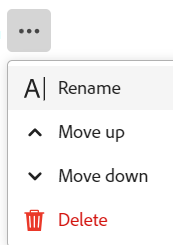

# Gérer la mise en page de la page d’enregistrement

{{planning-important-intro}}

Vous pouvez modifier la mise en page de l’aperçu des enregistrements et de la page dans Adobe Workfront Planning.

L’aperçu de l’enregistrement est une vue plus petite de la page d’enregistrement qui s’affiche dans la vue d’un type d’enregistrement.

Lorsque vous modifiez la mise en page d’un aperçu d’enregistrement et d’une page, les modifications affectent les zones d’aperçu et les pages de détails de tous les enregistrements du même type.

Cet article explique comment modifier la mise en page et l’aspect d’une boîte d’aperçu d’enregistrement ou d’une page d’enregistrement. Pour plus d&#39;informations sur la modification des enregistrements, voir [Modifier les enregistrements](/help/quicksilver/planning/records/edit-records.md).

Vous devez créer des types d’enregistrement et des enregistrements avant de pouvoir commencer à modifier des pages d’enregistrement.

Pour plus d’informations, voir les articles suivants :

* [Créer des types d’enregistrement](/help/quicksilver/planning/architecture/create-record-types.md)

* [Créer des enregistrements](/help/quicksilver/planning/records/create-records.md)

## Conditions d’accès

+++ Développez pour afficher les exigences d’accès à la planification Workfront.

Pour pouvoir accéder à Workfront Planning, vous devez disposer des éléments suivants :

<table style="table-layout:auto">
 <col>
 </col>
 <col>
 </col>
 <tbody>
    <tr>
<tr>
<td>
   
 Produits
 </td>
   <td>
   <ul><li>
 Adobe Workfront
</li>
   <li>
 Planification d’Adobe Workfront
</li></ul></td>
  </tr>  
 <tr>
   <td role="rowheader">
Formule Adobe Workfront*
</td>
   <td>

L’un des projets Workfront suivants est prévu :

<ul><li>Sélectionner</li>
<li>Principal</li>
<li>Final</li></ul>

La planification Workfront n’est pas disponible pour les plans Workfront hérités

   </td>

<tr>
   <td role="rowheader">
Formule de planification Adobe Workfront*
</td>
   <td>

Tous

Pour plus d’informations sur les éléments inclus dans chaque plan de planification Workfront, contactez votre gestionnaire de compte Workfront. 

   </td>

<tr>
   <td role="rowheader">
Plateforme Adobe Workfront
</td>
   <td>

L’instance de Workfront de votre entreprise doit être intégrée à l’expérience unifiée Adobe pour pouvoir accéder à toutes les fonctionnalités de la planification Workfront.

Pour plus d’informations, voir <a href="/help/quicksilver/workfront-basics/navigate-workfront/workfront-navigation/adobe-unified-experience.md">Adobe Unified Experience pour Workfront</a>. 

   </td>

</tr>
  </tr>
  <tr>
   <td role="rowheader">
Licence Adobe Workfront*
</td>
   <td>
   
Standard

   
La planification Workfront n’est pas disponible pour les licences Workfront héritées

  </td>
  </tr>
  <tr>
   <td role="rowheader">
Configuration du niveau d’accès
</td>
   <td> 
Il n’existe aucun contrôle de niveau d’accès pour Adobe Workfront Planning.
  
</td>
  </tr>
<tr>
   <td role="rowheader">
Autorisations d’objet
</td>
   <td>
   
Gérer des autorisations relatives à un espace de travail</a> 
  
   
L’administration système a accès à tous les espaces de travail, y compris ceux qu’elle n’a pas créés.
 
  </td>
  </tr>
<tr>
   <td role="rowheader">
Modèle de mise en page
</td>
   <td> 
Tous les utilisateurs, y compris les administrateurs de Workfront, doivent se voir attribuer un modèle de mise en page comprenant la zone Planification du menu principal et la zone Planification des projets, portefeuilles et programmes. 
 Pour plus d’informations, voir <a href="/help/quicksilver/planning/access/access-overview.md">Présentation des accès</a>. 
  
  
</td>
  </tr>
 </tbody>
</table>

* Pour plus d’informations sur les exigences d’accès à Workfront, voir [Conditions d’accès requises dans la documentation Workfront](/help/quicksilver/administration-and-setup/add-users/access-levels-and-object-permissions/access-level-requirements-in-documentation.md).

+++

## Remarques concernant la modification de pages d’enregistrement

* Par défaut, les détails et les pages de prévisualisation d&#39;un enregistrement affichent tous les champs associés à l&#39;enregistrement.

* Vous ne pouvez pas ajouter de nouveaux champs pour un enregistrement dans la page de prévisualisation ou de détails. Vous devez ajouter de nouveaux champs dans la vue de tableau pour les afficher dans les pages de prévisualisation et de détails.

* Vous pouvez ajouter des sections à une page d’aperçu ou de détails d’enregistrement afin d’organiser les informations selon des critères communs et faciliter leur recherche.

* Les modifications suivantes affectent tous les enregistrements du même type et sont visibles par tous les utilisateurs accédant à ces enregistrements :

   * Réorganisation des champs
   * Ajout ou suppression de sections

* Les modifications d’affichage que vous apportez dans l’aperçu de l’enregistrement sont immédiatement visibles dans la page des détails de l’enregistrement. Les modifications apportées à la page d’enregistrement sont également visibles dans la zone d’aperçu des enregistrements.

* L’ajout d’une image de couverture ou d’une miniature à un enregistrement ne fait pas partie de la disposition globale de l’aperçu ou de la page d’enregistrement. Vous pouvez ajouter des images de couverture ou des miniatures uniques à chaque enregistrement. Pour plus d’informations, voir [Ajout d’une image de couverture à un enregistrement](/help/quicksilver/planning/records/add-a-cover-image-to-a-record.md) et [Ajout d’une miniature à un enregistrement](/help/quicksilver/planning/records/add-thumbnails-to-records.md).

## Ajout de sections à un aperçu d’enregistrement ou à une page

Tenez compte des points suivants lors de l’ajout de sections à une page d’enregistrement :

* Le nombre de sections d’une page ne peut pas être limité.
* Vous ne pouvez pas avoir de section vide. Vous devez avoir au moins un champ dans une section.
* Vous pouvez faire glisser des champs d’une section vers une autre. Pour plus d&#39;informations, reportez-vous à la section [Réorganiser les champs dans la page d&#39;aperçu des enregistrements ou de détails](#rearrange-fields-in-the-record-preview-or-details-page) de cet article.
* Lorsque vous supprimez tous les champs d’une section, celle-ci est automatiquement supprimée et ne peut pas être récupérée.

Pour ajouter une section à un aperçu d’enregistrement ou à une page :

{{step1-to-planning}}

1. Cliquez sur la carte d’un espace de travail.

   L’espace de travail s’ouvre et les types d’enregistrement s’affichent sous forme de cartes.

1. Cliquez sur la vignette d’un type d’enregistrement pour plus de détails.

   La page du type d’enregistrement s’ouvre.

1. Dans une vue de tout type, cliquez sur le nom d’un enregistrement.

   Ou

   Dans la vue table, cliquez sur l&#39;icône **Ouvrir les détails**  dans la première colonne.

   L’aperçu de l’enregistrement s’ouvre dans la vue.

   

1. (Facultatif) Cliquez sur l’icône **Ouvrir dans un nouvel onglet**  dans le coin supérieur droit de l’aperçu de l’enregistrement pour ouvrir la page de l’enregistrement dans un nouvel onglet.

   La page d’enregistrement s’ouvre. L’onglet Détails s’ouvre par défaut.

   

1. Dans l’onglet **Détails** de l’aperçu de l’enregistrement ou de la page, passez la souris sur l’espace blanc situé à gauche des champs, puis cliquez sur l’icône **Ajouter une section**  pour ajouter une section.
1. Cliquez dans le nom de la section et remplacez **Section sans titre** par un nom, puis cliquez sur Entrée. Les champs affichés sous la section font automatiquement partie de la nouvelle section.
1. Commencez à faire glisser des champs vers la nouvelle section, comme décrit dans la section [Réorganiser les champs dans la page de prévisualisation des enregistrements ou de détails](#rearrange-fields-in-the-record-preview-or-details-page) de cet article.

1. (Facultatif) Pointez sur le nom d’une section et cliquez sur le menu **Plus**  .

   
1. (Facultatif) Pour modifier la section, effectuez l’une des opérations suivantes :

   * Cliquez sur **Renommer** pour renommer la section.

     >[!TIP]
     >
     > Vous pouvez renommer une section intégrée en cliquant sur son nom.

   * Cliquez sur **Déplacer vers le haut** pour déplacer la section vers le haut d’une position.

     Ou

     Cliquez sur **Déplacer vers le bas** pour déplacer la section vers le bas d’une position.
Tous les champs de la section sont déplacés avec la section .

   * Cliquez sur **Supprimer** pour supprimer la section. La section est supprimée et elle ne peut pas être récupérée. Tous les utilisateurs accédant aux enregistrements de ce type ne verront plus la section supprimée.

1. Cliquez sur la flèche pointant vers le bas située à gauche du nom d’une section pour la réduire ou sur la flèche pointant vers la droite pour la développer.
Par défaut, toutes les sections sont développées.

1. (Facultatif) Cliquez sur l’icône **grab**  située à gauche du nom d’une section, puis faites-la glisser et déposez-la à l’emplacement de votre choix.

   La nouvelle position de la section est mise à jour dans l&#39;aperçu et la page de tous les enregistrements du même type pour tous les utilisateurs qui visualisent les enregistrements.

   Toutes les modifications apportées aux sections et à l’ordre des champs sont enregistrées automatiquement.

1. (Facultatif) Cliquez sur l’icône **Exporter**  pour exporter l’onglet Détails vers un fichier Word. Pour plus d’informations, voir [Exporter les détails d’un enregistrement](/help/quicksilver/planning/records/export-the-record-page.md).

1. (Facultatif) Cliquez sur l’onglet **Connexions** en regard de l’onglet **Détails** . Vous devrez peut-être cliquer sur **Plus** avant de cliquer sur l’onglet **Connexions** .

   Tous les enregistrements ou objets connectés à l’enregistrement sélectionné s’affichent sous les noms du type d’enregistrement ou de l’application à laquelle ils appartiennent.

   

1. (Facultatif) Sélectionnez le paramètre **Afficher tous les enregistrements** dans le coin supérieur droit de l’onglet Connexions. Tous les types d’enregistrements connectés s’affichent, y compris ceux qui n’ont encore aucun enregistrement connecté. Par défaut, la bascule est désélectionnée et les types d’enregistrements sans enregistrement connecté sont masqués.

1. (Facultatif) Cliquez sur **Se connecter** pour ajouter d’autres enregistrements aux types d’enregistrements connectés. Pour plus d’informations, consultez [Connecter les enregistrements](/help/quicksilver/planning/records/connect-records.md).

1. (Facultatif) Pointez sur une carte d’enregistrement, puis cliquez sur l’icône de déconnexion d’enregistrement **-**, puis cliquez sur **Déconnecter**. <!--this is copied to the Manage the Planning page in Workfront article; update in both articles-->
Les événements suivants se produisent :
   * L’enregistrement n’est plus connecté à l’objet Workfront.
   * L’objet Workfront est également supprimé du champ connecté de l’enregistrement de Workfront Planning.
   * Les valeurs des champs de recherche Workfront connectés à l’enregistrement Planning sont également supprimées.

## Réorganiser les champs dans l’onglet Détails de l’enregistrement

{{step1-to-planning}}

1. Cliquez sur la carte d’un espace de travail.

   L’espace de travail s’ouvre et les types d’enregistrement s’affichent sous forme de cartes.

1. Cliquez sur la vignette d’un type d’enregistrement pour plus de détails.

   La page du type d’enregistrement s’ouvre.

1. Dans une vue de tout type, cliquez sur le nom d’un enregistrement.

   Ou

   Dans la vue table, cliquez sur l&#39;icône **Ouvrir les détails**  dans la première colonne.

   L’aperçu de l’enregistrement s’ouvre dans la vue.

   

1. (Facultatif) Cliquez sur l’icône **Ouvrir dans un nouvel onglet**  <!--check the icon; they are changing it--> dans le coin supérieur droit de l’aperçu de l’enregistrement pour ouvrir la page de l’enregistrement dans un nouvel onglet.

   L’onglet **Détails** de l’enregistrement s’ouvre par défaut.

   

1. Dans l’onglet **Détails** de l’enregistrement, cliquez sur l’icône **grab**  à gauche d’un nom de champ, puis faites-le glisser et déposez-le à l’emplacement de votre choix. <!--You can drag and drop fields to another section. You must have at least one field in a section.-->

   La nouvelle position du champ est mise à jour dans la prévisualisation et la page de tous les enregistrements du même type pour tous les utilisateurs qui visualisent les enregistrements.

   Toutes les modifications apportées à la mise en page de l’aperçu de l’enregistrement ou de la page sont automatiquement enregistrées.

