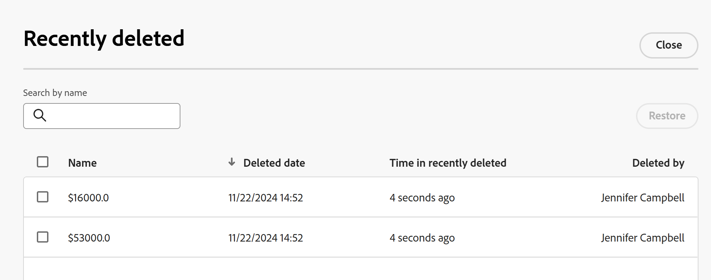

# Restaurer des enregistrements supprimés

Les informations mises en surbrillance sur cette page font référence à des fonctionnalités qui ne sont pas encore disponibles de manière générale. Elle est disponible uniquement dans l’environnement de Prévisualisation pour tous les clients. Après les versions mensuelles en production, les mêmes fonctionnalités sont également disponibles dans l’environnement de production pour les clients qui ont activé les versions rapides. 

Pour plus d’informations sur les versions rapides, voir [Activation ou désactivation des versions rapides pour votre organisation](/help/quicksilver/administration-and-setup/set-up-workfront/configure-system-defaults/enable-fast-release-process.md). 

{{planning-important-intro}}

Vous pouvez récupérer les enregistrements supprimés de la zone Récemment supprimés dans Adobe Workfront Planning.

Pour plus d&#39;informations sur la suppression d&#39;enregistrements, voir [Supprimer des enregistrements](/help/quicksilver/planning/records/delete-records.md).

## Conditions d’accès

+++ Développez pour afficher les conditions d’accès requises pour la fonctionnalité de cet article. 

<table style="table-layout:auto"> 
<col> 
</col> 
<col> 
</col> 
<tbody> 
    <tr> 
<tr> 
</tr>   
<tr> 
   <td role="rowheader">
Package Adobe Workfront
</td> 
   <td> 

Tout Workfront et tout package Planning
 
Tout workflow et tout package Planning

Pour plus d’informations sur les composants inclus dans chaque package Workfront Planning, contactez votre représentant de compte Workfront. 
 
   </td> 
  <tr> 
   <td role="rowheader">
Licence Adobe Workfront
</td> 
   <td>
Standard

   </td> 
  </tr> 
  <tr> 
   <td role="rowheader">
Autorisations d’objet
</td> 
   <td>   
Accorder des autorisations supérieures ou égales à un espace de travail, un type d’enregistrement et gérer les autorisations d’un enregistrement 
    
   
L’administration système a accès à tous les espaces de travail, y compris ceux qu’elle n’a pas créés.
 </td> 
  </tr>   
</tbody> 
</table>

Pour plus d’informations sur les exigences d’accès à Workfront, voir [Exigences d’accès dans la documentation de Workfront](/help/quicksilver/administration-and-setup/add-users/access-levels-and-object-permissions/access-level-requirements-in-documentation.md).

+++   

<!--
Old:
<table style="table-layout:auto"> 
<col> 
</col> 
<col> 
</col> 
<tbody> 
    <tr> 
<tr> 
<td> 
   
 Products
 </td> 
   <td> 
   <ul><li>
 Adobe Workfront
</li> 
   <li>
 Adobe Workfront Planning
</li></ul></td> 
  </tr>   
<tr> 
   <td role="rowheader">
Adobe Workfront plan*
</td> 
   <td> 

Any of the following Workfront plans:
 
<ul><li>Select</li> 
<li>Prime</li> 
<li>Ultimate</li></ul> 

Workfront Planning is not available for legacy Workfront plans
 
   </td> 
<tr> 
   <td role="rowheader">
Adobe Workfront Planning package*
</td> 
   <td> 

Any 
 

For more information about what is included in each Workfront Planning plan, contact your Workfront account manager. 
 
   </td> 
 <tr> 
   <td role="rowheader">
Adobe Workfront platform
</td> 
   <td> 

Your organization's instance of Workfront must be onboarded to the Adobe Unified Experience to be able to access Workfront Planning.
 

For more information, see <a href="/help/quicksilver/workfront-basics/navigate-workfront/workfront-navigation/adobe-unified-experience.md">Adobe Unified Experience for Workfront</a>. 
 
   </td> 
   </tr> 
  </tr> 
  <tr> 
   <td role="rowheader">
Adobe Workfront license*
</td> 
   <td>
 Standard

   
Workfront Planning is not available for legacy Workfront licenses
 
  </td> 
  </tr> 
  <tr> 
   <td role="rowheader">
Access level configuration
</td> 
   <td> 
There are no access level controls for Adobe Workfront Planning
   
</td> 
  </tr> 
<tr> 
   <td role="rowheader">
Object permissions
</td> 
   <td>   
Contribute or higher permissions to a workspace and record type</a> 
  
   
System Administrators have permissions to all workspaces, including the ones they did not create
 </td> 
  </tr> 
</tbody> 
</table>
-->

## Considérations relatives à la récupération des enregistrements supprimés

* Vous pouvez restaurer les enregistrements que vous ou d&#39;autres utilisateurs avez supprimés.
* Les enregistrements sont stockés dans la classe Récemment supprimés pendant 30 jours. Au bout de 30 jours, les enregistrements sont définitivement supprimés de Workfront Planning.
* Lorsque des enregistrements supprimés sont liés à d’autres enregistrements, ces enregistrements liés restent intacts, bien que les informations de l’enregistrement supprimé soient éliminées. La restauration des enregistrements supprimés restaurera les informations des enregistrements connectés.
* Vous pouvez restaurer des enregistrements en bloc.
* Lorsque les enregistrements sont supprimés, les informations suivantes sont stockées dans la classe Récemment supprimés :
   * **Nom** : il s’agit des informations figurant dans le champ de Principal de l’enregistrement. Pour plus d’informations sur les champs de Principal d’enregistrement, consultez la présentation des champs de Principal .
   * **Date de suppression** : l’heure et la date de suppression de l’enregistrement.
   * **Temps écoulé depuis la suppression récente** : temps écoulé depuis la suppression de l’enregistrement. Les enregistrements supprimés plus de 30 jours avant la date actuelle ne s&#39;affichent pas dans la classe Récemment supprimés.
   * **Supprimé par** : nom de l’utilisateur qui a supprimé l’enregistrement.

## Restaurer des enregistrements supprimés

1. Accédez à la page de type d’enregistrement dans laquelle vous avez supprimé des enregistrements.
1. Cliquez sur l’icône **Annuler**  dans le coin supérieur droit de n’importe quel type d’enregistrement affiché sur la page, puis cliquez sur **Récemment supprimé**.

   La zone **Récemment supprimé** s’affiche.

   

1. Sélectionnez les enregistrements à supprimer, puis cliquez sur **Restaurer** > **Restaurer**. Vous pouvez sélectionner plusieurs enregistrements.

   Si la restauration a réussi, vous recevez une notification de succès en bas de l’écran.
1. Accédez à la vue Tableau et passez en revue les enregistrements restaurés.
