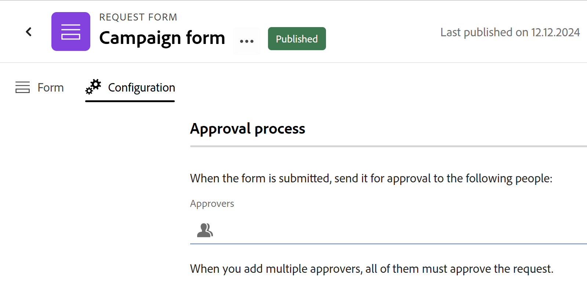

# Ajouter une approbation à un formulaire de demande dans Adobe Workfront Planning

<!--update the metadata with real information when making this available in TOC and in the left nav-->

<!--take Preview and Production references at Production time-->

Les informations mises en surbrillance sur cette page font référence à des fonctionnalités qui ne sont pas encore disponibles de manière générale. Elle est disponible uniquement dans l’environnement de Prévisualisation pour tous les clients. Après les versions mensuelles en production, les mêmes fonctionnalités sont également disponibles dans l’environnement de production pour les clients qui ont activé les versions rapides. 

Pour plus d’informations sur les versions rapides, voir [Activation ou désactivation des versions rapides pour votre organisation](/help/quicksilver/administration-and-setup/set-up-workfront/configure-system-defaults/enable-fast-release-process.md). 

{{planning-important-intro}}

Vous pouvez ajouter un processus d’approbation à un formulaire de demande Adobe Workfront Planning, afin de lancer une approbation pour chaque demande soumise, avant la création d’un enregistrement.

Cet article décrit comment un responsable d’espace de travail peut ajouter une approbation à un formulaire de demande associé à un type d’enregistrement.

Pour plus d’informations sur la création d’un formulaire de demande dans Workfront Planning, voir [Création et gestion d’un formulaire de demande dans Adobe Workfront Planning](/help/quicksilver/planning/requests/create-request-form.md).

Pour plus d’informations sur la soumission d’une demande à un type d’enregistrement pour créer un enregistrement, voir [ Soumettre des demandes Adobe Workfront Planning pour créer des enregistrements](/help/quicksilver/planning/requests/submit-requests.md).

## Conditions d’accès

+++ Développez pour afficher les exigences d’accès aux fonctionnalités de cet article. 

<table style="table-layout:auto"> 
<col> 
</col> 
<col> 
</col> 
<tbody> 
<tr> 
   <td role="rowheader">
Packages Adobe Workfront
</td> 
   <td> 

Tout package Workfront et tout package Planning

Ou

Tout package de workflow et tout package Planning

Pour plus d’informations sur les composants inclus dans chaque package Workfront Planning, contactez votre représentant de compte Workfront.

   </td> </tr>

</tr> 
  <tr> 
   <td role="rowheader">
Licence Adobe Workfront
</td> 
   <td>
Standard
 
  </td> 
  </tr> 
  <tr> 
   <td role="rowheader">
Autorisations d’objet
</td> 
   <td>   
Gérez les autorisations d’un espace de travail et d’un type d’enregistrement</a> 
  
   
L’administration système a accès à tous les espaces de travail, y compris ceux qu’elle n’a pas créés.
  </td> 
  </tr>  
</tbody> 
</table>

Pour plus d’informations sur les exigences d’accès à Workfront, voir [Exigences d’accès dans la documentation de Workfront](/help/quicksilver/administration-and-setup/add-users/access-levels-and-object-permissions/access-level-requirements-in-documentation.md).

+++

## Considérations relatives à l’ajout d’approbations à un formulaire de demande

* Vous pouvez ajouter un ou plusieurs approbateurs à un formulaire de demande. Vous ne pouvez ajouter que des utilisateurs en tant qu’approbateurs.
* Vous pouvez afficher les informations d&#39;approbation sur un enregistrement créé en soumettant un formulaire de demande dans les champs Date d&#39;approbation par et Date d&#39;approbation . Pour plus d’informations, consultez [Créer des champs](/help/quicksilver/planning/fields/create-fields.md).
* Lorsque vous ajoutez plusieurs approbateurs à un formulaire de demande, tous les approbateurs doivent accepter la demande avant la création d&#39;un enregistrement dans Workfront Planning.
* Si tous les approbateurs approuvent la demande, un enregistrement est créé pour le type d&#39;enregistrement associé au formulaire de demande.
* Si au moins un approbateur rejette la demande et que tous les autres l&#39;approuvent, une demande est créée pour la zone Demandes de Workfront, mais aucun enregistrement n&#39;est créé pour le type d&#39;enregistrement associé au formulaire de demande.
* L’ajout d’approbations à un formulaire de demande est facultatif. Workfront Planning crée immédiatement un enregistrement lorsqu&#39;une demande est soumise, si le formulaire de demande n&#39;est pas associé à une approbation.

## Ajout d’une approbation à un formulaire de demande dans l’environnement de production

1. Commencez à créer un formulaire de demande pour un type d’enregistrement, comme décrit dans la section [Créer et gérer un formulaire de demande dans Adobe Workfront Planning](/help/quicksilver/planning/requests/create-request-form.md).
1. Cliquez sur **Configuration**.

   La zone **Configuration** s’affiche.

   
1. Dans le champ **Approbateurs**, commencez à saisir le nom d’un utilisateur ou d’une équipe que vous souhaitez définir en tant qu’approbateur, puis sélectionnez-le lorsqu’il s’affiche dans la liste.
1. (Facultatif et conditionnel) Si vous avez défini plusieurs approbateurs et que vous n’en avez besoin que d’un seul pour prendre une décision, activez l’option **Une seule décision est requise**.

   <!--most of the Note below is duplicated in the Create a request form article-->

   >[!NOTE]
   >
   >
   >* Vous pouvez ajouter un ou plusieurs approbateurs à un formulaire de demande.
   >
   >* Si vous ajoutez plusieurs approbateurs et que l&#39;option Une seule décision est obligatoire n&#39;est pas activée, tous les approbateurs doivent approuver la demande avant que Workfront Planning ne crée un enregistrement.
   >
   >* Si au moins un approbateur rejette la demande, celle-ci est rejetée et l&#39;enregistrement n&#39;est pas créé. La demande reste dans la zone des Demandes de Workfront.
   >
   >* Si vous ajoutez plusieurs approbateurs et que l&#39;option Une seule décision est obligatoire n&#39;est pas activée, tous les approbateurs doivent prendre une décision avant qu&#39;une demande ne soit approuvée ou rejetée.
   >
   >* Si une équipe est définie en tant qu&#39;approbateur, une seule décision est requise de la part de l&#39;équipe.

1. (Facultatif) Cliquez sur **Publier** si vous n’avez jamais partagé le formulaire de demande auparavant.

   Ou

   Cliquez sur **Partager** pour partager le formulaire, puis sur **Copier le lien**.
1. (Facultatif) Lorsqu’un utilisateur utilise le lien que vous partagez et soumet une demande, Workfront Planning envoie une notification d’approbation in-app et un e-mail aux approbateurs.

   >[!NOTE]
   >
   >   L’instance de Workfront de votre entreprise doit être intégrée à l’expérience unifiée Adobe pour que les utilisateurs puissent recevoir des notifications par e-mail et in-app.

   Pour plus d’informations sur l’approbation des demandes, voir [ Approuver une demande ](/help/quicksilver/planning/requests/approve-request.md).

## Ajouter des règles d’approbation à un formulaire de demande

>[!NOTE]
>
>Cette fonctionnalité est disponible uniquement dans l’environnement de Prévisualisation.

Les règles d’approbation définissent le processus d’approbation en fonction des valeurs de champ sur dans les demandes envoyées.

Par exemple, si un formulaire de demande comporte le champ « Type de campagne », il est possible de créer une règle qui envoie la demande à une personne lorsque le champ comporte la valeur « Numérique » et à une autre personne lorsqu’il comporte la valeur « Imprimer ».

Tenez compte des points suivants lors de l’ajout de règles d’approbation :

* Vous pouvez ajouter un ou plusieurs approbateurs à une règle d&#39;approbation.
* Si au moins un approbateur rejette la demande, celle-ci est rejetée et l&#39;enregistrement n&#39;est pas créé. La demande reste dans la zone des Demandes de Workfront.
* Si vous ajoutez plusieurs approbateurs et que l&#39;option Une seule décision est obligatoire n&#39;est pas activée, tous les approbateurs doivent prendre une décision avant qu&#39;une demande ne soit approuvée ou rejetée.
* Si une équipe est définie en tant qu&#39;approbateur, une seule décision est requise de la part de l&#39;équipe.

Pour plus d’informations sur l’ajout d’approbations, voir [ Ajouter une approbation à un formulaire de demande ](/help/quicksilver/planning/requests/add-approval-to-request-form.md).

Pour définir des règles d&#39;approbation pour un formulaire de demande :

1. Commencez à créer un formulaire de demande pour un type d’enregistrement, comme décrit dans la section [Créer et gérer un formulaire de demande dans Adobe Workfront Planning](/help/quicksilver/planning/requests/create-request-form.md).
1. Cliquez sur **Paramètres**.

   L’onglet Paramètres s’affiche.

1. Pour commencer à configurer les règles d’approbation, cliquez sur Approbations  dans le volet de navigation de gauche.

1. (Facultatif) Si vous souhaitez définir un processus d&#39;approbation par défaut, ajoutez au moins un utilisateur ou une équipe au champ **Approbateurs** de la zone Règle d&#39;approbation par défaut, puis cochez la case **Une seule décision est requise** si vous souhaitez que l&#39;enregistrement soit créé après son approbation par l&#39;un des approbateurs par défaut.

   

   <!--below bullet list is duplicated in the Add approval to a request form article-->

1. (Facultatif) Pour chaque règle d’approbation supplémentaire, procédez comme suit :

   1. Cliquez sur **Ajouter une règle d’approbation**
   1. Cliquez sur le titre de l’espace réservé « Règle d’approbation sans titre » et saisissez un nom pour la règle d’approbation.
   1. Cliquez sur **Sélectionner un champ** et sélectionnez le champ qui active la règle.
   1. Sélectionnez l’opérateur de la règle. Les opérateurs varient en fonction du type de champ.
   1. Si l’opérateur sélectionné requiert une valeur, cliquez sur l’icône plus et ajoutez une ou plusieurs valeurs.
   1. (Facultatif) Ajoutez d’autres conditions à l’aide de ET ou de OU en cliquant sur Ajouter une condition et en configurant la condition supplémentaire comme indiqué dans les étapes C à E.
   1. Dans la zone Actions de la règle d&#39;approbation, dans le champ **Approbateurs**, ajoutez au moins un utilisateur ou une équipe à définir au niveau de l&#39;approbateur lorsque la condition est remplie.
   1. 
      1. (Conditionnel) Si vous souhaitez que l&#39;enregistrement soit créé après son approbation par l&#39;un des approbateurs, cochez la case **Une seule décision est requise**.

1. Cliquez sur **Enregistrer** pour enregistrer les règles d’approbation.
1. (Facultatif) Cliquez sur **Publier** si vous n’avez jamais partagé le formulaire de demande auparavant.

