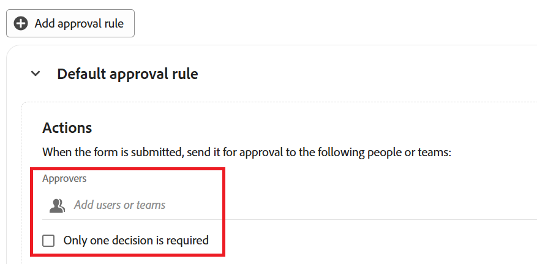

# Ajouter une approbation à un formulaire de demande dans Adobe Workfront Planning

<!--update the metadata with real information when making this available in TOC and in the left nav-->

<!--
The highlighted information on this page refers to functionality not yet generally available. It is available only in the Preview environment for all customers. After the monthly releases to Production, the same features are also available in the Production environment for customers who enabled fast releases.    

For information about fast releases, see [Enable or disable fast releases for your organization](/help/quicksilver/administration-and-setup/set-up-workfront/configure-system-defaults/enable-fast-release-process.md). 
-->

{{planning-important-intro}}

Vous pouvez ajouter un processus d’approbation à un formulaire de demande Adobe Workfront Planning, afin de lancer une approbation pour chaque demande soumise, avant la création d’un enregistrement.

Cet article décrit comment un responsable d’espace de travail peut ajouter une approbation à un formulaire de demande associé à un type d’enregistrement.

Pour plus d’informations sur la création d’un formulaire de demande dans Workfront Planning, voir [Création et gestion d’un formulaire de demande dans Adobe Workfront Planning](/help/quicksilver/planning/requests/create-request-form.md).

Pour plus d’informations sur la soumission d’une demande à un type d’enregistrement pour créer un enregistrement, voir [ Soumettre des demandes Adobe Workfront Planning pour créer des enregistrements](/help/quicksilver/planning/requests/submit-requests.md).

## Conditions d’accès

+++ Développez pour afficher les exigences d’accès aux fonctionnalités de cet article. 

<table style="table-layout:auto"> 
<col> 
</col> 
<col> 
</col> 
<tbody> 
<tr> 
   <td role="rowheader">
Packages Adobe Workfront
</td> 
   <td> 

Tout package Workfront et tout package Planning

Ou

Tout package de workflow et tout package Planning

Pour plus d’informations sur les composants inclus dans chaque package Workfront Planning, contactez votre représentant de compte Workfront.

   </td> </tr>

</tr> 
  <tr> 
   <td role="rowheader">
Licence Adobe Workfront
</td> 
   <td>
Standard
 
  </td> 
  </tr> 
  <tr> 
   <td role="rowheader">
Autorisations d’objet
</td> 
   <td>   
Gérez les autorisations d’un espace de travail et d’un type d’enregistrement</a> 
  
   
L’administration système a accès à tous les espaces de travail, y compris ceux qu’elle n’a pas créés.
  </td> 
  </tr>  
</tbody> 
</table>

Pour plus d’informations sur les exigences d’accès à Workfront, voir [Exigences d’accès dans la documentation de Workfront](/help/quicksilver/administration-and-setup/add-users/access-levels-and-object-permissions/access-level-requirements-in-documentation.md).

+++

## Considérations relatives à l’ajout d’approbations à un formulaire de demande

* Vous pouvez ajouter un ou plusieurs approbateurs à un formulaire de demande. Vous pouvez ajouter des utilisateurs et des équipes en tant qu’approbateurs.
* Vous pouvez afficher les informations d&#39;approbation sur un enregistrement créé en soumettant un formulaire de demande dans les champs Date d&#39;approbation par et Date d&#39;approbation . Pour plus d’informations, consultez [Créer des champs](/help/quicksilver/planning/fields/create-fields.md).
* Lorsque vous ajoutez plusieurs approbateurs à un formulaire de demande, tous les approbateurs doivent accepter la demande avant la création d&#39;un enregistrement dans Workfront Planning.
* Si tous les approbateurs approuvent la demande, un enregistrement est créé pour le type d&#39;enregistrement associé au formulaire de demande.
* Si au moins un approbateur rejette la demande et que tous les autres l&#39;approuvent, une demande est créée pour la zone Demandes de Workfront, mais aucun enregistrement n&#39;est créé pour le type d&#39;enregistrement associé au formulaire de demande.
* L’ajout d’approbations à un formulaire de demande est facultatif. Workfront Planning crée immédiatement un enregistrement lorsqu&#39;une demande est soumise, si le formulaire de demande n&#39;est pas associé à une approbation.

<!--

## Add an approval to a request form in the Production environment

1. Start creating a request form for a record type, as described in [Create and manage a request form in Adobe Workfront Planning](/help/quicksilver/planning/requests/create-request-form.md).
1. Click **Configuration**.

    The **Configuration** area displays.

    
1. In the **Approvers** field, start typing the name of a user or team that you want to set as an approver, then select it when it displays in the list. 
1. (Optional and conditional) If you have set more than one approver, and only need one approver to make a decision, enable the **Only one decision is required** option.

    (****most of the Note below is duplicated in the Create a request form article***)

      >[!NOTE]
      >
      >
      >* You can add one or several approvers to a request form.
      >
      >* If you add more than one approver, and the Only one decision is required option is not enabled, all approvers must approve the request before Workfront Planning creates a record.
      >
      >* If at least one approver rejects the request, the request is rejected and the record is not created. The request remains in the Requests area of Workfront.
      >
      >* If you add more than one approver, and the Only one decision is required option is not enabled, all approvers must make a decision before a request is either approved or rejected.
      >
      >* If a team is set as an approver, only one decision is required from the team.

1. (Optional) Click **Publish** if you have never shared the request form before.

    Or

    Click **Share** to share the form, then **Copy link**. 
1. (Optional) After a user uses the link you share and submits a request, Workfront Planning sends an approval in-app notification and an email to the approvers.

   For information about approving requests, see [Approve a request](/help/quicksilver/planning/requests/approve-request.md).

-->

## Ajouter des règles d’approbation à un formulaire de demande

Les règles d’approbation définissent le processus d’approbation en fonction des valeurs de champ dans les demandes envoyées.

Par exemple, si un formulaire de demande comporte le champ « Type de campagne », il est possible de créer une règle qui envoie la demande à une personne lorsque le champ comporte la valeur « Numérique » et à une autre personne lorsqu’il comporte la valeur « Imprimer ».

Tenez compte des points suivants lors de l’ajout de règles d’approbation :

* Vous pouvez ajouter un ou plusieurs approbateurs à une règle d&#39;approbation.
* Si au moins un approbateur rejette la demande, celle-ci est rejetée et l&#39;enregistrement n&#39;est pas créé. La demande reste dans la zone des Demandes de Workfront.
* Si vous ajoutez plusieurs approbateurs et que l&#39;option Une seule décision est obligatoire n&#39;est pas activée, tous les approbateurs doivent prendre une décision avant qu&#39;une demande ne soit approuvée ou rejetée.
* Si une équipe est définie en tant qu&#39;approbateur, une seule décision est requise de la part d&#39;un membre de l&#39;équipe.

Pour définir des règles d&#39;approbation pour un formulaire de demande :

1. Commencez à créer un formulaire de demande pour un type d’enregistrement, comme décrit dans l’article [Créer et gérer un formulaire de demande dans Adobe Workfront Planning](/help/quicksilver/planning/requests/create-request-form.md).
1. Lorsque le formulaire s’ouvre, cliquez sur **Paramètres**.

   L’onglet **Paramètres** s’ouvre.

1. Pour commencer à configurer les règles d’approbation, cliquez sur **Approbations**  dans le panneau de gauche.

1. (Facultatif) Si vous souhaitez définir un processus d&#39;approbation par défaut, ajoutez au moins un utilisateur ou une équipe au champ **Approbateurs** de la zone **Règle d&#39;approbation par défaut**, puis cochez la case **Une seule décision est requise** si vous souhaitez que l&#39;enregistrement soit créé après son approbation par l&#39;un des approbateurs par défaut.

   

1. (Facultatif) Commencez à ajouter des règles d’approbation. Pour chaque règle d’approbation personnalisée, procédez comme suit :

   1. Cliquez sur **Ajouter une règle d’approbation**
   1. Cliquez sur le titre de l’espace réservé **Règle d’approbation sans titre** et saisissez un nom pour la règle d’approbation.
   1. Cliquez sur **Sélectionner un champ** et sélectionnez le champ qui active la règle.
   1. Sélectionnez l’opérateur de la règle. Les opérateurs varient en fonction du type de champ.
   1. Si l’opérateur sélectionné requiert une valeur, cliquez sur l’icône plus et ajoutez une ou plusieurs valeurs.
   1. (Facultatif) Cliquez sur **Ajouter une condition** pour ajouter d’autres conditions et les connecter par des instructions **Et** ou **Ou** en configurant les conditions supplémentaires comme indiqué dans les étapes C-E.
   1. Dans la zone **Actions** de la règle d&#39;approbation, dans le champ **Approbateurs**, ajoutez au moins un utilisateur ou une équipe à définir au niveau de l&#39;approbateur lorsque la condition est remplie.
   1. (Conditionnel et facultatif) Si vous souhaitez que l&#39;enregistrement soit créé après son approbation par l&#39;un des approbateurs, cochez la case **Une seule décision est requise**. Dans le cas contraire, tous les approbateurs doivent décider de l&#39;approbation avant que la demande ne soit acceptée ou rejetée.

   >[!NOTE]
   >
   >   Tenez compte des points suivants lors de l’ajout de règles d’approbation :
   >
   >   * Si seule une règle par défaut est configurée, elle s’applique à chaque demande soumise.
   >   * Si une règle personnalisée est respectée, la valeur par défaut n’est pas appliquée au workflow d’approbation de la demande. Seules les règles personnalisées correspondantes s’appliquent pour les approbations et la règle par défaut est ignorée.
   >   * Si plusieurs règles personnalisées sont respectées, la première de l’ordre s’applique. Dans ce cas, l’approbation par défaut ne s’applique pas, le cas échéant.

1. Cliquez sur **Enregistrer** pour enregistrer les règles d’approbation.
1. (Facultatif) Cliquez sur **Publier** si vous n’avez jamais partagé le formulaire de demande auparavant.
