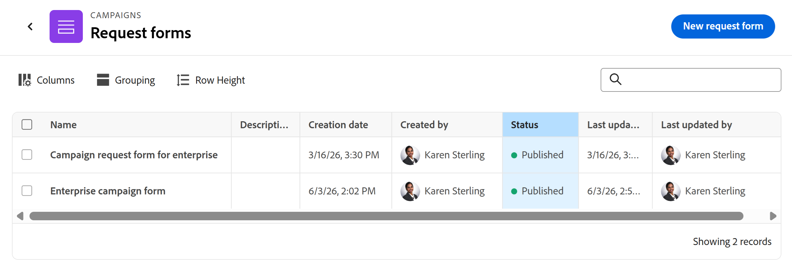
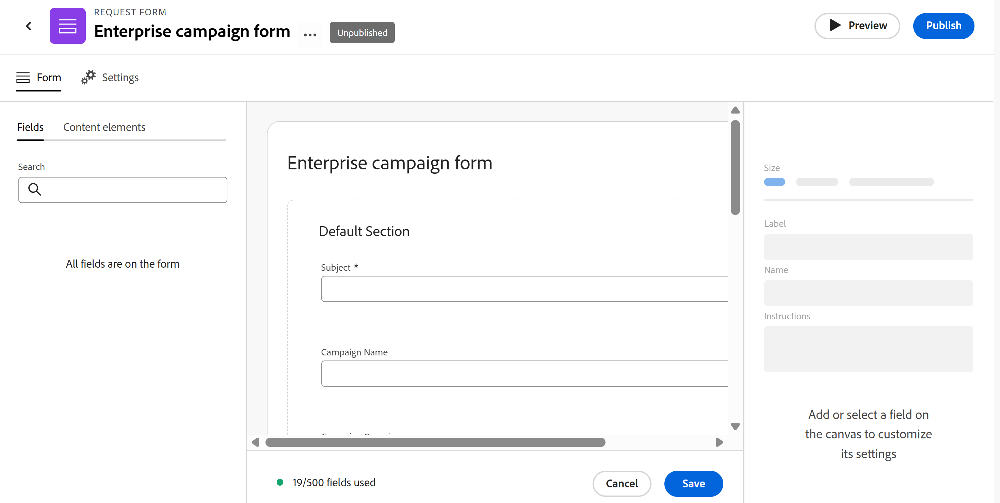
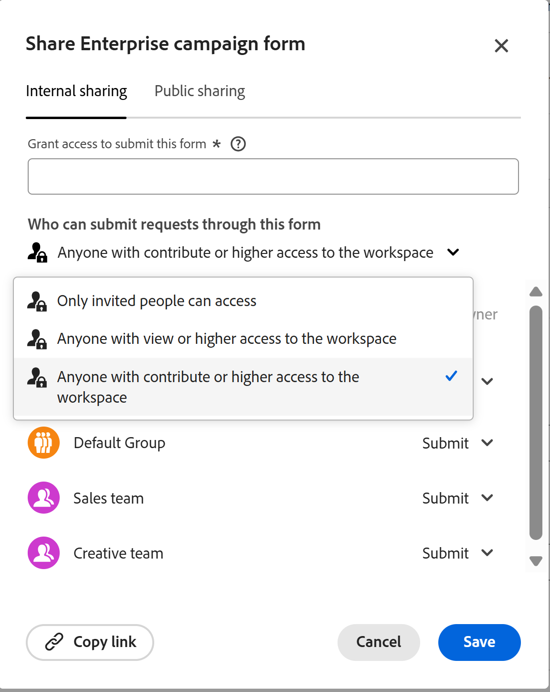
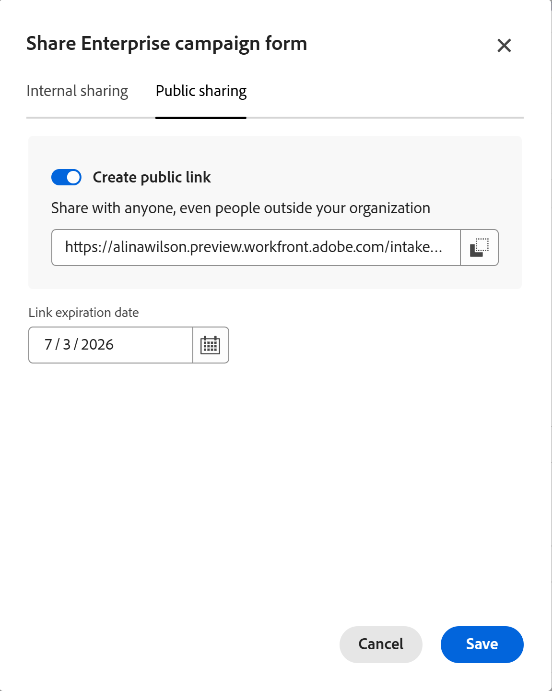
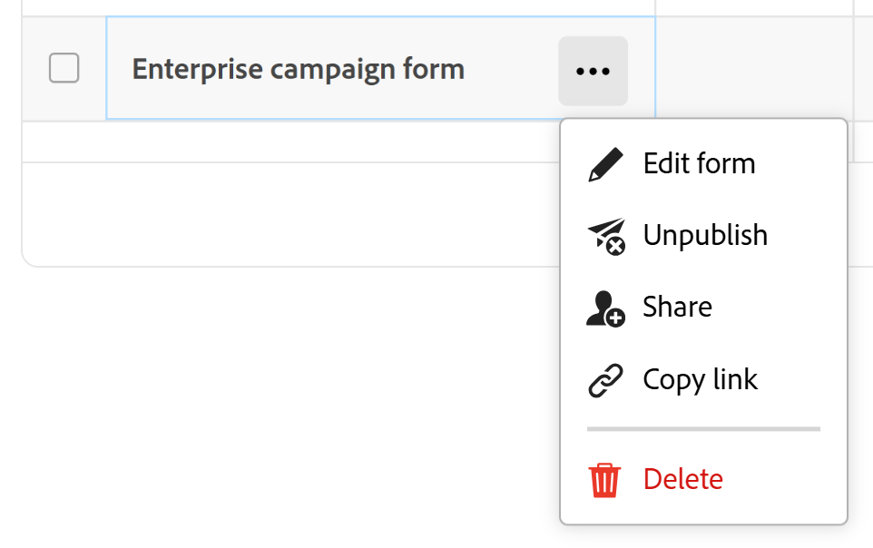

# Créer et gérer ’un formulaire de demande dans Adobe Workfront Planning

<!--update the metadata with real information when making this available in TOC and in the left nav-->

<!--this article needs to be re-built - the structure is odd; some of the information needs to move to other articles - like the approval information - there is a standalone approval article - move there-->

<!--take Preview and Production references at Production time-->

Les informations mises en surbrillance sur cette page font référence à des fonctionnalités qui ne sont pas encore disponibles de manière générale. Elle est disponible uniquement dans l’environnement de Prévisualisation pour tous les clients. Une fois la version à prévisualiser, les mêmes fonctionnalités sont également disponibles tous les mois dans l’environnement de production pour les clients qui ont activé les versions rapides. 

Pour plus d’informations sur les versions rapides, voir [Activation ou désactivation des versions rapides pour votre organisation](/help/quicksilver/administration-and-setup/set-up-workfront/configure-system-defaults/enable-fast-release-process.md). 

{{planning-important-intro}}

Vous pouvez créer un formulaire de demande et l&#39;associer à un type d&#39;enregistrement dans Adobe Workfront Planning. Vous pouvez ensuite partager le formulaire avec d’autres utilisateurs qui peuvent envoyer des demandes pour créer des enregistrements de ce type.

Cet article décrit comment un gestionnaire d’espace de travail peut créer un formulaire de demande associé à un type d’enregistrement.

Pour plus d’informations sur la soumission d’une demande à un type d’enregistrement pour créer un enregistrement, voir [ Soumettre des demandes Adobe Workfront Planning pour créer des enregistrements](/help/quicksilver/planning/requests/submit-requests.md).

## Conditions d’accès

+++ Développez pour afficher les exigences d’accès aux fonctionnalités de cet article. 

<table style="table-layout:auto"> 
<col> 
</col> 
<col> 
</col> 
<tbody> 
<tr> 
   <td role="rowheader">
Package Adobe Workfront
</td> 
   <td> 
<ul> 
<li>
Tout Workfront ou workflow avec un package Planning
</li>
   Ou
<li>
Tout package Planning lorsqu’il est acheté en tant que produit autonome
</li></ul>
   </td> </tr>
  <tr> 
   <td role="rowheader">
Licence Adobe Workfront
</td> 
   <td>
Norme de workflow

   </td> 
  </tr> 
<tr> 
   <td role="rowheader">
Licence Adobe Planning
</td> 
   <td>
Norme de planification

   </td> 
  </tr> 
<tr> 
   <td role="rowheader">
Configuration du niveau d’accès
</td> 
   <td> 
Vous devez ajouter un workflow et un type de licence Planning au niveau d'accès lorsque vous disposez à la fois d'un workflow et d'un package Planning
   
</td> 
  </tr>  
  <tr> 
   <td role="rowheader">
Autorisations d’objet
</td> 
   <td>   
Gérer les autorisations d’un espace de travail ou d’un type d’enregistrement
  
   
L’administration système a accès à tous les espaces de travail, y compris ceux qu’elle n’a pas créés.
  </td> 
  </tr>  
</tbody> 
</table>

Pour plus d’informations sur les exigences d’accès à Workfront, voir [Exigences d’accès dans la documentation de Workfront](/help/quicksilver/administration-and-setup/add-users/access-levels-and-object-permissions/access-level-requirements-in-documentation.md).

+++

## Limites d’affichage des champs et des valeurs dans les formulaires de demande

Il existe des limitations dans l’affichage de certains champs sur le formulaire de demande et dans l’affichage ultérieur de leurs valeurs sur les enregistrements ou la page des détails de la demande, après l’envoi d’une demande.

Pour plus d’informations sur l’envoi de demandes Workfront Planning, voir [Soumettre des demandes Adobe Workfront Planning pour créer des enregistrements](/help/quicksilver/planning/requests/submit-requests.md).

* Vous trouverez ci-dessous les limites d’affichage de certains champs dans les formulaires de demande, les enregistrements créés par un formulaire de demande ou sur la page des détails de la demande :

  * Vous ne pouvez pas ajouter de champs des types suivants à un formulaire de demande :

    * Créé par, Dernière modification par, Approuvé par
    * Date de création, Date de dernière modification, Date d’approbation
    * ID de l’enregistrement
    * Champs de recherche d’objets Workfront
    * Champs de recherche des enregistrements connectés de Workfront Planning

* Voici les différences entre la façon dont les formats de champ s’affichent dans le créateur de formulaires de demande et la façon dont les valeurs des champs sont formatées dans l’enregistrement ou dans la page des détails de la demande :

  * Les champs Devise, Nombre et Pourcentage s’affichent sous la forme d’un type de champ de texte monoligne dans le créateur de formulaires.

    Cependant, le format du champ est conservé et les valeurs des champs s’affichent sous la forme de devise, de nombres et de pourcentages une fois la demande soumise, sur le type d’enregistrement et dans la page des détails de la demande.

* Vous trouverez ci-dessous une description de l’affichage de certaines valeurs de champ dans les formulaires de demande et les pages de détails de la demande :

  * Le formatage spécial des champs Devise, Nombre et Pourcentage n’est pas conservé. Par exemple, la précision décimale n’est pas conservée pour les valeurs de ces champs dans ces zones.
  * Les valeurs des champs Personnes s’affichent sous la forme d’identifiants.
  * Les champs de formule qui ne font pas référence à d’autres champs ou calculs n’affichent aucune valeur. Par exemple, un champ avec une formule `STRING` affiche une valeur « N/A ».
  * Les champs de formule qui font référence à des champs Devise affichent les valeurs sans tenir compte des taux de change.
  * Les valeurs des champs de paragraphe affichent une valeur « S/O » sur le formulaire de demande et affichent des balises HTML au lieu du texte formaté dans la page des détails de la demande.

* Vous ne pouvez pas ajouter de formulaires de demande aux types d’enregistrements globaux dans leur espace de travail secondaire.

  Pour plus d’informations, voir [ Présentation du type d’enregistrement de l’espace de travail croisé ](/help/quicksilver/planning/architecture/cross-workspace-record-types-overview.md).

## Création d’un formulaire de demande

Pour créer un formulaire de demande, vous devez effectuer les opérations suivantes :

* Ajouter un nouveau formulaire et configurer ses champs et éléments de contenu
* Configurez les paramètres du formulaire pour ajouter des options d’approbation et de remplissage pour les demandes futures
* Publier le formulaire

### Ajouter un nouveau formulaire

{{step1-to-planning}}

1. Cliquez sur l’espace de travail dans lequel vous souhaitez ajouter des enregistrements.

   L’espace de travail s’ouvre et les types d’enregistrements s’affichent sous forme de cartes.

1. Cliquez sur la vignette d’un type d’enregistrement pour plus de détails. Pour plus d’informations sur la création d’un type d’enregistrement, consultez la section [Créer des types d’enregistrement](/help/quicksilver/planning/architecture/create-record-types.md).

   La page du type d’enregistrement s’ouvre dans la dernière vue à laquelle vous avez accédé. Par défaut, une page de type d’enregistrement s’ouvre dans la vue Liste.

1. Cliquez sur le menu **Plus**  à droite du nom du type d’enregistrement dans l’en-tête de la page, puis cliquez sur **Créer un formulaire de demande** si vous créez le formulaire pour la première fois. Cliquez sur **Gérer les formulaires de demande** ou **Formulaires de demande**., si vous disposez déjà d’un formulaire et que vous souhaitez en créer d’autres.

   La page **Formulaires de demande** s’ouvre et les demandes s’affichent dans la vue Liste.

   

1. Cliquez sur **Nouveau formulaire de demande** pour ajouter un nouveau formulaire.

   La boîte de dialogue **Créer un formulaire de demande** s’ouvre.

1. Dans la zone **Créer un formulaire de demande**, mettez à jour le nom du formulaire de demande. Par défaut, le nom du formulaire est **Formulaire sans titre**. <!--check this; you logged a bug to rename it to 'Untitled request form' but was it fixed?-->
1. (Facultatif) Ajoutez une **Description** pour le formulaire de demande.

   <!--Not possible yet: The Description is visible when you access the request form from the Requests area of Workfront.-->

1. Cliquez sur **Créer**.

   Le créateur de formulaires de demande pour le type d’enregistrement sélectionné s’ouvre dans l’onglet **Formulaire**.

   

   Le formulaire de demande contient par défaut les informations suivantes :

   * Champs d’enregistrement disponibles dans la vue Tableau du type d’enregistrement sélectionné.

     Les champs contenus dans le formulaire de demande seront visibles pour toutes les personnes soumettant une demande à ce type d&#39;enregistrement.

   * **Section par défaut** : il s’agit du saut de section par défaut que Workfront applique au formulaire de demande. Tous les champs d’enregistrement s’affichent dans la zone **Section par défaut**.
   * Champ **Subject** : champ qui identifiera la demande dans Workfront. La configuration et la valeur du champ **Objet** ne sont pas modifiables.

     >[!NOTE]
     >
     >* Le champ **Objet** nécessite une valeur lorsqu’il est visible sur le formulaire de demande. Cependant, vous pouvez supprimer le champ **Objet** si nécessaire, et les demandeurs ne le verront pas dans le formulaire lorsqu’ils soumettent la demande.
     >* Lorsque le champ **Objet** est manquant dans un formulaire de demande, mais qu’il existe un champ Nom pour le nom de l’enregistrement futur, le nom de la demande est automatiquement attribué au même nom que l’enregistrement créé.
     >* Lorsque les champs **Objet** et **Nom** sont manquants dans le formulaire de demande, la demande est nommée selon le modèle suivant : `< Request form name > < Entry date of the request >` ; l’enregistrement est nommé **Sans titre**.
     >* Pour afficher les informations du champ **Objet** dans Workfront Planning, vous pouvez ajouter le champ de connexion **Demande d’origine** au type d’enregistrement associé au formulaire de demande. Pour plus d’informations, consultez la section [Connecter des types d’enregistrements](/help/quicksilver/planning/architecture/connect-record-types.md).

1. (Facultatif) Pointez sur un champ du formulaire à supprimer, puis cliquez sur l’icône **x** pour le supprimer. Elles sont ajoutées à l’onglet **Champs** situé à gauche du formulaire.

1. (Facultatif) Pour supprimer la **section par défaut** du formulaire, procédez comme suit :

   1. Supprimez tous les champs de la **section par défaut**.
   1. Cliquez sur l’onglet **Éléments de contenu** et ajoutez une nouvelle section, puis ajoutez un nom pour la section.
   1. Ajoutez des champs à la nouvelle section.
   1. Cliquez sur l’icône **x** pour supprimer la **Section par défaut**.
1. Cliquez sur n’importe quel champ, puis utilisez les commandes du panneau de droite du formulaire pour définir leur taille ou l’une des informations suivantes :

   * **Taille** : contrôle l’espace occupé par le champ dans le formulaire. Non disponible pour tous les types de champs.
   * **Libellé** : il s&#39;agit du nom du champ tel qu&#39;il apparaîtra sur le formulaire de demande. Le nom du champ d’enregistrement n’est pas modifié.
   * **Instructions** : ajoutez plus d’informations sur le champ .

   

   * **Choix** : cette option n’est disponible que pour certains champs. Utilisez l’une des méthodes suivantes :

     * Cliquez sur **Trier les choix A à Z** pour les classer automatiquement.
     * Effectuez un glisser-déposer des choix ou ordonnez-les manuellement.
     * Cliquez sur l’icône **Paramètres** , puis **Sélectionner par défaut** pour indiquer quel choix est l’option par défaut ou **Masquer le choix** pour le masquer.

   

   >[!TIP]
   >
   >Vous ne pouvez pas renommer ni supprimer des choix dans un formulaire de demande Planning. Vous devez modifier les choix de champs dans la vue Tableau du type d’enregistrement.

1. Dans la zone **Paramètres avancés**, sélectionnez l’une des options répertoriées ci-dessous. Toutes les options ne sont pas disponibles pour tous les types de champ.

   * **Rendre un champ obligatoire** : lorsqu’il est sélectionné, le champ doit avoir une valeur. Dans le cas contraire, le formulaire ne peut pas être envoyé.
   * **Ajouter une logique** : définissez les conditions qui doivent être remplies pour que le champ s’affiche ou soit masqué. L’option Ajouter une logique est disponible uniquement lorsque les champs sont des champs à sélection unique et multiple, ou sont précédés de tels champs. Les règles de validation et de valeur par défaut ne sont pas disponibles pour tous les types de champ.

     Dans l’environnement de production, sélectionnez l’une des options suivantes :

     * **Logique d’affichage** : le champ que vous avez sélectionné doit être précédé d’un champ à sélection multiple ou à sélection unique.
     * **Ignorer la logique** : ajoutez des règles d’omission pour le moment où les utilisateurs doivent ignorer le champ et le laisser vide.

     

     Dans l’environnement de Prévisualisation, sélectionnez l’une des options suivantes :

     * **Affichage**
     * **Passer**
     * **Valeur par défaut**
     * **Validation**
     * **Formatage**
     * **Modifiabilité**

     

     Pour plus d’informations, voir [Ajouter des règles de logique aux formulaires et champs personnalisés](/help/quicksilver/administration-and-setup/customize-workfront/create-manage-custom-forms/form-designer/design-a-form/display-skip-logic-form-designer.md).

     >[!TIP]
     >
     >Le type de champ de chaque champ s’affiche dans la partie supérieure du panneau de droite, une fois que vous avez sélectionné le champ dans le formulaire.

1. (Facultatif) Cliquez de manière prolongée sur un champ, faites-le glisser et déposez-le à un autre emplacement du formulaire.
1. (Facultatif) Cliquez sur l’onglet **Éléments de contenu** sur le côté gauche du formulaire, puis ajoutez l’un des éléments suivants :

   * **Texte descriptif** : ajoutez des instructions pour une nouvelle section, par exemple.
   * **Saut de section** : il s’agit d’une zone du formulaire contenant plusieurs champs.

     >[!TIP]
     >
     >La création d’un formulaire de demande Planning est similaire à la création d’un formulaire personnalisé Workfront. Pour plus d’informations, voir [Créer un formulaire personnalisé](/help/quicksilver/administration-and-setup/customize-workfront/create-manage-custom-forms/form-designer/design-a-form/design-a-form.md).

1. (Facultatif) Cliquez sur **Aperçu** pour voir comment le formulaire s’affichera pour les autres utilisateurs lorsqu’ils l’utiliseront pour soumettre une demande.
1. Passez à l’un des éléments suivants :

   * [Configurer les paramètres de formulaire](#configure-form-settings) si vous souhaitez configurer plus de détails pour le formulaire dans l’environnement d’Exploitation
   * [Publier le formulaire](#publish-form) si vous ne souhaitez pas configurer d’autres paramètres.

### Configurer les paramètres de formulaire

Dans l’onglet Paramètres , vous pouvez définir des règles d’approbation, configurer le moment où une demande créée à partir de ce formulaire sera marquée comme Terminée et attribuer des autorisations par défaut aux utilisateurs interagissant avec de futures demandes envoyées à l’aide du formulaire.

Les règles d’approbation définissent le processus d’approbation en fonction des valeurs de champ dans les demandes envoyées.

Par exemple, si un formulaire de demande comporte le champ « Type de campagne », il est possible de créer une règle qui envoie la demande à une personne lorsque le champ comporte la valeur « Numérique » et à une autre personne lorsqu’il comporte la valeur « Imprimer ».

Plusieurs étapes sont prises en charge dans le processus de validation. Lorsque toutes les décisions requises d’une étape sont prises, l’étape suivante commence et les approbateurs de la nouvelle étape reçoivent une notification par e-mail.

Pour plus d’informations sur l’ajout d’approbations, voir [ Ajouter une approbation à un formulaire de demande ](/help/quicksilver/planning/requests/add-approval-to-request-form.md).

Les options d&#39;achèvement vous permettent de définir si une demande est marquée comme terminée lorsque l&#39;objet demandé est créé ou lorsque l&#39;objet créé est terminé. Vous définissez le moment où l’objet est terminé en fonction d’une condition spécifiée.

Utilisez la section Autorisations de la zone Paramètres d’un formulaire de demande pour définir les autorisations par défaut des demandeurs <!--and non-requestors--> aux demandes créées à l’aide du formulaire.

Pour configurer les paramètres de formulaire :

1. Commencez à créer ou à modifier un formulaire de demande, comme décrit dans la section [Commencer à créer un formulaire de demande](#begin-creating-a-request-form).

   Le formulaire de demande pour le type d’enregistrement sélectionné s’ouvre dans l’onglet Formulaire .
1. (Facultatif) Configurez tous les détails du formulaire, comme décrit dans la section [Configurer les détails du formulaire](#set-up-form-details).

1. Pour commencer à configurer les règles d’approbation, cliquez sur **Approbations**  dans le volet de navigation de gauche.

   Vous pouvez créer des règles d’approbation  ou en plusieurs étapes  et affecter des utilisateurs ou des équipes à une approbation.

   Pour plus d’informations sur l’ajout d’approbations, voir [ Ajouter une approbation à un formulaire de demande ](/help/quicksilver/planning/requests/add-approval-to-request-form.md).

1. Cliquez sur **Options de demande d’achèvement** dans le panneau de gauche.
1. Sélectionnez l’une des options suivantes :

   * **La demande est terminée lors de la création de l’objet demandé** : cette opération termine la demande lors de la création de l’enregistrement.
   * **La demande est terminée lorsque l’objet demandé est terminé** : cette action termine la demande lorsque l’enregistrement est marqué comme terminé.

1. (Conditionnel) Si vous avez sélectionné pour que la demande soit marquée comme terminée une fois l’objet demandé terminé, sélectionnez le champ et la valeur qui indiquent quand l’objet est terminé. Par exemple, vous pouvez sélectionner le champ Statut et la valeur Terminé pour terminer la demande lorsque le statut de l&#39;objet créé est défini sur Terminé.

1. Cliquez sur **Autorisations** dans le panneau de gauche.
1. Sélectionnez le niveau d’autorisation des utilisateurs et utilisatrices qui envoient des demandes via ce formulaire :

   

   * **Afficher** : tous les demandeurs peuvent ajouter des commentaires sur le formulaire et le partager.
   * **Contribuer** : tous les demandeurs peuvent ajouter des commentaires sur le formulaire, le partager et le modifier.
   * **Gérer** : tous les demandeurs peuvent ajouter des commentaires sur le formulaire, le partager, le modifier et le supprimer.

   

1.  (Facultatif) Désélectionnez l’une des autorisations granulaires pour chaque niveau d’autorisation afin d’empêcher les demandeurs d’effectuer les actions suivantes :

   

   * Commentaire
   * Partager
   * Modifier. Non disponible pour la vue.
   * Supprimer. Non disponible pour Contribute et View.

   

   >[!TIP]
   >
   >L’autorisation granulaire que vous désélectionnez ici est grisée lors du partage de la requête avec ces utilisateurs à partir de la page de requête. 

1. Cliquez sur **Enregistrer**.

1. Passez à [ Publier le formulaire ](#publish-form).

### Publier le formulaire

1. Après avoir créé le formulaire et l’avoir enregistré, cliquez sur **Publier** pour publier le formulaire et obtenir un lien unique pour celui-ci.

   Les événements suivants se produisent :

   * Le bouton **Publier** est supprimé.

     Le formulaire est alors disponible dans la zone Demandes du menu principal de Workfront.
   * Le bouton **Dépublier** remplace le bouton **Publier**. Cliquez dessus pour empêcher l’accès au formulaire.
   * Un bouton **Partager** est ajouté au formulaire.

1. Cliquez sur **Partager** pour partager le formulaire avec d’autres personnes.

   Pour plus d’informations sur le partage d’un formulaire de demande, consultez la section [Partager un formulaire de demande](#share-a-request-form) de cet article
1. Cliquez sur la flèche pointant vers la gauche du nom du formulaire dans l’en-tête pour fermer le formulaire.

   La liste **Formulaires de demande** s’ouvre et le formulaire s’affiche dans la liste.

## Partager un formulaire de demande

1. Accédez à une liste de formulaires de demande et effectuez l’une des opérations suivantes :

   * Cliquez sur le menu **Plus**  à droite du nom du formulaire de demande sur la page du type d’enregistrement.
   * Cliquez sur le nom d’un formulaire de demande dans la liste pour l’ouvrir.

1. Cliquez sur **Partager** pour partager le formulaire avec d’autres personnes.

1. Pour partager le formulaire en interne, sélectionnez l’onglet **Partage interne**, recherchez le nom d’un utilisateur, d’une équipe, d’une fonction, d’un groupe ou d’une entreprise dans le champ **Accorder l’accès pour envoyer ce formulaire**, puis sélectionnez-le lorsqu’il apparaît dans la liste. L’autorisation **Envoyer** est sélectionnée par défaut pour chaque entité.

1. (Facultatif) Cliquez sur le menu déroulant situé après le nom d’une entité, puis cliquez sur **Supprimer** pour la supprimer de la liste et arrêter de partager le formulaire avec elle.

   >[!NOTE]
   >
   >Outre les équipes, les groupes, les entreprises et les fonctions, vous ne pouvez partager qu’avec des utilisateurs qui ont été ajoutés au Adobe Admin Console. Vous ne pouvez pas ajouter des utilisateurs Workfront uniquement. Pour plus d’informations, voir [Gestion des utilisateurs dans Adobe Admin Console](/help/quicksilver/administration-and-setup/add-users/create-and-manage-users/admin-console.md).

1. Dans la section **Qui peut soumettre des demandes via ce formulaire**, sélectionnez l’une des options suivantes pour indiquer quels types d’utilisateurs peuvent accéder à ce formulaire :

   * Accessible par les personnes invitées uniquement
   * Toute personne disposant d’un accès en affichage ou supérieur à l’espace de travail
   * Toute personne disposant d’un accès en contribution ou supérieur à l’espace de travail

   

1. (Facultatif) Cliquez sur **Copier le lien** pour partager le lien vers le formulaire avec des personnes qui ont accès au formulaire et envoient des demandes. Le lien est copié dans votre presse-papiers et vous pouvez le partager avec d’autres personnes.
1. Pour partager le formulaire publiquement, sélectionnez l’onglet **Partage public** puis activez le paramètre **Créer un lien public**. Elle est désactivée par défaut.

   

   >[!WARNING]
   >
   >* Lorsque vous activez le paramètre **Créer un lien public**, n’importe qui peut accéder au formulaire et envoyer un nouvel enregistrement, même les personnes extérieures à votre organisation qui ne disposent pas d’un compte Workfront.
   >
   >* Un formulaire contenant les types de champs suivants ne peut pas être partagé publiquement :
   >
   >     * Connexions Workfront ou Adobe Experience Manager
   >     * Personnes
   >

1. Choisissez une **date d’expiration du lien**.

   Vous pouvez sélectionner des dates futures dans les 180 jours à compter de la date actuelle.

   >[!TIP]
   >
   >Une fois la date de partage expirée, le formulaire de demande n’est plus disponible dans la zone des Demandes de Workfront et les liens partagés avec d’autres utilisateurs ne sont plus accessibles.

   Les personnes recevront une erreur après l’expiration du lien et vous devez mettre à jour la date du lien et générer un nouveau lien à partager avant que les personnes puissent à nouveau accéder au formulaire.

1. (Facultatif et conditionnel) Cliquez sur **Enregistrer** pour enregistrer les détails de partage du formulaire.
1. (Conditionnel) Si le formulaire a été précédemment enregistré, cliquez sur **Copier le lien**.

   Les options de partage de formulaire sont enregistrées et le lien est copié dans le presse-papiers. Vous pouvez maintenant le partager avec d’autres personnes.

   Pour plus d&#39;informations sur la création d&#39;enregistrements à l&#39;aide d&#39;un lien vers un formulaire de demande, voir [Soumettre des demandes Adobe Workfront Planning](/help/quicksilver/planning/requests/submit-requests.md).

1. (Conditionnel) Si vous avez ouvert le formulaire, cliquez sur **Enregistrer** dans le coin inférieur droit de l’onglet **Formulaire** pour enregistrer le formulaire.

## Gestion des formulaires de demande existants

1. Cliquez sur l’espace de travail dans lequel vous souhaitez gérer les formulaires de demande.

   L’espace de travail s’ouvre et les types d’enregistrements s’affichent sous forme de cartes.

1. Cliquez sur la vignette d’un type d’enregistrement pour plus de détails. Pour plus d’informations sur la création d’un type d’enregistrement, consultez la section [Créer des types d’enregistrement](/help/quicksilver/planning/architecture/create-record-types.md).

1. Cliquez sur le menu **Plus**  à droite du nom du type d’enregistrement dans l’en-tête de la page, puis cliquez sur **Gérer les formulaires de demande** ou **Formulaires de demande**.

   La page **Formulaires de demande** s’ouvre et tous les formulaires de demande associés au type d’enregistrement s’affichent dans une vue Liste.
1. (Facultatif) Mettez à jour les éléments d’affichage suivants dans la page **Formulaires de demande** pour modifier la façon dont les informations s’affichent dans le tableau :

   * Colonnes
   * Regroupement
   * Hauteur de ligne

   Pour plus d’informations, voir [ Gérer la vue Liste ](/help/quicksilver/planning/views/manage-the-list-view.md).

1. (Facultatif) Pointez sur le nom d’un formulaire de demande dans la vue Liste, puis cliquez sur le menu **Plus**  à droite du nom du formulaire, puis cliquez sur l’une des options suivantes :

   * **Modifier le formulaire** : cliquez sur cette option pour modifier davantage les informations du formulaire.
   * **Dépublier** : cliquez sur cette option pour dépublier le formulaire et le supprimer de la zone des Demandes dans Workfront.
   * **Partager** : cliquez sur cette option pour modifier la personne qui a accès au formulaire.
   * **Copier le lien** : cliquez sur cette option pour copier rapidement le lien du formulaire de demande sans ouvrir le formulaire.
   * **Supprimer** : cliquez sur cette icône pour supprimer le formulaire. Toutes les demandes et tous les enregistrements ajoutés à l’aide du formulaire ne sont pas supprimés. Le formulaire ne peut pas être récupéré.

   

1. Cliquez sur la flèche pointant vers la gauche de **Formulaires de demande** dans l’en-tête pour fermer la liste des formulaires de demande.

   <!--
   Not possible anymore: 
      The record type page opens. 
   1. (Optional and conditional) Click the **More** menu  to the right of the record type name in the header, then do one of the following: 
      
      1. Click **Update request form** to make any changes to the request form, then click a request form to open and edit it.
      1. Click **Copy link to request form**  to share the link to the form with others. 
   -->

1. (Facultatif) Accédez à la zone **Demandes** dans Workfront et recherchez le formulaire partagé pour envoyer une demande. Pour plus d’informations, voir [Soumettre des demandes Adobe Workfront Planning pour créer des enregistrements](/help/quicksilver/planning/requests/submit-requests.md).

<!--

This information is for unified intake process: 

#### Create a request form from the Requests area of Workfront

1. Click the **[!UICONTROL Main Menu]** icon  in the upper-right corner of Adobe Workfront, or (if available), click the **[!UICONTROL Main Menu]** icon  in the upper-left corner, then click **Requests**.
1. In the upper-right corner of the screen, click **Request forms**.
1. (Conditional) If you are editing an existing request form, select it from the list, then continue to [Configure the form](#confgure-the-form).
1. If you are creating a new request form, in the upper-right corner of the screen, click **New request form**.

   The Create request form box opens

1. In the Create request form box, update the name of the request form. By default, the name of the form is **Untitled form**. 
1. In the Object types field, select the record type that the request form will be associated with. Record types are grouped into the workspace that they exist within.
1. (Optional) Add a **Description** for the request form. 

1. Click **Create**. 

   The request form for the selected record type opens in the Form tab.
1. Continue to [Set up details for the request form](#set-up-details-for-the-request-form).

-->

<!--
#### Set up Configuration details

>[!NOTE]
>
>This tab is available only in the Production environment.

On the Configuration tab, you can set the approval process and configure when a request created from this form will be marked as Completed.

1. Begin creating or editing a request form, as described in the section [Begin creating a request form](#begin-creating-a-request-form).
   
    The request form for the selected record type opens in the Form tab. 
1. (Optional) Set up any form details, as described in [Set up Form details](#set-up-form-details).    

1. (Optional) If you want to add approvers, click the **Configuration** tab, then add at least one user or team to the **Approvers** field to approve new requests for this record form. 

   

   (******)-below bullet list is duplicated in the Add approval to a request form article(****)

   * You can add one or several approvers to a request form.
   * If at least one approver rejects the request, the request is rejected and the record is not created. The request remains in the Requests area of Workfront.
   * If you add more than one approver, and the Only one decision is required option is not enabled, all approvers must make a decision before a request is either approved or rejected.
   * If a team is set as an approver, only one decision is required from the team.

   For more information about adding approvals to request forms, see [Add approval to a request form](/help/quicksilver/planning/requests/add-approval-to-request-form.md). 

1. (Conditional) If you want the record to be created after any one of the approvers has approved it, check the **Only one decision is required** checkbox.

1. Select whether you want a request created from this form to be marked complete when the requested object is created, or when the requested object is completed.
1. (Conditional) If you have selected for the request to be marked complete when the requested object is completed, select the field and value that indicate when the object is complete. For example, you could select the field Status and the value Complete to complete the request when the created object's status is set to Complete.
1. Continue to [Set up Automations details](#set-up-configuration-details) if you want to configure more details for the form, or go to [Complete request form creation](#complete-request-form-creation).

-->

<!--
 

#### Set up Automations

You can configure automations in Adobe Workfront Planning that, when activated, create objects in Workfront or records in Workfront Planning when triggered from a Planning record. 

For information on creating automations in other areas of Workfront Planning, see [Configure Adobe Workfront Planning automations](/help/quicksilver/planning/records/configure-automations-to-create-records.md).

1. On the automation's details page, update the following fields in the **Triggers** section: 

   * **Trigger**: Select the action that will trigger the automation. Currently, the only available trigger for request form automation is `When request object status equals pending creation`.

1. Update the following fields in the **Actions** section: 

   * **Actions**: Select the action that you want Workfront to perform when triggering the automation. This is a required field. 
   Currently, the only available Action for request form automation is `Create record`.

     >[!TIP]
     >
     >After you saved the automation, you can no longer change the action selected in this field.
1. Continue to  [Complete request form creation](#complete-request-form-creation).

-->

