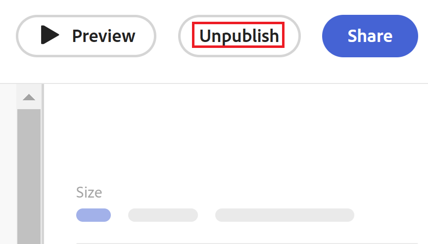

# Dépublication d’un formulaire de demande dans Adobe Workfront Planning

<!--take Preview and Production references at Production time-->

<!--

The highlighted information on this page refers to functionality not yet generally available. It is available only in the Preview environment for all customers. After the monthly releases to Production, the same features are also available in the Production environment for customers who enabled fast releases.    

For information about fast releases, see [Enable or disable fast releases for your organization](/help/quicksilver/administration-and-setup/set-up-workfront/configure-system-defaults/enable-fast-release-process.md). 

-->

{{planning-important-intro}}

Vous pouvez dépublier un formulaire de demande s’il n’est plus nécessaire ou pertinent. En dépubliant, vous supprimez les autorisations d’accès au formulaire accordées à tous.

Vous pouvez également modifier les entités avec lesquelles vous partagez un formulaire de demande, si vous souhaitez qu’il reste disponible pour un plus petit groupe de personnes.

## Conditions d’accès

+++ Développez pour afficher les exigences d’accès aux fonctionnalités de cet article. 

<table style="table-layout:auto"> 
<col> 
</col> 
<col> 
</col> 
<tbody> 
<tr> 
   <td role="rowheader">
Packages Adobe Workfront
</td> 
   <td> 

Tout package Workfront et tout package Planning

Ou

Tout package de workflow et tout package Planning

Pour plus d’informations sur les composants inclus dans chaque package Workfront Planning, contactez votre représentant de compte Workfront.

   </td> </tr>

</tr> 
  <tr> 
   <td role="rowheader">
Licence Adobe Workfront
</td> 
   <td>
Standard
 
  </td> 
  </tr> 
  <tr> 
   <td role="rowheader">
Autorisations d’objet
</td> 
   <td>   
Gérez les autorisations d’un espace de travail et d’un type d’enregistrement</a> 
  
   
L’administration système a accès à tous les espaces de travail, y compris ceux qu’elle n’a pas créés.
  </td> 
  </tr>  
</tbody> 
</table>

Pour plus d’informations sur les exigences d’accès à Workfront, voir [Exigences d’accès dans la documentation de Workfront](/help/quicksilver/administration-and-setup/add-users/access-levels-and-object-permissions/access-level-requirements-in-documentation.md).

+++

## Modification du partage d’un formulaire de demande

Si vous partagez une demande de publiquement, avec tout le monde, y compris les utilisateurs et utilisatrices externes à votre organisation, vous pouvez envisager de restreindre cet accès à certains utilisateurs et utilisatrices qui affichent ou gèrent l’espace de travail auquel le formulaire est associé.

Pour modifier le partage d’un formulaire de demande :

{{step1-to-planning}}

1. Cliquez sur l’espace de travail dans lequel vous souhaitez partager un formulaire.

   L’espace de travail s’ouvre et les types d’enregistrements s’affichent sous forme de cartes.

1. Cliquez sur la vignette d’un type d’enregistrement pour plus de détails. Pour plus d’informations sur la création d’un type d’enregistrement, consultez la section [Créer des types d’enregistrement](/help/quicksilver/planning/architecture/create-record-types.md).

   La page du type d’enregistrement s’ouvre dans la dernière vue à laquelle vous avez accédé. Par défaut, une page de type d’enregistrement s’ouvre en mode Tableau.

1. Cliquez sur le menu **Plus**  à droite du nom du type d’enregistrement dans l’en-tête de la page, puis cliquez sur **Gérer les formulaires de demande**.

   Tous les formulaires de demande associés au type d’enregistrement s’affichent dans une vue tabulaire.
1. Pointez sur le nom d’un formulaire de demande, puis cliquez sur le menu **Plus**  à droite de son nom, puis cliquez sur **Partager**.
1. Mettez à jour les choix de partage en sélectionnant l’une des options suivantes :

   * Toute personne disposant d’un accès en affichage ou supérieur à l’espace de travail
   * Toute personne disposant d’un accès en contribution ou supérieur à l’espace de travail
   * Toute personne disposant du lien

   Pour plus d’informations, voir [Création et gestion d’un formulaire de demande dans Adobe Workfront Planning](/help/quicksilver/planning/requests/create-request-form.md).
1. (Facultatif) Cliquez sur **Copier le lien**, si vous avez modifié le partage du formulaire de demande et que vous souhaitez le partager avec le nouveau groupe de personnes avec un nouveau lien.

## Dépublication d’un formulaire de demande pour un type d’enregistrement

Lorsqu’un formulaire de demande devient non pertinent et que vous ne souhaitez plus que quiconque y accède, vous pouvez le dépublier.

{{step1-to-planning}}

1. Cliquez sur l’espace de travail dans lequel vous souhaitez ajouter des enregistrements.

   L’espace de travail s’ouvre et les types d’enregistrements s’affichent sous forme de cartes.

1. Cliquez sur la vignette d’un type d’enregistrement pour plus de détails. Pour plus d’informations sur la création d’un type d’enregistrement, consultez la section [Créer des types d’enregistrement](/help/quicksilver/planning/architecture/create-record-types.md).

   La page du type d’enregistrement s’ouvre dans la dernière vue à laquelle vous avez accédé. Par défaut, une page de type d’enregistrement s’ouvre en mode Tableau.

1. Cliquez sur le menu **Plus**  à droite du nom du type d’enregistrement dans l’en-tête de la page, puis cliquez sur **Gérer les formulaires de demande**.

   Tous les formulaires de demande associés au type d’enregistrement s’affichent dans une vue tabulaire.
1. Pointez sur le nom d’un formulaire de demande, puis cliquez sur le menu **Plus**  à droite de son nom, puis cliquez sur **Dépublier**

Ou

Cliquez sur le nom du formulaire de demande pour l’ouvrir, puis cliquez sur **Dépublier** dans le coin supérieur droit du formulaire de demande.

Un message de confirmation s’affiche au bas de l’écran pour vous informer que la publication du formulaire a été annulée.

Le lien ou le bouton **Dépublier** devient **Publier**.

1. (Conditionnel) Cliquez sur **Enregistrer** si vous avez dépublié le formulaire après l’avoir ouvert.

   Les utilisateurs ne peuvent plus accéder au formulaire de demande à partir d’un lien ou de la file d’attente des demandes dans la zone des Demandes de Workfront.

   Tous les enregistrements précédemment ajoutés à l’aide du formulaire de demande restent sur la page du type d’enregistrement.

   Toutes les requêtes précédemment ajoutées restent dans la zone des Requêtes de Workfront.
