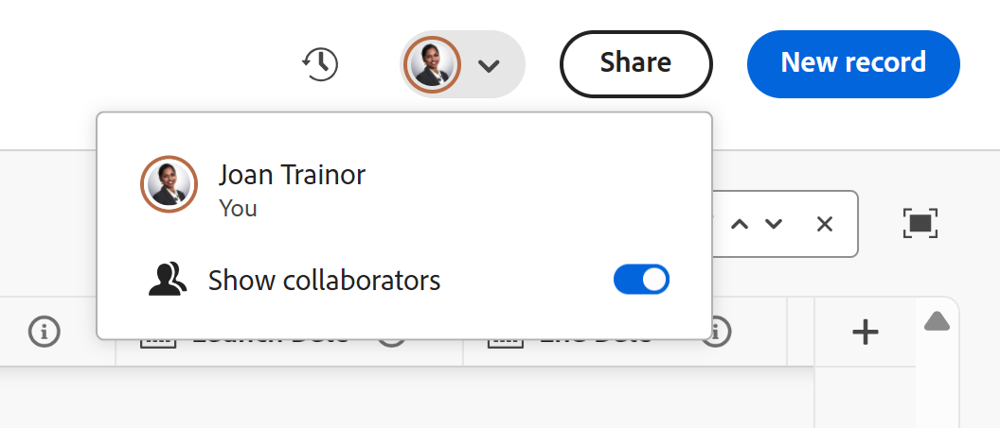

# Gérer les vues d’enregistrement

<!--The highlighted information on this page refers to functionality not yet generally available. It is available only in the Preview environment for all customers. After the monthly releases to Production, the same features are also available in the Production environment for customers who enabled fast releases.    

For information about fast releases, see [Enable or disable fast releases for your organization](/help/quicksilver/administration-and-setup/set-up-workfront/configure-system-defaults/enable-fast-release-process.md).    -->

{{planning-important-intro}}

Après avoir sélectionné un type d’enregistrement dans la zone d’Adobe Workfront Planning, vous pouvez afficher tous les enregistrements de ce type dans les vues suivantes :

* Tableau

  Pour plus d’informations, voir [Gérer la vue de tableau](/help/quicksilver/planning/views/manage-the-table-view.md).

* Journal

  Pour plus d’informations, voir [Gérer la vue chronologique](/help/quicksilver/planning/views/manage-the-timeline-view.md).

* Calendrier

  Pour plus d’informations, voir [Gérer la vue de calendrier](/help/quicksilver/planning/views/manage-the-calendar-view.md).

Cet article présente les informations suivantes sur les vues d’enregistrement :

* [Créer et modifier une vue](#create-or-edit-record-views)
* [Supprimer une vue](#delete-views)
* [Dupliquer une vue](#duplicate-views)
* [Activer les indicateurs de présence en temps réel dans une vue](#enable-the-real-time-presence-indicator-in-a-view)
  <!--* [Add a view as a favorite](#add-a-view-as-a-favorite) - not possible yet-->

## Conditions d’accès

+++ Développez pour afficher les exigences d’accès.

Vous devez disposer des accès suivants pour effectuer les étapes décrites dans cet article :

<table style="table-layout:auto"> 
<col> 
</col> 
<col> 
</col> 
<tbody> 
    <tr> 
<tr> 
<td> 
   
 Produits
 </td> 
   <td> 
   <ul><li>
 Adobe Workfront
</li> 
   <li>
 Planification d’Adobe Workfront
</li></ul></td> 
  </tr>   
<tr> 
   <td role="rowheader">
Formule Adobe Workfront*
</td> 
   <td> 

L’un des plans Workfront suivants :
 
<ul><li>Sélectionner</li> 
<li>Principal</li> 
<li>Final</li></ul> 

Workfront Planning n’est pas disponible pour les plans Workfront hérités
 
   </td> 
<tr> 
   <td role="rowheader">
Package Adobe Workfront Planning*
</td> 
   <td> 

Tous 
 

Pour plus d’informations sur les éléments inclus dans chaque plan de planification Workfront, contactez votre gestionnaire de compte Workfront. 
 
   </td> 
 <tr> 
   <td role="rowheader">
Plateforme Adobe Workfront
</td> 
   <td> 

L’instance de Workfront de votre entreprise doit être intégrée à l’expérience unifiée Adobe pour pouvoir accéder à toutes les fonctionnalités de Workfront Planning.
 

Pour plus d’informations, voir <a href="/help/quicksilver/workfront-basics/navigate-workfront/workfront-navigation/adobe-unified-experience.md">Adobe Unified Experience pour Workfront</a>. 
 
   </td> 
   </tr> 
  </tr> 
  <tr> 
   <td role="rowheader">
Licence Adobe Workfront*
</td> 
   <td>
 Standard 

   
Workfront Planning n’est pas disponible pour les licences Workfront héritées
 
  </td> 
  </tr> 
  <tr> 
   <td role="rowheader">
Configuration du niveau d’accès
</td> 
   <td> 
Il n’existe aucun contrôle de niveau d’accès pour Adobe Workfront Planning.
   
</td> 
  </tr> 
<tr> 
   <td role="rowheader">
Autorisations d’objet
</td> 
   <td>   
Gérer les autorisations pour une vue
  
   
Autorisations d’affichage d’une vue pour modifier temporairement les paramètres d’affichage
 </td> 
  </tr> 
<tr> 
   <td role="rowheader">
Modèle de disposition
</td> 
   <td> 
Toutes les personnes, y compris les administrateurs et administratrices de Workfront, doivent se voir attribuer un modèle de mise en page incluant la zone Planning dans le menu principal. 
 </td> 
  </tr> 
</tbody> 
</table>

* Pour plus d’informations sur les exigences d’accès à Workfront, voir [Conditions d’accès requises dans la documentation Workfront](/help/quicksilver/administration-and-setup/add-users/access-levels-and-object-permissions/access-level-requirements-in-documentation.md).

+++

<!--replace the layout template info in the table with this at release: 

In the Production environment, all users including the System Administrators must be assigned to a layout template that includes the Planning areas.

In the Preview environment, Standard users and System Administrators have the Planning area enabled by default.

-->

## Remarques concernant l’utilisation des vues d’enregistrement

* Les vues dans Workfront Planning sont spécifiques au type d’enregistrement. Vous ne pouvez pas appliquer la même vue à deux types d’enregistrements différents.
* Les vues que vous créez sont visibles uniquement par vous et les personnes avec lesquelles vous les partagez.
* Lorsque vous modifiez ou supprimez une vue, elle est modifiée et supprimée pour toutes les personnes disposant d’autorisations sur la vue.
* Chaque utilisateur peut créer un maximum de 100 vues. Vous pouvez afficher plus de 100 vues pour un type d’enregistrement, mais un utilisateur ne peut créer que 100 vues.
* Vous pouvez partager des vues que vous créez avec d&#39;autres utilisateurs. Pour plus d’informations, voir [Partager des vues](/help/quicksilver/planning/access/share-views.md).
* Les éléments suivants sont propres à chaque vue d’enregistrement :

   * Filtre
   * Regroupement 
   * Trier
   * Aspect de la barre (pour la vue chronologique)

  <!-- some of these are not available in all of the views - edit above-->

  Par exemple, lors de la création d’un filtre dans une vue de tableau, les résultats du filtre ne sont visibles que dans la vue sélectionnée et non dans toutes les vues associées au type d’enregistrement.

  >[!NOTE]
  >
  > Certains éléments d&#39;affichage peuvent ne pas être disponibles pour tous les affichages.

## Similarités et différences entre les vues d’enregistrement

Le tableau suivant présente les similitudes et les différences entre les vues de tableau, chronologique et de calendrier :

<!--some of these are NOT available right now; if you make this public, comment out the ones not there-->

| Fonctionnalité | Vue de tableau | Vue chronologique | Vue de calendrier |
|-----------------------------------------------------------------------|------------|---------------|--------------|
| Afficher des enregistrements dans une liste ou une table | ✓ |              | |
| Afficher tous les champs sous forme de colonnes dans le tableau, par défaut | ✓ |              |    |
| Masquer ou afficher des champs (ou des colonnes) | ✓ |               |    |
| Modifier les valeurs de champ de chaque enregistrement | ✓ |               |             |
| Ajouter des enregistrements en tant que nouvelles lignes dans la vue | ✓ |               |        |
| Ajouter des champs en tant que nouvelles colonnes dans la vue | ✓ |               |         |
| Copier des lignes d’une liste externe et les coller dans un tableau | ✓ |               |          |
| Afficher des enregistrements dans une chronologie |            | ✓ |             |
| Filtrer des enregistrements | ✓ | ✓ | ✓ |
| Afficher des enregistrements sur un calendrier |           |              | ✓ |
| Regrouper les enregistrements | ✓ | ✓ |
| Trier les enregistrements | ✓ |              |
| Attribuer des couleurs aux enregistrements |           | ✓ | ✓ |
| Attribuer des couleurs aux regroupements |           | ✓ |
| Rechercher des enregistrements spécifiques | ✓ | ✓ |
| Partager la vue avec d&#39;autres personnes | ✓ | ✓ | ✓ |
| Ouvrir la page de l’enregistrement à partir de la vue. | ✓ | ✓ |    |
| Afficher les enregistrements par année et par trimestre |           | ✓ |    |
| Afficher les enregistrements par mois |           | ✓ | ✓ |
| Afficher les enregistrements par semaine |           |               | ✓ |

## Créer ou modifier des vues {#create-or-edit-views}

{{step1-to-planning}}

1. Cliquez sur la vignette d’un espace de travail.

   L’espace de travail s’ouvre et les types d’enregistrements s’affichent sous forme de cartes.

1. Cliquez sur la vignette d’un type d’enregistrement pour plus de détails.

   La page de type d’enregistrement s’ouvre.

   Par défaut, tous les enregistrements du type sélectionné s&#39;affichent dans la vue de tableau.

1. Cliquez sur **+ Affichage** pour ajouter une nouvelle vue.
1. Choisissez parmi les types de vues suivants :

   * Tableau
   * Journal
   * Calendrier

   Un nouvel onglet est créé avec la vue sélectionnée.

   Selon la largeur de l’écran, d’autres vues peuvent s’afficher dans le menu **Plus** .

>[!TIP]
>
>Lorsque vous créez un type d’enregistrement, la vue de tableau est également créée par défaut.
>
>Pour créer une vue de calendrier ou de chronologie, le type d’enregistrement pour lequel vous créez la vue doit comporter au moins deux champs de date.
>
>Dans le cas contraire, les options Chronologie et Calendrier sont grisées.
>

1. (Le cas échéant) Cliquez sur **Suivant** lors de la création d’une vue chronologique ou de calendrier.

   Par défaut, Workfront donne à la vue l’un des noms suivants :

   * `Table < number >`
   * `Timeline < number >`
   * `Calendar < number >`

   Le nombre est un incrément généré automatiquement.

1. (Le cas échéant) Sélectionnez les **dates de début** et **de fin** pour les enregistrements qui s’afficheront dans la vue chronologique ou de calendrier.

   >[!TIP]
   >
   >    Vous pouvez effectuer un choix parmi les champs de date d’enregistrement ou les champs de date de recherche parmi les types d’objet ou d’enregistrement connectés. Vous devez utiliser des agrégateurs pour les champs de date (MAX ou MIN) lorsque vous sélectionnez des champs de recherche comme dates de début et de fin pour les vues chronologique et Calendrier. Pour plus d’informations, consultez la section [Connecter des types d’enregistrements](/help/quicksilver/planning/architecture/connect-record-types.md).

1. Cliquez sur **Créer**.

   La vue s’affiche dans un nouvel onglet. Les vues s’affichent dans l’ordre chronologique à partir du moment où elles ont été créées ou partagées avec vous.
1. (Facultatif) Cliquez sur le menu **Plus**  en regard de la dernière vue pour afficher toutes les vues pour le type d’enregistrement sélectionné.

   D’autres vues s’affichent dans le menu **Plus** après le dernier onglet de vue. Le numéro en regard du menu **Plus** affiche le nombre de vues supplémentaires.
1. (Facultatif) Pour renommer une vue après sa création, cliquez sur le menu déroulant de la vue, puis sur le menu **Plus**  > **Renommer** pour mettre à jour le nom de la vue

   Ou

   Double-cliquez sur le nom de la vue et commencez à saisir le nouveau nom. <!--ensure there is not another saving step here?!-->

1. (Facultatif) Pour gérer un type de vue spécifique, consultez les articles suivants :

   * [Gérer la vue de tableau](/help/quicksilver/planning/views/manage-the-table-view.md)
   * [Gérer la vue chronologique](/help/quicksilver/planning/views/manage-the-timeline-view.md)
   * [Gérer la vue de calendrier](/help/quicksilver/planning/views/manage-the-calendar-view.md)

## Supprimer des vues

{{step1-to-planning}}

1. Cliquez sur la vignette d’un espace de travail.

   L’espace de travail s’ouvre et les types d’enregistrements s’affichent sous forme de cartes.

1. Cliquez sur la vignette d’un type d’enregistrement pour plus de détails.

   La page de type d’enregistrement s’ouvre.

   Par défaut, tous les enregistrements du type sélectionné s’affichent dans la vue tableau.

1. Pointez sur l&#39;un des noms de la vue dans l&#39;onglet Vue, puis cliquez sur **Plus**  à gauche du nom de la vue, puis cliquez sur **Supprimer**.
Vous devrez peut-être d’abord cliquer sur **Plus** à gauche du dernier onglet pour trouver la vue que vous souhaitez supprimer.

1. Cliquez sur **Supprimer** pour confirmer. <!--ensure there is not another saving step here?!-->

   La vue est supprimée pour l’ensemble des utilisateurs et des utilisatrices qui peuvent accéder à la zone des enregistrements et elle ne peut pas être récupérée.

<!--## Add a view as a favorite - this is not possible yet-->

<!--not possible yet - August 30, 2023: -->

## Dupliquer une vue

Si vous souhaitez conserver plusieurs versions d’une vue et apporter de légères modifications entre les versions, vous pouvez dupliquer une vue.

La duplication d’une vue crée des copies identiques d’une vue existante.

Les autorisations de partage de la vue d’origine ne sont pas transférées à la vue dupliquée.

{{step1-to-planning}}

1. Cliquez sur la vignette d’un espace de travail.

   L’espace de travail s’ouvre et les types d’enregistrements s’affichent sous forme de cartes.

1. Cliquez sur la vignette d’un type d’enregistrement pour plus de détails.

   La page de type d’enregistrement s’ouvre.
Par défaut, tous les enregistrements du type sélectionné s&#39;affichent dans la vue de tableau.

1. Pointez sur l’onglet de la vue à dupliquer, puis cliquez sur le menu **Plus**  à droite du nom de la vue, puis cliquez sur **Dupliquer**.

   

   La vue est dupliquée et le nom de la nouvelle vue suit le modèle suivant : `Original view's name (Copy)`. Le nouvel onglet de vue s’affiche à la fin de tous les onglets de vue.

## Activation de l&#39;indicateur de présence en temps réel dans une vue

Par défaut, les avatars d’autres utilisateurs qui modifient les informations d’enregistrement en même temps que vous s’affichent dans le coin supérieur droit de toutes les vues d’enregistrement.

Lorsque vous affichez la vue Tableau, vous pouvez également voir quel champ un autre utilisateur est en train de modifier au moment où vous affichez l’enregistrement.

1. Accédez à une page de type d’enregistrement et ouvrez n’importe quelle vue.
1. (Conditionnel) Si d’autres utilisateurs modifient les enregistrements du type sélectionné en même temps, leurs avatars s’affichent dans le coin supérieur droit de la vue.
1. Cliquez sur le menu déroulant en regard des avatars, puis sélectionnez le bouton bascule **Afficher les collaborateurs**. Le bouton (bascule) est sélectionné par défaut.

   

1. (Conditionnel) Ouvrez une vue de tableau, et le champ qu’une autre personne modifie activement est mis en surbrillance dans la couleur correspondant au contour de son avatar dans la vue de tableau.

   Si la couleur de surbrillance de l&#39;avatar est grise, l&#39;utilisateur a arrêté de modifier activement l&#39;enregistrement il y a plus de 30 secondes.

   

   >[!TIP]
   >
   >Vous pouvez sélectionner le bouton bascule **Afficher les collaborateurs** dans n’importe quel mode. Le champ actuellement modifié par d’autres utilisateurs est uniquement indiqué dans la vue Tableau.
