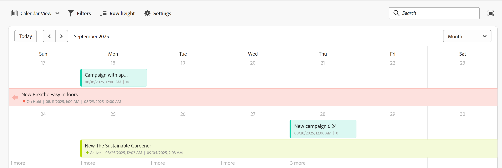

# Gérer la vue de calendrier

<!--The highlighted information on this page refers to functionality not yet generally available. It is available only in the Preview environment for all customers. After the monthly releases to Production, the same features are also available in the Production environment for customers who enabled fast releases.    

For information about fast releases, see [Enable or disable fast releases for your organization](/help/quicksilver/administration-and-setup/set-up-workfront/configure-system-defaults/enable-fast-release-process.md). -->

{{planning-important-intro}}

Vous pouvez afficher les enregistrements et leurs champs dans une vue Calendrier, à partir de la page Type d’enregistrement.

Pour plus d’informations sur les vues Adobe Workfront Planning et leur gestion, voir [Gérer les vues d’enregistrement](/help/quicksilver/planning/views/manage-record-views.md).

## Conditions d’accès

+++ Développez pour afficher les conditions d’accès requises pour la fonctionnalité de cet article. 

<table style="table-layout:auto"> 
<col> 
</col> 
<col> 
</col> 
<tbody> 
    <tr> 
<tr> 
</tr>   
<tr> 
   <td role="rowheader">
Package Adobe Workfront
</td> 
   <td> 

Tout Workfront et tout package Planning

Tout workflow et tout package Planning

Pour plus d’informations sur les composants inclus dans chaque package Workfront Planning, contactez votre représentant de compte Workfront. 
 
   </td> 
  <tr> 
   <td role="rowheader">
Licence Adobe Workfront
</td> 
   <td>
 Standard pour créer et supprimer des vues

   
Contributeur ou version ultérieure pour mettre à jour les éléments d’affichage

  </td> 
  </tr> 
  <tr> 
   <td role="rowheader">
Autorisations d’objet
</td> 
   <td>   
Gérer les autorisations pour une vue
  
   
Autorisations d’affichage d’une vue pour modifier temporairement les paramètres d’affichage ou la dupliquer
 </td> 
  </tr> 
<tr>
   <td role="rowheader">
Modèle de mise en page
</td>
   <td> Les utilisateurs disposant d'une licence light ou contributor doivent se voir attribuer un modèle de mise en page incluant Planning.
   
Les zones Planning sont activées par défaut pour les utilisateurs standard et les administrateurs système.

</li></ul>
</td>
  </tr> 
</tbody> 
</table>

Pour plus d’informations sur les exigences d’accès à Workfront, voir [Exigences d’accès dans la documentation de Workfront](/help/quicksilver/administration-and-setup/add-users/access-levels-and-object-permissions/access-level-requirements-in-documentation.md).

+++ 

<!--Old:
 <table style="table-layout:auto"> 
<col> 
</col> 
<col> 
</col> 
<tbody> 
    <tr> 
<tr> 
<td> 
   
 Products
 </td> 
   <td> 
   <ul><li>
 Adobe Workfront
</li> 
   <li>
 Adobe Workfront Planning
</li></ul></td> 
  </tr>   
<tr> 
   <td role="rowheader">
Adobe Workfront plan*
</td> 
   <td> 

Any of the following Workfront plans:
 
<ul><li>Select</li> 
<li>Prime</li> 
<li>Ultimate</li></ul> 

Workfront Planning is not available for legacy Workfront plans
 
   </td> 
<tr> 
   <td role="rowheader">
Adobe Workfront Planning package*
</td> 
   <td> 

Any 
 

For more information about what is included in each Workfront Planning plan, contact your Workfront account manager. 
 
   </td> 
 <tr> 
   <td role="rowheader">
Adobe Workfront platform
</td> 
   <td> 

Your organization's instance of Workfront must be onboarded to the Adobe Unified Experience to be able to access Workfront Planning.
 

For more information, see <a href="/help/quicksilver/workfront-basics/navigate-workfront/workfront-navigation/adobe-unified-experience.md">Adobe Unified Experience for Workfront</a>. 
 
   </td> 
   </tr> 
  </tr> 
    <td role="rowheader">
Adobe Workfront license*
</td> 
   <td>
 Standard to create and delete views

   
Contributor or higher to update view elements

   
Workfront Planning is not available for legacy Workfront licenses
 
  </td> 
  </tr> 
  <tr> 
   <td role="rowheader">
Access level configuration
</td> 
   <td> 
There are no access level controls for Adobe Workfront Planning
   
</td> 
  </tr> 
<tr> 
   <td role="rowheader">
Object permissions
</td> 
   <td>   
Manage permissions to a view
  
   
View permissions to a view to temporarily change the view settings or to duplicate it
 </td> 
  </tr> 
<tr>
   <td role="rowheader">
Layout template
</td>
   <td> Users with a Light or Contributor license must be assigned a layout template that includes Planning.
   
Standard users and System Administrators have the Planning areas enabled by default.

</li></ul>
</td>
  </tr>

</tbody> 
</table> -->

## Gérer une vue Calendrier {#manage-a-calendar-view}

<!--insert screen shot of calendar view-->

Tenez compte des points suivants :

* Vous ne pouvez créer une vue Calendrier que si au moins deux champs de date sont associés à un type d’enregistrement. Lorsqu’un type d’enregistrement est associé à un ou à aucun champ de date, l’option Vue Calendrier est grisée.

  Vous pouvez effectuer un choix parmi les champs de date d’enregistrement ou les champs de date de recherche parmi les types d’objet ou d’enregistrement connectés.
* Les scénarios suivants sont possibles :

   * Lorsque les dates de début et de fin ne comportent aucune valeur, les enregistrements ne s’affichent pas dans le calendrier
   * Lorsque les dates de début et de fin n’ont aucune valeur, l’enregistrement s’affiche sous la forme d’un événement d’un jour
   * Lorsque la date de début est postérieure à la date de fin, l&#39;enregistrement ne s&#39;affiche pas dans le calendrier.

Pour gérer une vue Calendrier :

1. Accédez à la page de type d’enregistrement pour laquelle vous souhaitez afficher le calendrier.
1. Créez une vue Calendrier, comme décrit dans l’article [Gérer les vues d’enregistrement](/help/quicksilver/planning/views/manage-record-views.md).

   

   Les enregistrements associés au type d&#39;enregistrement que vous avez sélectionné s&#39;affichent sous forme de barres dans un calendrier. Par défaut, la couleur des barres correspond à celle de l’icône d’enregistrement.

1. Effectuez l’une des opérations suivantes pour parcourir le calendrier :

   * Cliquez sur les icônes de gauche et de droite dans le coin supérieur gauche du calendrier ou utilisez le défilement horizontal pour vous déplacer vers l’arrière et l’avant dans le calendrier.
   * Cliquez sur **Aujourd’hui** dans le coin supérieur droit pour centrer le calendrier sur la date d’aujourd’hui.
   * Sélectionnez l’une des options suivantes dans le menu déroulant de la période pour mettre à jour les incréments de temps :

      * **Mois** : les enregistrements s’affichent dans un calendrier mensuel.

      * **Semaine** : les enregistrements s’affichent dans les zones suivantes :

         * Les enregistrements qui s&#39;étendent sur plusieurs jours s&#39;affichent en haut du calendrier.
         * Les enregistrements d&#39;une durée inférieure ou égale à un jour s&#39;affichent dans la moitié inférieure de la vue Calendrier. Si vous avez choisi d&#39;afficher l&#39;heure des dates de début et de fin, l&#39;enregistrement s&#39;affiche à l&#39;heure appropriée dans la journée où il se produit.

1. (Facultatif) Cliquez sur l’icône **Plein écran**  pour ouvrir l’affichage en plein écran, puis sur l’icône **Quitter le plein écran**  ou sur la touche Échap du clavier pour quitter le plein écran.

1. Pour créer des enregistrements dans la vue Calendrier ou modifier leurs dates, effectuez l&#39;une des opérations suivantes :

   * Double-cliquez n&#39;importe où sur le calendrier pour créer un enregistrement.

     Pour plus d’informations, voir [Créer des enregistrements](/help/quicksilver/planning/records/create-records.md).

   * Cliquez sur la marge gauche ou droite d’une barre d’enregistrement, puis faites-la glisser et déposez-la à un nouvel emplacement. Le redimensionnement des barres des enregistrements met immédiatement à jour leurs dates de début ou de fin.

   * Faites glisser et déposez les barres d’enregistrement pour mettre à jour leur position et leurs dates. Le déplacement des barres des enregistrements met immédiatement à jour leurs dates de début et de fin.

     Pour plus d’informations, voir [Modifier des enregistrements](/help/quicksilver/planning/records/edit-records.md).

1. Mettez à jour les éléments de vues suivants, comme décrit dans les sous-sections ci-dessous :
   * [Filtres](#add-filters)
   * [Hauteur de ligne](#modify-row-height)
   * [Paramètres](#edit-the-calendar-view-settings)

   <!--* [Grouping](#add-grouping)-->
   <!--* [Sort](#add-sort) not sure if this is present in calendar views?!; also check the anchor and make sure it's correct-->

### Ajouter des filtres

Vous pouvez réduire la quantité d’informations affichées à l’écran en utilisant des filtres.

Tenez compte des points suivants lorsque vous utilisez des filtres dans la vue Calendrier :

<!-- this list is almost identical to the one for the table view - update both-->

* Les filtres que vous créez pour une vue Calendrier fonctionnent indépendamment des filtres de toute autre vue appliquée au même type d&#39;enregistrement.

* Les filtres sont propres à la vue que vous sélectionnez. Des filtres différents peuvent être appliqués à deux vues de calendrier du même type d’enregistrement.

* Deux utilisateurs qui consultent le même affichage Calendrier verront le même filtre qui est actuellement appliqué.

* Vous ne pouvez pas nommer les filtres que vous créez pour une vue Calendrier.

* En supprimant les filtres, vous les supprimez pour toutes les personnes qui accèdent au même type d’enregistrement que vous et qui consultent la même vue que vous.

* Vous pouvez filtrer par champs d’enregistrement connectés ou champs de recherche.

* Vous pouvez filtrer par champs de recherche qui affichent plusieurs valeurs.

Pour ajouter un filtre à une vue Calendrier :

1. Créez une vue Calendrier pour une page de type enregistrement, comme décrit dans l’article [Gérer les vues d’enregistrement](/help/quicksilver/planning/views/manage-record-views.md).
1. Sélectionnez une vue de calendrier, puis cliquez sur **Filtres** dans la barre d’outils du calendrier.
1. Cliquez sur **Ajouter une condition** et ajoutez les informations suivantes :

   * **Sélectionnez un champ** pour rechercher un champ et le sélectionner dans la liste

   * **Sélectionnez une option** (ou un modificateur de filtre) pour définir le type de condition auquel le champ doit répondre

     Le tableau ci-dessous présente les modificateurs disponibles pour chaque type de champ.

     <table>
        <thead>
        <tr>
            <th><b>Type de champ</b></th>
            <th><b>Modificateurs</b></th>
        </tr>
        </thead>
        <tbody>
        <tr>
            <td>Ligne unique, paragraphe, formule </td>
            <td>
Contient

            
Ne contient pas

            
Est

            
N’est pas

            
Est vide

            
N’est pas vide
</td>
        </tr>
        <tr><td>Sélection unique</td>
            <td>
Est

            
N’est pas

            
Est l’un des

            
N’est aucun de

            
Est vide

            
N’est pas vide
</td>
        </tr>
        <tr>
            <td>Multi-sélection, personnes</td>
            <td>
A l’un des

            
Dispose de tous les

            
Est exactement

            
N’a aucun(e) des

            
Est vide

            
N’est pas vide
</td>
        </tr>
        <tr>
            <td>Nombre, pourcentage, devise</td>
            <td>
=

            
≠

            
 &lt; 

            
&gt;

            
≤

            
≥

            
Est vide

            
N’est pas vide
</td>
        </tr>
        <tr>
            <td>Date</td>
            <td>
Est

            
N’est pas

            
Est après

            
Est avant

            
Est compris entre

N’est pas compris entre

            
Est vide

N’est pas vide
</td>
        </tr>

     <tr>
            <td>Case à cocher</td>
            <td>
Est

        </tr>
        </tbody>
        </table>

   * Choisissez une valeur pour le champ sélectionné.

   

   Il n’y a pas de limite au nombre de conditions de filtrage que vous pouvez ajouter.

1. (Facultatif) Cliquez sur **Ajouter une condition** pour ajouter une autre option de filtrage et répétez les étapes ci-dessus. Le nombre de filtres appliqués s’affiche à gauche de l’icône Filtres.
1. Cliquez sur les opérateurs suivants pour indiquer comment les conditions de filtrage sont liées et doivent être appliquées :

   * **AND** : toutes les conditions spécifiées doivent être remplies.
   * **OR** : l’une des conditions spécifiées doit être remplie. Il s’agit de l’option par défaut.

   1. (Facultatif) Ajoutez des opérateurs **AND** ou **OR** supplémentaires entre plusieurs regroupements de conditions.

      

   La liste des enregistrements est filtrée automatiquement. <!--at this time, you can't name and save the filter - but will this change?!-->
   <!-- asked on the task for the simple filters whether there is a limitation for how many statements a filter can have?!-->

1. (Facultatif) Cliquez sur l’icône **x** pour supprimer une condition de filtre.
1. (Facultatif) Cliquez sur **Filtres** pour fermer la zone des filtres. <!--right now you cannot "clear all" for filters, but this might come later-->

### Modifier la hauteur de ligne

Vous pouvez modifier la hauteur de ligne d’une cellule de calendrier pour augmenter ou réduire le nombre de barres d’enregistrement affichées dans chaque cellule.

Le nombre d’enregistrements affichés dans le calendrier varie en fonction du nombre de champs que vous affichez sur les barres des enregistrements.

>[!TIP]
>
>Ce paramètre est disponible uniquement lors de l’affichage du calendrier par mois.

1. Créez une vue Calendrier pour une page de type enregistrement, comme décrit dans l’article [Gérer les vues d’enregistrement](/help/quicksilver/planning/views/manage-record-views.md).
1. (Conditionnel) Afficher la vue Calendrier par mois, puis cliquer sur **Hauteur de ligne** dans la barre d’outils du calendrier.
1. Choisissez l’une des options suivantes :

   <table>
    <thead>
    <tr>
        <th><b>Option de hauteur de ligne</b></th>
        <th><b>Nombre maximal d’enregistrements par défaut</b></th>
    </tr>
    </thead>
    <tbody>
    <tr>
        <td>Court</td>
        <td>
Contient :

   <ul><li>2 enregistrements affichant 1 champ</li>
    <li>1 enregistrement affichant plus d’un champ</li></ul>
        </td>
    </tr>
    <tr><td>Standard</td>
        <td>
Contient :

   <ul><li>4 enregistrements affichant 1 champ</li>
    <li>2 enregistrement(s) affichant plus d’1 champ</li></ul>
        </td>
    </tr>
    <tr>
        <td>Moyen</td>
        <td>
Contient :

   <ul><li>8 enregistrements affichant 1 champ</li>
    <li>4 enregistrement affichant plus d’un champ</li></ul>
        </td>
    </tr>
    <tr>
        <td>Grand</td>
        <td>
Contient :

   <ul><li>12 enregistrements affichant 1 champ</li>
    <li>6 enregistrement affichant plus d’un champ</li></ul>
        </td>
    </tr>
    <tr>
        <td>Ajuster au contenu</td>
        <td>
Tous les enregistrements sont visibles, jusqu’à 500 enregistrements
</td>
    </tr>
    </tbody>
    </table>

1. (Facultatif) Cliquez sur **plus** s’il existe des enregistrements non visibles dans le calendrier.

### Modifier les paramètres de la vue Calendrier

Mettez à jour les paramètres de la vue Calendrier pour indiquer les informations qui s’affichent dans la vue, ainsi que leur mode d’affichage.

1. Créez une vue Calendrier pour un type d’enregistrement, comme décrit dans l’article [Gérer les vues d’enregistrement](/help/quicksilver/planning/views/manage-record-views.md).
1. Cliquez sur **Paramètres**.
1. Cliquez sur **Date et heure** dans le panneau de gauche, puis sélectionnez une **Date de début** et une **Date de fin** à afficher dans le calendrier. Vous pouvez choisir les dates de début et de fin par défaut, ou tout champ de date disponible.

   Les barres représentant les enregistrements commencent à la date que vous indiquez pour la date de début et se terminent à la date correspondant à la date de fin.

   >[!NOTE]
   >
   >* Les enregistrements sans valeur pour les dates de début et de fin ou dont la date de début est postérieure à la date de fin ne s&#39;affichent pas dans la vue Calendrier.
   >
   >* Si vous affichez des enregistrements supplémentaires à l&#39;aide de l&#39;option Répartition , les dates de Début et de Fin sont celles de l&#39;enregistrement principal. Vous ne pouvez pas choisir les dates de début et de fin pour les enregistrements connectés dans cette zone.

1. Cliquez sur **Style de barre** dans le panneau de gauche pour indiquer les informations à afficher sur les barres d’enregistrement.

   Le champ principal (ou titre) de l&#39;enregistrement, tel que défini dans la vue Tableau de l&#39;enregistrement, est sélectionné par défaut.
   <!--adjust this when the primary field is released??-->

1. (Facultatif et conditionnel) Si vous avez ajouté des miniatures aux enregistrements, sélectionnez l’option **Miniature** pour afficher l’image associée aux enregistrements dans leur barre d’enregistrement.

   >[!NOTE]
   >
   >    Vous devez d’abord ajouter des miniatures en mode Tableau avant de pouvoir les afficher en mode Calendrier. Pour plus d’informations, voir [Ajouter une miniature à un enregistrement](/help/quicksilver/planning/records/add-thumbnails-to-records.md).

1. Cliquez sur **Ajouter un champ**, puis dans la zone **Rechercher des champs**, et cliquez sur le champ à ajouter.

   >[!TIP]
   >
   >   * Vous devez créer les champs avant de les ajouter aux barres d’enregistrement.
   > 
   >   * Vous devez disposer d’au moins un champ sélectionné. Le **nom** est sélectionné par défaut.
   >
   >   * Vous pouvez ajouter jusqu’à 5 champs.

   Un aperçu de l’apparence des barres sur le calendrier s’affiche à droite.

   

1. Cliquez sur **Couleur** dans le panneau de gauche pour personnaliser les couleurs des enregistrements du calendrier.

   

1. Dans la section **Définir la couleur de l’enregistrement sur**, sélectionnez l’une des options suivantes pour définir une couleur pour les enregistrements :

   * **Type d’enregistrement** : la couleur des barres d’enregistrement du calendrier correspond à la couleur du type d’enregistrement que vous avez sélectionné. Il s’agit de l’option par défaut.
   * **Valeurs de champ** : la couleur des enregistrements correspond à la couleur d’un champ que vous spécifiez.
   * **Aucune** : les enregistrements s’affichent dans une barre blanche.

1. (Le cas échéant) Si vous avez sélectionné **Valeurs de champ** pour les couleurs des enregistrements, sélectionnez un champ dans le menu déroulant **Faire correspondre la couleur de l’enregistrement à**.

   

   Seuls les champs dont les options sont codées en couleur s’affichent dans le menu déroulant.

   Par exemple, les champs à sélection multiple ou unique peuvent avoir des options codées par couleur.

   Si vous n’avez pas de champ avec des options codées par couleur pour le type d’enregistrement sélectionné, cette option est grisée.

1. Cliquer sur **Enregistrer**.

   Les enregistrements s’affichent dans la vue Calendrier avec les spécifications que vous avez sélectionnées.