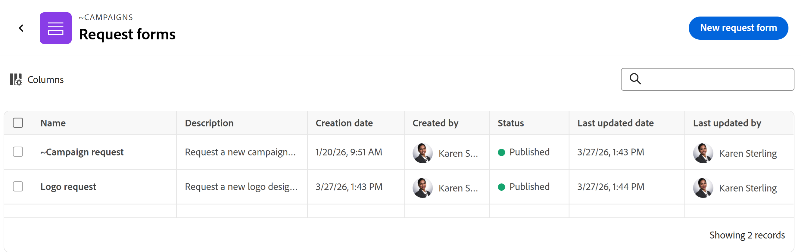

# Gestion de la vue Liste dans Adobe Workfront Planning

<!--
although list views in Planning are very similar to Workfront enhanced lists, keep this one separate with all the information, because of Planning standalone; some information here is also duplicated in this main Glist article: help/quicksilver/workfront-basics/navigate-workfront/use-lists/enhanced-lists.md
-->

<!--
The information highlighted on this page refers to functionality not yet generally available. It is available only in the Preview environment for all customers. After the monthly releases to Production, the same features are also available in the Production environment for customers who enabled fast releases.    

For information about fast releases, see [Enable or disable fast releases for your organization](/help/quicksilver/administration-and-setup/set-up-workfront/configure-system-defaults/enable-fast-release-process.md). 
-->

{{planning-important-intro}}

Vous pouvez afficher les objets dans la vue Liste dans les zones suivantes de Workfront Planning :

* Une page d&#39;enregistrements connectée pour les projets dans la zone des détails d&#39;un enregistrement

  

* Une liste de formulaires de demande au niveau du type d’enregistrement

  

Cet article décrit comment naviguer dans une vue de liste, la créer ou la modifier dans Workfront Planning.

## Conditions d’accès

+++ Développez pour afficher les conditions d’accès requises pour la fonctionnalité de cet article. 

<table style="table-layout:auto"> 
<col> 
</col> 
<col> 
</col> 
<tbody> 
    <tr> 
<tr> 
</tr>   
<tr> 
   <td role="rowheader">
Package Adobe Workfront
</td> 
   <td> 

Tout Workfront et tout package Planning

Tout workflow et tout package Planning

Pour plus d’informations sur les composants inclus dans chaque package Workfront Planning, contactez votre représentant de compte Workfront. 
 
   </td> 
  <tr> 
   <td role="rowheader">
Licence Adobe Workfront
</td> 
   <td>
 Standard pour créer et supprimer des vues

   
Contributeur ou version ultérieure pour mettre à jour les éléments d’affichage

  </td> 
  </tr> 
  <tr> 
   <td role="rowheader">
Autorisations d’objet
</td> 
   <td>   
Gérer les autorisations pour une vue
  
   
Autorisations d’affichage d’une vue pour modifier temporairement les paramètres d’affichage ou la dupliquer
 </td> 
  </tr> 
<tr>
   <td role="rowheader">
Modèle de mise en page
</td>
   <td> Les utilisateurs disposant d'une licence light ou contributor doivent se voir attribuer un modèle de mise en page incluant Planning.
   
Les zones Planning sont activées par défaut pour les utilisateurs standard et les administrateurs système.

</li></ul>
</td>
  </tr> 
</tbody> 
</table>

Pour plus d’informations sur les exigences d’accès à Workfront, voir [Exigences d’accès dans la documentation de Workfront](/help/quicksilver/administration-and-setup/add-users/access-levels-and-object-permissions/access-level-requirements-in-documentation.md).

+++ 

## Considérations relatives aux vues Liste

* Tenez compte des points suivants pour la vue Liste de pages des enregistrements connectés :

   * Vous pouvez uniquement afficher les projets dans la vue Liste dans la page Enregistrements connectés d’un enregistrement. La vue Liste n&#39;est disponible pour aucun autre objet ou type d&#39;enregistrement dans une page d&#39;enregistrements connectée.

  Pour plus d&#39;informations sur la création d&#39;une page d&#39;enregistrements connectés, voir [Ajouter une page d&#39;enregistrements connectés à un enregistrement](/help/quicksilver/planning/records/add-a-connected-records-page-to-a-record.md).
   * Avant de pouvoir afficher une vue Liste dans une page Enregistrements connectés d’un enregistrement, vous devez connecter les projets Workfront aux types d’enregistrements Planning. Pour plus d’informations, voir [Connecter des types d’enregistrement](/help/quicksilver/planning/architecture/connect-record-types.md).
   * Vous pouvez créer plusieurs vues de liste pour les projets dans la page d&#39;enregistrements connectés d&#39;un enregistrement.

* Tenez compte des points suivants pour la vue Liste des formulaires de demande :

   * Vous ne pouvez pas créer ou modifier des vues de liste supplémentaires pour les formulaires de demande Planning. Workfront crée une vue Liste pour les formulaires de demande. <!--this will change-->

     Pour plus d’informations sur les formulaires de demande, voir [Création et gestion d’un formulaire de demande dans Adobe Workfront Planning](/help/quicksilver/planning/requests/create-request-form.md).
* Selon l’emplacement d’affichage, toutes les vues de liste ne comportent pas tous les éléments décrits dans cet article.

## Gestion d’une vue de liste {#manage-a-list-view}

Les vues Liste Workfront Planning sont similaires aux listes améliorées de Workfront. La plupart des éléments des vues améliorées existent également dans les vues Liste de Workfront Planning.

Pour plus d’informations, voir [Utilisation de listes améliorées](/help/quicksilver/workfront-basics/navigate-workfront/use-lists/enhanced-lists.md).

<!--
Removed - more direct steps below: 
{{step1-to-planning}}

1. (Conditional) To access a projects connected page, do the following: 

    1. Click a workspace card, then click a record type card. 
    1. From any view, click the name of a record to open the record's preview or details page. 
    1. Add a **Connected records page** for connected projects as described in the article [Add a Connected records page to a record](/help/quicksilver/planning/records/add-a-connected-records-page-to-a-record.md).

    The Connected records page displays projects connected to the record in the list view. 

    

1. (Conditional) To access a list of request forms, do the following: 

    1. {{step1-to-planning}}

    1. (Conditional) To access a projects connected page, do the following: 

    1. Click a workspace card, then click a record type card.
    1. Click the **More** menu  to the right of the record name in the header, then click **Manage request forms**.

        A list of request forms displays.

-->

1. Accédez à une vue Liste dans l’une des zones suivantes :

   * Une page d&#39;enregistrements connectée pour les projets dans la zone des détails d&#39;un enregistrement
   * Page Formulaires de demande d’un type d’enregistrement

1. (Conditionnel) Si disponible, effectuez l’une des opérations suivantes pour modifier la vue Liste :

   1. Développez le menu des vues déroulantes dans le coin supérieur gauche de la liste pour sélectionner une autre vue, ou cliquez sur **Nouvelle vue** et créez-en une autre.

      >[!TIP]
      >
      >Les vues sont partagées dans l’ensemble du système. Si vous créez une vue Projets pour un type d’enregistrement, vous pouvez l’afficher sur d’autres types d’enregistrement qui affichent les projets connectés.

   1. Passez la souris sur le nom d&#39;une vue existante et cliquez sur le menu **Plus** , puis sur l&#39;une des options suivantes :
      * **Renommer**, pour donner un nouveau nom à la vue
      * **Partager**, pour partager la vue avec d&#39;autres personnes
      * **Supprimer**, pour supprimer la vue.

      >[!NOTE]
      >
      >* Vous devez disposer d’autorisations de niveau Gérer sur une vue pour pouvoir la modifier, la partager ou la supprimer.
      >
      >* Vous ne pouvez pas modifier les vues système.
      >
      >* Vous pouvez réinitialiser un affichage partagé avec vous et pour lequel vous disposez uniquement d&#39;autorisations d&#39;affichage, après l&#39;avoir modifié pour restaurer ses préférences d&#39;origine, ou vous pouvez le copier avec vos modifications et partager la copie. Pour plus d’informations, voir [Utilisation de listes améliorées](/help/quicksilver/workfront-basics/navigate-workfront/use-lists/enhanced-lists.md).

   1. Cliquez sur l’icône **Filtre**  pour ajouter un filtre à la vue. Les résultats sont immédiatement filtrés dans la liste. Vous ne pouvez pas enregistrer ni nommer les filtres. Les filtres sont mémorisés lorsque vous accéderez à la page ultérieurement et ils font partie des vues partagées.

      >[!TIP]
      >
      >Pour appliquer un filtre personnalisé, sélectionnez l’une des options suivantes pour une valeur de champ :
      >
      >* **Moi (utilisateur connecté)** pour faire référence à l’utilisateur connecté dans les champs qui font référence aux utilisateurs.
      >
      >* **Mes équipes** ou **Mon équipe interne** pour faire référence à vos équipes dans les champs qui font référence aux équipes.
      >
      >* **Mes groupes** ou **Mon groupe principal** pour faire référence à vos groupes dans les champs qui font référence à des groupes.
      >
      >* **Ma société** pour faire référence à votre société dans les champs qui font référence à des sociétés.
      > 
      >* **Mes rôles** ou **Mon rôle principal** pour faire référence à vos fonctions dans des champs qui font référence à des rôles.

   1. Cliquez sur l’icône **Colonnes**  pour sélectionner les colonnes à afficher ou à masquer dans la vue.
   1. Pointez sur le nom d’une colonne, puis cliquez sur la flèche vers le bas située à gauche du nom de la colonne, puis cliquez sur l’une des options suivantes :
      * **Renommer**, pour ajouter un **libellé personnalisé** pour la colonne. Le nom du champ d’origine dans Workfront ne change pas.
      * **Trier**, pour trier la liste en fonction du champ sélectionné. Une icône de tri indiquant le sens du tri est ajoutée à l’en-tête de colonne.
   1. Cliquez sur l’icône **+** dans le coin supérieur droit de la liste pour ajouter ou supprimer des colonnes dans la liste, puis cliquez sur **Enregistrer**.

      Le **Gestionnaire de colonnes** s’ouvre.

      Vous ne pouvez ajouter que des champs existants à la vue Liste.
Vous ne pouvez pas supprimer le champ principal dans la vue Liste qui s’affiche dans la première colonne.

   1. Cliquez sur l’icône **Formater les cellules** . La boîte **Format** s’ouvre. <!--change the name of the box when they update it-->
Procédez comme suit :

      1. Cliquez sur **Ajouter une condition**.
      1. Dans la ligne **If**, sélectionnez un champ, choisissez une valeur de champ et ajoutez un modificateur. Les modificateurs changent en fonction du type de champ choisi.

         >[!TIP]
         >
         >Seuls les champs visibles dans la vue Liste sont disponibles pour la mise en forme conditionnelle.

      1. (Facultatif) Au lieu d’ajouter une valeur de champ, cliquez sur l’icône **Comparer à un autre champ**  et sélectionnez un champ dont vous souhaitez comparer la valeur à celle du champ sélectionné. Vous pouvez, par exemple, comparer les champs Propriétaire du projet et Sponsor du projet .

         >[!TIP]
         >
         >Seuls les champs visibles dans la vue Liste sont disponibles pour la mise en forme conditionnelle. Les champs comparés doivent être du même type.

      1. (Facultatif) Cliquez sur **Ajouter une condition** dans la ligne **Si** pour ajouter d’autres conditions à la même règle.

         >[!TIP]
         >
         >Vous pouvez ajouter jusqu’à 10 conditions dans une règle de conditionnement et vous pouvez avoir jusqu’à 20 règles pour un champ.

      1. Cliquez sur le connecteur **Ou** entre les conditions pour passer à **Et** et indiquer que plusieurs conditions doivent être remplies en même temps. **Or** est le connecteur par défaut.
      1. Sur la ligne **Format**, sélectionnez un champ pour indiquer la colonne à mettre en forme. <!--edit this area, if it changes names??-->
      1. (Facultatif) Cliquez sur l’icône **cercle de couleur**  en regard du champ sélectionné pour le développer et choisir une autre couleur dans la zone **Remplissage de cellule** pour modifier la couleur de l’arrière-plan d’une cellule ou sélectionnez une couleur dans la zone **Couleur du texte** pour modifier la couleur du texte d’une cellule.
      1. Cliquez sur l’icône **Format de texte**  et sélectionnez l’une des options suivantes pour mettre en forme le texte dans une cellule :
         * Gras
         * Italiques

      1. Activez le paramètre **Appliquer à la ligne** pour appliquer la mise en forme à l’ensemble de la ligne du champ qui répond aux conditions.
      1. (Facultatif) Cliquez sur **Ajouter une condition** dans la zone **Format** pour ajouter une autre règle pour un autre champ, puis répétez les étapes ci-dessus.
      1. (Facultatif) Cliquez sur **Effacer tout** pour supprimer toute mise en forme.
      1. Cliquez en dehors de la zone **Format** pour la fermer.

         Vous revenez alors à la vue Liste.
La mise en forme est appliquée immédiatement à la vue Liste.
Un point bleu est placé en regard de l’icône **Formater les cellules** pour indiquer qu’une mise en forme spéciale est appliquée à la vue.

   1. (Facultatif) Cliquez sur l’icône **Regroupement**  <!--have they updated this to "Grouping"??--> pour regrouper les éléments de la liste par un champ commun. Sélectionnez l’une des options ou utilisez la barre de recherche pour rechercher un champ.

      Le champ doit être une colonne de la liste pour que vous puissiez effectuer un regroupement. Tous les types de champ ne peuvent pas être utilisés pour les regroupements.

   1. Cliquez sur l’icône **Hauteur de ligne**  pour mettre à jour la longueur verticale d’une ligne. Choisissez l’une des options suivantes :

      * Court
      * Standard. Il s’agit du choix par défaut.
      * Moyen
      * Grand

   <!--leave these here, although they duplicate for Enhanced lists in Workfront-->

1. (Facultatif) Ajoutez un mot-clé dans la zone de recherche située dans le coin supérieur droit de la liste pour rechercher un élément.

   Les éléments qui correspondent à votre terme de recherche sont mis en surbrillance dans la liste.

1. (Facultatif et conditionnel) Pour ajouter d’autres éléments à la liste et les connecter automatiquement à l’enregistrement sélectionné, effectuez l’une des opérations suivantes dans la page <!--change projects to items here when more items will display in the Glist--> connectée des projets :

   * Cliquez sur **Connecter des enregistrements** dans le coin supérieur droit de la liste pour ajouter des éléments existants.
   * Cliquez sur **Nouvelle ligne** au bas de la liste pour ajouter de nouveaux éléments.
1. Cliquez sur le nom d’un élément connecté de la liste pour l’ouvrir dans un autre onglet du navigateur.
1. Double-cliquez à l&#39;intérieur d&#39;une cellule de la liste pour modifier les informations d&#39;un champ, puis appuyez sur Entrée pour enregistrer vos modifications.

   Certains champs sont en lecture seule. Par exemple, le pourcentage d’achèvement d’un projet est un champ calculé par le système et que vous ne pouvez pas modifier manuellement.

1. Pointez sur le nom d’un élément dans la liste, cliquez sur le menu **Plus** [Plus](assets/more-menu.png), puis sur **Affichage** pour ouvrir le projet dans un autre onglet

   Ou

   Sélectionnez un ou plusieurs éléments, remarquez la barre d’actions située en bas de la liste, puis cliquez sur l’un des éléments suivants, le cas échéant. Selon la zone à partir de laquelle vous accédez à la vue Liste, cliquez sur l’une des options suivantes :

   * **Supprimer** pour supprimer l’élément. La suppression d’un projet le déconnecte de l’enregistrement et le déplace vers la Corbeille de Workfront. Les administrateurs et administratrices de Workfront peuvent récupérer les projets supprimés jusqu’à 30 jours après leur suppression. La suppression d’un formulaire ne supprime pas les demandes ou les enregistrements créés lors de l’envoi du formulaire.
   * **Déconnecter** pour déconnecter le projet de l’enregistrement. La déconnexion d’un projet supprime cet enregistrement et toutes les valeurs de ses champs de recherche de l’enregistrement actif.

     

   * **Modifier le formulaire** : ouvre un formulaire de demande Planning et vous permet de le modifier.
   * **Dépublier** : dépublie un formulaire de demande. Le formulaire est supprimé de la zone des Demandes et les utilisateurs et utilisatrices ne peuvent plus ajouter de demandes à ce type d’enregistrement.
   * **Partager** : ouvre la zone de partage d’un formulaire de demande que vous pouvez partager avec d’autres personnes.
   * **Copier le lien** : copie un lien vers un formulaire de demande Planning afin que vous puissiez le partager avec d&#39;autres utilisateurs. Si le formulaire est partagé publiquement, vous pouvez partager le lien avec des personnes en dehors de Workfront Planning.

     

