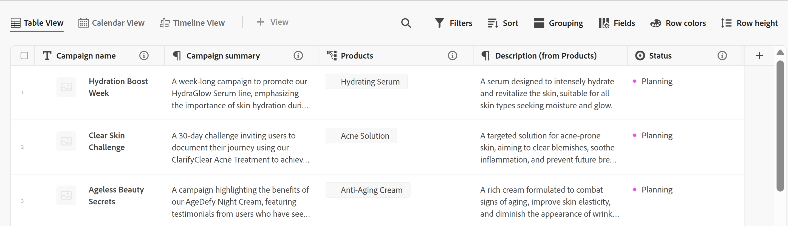
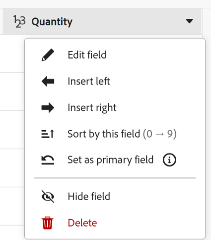
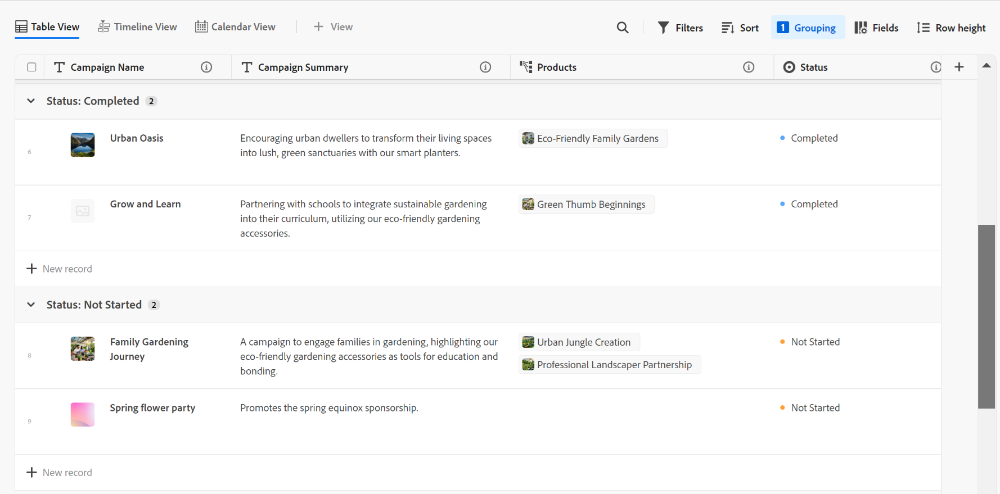

# Gérer la vue de tableau

Les informations mises en évidence sur cette page font référence à des fonctionnalités qui ne sont pas encore disponibles pour tous. Elle est disponible uniquement dans l’environnement de Prévisualisation pour tous les clients. Après les versions mensuelles en production, les mêmes fonctionnalités sont également disponibles dans l’environnement de production pour les clients qui ont activé les versions rapides. 

Pour plus d’informations sur les versions rapides, voir [Activation ou désactivation des versions rapides pour votre organisation](/help/quicksilver/administration-and-setup/set-up-workfront/configure-system-defaults/enable-fast-release-process.md). 

{{planning-important-intro}}

Vous pouvez afficher les enregistrements et leurs champs dans la vue de tableau lors de l’accès à la page du type d’enregistrement dans Adobe Workfront Planning.

Pour plus d’informations sur les vues d’enregistrement et leur gestion, consultez la section [Gérer les vues d’enregistrement](/help/quicksilver/planning/views/manage-record-views.md).

Cet article décrit les informations suivantes :

* [Créer ou modifier des colonnes et des lignes dans une vue Tableau](#manage-a-table-view)
* [Activer les indicateurs de présence en temps réel pour la vue Tableau](#enable-the-real-time-presence-indicator)

Pour plus d’informations sur l’exportation de la vue Tableau vers un fichier Excel ou CSV, voir [ Exporter des enregistrements de la vue Tableau ](/help/quicksilver/planning/records/export-records-from-the-table-view.md).

## Conditions d’accès

+++ Développez pour afficher les conditions d’accès requises pour la fonctionnalité de cet article. 

<table style="table-layout:auto"> 
<col> 
</col> 
<col> 
</col> 
<tbody> 
    <tr> 
<tr> 
</tr>   
<tr> 
   <td role="rowheader">
Package Adobe Workfront
</td> 
   <td> 

Tout Workfront et tout package Planning

Tout workflow et tout package Planning

Pour plus d’informations sur les composants inclus dans chaque package Workfront Planning, contactez votre représentant de compte Workfront. 
 
   </td> 
  <tr> 
   <td role="rowheader">
Licence Adobe Workfront
</td> 
   <td>
 Standard pour créer et supprimer des vues

   
Contributeur ou version ultérieure pour mettre à jour les éléments d’affichage

  </td> 
  </tr> 
  <tr> 
   <td role="rowheader">
Autorisations d’objet
</td> 
   <td>   
Gérer les autorisations pour une vue
  
   
Autorisations d’affichage d’une vue pour modifier temporairement les paramètres d’affichage ou la dupliquer
 </td> 
  </tr> 
<tr>
   <td role="rowheader">
Modèle de mise en page
</td>
   <td> Les utilisateurs disposant d'une licence light ou contributor doivent se voir attribuer un modèle de mise en page incluant Planning.
   
Les zones Planning sont activées par défaut pour les utilisateurs standard et les administrateurs système.

</li></ul>
</td>
  </tr> 
</tbody> 
</table>

Pour plus d’informations sur les exigences d’accès à Workfront, voir [Exigences d’accès dans la documentation de Workfront](/help/quicksilver/administration-and-setup/add-users/access-levels-and-object-permissions/access-level-requirements-in-documentation.md).

+++ 

<!--Old:
<table style="table-layout:auto"> 
<col> 
</col> 
<col> 
</col> 
<tbody> 
    <tr> 
<tr> 
<td> 
   
 Products
 </td> 
   <td> 
   <ul><li>
 Adobe Workfront
</li> 
   <li>
 Adobe Workfront Planning
</li></ul></td> 
  </tr>   
<tr> 
   <td role="rowheader">
Adobe Workfront plan*
</td> 
   <td> 

Any of the following Workfront plans:
 
<ul><li>Select</li> 
<li>Prime</li> 
<li>Ultimate</li></ul> 

Workfront Planning is not available for legacy Workfront plans
 
   </td> 
<tr> 
   <td role="rowheader">
Adobe Workfront Planning package*
</td> 
   <td> 

Any 
 

For more information about what is included in each Workfront Planning plan, contact your Workfront account manager. 
 
   </td> 
 <tr> 
   <td role="rowheader">
Adobe Workfront platform
</td> 
   <td> 

Your organization's instance of Workfront must be onboarded to the Adobe Unified Experience to be able to access Workfront Planning.
 

For more information, see <a href="/help/quicksilver/workfront-basics/navigate-workfront/workfront-navigation/adobe-unified-experience.md">Adobe Unified Experience for Workfront</a>. 
 
   </td> 
   </tr> 
  </tr> 
    <td role="rowheader">
Adobe Workfront license*
</td> 
   <td>
 Standard to create and delete views

   
Contributor or higher to update view elements

   
Workfront Planning is not available for legacy Workfront licenses
 
  </td> 
  </tr> 
  <tr> 
   <td role="rowheader">
Access level configuration
</td> 
   <td> 
There are no access level controls for Adobe Workfront Planning
   
</td> 
  </tr> 
<tr> 
   <td role="rowheader">
Object permissions
</td> 
   <td>   
Manage permissions to a view
  
   
View permissions to a view to temporarily change the view settings or to duplicate it
 </td> 
  </tr> 
<tr>
   <td role="rowheader">
Layout template
</td>
   <td> Users with a Light or Contributor license must be assigned a layout template that includes Planning.
   
Standard users and System Administrators have the Planning areas enabled by default.

</li></ul>
</td>
  </tr>
</tbody> 
</table> -->

## Modifier des enregistrements à l’aide de la vue Tableau

Vous ne pouvez modifier les informations d’enregistrement que dans la vue Tableau.

Pour plus d&#39;informations sur la modification des enregistrements en mode Tableau, voir [Modifier les enregistrements](/help/quicksilver/planning/records/edit-records.md).

## Gérer une vue tableau {#manage-a-table-view}

Lors de la création d’une vue tableau, tous les enregistrements du type sélectionné s’affichent dans un tableau. Chaque ligne est un enregistrement unique et chaque colonne est un champ d’enregistrement. Tous les champs et tous les enregistrements s’affichent par défaut.

Pour gérer une vue tableau :

1. Créez une vue tableau, comme décrit dans l’article [Gérer les vues d’enregistrement](/help/quicksilver/planning/views/manage-record-views.md).

   

1. (Facultatif) Cliquez sur **Hauteur de ligne**, puis sélectionnez l’une des options suivantes pour modifier la hauteur des lignes du tableau :
   * Court
   * Moyen
   * Grand

1. (Facultatif) Cliquez sur l’icône **Plein écran**  pour ouvrir l’affichage en plein écran, puis sur l’icône **Quitter le plein écran**  ou sur la touche Échap du clavier pour quitter le plein écran.

1. Mettez à jour les éléments de vues suivants, comme décrit dans les sous-sections ci-dessous :
   * [Colonnes (ou champs)](#add-columns-or-fields)
   * [Lignes (ou enregistrements)](#add-rows-or-records)
   * [Filtres](#add-filters)
   * [Trier](#add-a-sort)
   * [Regroupement ](#add-groupings)
   * [Couleurs de ligne](#add-row-colors)
   * [Indicateur de présence en temps réel](#enable-the-real-time-presence-indicator)

### Ajouter des colonnes (ou des champs) {#add-columns}

Les en-têtes de colonne d’une vue de tableau affichent les champs associés aux enregistrements de la vue. Les champs affichés dans la vue Tableau s’affichent également dans la section Détails d’un enregistrement.

Pour plus d’informations, voir [Modifier des enregistrements](/help/quicksilver/planning/records/edit-records.md).

<!--this is not available yet:You can display record fields (or columns) in both a table and a timeline view. However, the number of columns displayed in the table of the timeline view is limited and you cannot add columns in addition to those selected by default.-->

L’ajout de colonnes à une vue est identique à l’ajout de champs à un type d’enregistrement.

Vous pouvez ajouter jusqu’à 500 champs (ou colonnes) dans une vue tableau.

1. Accédez à une page de type enregistrement et cliquez sur un onglet de vue Tableau, ou cliquez sur **+ Vue** pour ajouter une nouvelle vue, puis choisissez **Table**.

1. Commencez à ajouter des champs (ou des colonnes), comme décrit dans l’article [Créer des champs](/help/quicksilver/planning/fields/create-fields.md).

   Les colonnes que vous ajoutez sont visibles par toutes les personnes qui accèdent au type d’enregistrement et sont ajoutées en tant que nouveaux champs sur la page de l’enregistrement.

1. (Facultatif) Cliquez sur l’icône **Champs**  dans la barre d’outils, recherchez un champ, puis désélectionnez le bouton (bascule) situé à droite du nom du champ pour le masquer.

1. Effectuez l’une des opérations suivantes pour réorganiser les colonnes du tableau :

   * Saisissez l’en-tête de colonne et faites-le glisser à l’endroit souhaité. La colonne que vous avez déplacée s’affiche brièvement sur fond bleu jusqu’à ce que vous procédiez à d’autres ajustements dans le tableau.

   * Cliquez sur **Champs** dans la barre d’outils du tableau, puis faites glisser les champs dans l’ordre souhaité et cliquez en dehors de la case **Visibilité et ordre des champs** pour la fermer.

     

     >[!TIP]
     >
     >* Le champ Nom est toujours le premier champ de la vue tableau, par défaut. Il est considéré comme un champ principal.
     >
     >* Vous ne pouvez pas déplacer le champ Nom, à moins que vous ne désigniez un autre champ comme champ principal. Pour plus d’informations, passez à l’étape 4. <!--accurate?-->
     >
     >

   * Remplacez le champ de la première colonne par un autre en modifiant le champ principal. Pour plus d’informations, passez à l’étape 4. <!--accurate?-->

1. (Facultatif) Pointez sur un nom de champ dans l’en-tête de colonne d’un champ qui ne s’affiche pas dans la première colonne du tableau, cliquez sur la flèche pointant vers le bas à droite du nom du champ, puis sur **Définir comme champ principal**.

   

1. Cliquez sur **Définir le champ** pour confirmer.

   Le champ devient champ principal, ce qui signifie qu’il s’affiche en tant que première colonne de la vue du tableau. Le champ principal précédent est déplacé dans la deuxième colonne.

   Les champs de Principal deviennent le titre de l&#39;enregistrement et s&#39;affichent dans la zone d&#39;en-tête de la page de l&#39;enregistrement et partout où les enregistrements s&#39;affichent. Par exemple, le titre de l’enregistrement s’affiche dans les champs connectés et toutes les vues. Pour plus d’informations sur les champs principaux, consultez la présentation des champs de Principal .

1. Cliquez sur les lignes de séparation des colonnes et déposez-les à l’endroit souhaité pour augmenter la largeur des colonnes.

   >[!TIP]
   >
   >Les modifications de la largeur et de l’ordre des colonnes sont permanentes et visibles par tous les utilisateurs et utilisatrices qui accèdent au type d’enregistrement.

1. Pointez sur l’en-tête de la colonne, cliquez sur la flèche pointant vers le bas, puis sur **Masquer le champ**

   Ou

   Cliquez sur **Champs** dans la barre d’outils du tableau et désactivez le bouton (bascule) associé aux champs (ou colonnes) que vous souhaitez masquer. La boîte de dialogue **Visibilité et ordre des champs** s’affiche.

   >[!TIP]
   >
   >Le nombre de champs masqués s’affiche à gauche de l’icône Champs dans la barre d’outils.
   >
   >Par défaut, les champs masqués ne s&#39;affichent pas dans la zone d&#39;aperçu **Détails** de l&#39;enregistrement. Tous les champs s’affichent dans la page Détails de l’enregistrement. Pour plus d’informations, voir [Gérer la mise en page des enregistrements](/help/quicksilver/planning/records/manage-the-record-page.md)

1. Cliquez sur l’icône **Champs** et activez le bouton (bascule) associé aux champs que vous souhaitez afficher dans les colonnes du tableau. Tous les champs s’affichent par défaut.

1. Procédez comme suit pour trouver rapidement les enregistrements correspondant à un mot-clé :

   1. Dans la zone **Rechercher**  et commencez à saisir un mot-clé associé à n’importe quel champ d’un enregistrement qui s’affiche à l’écran. Le nombre de correspondances correctes s’affiche à côté de l’élément de recherche et le champ correspondant est mis en surbrillance.

      

      Vous pouvez utiliser n’importe quel mot ou caractère spécial visible à l’écran.

      Vous ne pouvez pas utiliser de mots-clés associés à des champs masqués dans la vue de tableau.

   1. Appuyez sur la touche **Entrée** de votre clavier pour passer au champ suivant.

   1. (Facultatif) S’il y a plus d’une correspondance, cliquez sur les flèches haut et bas situées à droite du mot-clé de recherche pour accéder à l’ensemble des correspondances dans le tableau.

   1. Cliquez sur l’icône **x** dans le champ de recherche pour effacer le mot-clé de recherche.

### Ajouter des lignes (ou des enregistrements) {#add-rows}

Les lignes d’une vue de tableau affichent des enregistrements individuels du type d’enregistrement sélectionné.

Vous pouvez avoir jusqu’à 50 000 enregistrements (ou lignes) pour un type d’enregistrement.

1. Accédez à une page de type enregistrement et cliquez sur un onglet de vue Tableau, ou cliquez sur **+ Vue** pour ajouter une nouvelle vue, puis choisissez **Table**.

1. Commencez à ajouter des enregistrements (ou lignes), comme décrit dans l’article [Créer des enregistrements](/help/quicksilver/planning/records/create-records.md).

   Les enregistrements que vous ajoutez dans la vue de tableau sont enregistrés immédiatement et sont visibles par tous les utilisateurs et utilisatrices qui disposent d’une autorisation d’affichage ou de niveau supérieure sur l’espace de travail.

1. (Facultatif) Ajoutez une miniature à chaque enregistrement et cliquez sur **Champs** dans le coin supérieur droit du tableau, puis sélectionnez le bouton (bascule) du champ **Miniature** pour l’afficher à gauche du champ principal. Il est désélectionné par défaut.

   Pour plus d’informations, voir [Ajouter une miniature à un enregistrement](/help/quicksilver/planning/records/add-thumbnails-to-records.md).

1. (Facultatif) Sélectionnez un ou plusieurs enregistrements dans une ligne, puis faites glisser et déposez l’icône **handle**  à gauche de l’enregistrement pour réorganiser les lignes.

   >[!NOTE]
   >
   >Vous ne pouvez pas réorganiser les lignes si vous appliquez au moins un tri à la vue de tableau.
   >
   >Les modifications apportées à l’ordre des lignes sont visibles par tous les utilisateurs qui accèdent au type d’enregistrement

<!-- this section below links from the timeline view; consider splitting them if they become different-->

### Ajouter des filtres {#add-filters}

Les filtres permettent de réduire la quantité d’informations affichées à l’écran.

Tenez compte des points suivants lorsque vous utilisez des filtres en mode Tableau :

<!-- this list is almost identical to the one for the table view - update both-->

* Les filtres que vous créez pour la vue en tableau fonctionnent indépendamment des filtres de la vue chronologique lorsqu’ils sont appliqués au même type d’enregistrement.

* Les filtres sont propres à la vue que vous sélectionnez. Des filtres différents peuvent être appliqués à deux vues en tableau du même type d’enregistrement. Deux utilisateurs et utilisatrices qui consultent la même vue en tableau voient le même filtre que celui qui est actuellement appliqué.

* Vous ne pouvez pas nommer les filtres que vous créez et appliquez à une vue en tableau.

* Supprimer des filtres les rend inaccessibles à toute personne accédant au même type d’enregistrement que vous et utilisant la même vue que vous.

* Vous pouvez filtrer par champs d’enregistrement connectés ou champs de recherche.

* Vous pouvez filtrer par champs de recherche qui affichent plusieurs valeurs.

* Vous pouvez référencer un champ qui se trouve à jusqu’à 4 niveaux du type d’enregistrement actuel. Par exemple, si vous créez un filtre pour un type d’enregistrement Activité et que l’Activité est connectée au type d’enregistrement Produit associé au type d’enregistrement Campagne associé à un projet Workfront, vous pouvez référencer le budget du projet dans le filtre que vous créez pour le type d’enregistrement Activité.

Pour ajouter un filtre à une vue en tableau, procédez comme suit :

1. Créez une vue en tableau pour une page de type enregistrement, comme décrit dans l’article [Gérer les vues d’enregistrement](/help/quicksilver/planning/views/manage-record-views.md).
1. Sélectionnez une vue en tableau, puis cliquez sur **Filtres** dans le coin supérieur droit du tableau.
1. Cliquez sur **Ajouter une condition** et ajoutez les informations suivantes :

   * Recherchez un champ et sélectionnez-le lorsqu’il s’affiche dans la liste.

   * **Sélectionnez une option** (ou un modificateur de filtre) pour définir le type de condition auquel le champ doit répondre

     Le tableau ci-dessous présente les modificateurs disponibles pour chaque type de champ.

     <table>
        <thead>
        <tr>
            <th><b>Type de champ</b></th>
            <th><b>Modificateurs</b></th>
        </tr>
        </thead>
        <tbody>
        <tr>
            <td>Ligne unique, paragraphe, formule </td>
            <td>
Contient

            
Ne contient pas

            
Est

            
N’est pas

            
Est vide

            
N’est pas vide
</td>
        </tr>
        <tr><td>Sélection unique</td>
            <td>
Est

            
N’est pas

            
Est l’un des

            
N’est aucun de

            
Est vide

            
N’est pas vide
</td>
        </tr>
        <tr>
            <td>Multi-sélection, personnes</td>
            <td>
A l’un des

            
Dispose de tous les

            
Est exactement

            
N’a aucun(e) des

            
Est vide

            
N’est pas vide
</td>
        </tr>
        <tr>
            <td>Nombre, pourcentage, devise</td>
            <td>
=

            
≠

            
 &lt; 

            
&gt;

            
≤

            
≥

            
Est vide

            
N’est pas vide
</td>
        </tr>
        <tr>
            <td>Date</td>
            <td>
Est

            
N’est pas

            
Est après

            
Est avant

            
Est compris entre

N’est pas compris entre

            
Est vide

N’est pas vide
</td>
        </tr>

     <tr>
            <td>Case à cocher</td>
            <td>
Est

        </tr>
        </tbody>
        </table>

   * Choisissez une valeur pour le champ sélectionné.

   

   Il n’y a pas de limite au nombre de conditions de filtrage que vous pouvez ajouter.

1. (Facultatif) Cliquez sur **Ajouter une condition** pour ajouter une autre option de filtrage et répétez les étapes ci-dessus. Le nombre de filtres appliqués s’affiche à gauche de l’icône Filtres.
1. Cliquez sur les opérateurs suivants pour indiquer comment les conditions de filtrage sont liées et doivent être appliquées :

   * **AND** : toutes les conditions spécifiées doivent être remplies.
   * **OR** : l’une des conditions spécifiées doit être remplie. Il s’agit de l’option par défaut.

   1. (Facultatif) Ajoutez des opérateurs **AND** ou **OR** supplémentaires entre plusieurs regroupements de conditions.

      

   La liste des enregistrements est filtrée automatiquement. <!--at this time, you can't name and save the filter - but will this change?!-->
   <!-- asked on the task for the simple filters whether there is a limitation for how many statements a filter can have?!-->

1. (Facultatif) Cliquez sur l’icône **x** pour supprimer une condition de filtre.
1. (Facultatif) Cliquez sur **Filtres** pour fermer la zone des filtres. <!--right now you cannot "clear all" for filters, but this might come later-->

### Ajouter un tri {#sort-information}

En appliquant un tri, vous pouvez organiser les informations dans un ordre donné.

Vous pouvez trier les informations suivantes :

* Tous les enregistrements dans une vue en tableau.<!--or timeline view. ***********verify this is the case for the timeline view*********************-->
  <!--* All groupings. - this is not available yet-->

Tenez compte des éléments suivants lorsque vous triez les enregistrements dans la vue en tableau :

<!-- if this is available for the timeline view, update both when you update one-->

* Le tri est propre à la vue que vous sélectionnez. Des critères de tri différents peuvent être appliqués à deux vues en tableau du même type d’enregistrement. Deux utilisateurs ou utilisatrices qui consultent la même vue en tableau voient le même tri que celui qui est actuellement appliqué.

* Les tris que vous créez et appliquez à une vue en tableau ne peuvent pas être nommés.

* Le tri que vous créez est préservé lorsque vous quittez cette vue.

* Vous pouvez trier par autant de champs que comporte la vue de tableau d’un type d’enregistrement.

* Vous ne pouvez pas trier par champs d’enregistrement connectés, mais vous pouvez trier par champs de recherche à partir de types d’enregistrements connectés.

* Lorsque vous triez par champs de recherche avec plusieurs valeurs (qui n’ont pas été résumées par un agrégateur), la première valeur est utilisée pour le tri.

* Supprimer des critères de tri les rend inaccessibles à toute personne accédant au même type d’enregistrement que vous et utilisant la même vue que vous.

* Vous pouvez référencer un champ qui se trouve à jusqu’à 4 niveaux du type d’enregistrement actuel. Par exemple, si vous créez un tri pour un type d’enregistrement Activité et que l’Activité est connectée au type d’enregistrement Produit connecté au type d’enregistrement Campaign connecté à un projet Workfront, vous pouvez référencer le statut du projet dans le tri que vous créez pour le type d’enregistrement Activité.

Pour trier les enregistrements <!--ungrouped (add this when sorting for groupings will be available-->, procédez comme suit :

1. Créez une vue en tableau, comme décrit dans l’article [Gérer les vues d’enregistrement](/help/quicksilver/planning/views/manage-record-views.md).
1. Cliquez sur l’icône **Trier**  dans le coin supérieur droit du tableau

   Ou

   Pointez sur le nom d’une colonne dans la vue en tableau, cliquez sur la flèche pointant vers le bas à droite du nom de l’en-tête de la colonne, puis cliquez sur **Trier par ce champ**. Le champ est ajouté en tant que sélection de tri dans l’icône de tri dans le coin supérieur droit de la vue en tableau.

1. (Conditionnel) Dans la zone **Trier les enregistrements par**, cliquez sur l&#39;un des champs suggérés, ou cliquez sur **Choisir un autre champ** et recherchez un autre champ, puis cliquez dessus lorsqu&#39;il s&#39;affiche dans la liste.

   Le tri est appliqué automatiquement à la vue en tableau et les enregistrements s’affichent triés selon les critères que vous avez sélectionnés.

   <!-- add a step that you can rearrange the sorting fields here, when this will be possible-->

1. (Facultatif) Cliquez sur **Ajouter une condition** et répétez les étapes ci-dessus pour trier par champs supplémentaires.

   Le nombre de champs que vous triez s’affiche à gauche de l’icône de tri dans le coin supérieur droit de la barre d’outils. Vous ne pouvez sélectionner que les champs qui s’affichent dans les colonnes de la vue de tableau.

1. (Facultatif) Dans la zone **Trier les enregistrements par**, cliquez sur l’icône **x** en regard d’un champ de tri pour supprimer le tri.

   Ou

   Cliquez sur **Tout effacer** pour supprimer tous les champs du tri.

1. Cliquez en dehors de la zone **Trier les enregistrements par** pour la fermer.

   

   Les informations affichées dans le tableau sont triées en fonction des critères sélectionnés.

   Les champs qui doivent être triés affichent une icône de tri suivie d’un nombre qui indique l’ordre dans lequel le tri est appliqué.

### Ajouter des regroupements {#add-groupings}

<!--this section exists in the timeline view too, but the display is slightly different, so I kept both steps; consider updating both sections if any updates to groupings are introduced-->

Vous pouvez regrouper des enregistrements par des informations similaires lorsque vous appliquez un regroupement à une vue.

Tenez compte des points suivants :

* Vous pouvez utiliser des regroupements à la fois dans la vue tableau et dans la vue chronologique. Les regroupements de la vue de tableau sont indépendants de ceux de la vue chronologique du même type d’enregistrement.
* Vous pouvez appliquer 3 niveaux de regroupement dans une vue. Les enregistrements sont regroupés dans l’ordre des regroupements que vous sélectionnez.
&lt;!--* Vous pouvez appliquer jusqu’à 4 niveaux de regroupement lorsque vous utilisez l’API. --vérifier celui-ci pour l’instant-->
* Les regroupements sont propres à la vue que vous sélectionnez. Vous pouvez appliquer des regroupements différents à deux vues de tableau du même type d’enregistrement. Deux utilisateurs ou utilisatrices qui consultent la même vue de tableau voient le regroupement qui est actuellement appliqué.
* Vous ne pouvez pas nommer les regroupements que vous créez pour une vue de tableau.
* En supprimant les regroupements, vous les supprimez pour toutes les personnes qui accèdent au même type d’enregistrement que vous et qui consultent la même vue que vous.
* Vous pouvez modifier les enregistrements répertoriés dans un regroupement.
* Vous pouvez effectuer un regroupement par champs d’enregistrement connectés ou champs de recherche.
* Lorsque vous regroupez des champs de recherche avec plusieurs valeurs (qui n’ont pas été résumées par un agrégateur), les enregistrements sont regroupés selon chaque combinaison unique de valeurs de champ.
* Vous pouvez référencer un champ qui se trouve à jusqu’à 4 niveaux du type d’enregistrement actuel. Par exemple, si vous créez un regroupement pour un type d’enregistrement Activité et que l’Activité est connectée au type d’enregistrement Produit connecté au type d’enregistrement Campagne connecté à un projet Workfront, vous pouvez référencer le statut du projet dans le regroupement que vous créez pour le type d’enregistrement Activité.
* Les regroupements sont répertoriés dans l’ordre alphabétique de leurs valeurs.
<!--checking into this: * You can apply up to 4 levels of grouping when using the API. -->
<!-- checking also into this: * You cannot group by a Paragraph-type field.-->

Pour ajouter un regroupement :

1. Créez une vue chronologique pour un type d’enregistrement, comme décrit dans l’article [Gérer les vues d’enregistrement](/help/quicksilver/planning/views/manage-record-views.md).
1. Cliquez sur **Regroupement** dans le coin supérieur droit de la vue de tableau.

   

1. Cliquez sur l’un des champs proposés ou cliquez sur **Choisir un autre champ**, recherchez un autre champ, puis cliquez dessus lorsqu’il s’affiche dans la liste.

   Le regroupement est appliqué automatiquement au tableau et les enregistrements s’affichent sous la ligne de séparation du regroupement.

1. (Facultatif) Cliquez sur **Ajouter une condition** et répétez les étapes ci-dessus pour ajouter jusqu’à 3 regroupements.

   Le nombre de champs sélectionnés pour le regroupement s’affiche à côté de l’icône de regroupement.

   

1. (Facultatif) Dans la zone **Regrouper les enregistrements par**, cliquez sur l’icône **x** à droite d’un champ sélectionné pour le regroupement pour le supprimer.

   Ou

   Cliquez sur **Tout effacer** pour supprimer tous les champs.

1. Cliquez en dehors de la zone **Regrouper les enregistrements par** pour la fermer.
1. (Facultatif) Cliquez sur **+ Nouvel enregistrement** à la fin de tout regroupement pour ajouter de nouveaux enregistrements, puis actualisez votre page pour ajouter le nouvel enregistrement au regroupement approprié. <!--this might need to be changed when they add the Refresh button on the toolbar of the table view-->

1. Pour développer ou réduire des regroupements, effectuez l’une des opérations suivantes :

   1. Cliquez sur l’icône **Regroupement**, puis sur **Tout développer** ou **Tout réduire**. Cette action développe tous les regroupements et sous-regroupements dans la vue Tableau.

      

   1. Cliquez avec le bouton droit sur l&#39;un des en-têtes de regroupement dans la vue Tableau, puis cliquez sur l&#39;une des options suivantes :
      * **Développer le groupe**
      * **Réduire le groupe**
      * **Tout développer**
      * **Tout réduire**
      * **Développer les sous-groupes**
      * **Réduire les sous-groupes**

      Selon le nombre de regroupements que vous appliquez à la vue, certaines options peuvent ne pas être disponibles.

<!-- this is not available yet: 

To sort grouped records: 

1. Create a view, as described in [Create or edit record views](#create-or-edit-record-views). 
1. ************************* add steps here for sorting grouped records****************

-->

### Ajouter des couleurs de ligne

1. (Facultatif) Cliquez sur **Couleurs de ligne** pour définir des conditions et choisir de configurer différentes couleurs pour les lignes du tableau.

1. Cliquez sur **Ajouter une couleur**, puis recherchez un champ et sélectionnez-le lorsqu’il s’affiche dans la liste. Il s’agit du champ dont vous souhaitez déterminer la valeur de couleur d’une ligne.

   Par exemple, pour afficher les campagnes avec le statut Actif en vert, sélectionnez **Statut**, puis choisissez un modificateur et une valeur pour le champ.

   

1. Cliquez sur le menu déroulant du sélecteur de couleurs dans le coin supérieur gauche de la condition que vous avez sélectionnée, pour sélectionner la couleur de la condition, puis cliquez en dehors de la zone du sélecteur de couleurs pour la fermer.

   

1. (Facultatif) Cliquez sur **Ajouter une condition** pour ajouter d’autres champs et valeurs au premier ensemble de conditions

   Ou

   Cliquez sur **Ajouter une couleur** pour ajouter un nouveau jeu de conditions et identifier une nouvelle couleur.

   Par exemple, vous pouvez afficher les campagnes au statut Planning en jaune en définissant un nouveau jeu de conditions.

   

1. (Facultatif) Activez le paramètre **Appliquer à toute la ligne** dans le coin supérieur droit de la zone Couleurs de ligne. La ligne entière où la condition est remplie s’affiche automatiquement dans la couleur sélectionnée.

   >[!NOTE]
   >
   >* Si le paramètre Appliquer à toute la ligne est désactivé, seul le côté gauche du champ Principal affiche un indicateur de couleur étroit avec la couleur sélectionnée. Le paramètre est désactivé par défaut.
   >
   >* Vous ne pouvez pas appliquer de couleurs de ligne à une ligne entière lorsque au moins un regroupement est sélectionné en mode Tableau.

1. Cliquez en dehors de la zone **Couleurs des lignes** pour la fermer. Les couleurs sont appliquées automatiquement.

### Activer l’indicateur de présence en temps réel

Par défaut, les avatars d’autres utilisateurs qui modifient les informations d’enregistrement en même temps que vous s’affichent dans le coin supérieur droit de toutes les vues d’enregistrement.

Lorsque vous affichez la vue Tableau, vous pouvez également voir quel champ un autre utilisateur est en train de modifier au moment où vous affichez l’enregistrement.

1. Accédez à une page de type d’enregistrement et ouvrez n’importe quelle vue.
1. (Conditionnel) Si d’autres utilisateurs modifient les enregistrements du type sélectionné en même temps, leurs avatars s’affichent dans le coin supérieur droit de la vue.
1. Cliquez sur le menu déroulant en regard des avatars, puis sélectionnez le bouton bascule **Afficher les collaborateurs**. Le bouton (bascule) est sélectionné par défaut.

   

1. (Conditionnel) Ouvrez une vue de tableau, et le champ qu’une autre personne modifie activement est mis en surbrillance dans la couleur correspondant au contour de son avatar dans la vue de tableau.

   Si la couleur de surbrillance de l&#39;avatar est grise, l&#39;utilisateur a arrêté de modifier activement l&#39;enregistrement il y a plus de 30 secondes.

   

   >[!TIP]
   >
   >Vous pouvez sélectionner le bouton bascule **Afficher les collaborateurs** dans n’importe quel mode. Le champ actuellement modifié par d’autres utilisateurs est uniquement indiqué dans la vue Tableau.

